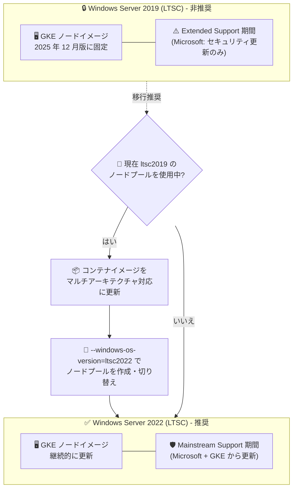

# Google Kubernetes Engine: Windows Server 2019 (LTSC) ノードイメージが 2025 年 12 月版に固定

**リリース日**: 2026-08-21

**サービス**: Google Kubernetes Engine (GKE)

**機能**: Windows Server 2019 (LTSC) ノードイメージのライフサイクル変更 (更新停止・バージョン固定)

**ステータス**: Change (ノードイメージライフサイクルの変更)

📊 [このアップデートのインフォグラフィックを見る](https://takech9203.github.io/google-cloud-news-summary/20260821-gke-windows-server-2019-node-image-pinned.html)

## 概要

Windows Server 2019 (LTSC) の GKE ノードイメージは、2025 年 12 月版を最後に更新を受け取らなくなりました。Windows Server 2019 (LTSC) は Microsoft の固定ライフサイクルポリシーにおける Extended Support (延長サポート) 期間に入っており、Microsoft からはセキュリティ更新のみが提供される状態です。GKE では、Mainstream Support 終了後の基盤イメージ更新に起因する安定性の問題を防ぐため、Windows Server 2019 (LTSC) 用の GKE ノードイメージを 2025 年 12 月版に固定 (pin) しました。

このノードイメージを使用しているユーザーは、Mainstream Support 期間にあり Microsoft と GKE の両方から更新を受け取れる Windows Server 2022 (LTSC) への切り替えが推奨されます。GKE の公式ドキュメントでも、LTSC2019 は「GKE により非推奨 (deprecated by GKE)」と明記されており、ノードイメージ選択時には LTSC2022 の使用が推奨されています。

GKE 上で Windows Server コンテナワークロードを運用しているすべてのユーザー、特に `WINDOWS_LTSC_CONTAINERD` イメージタイプでデフォルトの `ltsc2019` OS バージョンを使用しているユーザーに影響します。

**アップデート前の課題**

- Windows Server 2019 (LTSC) は Microsoft の Mainstream Support が終了し Extended Support 期間に入っており、Microsoft からはセキュリティ更新のみが提供される状態だった
- Mainstream Support 終了後の基盤イメージへの更新には安定性の問題があり、GKE ノードイメージとして更新を継続することにリスクがあった
- `WINDOWS_LTSC_CONTAINERD` イメージタイプで OS バージョンを明示指定しない場合、デフォルトで `ltsc2019` が使用されるため、非推奨イメージを意図せず使い続けるリスクがあった

**アップデート後の改善**

- GKE の Windows Server 2019 (LTSC) ノードイメージが 2025 年 12 月版に固定され、不安定な更新が適用されることによる予期しない障害リスクが排除された
- サポート状況が明確になり、Windows Server 2022 (LTSC) への移行判断の基準が示された
- Windows Server 2022 (LTSC) は Mainstream Support 期間にあり、Microsoft と GKE の両方から継続的に更新を受け取れる

## アーキテクチャ図



Windows Server 2019 (LTSC) ノードイメージは 2025 年 12 月版で更新が停止 (固定) されるため、Mainstream Support 期間にある Windows Server 2022 (LTSC) へノードプールを移行するフローを示しています。

## サービスアップデートの詳細

### 主要機能 (変更点)

1. **Windows Server 2019 (LTSC) ノードイメージの更新停止とバージョン固定**
   - GKE の Windows Server 2019 (LTSC) ノードイメージは 2025 年 12 月版以降の更新を受け取らない
   - Mainstream Support 終了後の基盤イメージ更新による安定性問題を防ぐことが目的
   - 既存の LTSC2019 ノードプールは動作し続けるが、GKE によるノードイメージ更新は提供されない

2. **Microsoft 固定ライフサイクルポリシーとの整合**
   - Windows Server 2019 (LTSC) は Microsoft の固定ライフサイクルポリシーにおける Extended Support 期間にあり、セキュリティ更新のみが提供される
   - GKE では Windows Server ノードの Windows Update は無効化されており、更新は GKE によるノードイメージの定期更新を通じて提供される仕組みのため、イメージ固定は実質的に OS 更新の停止を意味する

3. **Windows Server 2022 (LTSC) への移行推奨**
   - Windows Server 2022 (LTSC) は Mainstream Support 期間にあり、Microsoft と GKE の両方から更新を受け取れる
   - GKE ドキュメントでは LTSC2019 は「GKE により非推奨」と明記され、LTSC2022 の使用が推奨されている

## 技術仕様

### Windows Server ノードイメージの比較

| 項目 | Windows Server 2019 (LTSC) | Windows Server 2022 (LTSC) |
|------|---------------------------|----------------------------|
| GKE イメージタイプ | `WINDOWS_LTSC_CONTAINERD` | `WINDOWS_LTSC_CONTAINERD` (共通) |
| `--windows-os-version` の値 | `ltsc2019` (デフォルト・非推奨) | `ltsc2022` (推奨) |
| GKE でのステータス | 非推奨 (deprecated by GKE)、2025 年 12 月版に固定 | 推奨、継続的に更新 |
| Microsoft サポート状況 | Extended Support (セキュリティ更新のみ) | Mainstream Support |
| コンテナベースイメージのバージョン | 10.0.17763.X | LTSC2022 系列 |

**注意点:**

- Windows Server 2022 と 2019 のノードイメージは同一のイメージタイプ `WINDOWS_LTSC_CONTAINERD` を共有しており、OS バージョンは `--windows-os-version` フラグで指定する
- Google Cloud コンソールや CLI で OS バージョンを指定せずに `WINDOWS_LTSC_CONTAINERD` ノードプールを作成すると、デフォルトで `ltsc2019` が使用されるため注意が必要
- Windows Server コンテナはホスト OS バージョンとの互換性要件があるため、LTSC2022 ノードへの移行前にコンテナイメージの再ビルド (またはマルチアーキテクチャイメージ化) が必要になる場合がある

## 設定方法

### 前提条件

1. GKE Standard クラスタで Windows Server ノードプール (`WINDOWS_LTSC_CONTAINERD`) を使用していること
2. コンテナイメージが Windows Server 2022 (LTSC) に対応していること (マルチアーキテクチャイメージの利用を推奨)

### 手順

#### ステップ 1: コンテナイメージの互換性確認とマルチアーキテクチャ化

Windows Server コンテナにはホスト OS バージョンとの互換性要件があるため、移行前にコンテナイメージが LTSC2022 で動作することを確認します。複数の Windows Server バージョンをターゲットにできるマルチアーキテクチャイメージとしてビルドすることが推奨されています。ビルドには Cloud Build の gke-windows-builder が利用できます。

#### ステップ 2: Windows Server 2022 ノードプールの作成

```bash
gcloud container node-pools create NODE_POOL_NAME \
  --cluster=CLUSTER_NAME \
  --location=CONTROL_PLANE_LOCATION \
  --image-type=WINDOWS_LTSC_CONTAINERD \
  --windows-os-version=ltsc2022
```

`--windows-os-version=ltsc2022` を明示的に指定して Windows Server 2022 ノードプールを作成します。このフラグを省略するとデフォルトの `ltsc2019` (非推奨) が使用されます。

#### ステップ 3: ワークロードの移行と検証

新しい LTSC2022 ノードプールにワークロードを移行します。本番環境をアップグレードする前に、ステージング環境またはテストクラスタで移行をテストし、デプロイメントが意図どおりに動作することを確認することが強く推奨されています。移行完了後、旧 LTSC2019 ノードプールを削除します。

## メリット

### ビジネス面

- **安定性リスクの回避**: Mainstream Support 終了後の不安定な基盤イメージ更新が GKE ノードに適用されなくなり、予期しない障害を防止できる
- **移行計画の明確化**: サポートポリシーと推奨移行先 (LTSC2022) が明示され、Windows ワークロードのライフサイクル計画を立てやすくなった

### 技術面

- **同一イメージタイプ内での移行**: LTSC2019 と LTSC2022 は同じ `WINDOWS_LTSC_CONTAINERD` イメージタイプを共有するため、`--windows-os-version` フラグの変更で移行できる
- **継続的な更新の確保**: LTSC2022 へ移行することで、Microsoft と GKE の両方からの更新 (セキュリティ更新を含む) を継続して受け取れる

## デメリット・制約事項

### 制限事項

- Windows Server 2019 (LTSC) ノードイメージは 2025 年 12 月版から更新されないため、それ以降に Microsoft がリリースするセキュリティ更新は GKE ノードイメージに反映されない
- GKE の Windows Server ノードでは Windows Update が無効化されているため、ノード上で個別に OS 更新を適用することはできない

### 考慮すべき点

- LTSC2019 上で動作しているコンテナイメージ (ベースイメージ 10.0.17763.X) は、LTSC2022 ノードで動作させるために再ビルドが必要になる場合がある
- Windows Server コンテナのバージョン互換性要件があるため、移行前にバージョンマッピングの確認とマルチアーキテクチャイメージの整備が推奨される
- `WINDOWS_LTSC_CONTAINERD` のデフォルト OS バージョンは `ltsc2019` のため、既存の IaC (Terraform など) や自動化スクリプトで OS バージョンを明示していない場合、非推奨イメージでノードプールが作成される可能性がある

## ユースケース

### ユースケース 1: LTSC2019 ノードプールの棚卸しと移行

**シナリオ**: 複数の GKE クラスタで Windows Server ノードプールを運用しており、どのノードプールが LTSC2019 を使用しているか把握できていない。

**実装例**:
```bash
# ノードプールの Windows OS バージョン設定を確認
gcloud container node-pools describe NODE_POOL_NAME \
  --cluster=CLUSTER_NAME \
  --location=CONTROL_PLANE_LOCATION \
  --format="value(config.windowsNodeConfig)"

# LTSC2022 ノードプールを新規作成して移行
gcloud container node-pools create NEW_NODE_POOL_NAME \
  --cluster=CLUSTER_NAME \
  --location=CONTROL_PLANE_LOCATION \
  --image-type=WINDOWS_LTSC_CONTAINERD \
  --windows-os-version=ltsc2022
```

**効果**: 非推奨の LTSC2019 ノードプールを特定し、更新が継続される LTSC2022 へ計画的に移行できる。

### ユースケース 2: マルチアーキテクチャイメージによる段階的移行

**シナリオ**: LTSC2019 と LTSC2022 のノードプールが混在する移行期間中に、同一のコンテナデプロイメントを両方のノードで動作させたい。

**効果**: マルチアーキテクチャ Windows コンテナイメージを使用すると、containerd がノードの Windows Server バージョンを検出してマニフェストから適切なイメージを選択するため、移行期間中もデプロイメント定義を変更せずに両バージョンのノードで運用できる。

## 関連サービス・機能

- **Compute Engine (OS イメージサポートポリシー)**: GKE の Windows Server ノードイメージのサポート期間は、Compute Engine の OS イメージサポートポリシーに従い、Microsoft のサポート期間に準拠する
- **Cloud Build (gke-windows-builder)**: マルチアーキテクチャ Windows コンテナイメージのビルドに利用でき、新しい Windows Server LTSC イメージへの対応が定期的に更新される
- **GKE クラスタ通知**: 新しい GKE バージョンとそれが使用する Windows OS バージョンに関する更新を事前に受け取るために、アップグレード通知のサブスクライブが推奨される
- **メンテナンスウィンドウと除外**: Windows ノードプールのアップグレードタイミングを制御するために、メンテナンス除外でノード自動アップグレードを一時的に抑止できる

## 参考リンク

- 📊 [インフォグラフィック](https://takech9203.github.io/google-cloud-news-summary/20260821-gke-windows-server-2019-node-image-pinned.html)
- [公式リリースノート](https://docs.cloud.google.com/release-notes#August_21_2026)
- [Creating a cluster using Windows Server node pools](https://docs.cloud.google.com/kubernetes-engine/docs/how-to/creating-a-cluster-windows)
- [Microsoft 固定ライフサイクルポリシー](https://learn.microsoft.com/en-us/lifecycle/policies/fixed)
- [Windows Server 2019 のライフサイクル (Microsoft)](https://learn.microsoft.com/en-us/lifecycle/products/windows-server-2019)
- [Building Windows Server multi-arch images](https://docs.cloud.google.com/kubernetes-engine/docs/tutorials/building-windows-multi-arch-images)

## まとめ

GKE の Windows Server 2019 (LTSC) ノードイメージは 2025 年 12 月版に固定され、今後更新されません。LTSC2019 ノードプールを使用している場合、Microsoft のセキュリティ更新がノードイメージに反映されなくなるため、Mainstream Support 期間にある Windows Server 2022 (LTSC) への移行を計画的に進めることを推奨します。移行にあたっては、コンテナイメージのマルチアーキテクチャ化とステージング環境での事前検証が重要です。

---

**タグ**: #GKE #GoogleKubernetesEngine #WindowsServer #LTSC #ノードイメージ #ライフサイクル #移行
