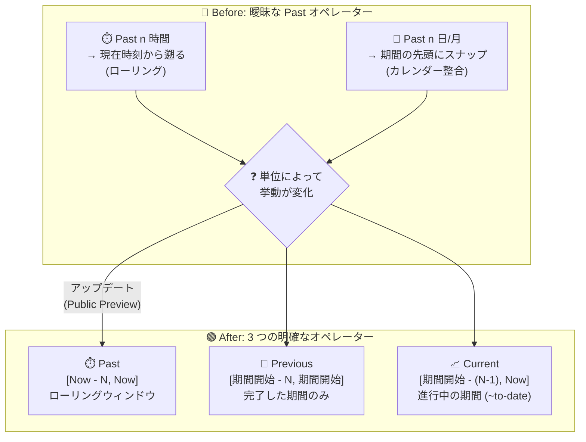

# Google SecOps: 相対時間フィルタリングの刷新 (Past / Previous / Current オペレーター)

**リリース日**: 2026-08-21

**サービス**: Google SecOps (Google Security Operations)

**機能**: 相対時間フィルタリング (Relative time filtering)

**ステータス**: Public Preview (Spotlight Feature)

📊 [このアップデートのインフォグラフィックを見る](https://takech9203.github.io/google-cloud-news-summary/20260821-google-secops-relative-time-filtering.html)

## 概要

Google SecOps の相対時間フィルターにおけるデータ範囲の計算方法が刷新され、**Past**、**Previous**、**Current** という 3 つの数学的に明確なオペレーターから選択できるようになりました。本機能は Public Preview として提供され、Spotlight Feature として発表されています。

従来の相対時間フィルターでは、「ローリングウィンドウ (現在時刻から遡る動的な範囲)」と「カレンダー整合期間 (日・週・月などの区切りに揃えた範囲)」の区別が曖昧で、指定する時間単位によって挙動が異なるという問題がありました。今回の変更により、この曖昧さが解消され、秒・分・時間・日・週・月・年のすべての時間単位で一貫した挙動が保証されます。また、SecOps ダッシュボードの時間フィルターが Search や他の Google ツール (Looker など) と整合するようになりました。

SOC アナリストやセキュリティエンジニアにとって、検索・ダッシュボード・レポート間で時間範囲の解釈が統一されることは、インシデント調査の再現性やメトリクス比較の正確性に直結する重要な改善です。

**アップデート前の課題**

- 従来のダッシュボードの Past オペレーターは、時間単位によって挙動が異なっていた。秒・分・時間を指定した場合は現在時刻から正確に遡るローリングウィンドウとして動作する一方、日・週・月・年を指定した場合は開始時刻が期間の先頭 (例: 当日の 0 時、当月の 1 日) にスナップされ、同じ「Past」でも意味が変わっていた
- ローリングウィンドウとカレンダー整合期間の区別が曖昧なため、「過去 7 日間」が「今この瞬間から 168 時間前まで」なのか「今週の日曜からなのか」をユーザーが確信できなかった
- SecOps ダッシュボードと Search、Looker などの他の Google ツールとで相対時間の解釈が揃っておらず、同じ意図の時間指定でも異なる結果が返る可能性があった

**アップデート後の改善**

- **Past (ローリングウィンドウ)**、**Previous (完了した期間)**、**Current (進行中の期間)** の 3 つのオペレーターに分離され、それぞれの計算式が数学的に明確に定義された
- すべての時間単位 (秒、分、時間、日、週、月、年) で一貫した挙動が保証され、単位によって解釈が変わる問題が解消された
- SecOps ダッシュボードの時間フィルターが Search および Looker などの他の Google ツールと整合し、ツール間で一貫した分析が可能になった

## アーキテクチャ図



従来は単一の Past オペレーターが時間単位によってローリングとカレンダー整合の 2 つの挙動を混在させていましたが、今回のアップデートで用途別に 3 つのオペレーターへ分離され、すべての単位で計算式が一意に定まります。

## サービスアップデートの詳細

### 主要機能

1. **Past (ローリングウィンドウ)**
   - 現在時刻 (Now) から正確に N 単位分だけ遡るローリングウィンドウを測定する。開始時刻と終了時刻の両方が動的に移動する
   - 計算式: `[Now - N, Now]`
   - 用途: リアルタイムの継続的なデータ追跡 (例: 「今この瞬間から過去 24 時間」)

2. **Previous (完了した期間)**
   - 完全に完了したカレンダー単位 (丸 1 日、丸 1 週、丸 1 か月など) のみを取得する。進行中の期間は除外される
   - 計算式: `[現在の期間の開始 - N, 現在の期間の開始]`
   - 用途: 「昨日」「先週」「先月」など完了した過去期間の比較。進行中期間の部分的なデータによる結果の歪みを防ぐ

3. **Current (進行中の期間)**
   - 進行中のカレンダー期間の開始から現在時刻 (Now) までを測定する
   - 計算式: `[現在の期間の開始 - (N - 1), Now]` (秒単位の場合はローリングウィンドウとして動作)
   - 用途: 進行中期間の進捗追跡 (例: month-to-date、今週これまで)。オプションで過去の完全な期間を含めることも可能

### 相対時間範囲の設定方法 (Search)

1. Time Range メニューから **Relative** を選択
2. ドロップダウンから時間オペレーター (Past / Previous / Current) を選択
3. テキストフィールドに整数を入力
4. 時間単位 (Seconds、Minutes、Hours、Days、Weeks、Months、Years) を選択

検索実行時 (Run Search クリック時) の時刻がクエリの基準時刻となります。

## 技術仕様

### オペレーターの比較

| 項目 | Past (ローリングウィンドウ) | Previous (完了した期間) | Current (進行中の期間) |
|------|---------------------------|------------------------|----------------------|
| 動作 | 現在時刻から遡る動的なウィンドウ。開始・終了とも移動する | 完全に完了したカレンダー単位のみ。進行中の期間は除外 | 進行中のカレンダー期間の開始から現在まで |
| 計算式 | `[Now - N, Now]` | `[期間開始 - N, 期間開始]` | `[期間開始 - (N - 1), Now]` |
| 最適な用途 | リアルタイムの継続的なデータ追跡 | 完了した過去期間の比較 (部分データによる歪みを排除) | 進行中期間の進捗追跡 (month-to-date など) |
| 備考 | - | - | 秒単位の場合はローリングウィンドウとして動作 |

### 期間境界 (Unit boundaries) の定義

「現在の期間の開始 (Start of Current Unit)」は以下のように厳密に定義されます。

| 単位 | 期間の開始 |
|------|-----------|
| 日 (Day) | 深夜 0 時 (00:00:00) |
| 週 (Week) | 日曜日の 00:00:00 |
| 月 (Month) | 月の 1 日の 00:00:00 |

## メリット

### ビジネス面

- **メトリクスの正確な比較**: Previous オペレーターにより、進行中期間の部分データを含まない完了期間同士の比較が可能になり、週次・月次のセキュリティメトリクスレポートの信頼性が向上する
- **ツール間の一貫性**: SecOps ダッシュボード、Search、Looker などで時間範囲の解釈が整合し、複数ツールを併用する SOC チーム内での認識齟齬を防げる

### 技術面

- **数学的に明確な計算式**: 各オペレーターの範囲計算が `[Now - N, Now]` のように一意に定義され、時間単位による挙動の違いがなくなった
- **全時間単位で一貫した挙動**: 秒から年まですべての単位で同じセマンティクスが適用され、クエリの再現性が保証される
- **用途に応じた選択**: リアルタイム監視 (Past)、期間比較 (Previous)、進捗追跡 (Current) を意図どおりに使い分けられる

## デメリット・制約事項

### 制限事項

- 本機能は Public Preview であり、Google Security Operations Service Specific Terms の Pre-GA Offerings Terms が適用される。Pre-GA 機能はサポートが限定される場合があり、変更が他の Pre-GA バージョンと互換でない可能性がある

### 考慮すべき点

- 従来の Past オペレーターは日・週・月・年の単位で期間開始にスナップする挙動だったため、同じ指定値でも新しい Past (純粋なローリングウィンドウ) では取得範囲が変わる可能性がある。既存のダッシュボードや定型検索の時間指定は、意図した挙動 (ローリング / カレンダー整合) に応じて Past / Previous / Current のいずれが適切かを見直すことを推奨
- Current オペレーターは秒単位ではローリングウィンドウとして動作する点に注意が必要
- 週の開始は日曜日の 00:00:00 と定義される (Looker のデフォルト設定では週の開始は月曜日であるなど、他ツールとの週境界の設定差異には注意が必要)

## ユースケース

### ユースケース 1: リアルタイムの脅威ハンティング (Past)

**シナリオ**: SOC アナリストが「今この瞬間から過去 24 時間」に発生した不審な認証イベントを継続的に監視したい。

**実装例**:
```
Time Range: Relative → Past 24 Hours
検索範囲: [Now - 24h, Now] (実行するたびに範囲がスライド)
```

**効果**: 実行時刻を基準にウィンドウが動的にスライドするため、常に最新 24 時間分のイベントを漏れなく確認できる。

### ユースケース 2: 週次セキュリティメトリクスの比較 (Previous)

**シナリオ**: セキュリティマネージャーが「先週 1 週間」のアラート件数を、その前の週と比較するダッシュボードを作成したい。

**実装例**:
```
Time Range: Relative → Previous 1 Week
検索範囲: [先週日曜 00:00:00, 今週日曜 00:00:00] (完了した 1 週間のみ)
```

**効果**: 進行中の今週の部分的なデータが混入せず、完了した期間同士の正確な比較ができる。

### ユースケース 3: 月初からの進捗追跡 (Current)

**シナリオ**: 月次レポートに向けて、今月 1 日から現在までのインシデント対応状況 (month-to-date) を追跡したい。

**実装例**:
```
Time Range: Relative → Current 1 Month
検索範囲: [今月 1 日 00:00:00, Now]
```

**効果**: カレンダー月の開始に揃った進行中期間のデータを取得でき、月次目標に対する進捗を正確に把握できる。

## 関連サービス・機能

- **Google SecOps UDM Search**: 本アップデートの中心となる検索機能。Relative time range で 3 オペレーターを選択できる
- **Google SecOps ネイティブダッシュボード**: グローバル時間フィルターを持ち、本アップデートにより Search と時間解釈が整合する
- **Looker / Looker Studio**: Google のデータ分析ツール。相対日付フィルターのセマンティクスと整合が図られている

## 参考リンク

- 📊 [インフォグラフィック](https://takech9203.github.io/google-cloud-news-summary/20260821-google-secops-relative-time-filtering.html)
- [公式リリースノート](https://docs.cloud.google.com/release-notes#August_21_2026)
- [ドキュメント: Understand search - Relative time range](https://docs.cloud.google.com/chronicle/docs/investigation/udm-search#relative_time_range)
- [ドキュメント: ダッシュボードフィルターの管理](https://docs.cloud.google.com/chronicle/docs/reports/native-dashboards-filters)

## まとめ

Google SecOps の相対時間フィルターが Past / Previous / Current の 3 オペレーターに刷新され、ローリングウィンドウとカレンダー整合期間の曖昧さが解消されました。検索・ダッシュボード・Looker 間で時間解釈が統一されるため、SOC チームはまず既存ダッシュボードや定型検索の時間指定を確認し、意図した挙動に対応するオペレーターへ見直すことを推奨します。Public Preview のため、本番の重要レポートへの適用は Pre-GA の制約を理解した上で進めてください。

---

**タグ**: Google SecOps, Chronicle, UDM Search, ダッシュボード, 時間フィルター, SIEM, Public Preview, Spotlight Feature
