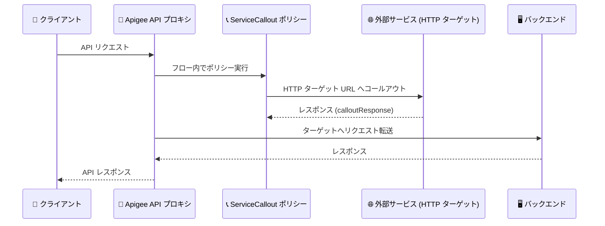

# Apigee UI: ServiceCallout ポリシー作成とデベロッパーカスタム属性保存の不具合修正

**リリース日**: 2026-08-22

**サービス**: Apigee (Cloud console UI)

**機能**: ServiceCallout ポリシー作成フォームの修正 / デベロッパーカスタム属性保存の修正

**ステータス**: Fixed (バグ修正)

📊 [このアップデートのインフォグラフィックを見る](https://takech9203.github.io/google-cloud-news-summary/20260822-apigee-ui-servicecallout-developer-attributes-fixes.html)

## 概要

2026 年 8 月 22 日、Apigee の Cloud console UI に関する 2 件の不具合修正がリリースされました。いずれも Apigee UI 上での操作に影響していた問題であり、API (Management API) 経由の操作には影響していませんでした。

1 件目 (Bug ID: 543626585) は、Apigee UI で ServiceCallout ポリシーを追加できない問題の修正です。「Create policy」または「Add policy」パネルで Service Callout を選択した際に、Name と Display name フィールドのみが表示され、必須の HTTP ターゲットフィールドが表示されないことがありました。必須フィールドが欠落しているためフォームが有効にならず、何を入力しても「Create」または「Add」ボタンが無効のままとなり、UI からポリシーを作成できませんでした。この問題は API プロキシと共有フロー (Shared Flow) の両方に影響していました。

2 件目 (Bug ID: 540008387) は、Apigee UI でデベロッパーのカスタム属性の保存が断続的に失敗する問題の修正です。UI 上では保存成功と表示されるにもかかわらず、ページを再読み込みすると以前の属性値に戻ってしまう現象が発生していました。今回の修正により、デベロッパーのカスタム属性が確実に永続化されるようになりました。

**アップデート前の課題**

- ServiceCallout ポリシーを UI から追加しようとすると、必須の HTTP ターゲットフィールドがフォームに表示されず、「Create / Add」ボタンが無効のままでポリシーを作成できないことがあった (API プロキシ・共有フローの両方に影響)
- 回避策として、プレースホルダーのポリシーを作成してからコードエディタで XML を書き換えるという手間のかかる作業が必要だった
- デベロッパーのカスタム属性を UI で編集・保存すると、保存成功と表示されても実際には永続化されず、再読み込みで以前の値に戻ることが断続的に発生していた

**アップデート後の改善**

- ServiceCallout ポリシーの作成フォームに必須の HTTP ターゲットフィールドが正しく表示され、UI からポリシーを追加できるようになった
- プレースホルダーポリシーを作成して XML を差し替える回避策が不要になった
- デベロッパーのカスタム属性の変更が UI から確実に保存・永続化されるようになった

## アーキテクチャ図



ServiceCallout ポリシーは、プロキシフローの途中で外部サービスを呼び出すためのポリシーです。今回の修正により、この HTTP ターゲット URL (必須項目) を UI の作成フォームで正しく指定できるようになりました。

## サービスアップデートの詳細

### 主要機能

1. **ServiceCallout ポリシー作成フォームの修正 (Bug ID: 543626585)**
   - 「Create policy」/「Add policy」パネルで Service Callout を選択した際に、必須の HTTP ターゲットフィールドが表示されず Name と Display name のみ表示されることがある問題を修正
   - 必須フィールドの欠落によりフォームが有効化されず、「Create / Add」ボタンが無効のままになる問題が解消
   - API プロキシと共有フローの両方の編集画面で修正が適用される
   - プレースホルダーポリシーを作成しコードエディタで XML を差し替える従来の回避策は不要

2. **デベロッパーカスタム属性の保存修正 (Bug ID: 540008387)**
   - Cloud console の Apigee UI でデベロッパーを保存した際、カスタム属性の変更が断続的に永続化されない問題を修正
   - 従来は UI 上で保存成功と表示されても、ページ再読み込み後に以前の属性値が再表示されることがあった
   - Apigee API 経由でのデベロッパー更新はこの問題の影響を受けていなかった

## 技術仕様

### 修正内容の一覧

| 項目 | Bug ID 543626585 | Bug ID 540008387 |
|------|------------------|------------------|
| 対象 | ServiceCallout ポリシー作成フォーム | デベロッパーのカスタム属性保存 |
| 影響範囲 | API プロキシ / 共有フローの UI 編集 | Apigee UI (Cloud console) のデベロッパー編集 |
| 症状 | 必須の HTTP ターゲットフィールドが表示されず、Create / Add ボタンが無効のまま | 保存成功と表示されるが属性値が永続化されない (断続的) |
| API への影響 | なし (UI のみ) | なし (API 経由の更新は正常) |
| 従来の回避策 | プレースホルダーポリシー作成後に XML を編集 | Apigee API で更新 |

### ServiceCallout ポリシーの必須要素

公式ドキュメントによると、ServiceCallout ポリシーでは `<HTTPTargetConnection>` とその子要素 `<URL>` が必須 (Presence: Required) です。今回の不具合は、この必須項目を入力する UI フィールドが表示されないことが原因でフォームのバリデーションが通らなかったものです。

```xml
<ServiceCallout async="false" continueOnError="false" enabled="true" name="Service-Callout-1">
  <DisplayName>Custom label used in UI</DisplayName>
  <Response>calloutResponse</Response>
  <HTTPTargetConnection>
    <URL>http://example.com</URL>  <!-- 必須: HTTP ターゲット -->
  </HTTPTargetConnection>
</ServiceCallout>
```

### デベロッパーカスタム属性の仕様

| 項目 | 詳細 |
|------|------|
| 属性数の上限 | デベロッパーごとに最大 18 個のカスタム属性を追加可能 |
| キャッシュ | KMS エンティティ (アプリ、デベロッパー、API プロダクト) とそのカスタム属性は、アクセス後最低 180 秒間キャッシュされる |
| 注意事項 | 同一リソースへの同時更新リクエストは競合や予期しない動作の原因となるため、変更操作は順次実行することが推奨されている |

## メリット

### ビジネス面

- **開発生産性の回復**: ServiceCallout はジオロケーションデータの取得やパートナーサービス連携など多くのプロキシで使われる主要ポリシーであり、UI から直接作成できることで開発フローの中断がなくなる
- **データ整合性への信頼**: デベロッパーのカスタム属性 (課金区分やポータル連携情報などに利用されることがある) が確実に保存されるため、「保存したはずの値が消える」ことによる運用トラブルを回避できる

### 技術面

- **回避策の廃止**: プレースホルダーポリシーの作成と XML 手動編集という 2 段階の回避手順が不要になり、UI のフォームだけでポリシー定義が完結する
- **UI と API の動作一致**: UI からの保存結果が API と同様に確実に永続化されるため、UI 操作と API 操作を混在させる運用でも不整合が生じない

## デメリット・制約事項

### 考慮すべき点

- 今回の修正は UI の不具合修正であり、ServiceCallout ポリシーやデベロッパー属性の機能自体に変更はない
- カスタム属性を含む KMS エンティティは最低 180 秒間キャッシュされるため、保存直後のランタイム反映には遅延が生じ得る (これは従来からの仕様)
- 過去に回避策 (プレースホルダーポリシー + XML 編集) で作成した ServiceCallout ポリシーは有効な XML であればそのまま利用でき、作り直しは不要

## ユースケース

### ユースケース 1: UI ベースでの ServiceCallout ポリシー追加

**シナリオ**: API プロキシのリクエストフローで外部の在庫確認サービスを呼び出すため、Apigee UI の「Add policy」パネルから ServiceCallout ポリシーを追加する。

**効果**: HTTP ターゲットフィールドが正しく表示されるため、ターゲット URL を入力してそのままポリシーを作成できる。XML の手動編集は不要。

### ユースケース 2: デベロッパー属性による分類管理

**シナリオ**: API プログラム運用者が、デベロッパーに部署名や契約プランなどのカスタム属性を UI から設定・更新する。

**効果**: 保存した属性値が確実に永続化されるため、再読み込み後の値の巻き戻りを確認する二度手間や、API での再更新が不要になる。

## 関連サービス・機能

- **AssignMessage ポリシー**: ServiceCallout が送信するリクエストメッセージの生成・ヘッダー設定に使用される、典型的な組み合わせのポリシー
- **ExtractVariables ポリシー**: ServiceCallout のレスポンスを JSONPath / XPath でパースして変数に格納する、典型的な組み合わせのポリシー
- **共有フロー (Shared Flows)**: 複数プロキシで再利用可能なポリシーシーケンス。今回の ServiceCallout 修正は共有フローの編集画面にも適用される
- **Apigee Management API**: デベロッパーやポリシーをプログラムから管理する API。今回の不具合の影響を受けておらず、UI の代替手段として利用可能

## 参考リンク

- 📊 [インフォグラフィック](https://takech9203.github.io/google-cloud-news-summary/20260822-apigee-ui-servicecallout-developer-attributes-fixes.html)
- [公式リリースノート](https://docs.cloud.google.com/release-notes#August_22_2026)
- [ServiceCallout ポリシーリファレンス](https://docs.cloud.google.com/apigee/docs/api-platform/reference/policies/service-callout-policy)
- [管理 UI でのポリシーのアタッチと構成](https://docs.cloud.google.com/apigee/docs/api-platform/develop/attaching-and-configuring-policies-management-ui)
- [Apigee UI の概要](https://docs.cloud.google.com/apigee/docs/api-platform/fundamentals/ui-overview)

## まとめ

Apigee UI における ServiceCallout ポリシー作成不能とデベロッパーカスタム属性の保存失敗という、日常的な開発・運用作業を妨げていた 2 件の不具合が修正されました。これまで回避策 (プレースホルダーポリシーの XML 編集や API 経由での属性更新) を運用手順に組み込んでいたチームは、その手順を廃止して通常の UI 操作に戻すことを推奨します。

---

**タグ**: #Apigee #ApigeeUI #ServiceCallout #CustomAttributes #BugFix #APIManagement
