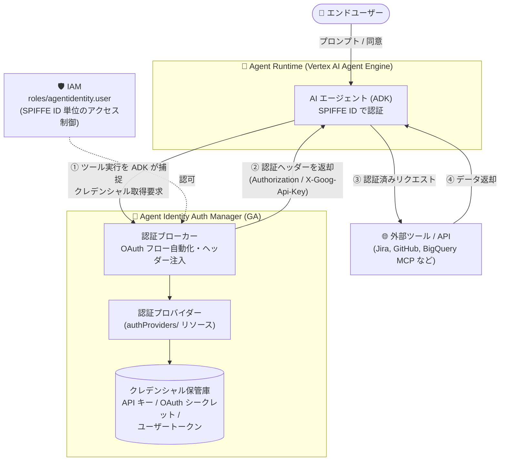

# Identity and Access Management (IAM): Agent Identity Auth Manager と Agent Identity APIs が GA

**リリース日**: 2026-08-22

**サービス**: Identity and Access Management (IAM)

**機能**: Agent Identity Auth Manager / Agent Identity APIs (`agentidentity.googleapis.com`, `agentidentitycredentials.googleapis.com`)

**ステータス**: GA (一般提供開始)

📊 [このアップデートのインフォグラフィックを見る](https://takech9203.github.io/google-cloud-news-summary/20260822-iam-agent-identity-ga.html)

## 概要

Agent Identity auth manager と Agent Identity APIs (`agentidentity.googleapis.com` および `agentidentitycredentials.googleapis.com`) が一般提供 (GA) となった。Agent Identity auth manager は、AI エージェントが外部ツールや API (BigQuery、Jira、GitHub、Google Maps など) にアウトバウンドでアクセスする際の認証を簡素化する、一元化されたクレデンシャル保管庫 (credentials vault) 兼認証ブローカーである。3-legged OAuth (ユーザー委任)、2-legged OAuth (マシン間認証)、API キーの 3 つの認証方式を統合的に管理する。

あわせて、Agent Identity APIs はレガシーの IAM Connectors API (`iamconnectors.googleapis.com`) を置き換える正式な API として GA になった。認証プロバイダー (auth provider) とエージェント ID の管理は、今後 `authProviders/` リソース階層を持つ Agent Identity API で行うことが推奨される。レガシー API の既存の認証プロバイダーは新 API に自動的にミラーリングされるため、再作成せずに移行できる。

対象ユーザーは、Vertex AI Agent Engine (Agent Runtime) や Gemini Enterprise 上で AI エージェントを構築・運用する開発者およびプラットフォームエンジニアである。2026 年 4 月の Auth Manager Preview 発表、6 月の Agent Identity API Preview を経て、エージェントのアウトバウンド認証基盤がプロダクションレベルの提供条件で利用可能になった。

**アップデート前の課題**

- Agent Identity auth manager は Preview (Pre-GA Offerings Terms 適用) であり、本番環境での利用にはサポートや SLA の面で制約があった
- 認証プロバイダーの管理はレガシーの IAM Connectors API (`iamconnectors.googleapis.com`) に依存しており、同 API は GA にならないことがアナウンスされていたため、本番導入の際に将来の移行を前提とする必要があった
- API キーや OAuth クライアントシークレット、ユーザートークンをエージェント開発者が自前のデータベースやコードにハードコードして管理すると、シークレット漏洩や運用負荷のリスクがあった
- ユーザー委任 (3-legged OAuth) の同意フロー、認可コード交換、トークンリフレッシュといった複数ステップの OAuth 処理をカスタムバックエンドコードで実装する必要があった

**アップデート後の改善**

- Auth manager と Agent Identity APIs が GA となり、プロダクションレベルの提供条件でエージェントのアウトバウンド認証基盤を利用できるようになった
- API キー、OAuth クライアントシークレット、ユーザートークンが Google 管理の保管庫に一元保管され、ハードコードやカスタムストレージが不要になった
- ユーザー同意・認可コード交換・トークンリフレッシュなどの OAuth 2.0 フローが自動化され、Agent Development Kit (ADK) がツール実行時に認証ヘッダー (`Authorization` や `X-Goog-Api-Key`) を透過的に注入するようになった
- SPIFFE ベースのエージェント ID を使用した粒度の細かい IAM ポリシーにより、認可されたエージェントプリンシパルと開発者だけが特定の認証プロバイダーにアクセスできるようになった
- レガシー IAM Connectors API からの移行パスが整備され、既存の `connectors/` リソースが `authProviders/` リソースとして自動ミラーリングされるため、ダウンタイムなしで移行できる

## アーキテクチャ図



Auth manager はエージェントランタイムと外部サービスの間に位置するクレデンシャル保管庫兼認証ブローカーとして動作する。エージェントが外部ツールを呼び出すと ADK がツール実行を捕捉し、auth manager からクレデンシャルを取得して認証ヘッダーを付与したうえでリクエストを外部 API にディスパッチする。

## サービスアップデートの詳細

### 主要機能

1. **一元化されたクレデンシャル保管庫 (GA)**
   - API キー、OAuth クライアントシークレット、ユーザートークンを Google 管理の保管庫に保管
   - シークレットのハードコードやカスタムデータベースでの保管が不要になる
   - 認証プロバイダー (auth provider) として、サードパーティアプリケーションごとに認証タイプとクレデンシャルを定義

2. **OAuth 2.0 フローの自動化**
   - 3-legged OAuth: ユーザーサインイン・同意ダイアログの表示、認可コード交換、トークンリフレッシュを自動処理
   - 2-legged OAuth: OAuth をサポートする外部サービスとのマシン間 (M2M) 認証に推奨
   - API キー: 暗号鍵やパスワードを要求する外部サービス向けに安全に保管・管理
   - エンドユーザーのアクセスの可視化と取り消し (revoke) が可能で、ユーザー委任権限のガバナンスを強化

3. **ADK / MCP とのシームレスな統合**
   - ADK がツールおよび Model Context Protocol (MCP) サーバー呼び出しに対して、認証ヘッダー (`Authorization`、`X-Goog-Api-Key`) をネイティブに取得・注入
   - エージェントコードでは `GcpAuthProviderScheme` に `authProviders/` リソース名を指定するだけで認証を利用できる

4. **SPIFFE ID による粒度の細かいアクセス制御**
   - エージェントは自身の SPIFFE ID を使用して auth manager に認証し、auth manager へのアクセスは IAM で管理される
   - すべてのエンドユーザーアクセスイベントはエージェントの SPIFFE ID に帰属し、監査・ガバナンスが容易になる

5. **Agent Identity APIs によるレガシー API の置き換え**
   - `agentidentity.googleapis.com` (認証プロバイダー・認可・アクセスサマリーの管理) と `agentidentitycredentials.googleapis.com` (クレデンシャル取得) が GA
   - レガシー IAM Connectors API (`iamconnectors.googleapis.com`) を置き換える。同レガシー API は GA にはならない
   - v1 (GA) と v1beta の 2 つの API バージョンを提供

## 技術仕様

### Agent Identity APIs の構成

| 項目 | 詳細 |
|------|------|
| 管理 API | `agentidentity.googleapis.com` (v1 / v1beta) |
| クレデンシャル API | `agentidentitycredentials.googleapis.com` |
| 主要リソース | `projects/*/locations/*/authProviders` (認証プロバイダー)、`authProviders/*/authorizations` (ユーザー認可)、`accessSummaries` (アクセスサマリー) |
| 主なメソッド | `create` / `patch` / `enable` / `disable` / `delete` / `undelete` / `queryWorkloads` / `revokeAuthorization` / `setIamPolicy` など |
| 置き換え対象 | IAM Connectors API (`iamconnectors.googleapis.com`) の `connectors/` リソース |
| 削除の扱い | 認証プロバイダー削除後 30 日間はソフトデリート状態で復元 (undelete) 可能 |

### 対応認証モデル

| 認証方式 | 権限の主体 | 対象 | ユースケース |
|---------|-----------|------|------------|
| 3-legged OAuth | ユーザー委任 | 外部ツール・サービス | ユーザーの Jira タスクや GitHub リポジトリへのアクセスなど、特定ユーザーの代理として動作 |
| 2-legged OAuth | エージェント自身 | 外部ツール・サービス | OAuth をサポートする外部サービスとのマシン間認証 (推奨) |
| API キー | エージェント自身 | 外部ツール・サービス | 暗号鍵・パスワードを要求する外部サービスへの認証 |
| Agent Identity (自身の ID) | エージェント自身 | Google Cloud サービス | Google Cloud 上のエージェントが自身の ID で他の Google Cloud サービスにアクセス |
| HTTP Basic 認証 | エージェント自身 | 外部ツール・サービス | 平文パスワードを使用するため非推奨 (API キーと同様に保管可能) |

### IAM ロール (Agent Identity API)

| ロール | 用途 |
|--------|------|
| Agent Identity Admin (`roles/agentidentity.admin`) | 認証プロバイダー・認可・アクセスサマリーの管理 (IAM ポリシー設定を含む) |
| Agent Identity Editor (`roles/agentidentity.editor`) | 認証プロバイダー・認可・アクセスサマリーの編集 |
| Agent Identity Viewer (`roles/agentidentity.viewer`) | 認証プロバイダー・認可・アクセスサマリーの閲覧 |
| Agent Identity User (`roles/agentidentity.user`) | 認証プロバイダーからのクレデンシャル取得 (`agentidentity.authProviders.retrieveCredentials`) |

## 設定方法

### 前提条件

1. Agent Identity API (`agentidentity.googleapis.com`) が有効化されたプロジェクト
2. 認証プロバイダーの管理には `roles/agentidentity.editor` (または Admin) ロール
3. エージェントからのクレデンシャル取得には、エージェントの SPIFFE ID に対する `roles/agentidentity.user` ロール
4. ADK 統合を使用する場合は ADK バージョン 2.3.0 以上

### 手順 (レガシー IAM Connectors API からの移行)

#### ステップ 1: Agent Identity API の有効化

```bash
gcloud services enable agentidentity.googleapis.com --project="PROJECT_ID"
```

API を有効化すると、Google Cloud コンソールの Agent Registry ページが新 API に切り替わる。レガシーの各認証プロバイダー (`projects/PROJECT_ID/locations/LOCATION/connectors/AUTH_PROVIDER_NAME`) は、新 API の `authProviders` リソースとして自動的にミラーリングされるため、再作成は不要である。移行期間中、レガシー `connectors/` を使用する既存エージェントは引き続き動作する。

#### ステップ 2: IAM 許可ポリシーの更新

```bash
# レガシーの roles/iamconnectors.user に代わり、
# 新しい authProviders リソースに roles/agentidentity.user を付与
gcloud alpha agent-identity authProviders add-iam-policy-binding \
  AUTH_PROVIDER_NAME \
  --project="PROJECT_ID" \
  --location="LOCATION" \
  --role="roles/agentidentity.user" \
  --member="principal://agents.global.org-ORGANIZATION_ID.system.id.goog/resources/aiplatform/projects/PROJECT_NUMBER/locations/LOCATION/reasoningEngines/ENGINE_ID"
```

`adk web` でローカルテストする場合は、個人ユーザーアカウント (`user:USER_EMAIL`) にも `roles/agentidentity.user` を付与する。

#### ステップ 3: エージェントコード・SDK の更新

```python
# ADK を 2.3.0 以上に更新したうえで、リソース名を connectors/ から authProviders/ に変更

# 旧: レガシー IAM Connectors API
auth_scheme = GcpAuthProviderScheme(
    name="projects/PROJECT_ID/locations/LOCATION/connectors/AUTH_PROVIDER_NAME"
)

# 新: Agent Identity API
auth_scheme = GcpAuthProviderScheme(
    name="projects/PROJECT_ID/locations/LOCATION/authProviders/AUTH_PROVIDER_NAME"
)
```

3-legged OAuth で REST API を直接呼び出している場合は、エンドポイントのホスト名を `iamconnectorcredentials.googleapis.com` から `agentidentitycredentials.googleapis.com` に変更し、リクエストパスの `connectors/` を `authProviders/` に置き換える。フロントエンドの検証サーバーでは `FinalizeCredentials` エンドポイント URL を `https://agentidentitycredentials.googleapis.com/v1alpha` に更新する。

#### ステップ 4: レガシー API の無効化

```bash
# すべてのワークフローの移行完了を確認後、レガシー API を無効化
gcloud services disable iamconnectors.googleapis.com --project="PROJECT_ID"
```

### 認証プロバイダーの運用管理

```bash
# 認証プロバイダーの更新 (3-legged OAuth の例)
gcloud alpha agent-identity authProviders update AUTH_PROVIDER_NAME \
  --location="LOCATION" \
  --description="NEW_DESCRIPTION" \
  --three-legged-oauth-client-id="NEW_CLIENT_ID" \
  --three-legged-oauth-client-secret="NEW_CLIENT_SECRET" \
  --three-legged-oauth-authorization-url="NEW_ENDPOINT"

# 一時的な無効化 / 再有効化
gcloud alpha agent-identity authProviders disable AUTH_PROVIDER_NAME --location="LOCATION"
gcloud alpha agent-identity authProviders enable AUTH_PROVIDER_NAME --location="LOCATION"

# 削除と復元 (削除後 30 日間はソフトデリート状態)
gcloud alpha agent-identity authProviders delete AUTH_PROVIDER_NAME --location="LOCATION"
gcloud alpha agent-identity authProviders undelete AUTH_PROVIDER_NAME --location="LOCATION"
```

## メリット

### ビジネス面

- **本番導入の障壁解消**: GA により Pre-GA Offerings Terms の制約がなくなり、エンタープライズの本番エージェントでアウトバウンド認証基盤を安心して採用できる
- **ガバナンスの強化**: すべてのエンドユーザーアクセスイベントがエージェントの SPIFFE ID に帰属するため、誰の委任でどのエージェントが外部サービスにアクセスしたかを追跡でき、ユーザー委任権限の可視化・取り消しも可能
- **開発・運用コストの削減**: OAuth フローの自動化とクレデンシャルの一元管理により、認証ロジックのカスタム実装やシークレット管理基盤の自前構築が不要になる

### 技術面

- **シークレットのハードコード排除**: API キーや OAuth シークレットが Google 管理の保管庫に保管され、コードやカスタムデータベースへの散在を防止できる
- **ADK / MCP ネイティブ統合**: ツールおよび MCP サーバー呼び出しへの認証ヘッダー注入が透過的に行われ、エージェントコードの変更が最小限で済む
- **最小権限のアクセス制御**: SPIFFE ベースのエージェント ID 単位で `roles/agentidentity.user` を付与でき、認証プロバイダーごとに利用可能なエージェントを限定できる
- **ダウンタイムなしの移行**: レガシー `connectors/` リソースが `authProviders/` に自動ミラーリングされ、移行期間中は両 API が並行稼働するため、既存エージェントの会話を中断せずに移行できる

## デメリット・制約事項

### 制限事項

- レガシー IAM Connectors API (`iamconnectors.googleapis.com`) は GA にならないため、同 API を使用している既存プロジェクトは Agent Identity API への移行が必要
- 一部リージョン (us-west8、europe-west6、europe-west8) は引き続き Preview 段階である
- HTTP Basic 認証は平文パスワードを使用するため非推奨とされている

### 考慮すべき点

- 移行時には IAM ポリシーの再付与が必要 (`roles/iamconnectors.user` → `roles/agentidentity.user`)。ロール名・リソース名の両方が変わる点に注意
- ADK 統合を利用する場合はバージョン 2.3.0 以上へのアップデートが必要
- 3-legged OAuth で REST API を直接呼び出す実装は、エンドポイントホスト名 (`agentidentitycredentials.googleapis.com`) とリクエストパスの両方の変更が必要
- 認証プロバイダーの削除は 30 日間のソフトデリートを経て確定し、ポリシーのパージにさらに 1 日を要するため、同名プロバイダーの再作成タイミングに注意
- VPC Service Controls のサービス境界内で Agent Identity API を使用する場合、クライアントは Restricted VIP (`restricted.googleapis.com`) 経由でリクエストをルーティングする必要がある

## ユースケース

### ユースケース 1: レガシー IAM Connectors API からの本番移行

**シナリオ**: IAM Connectors API (Preview) で構築した社内エージェントの認証プロバイダーを、GA された Agent Identity API に移行し、本番運用の要件 (サポート・提供条件) を満たす。

**実装例**:
```bash
# 1. 新 API を有効化 (既存 connectors/ は authProviders/ に自動ミラーリング)
gcloud services enable agentidentity.googleapis.com --project="my-project"

# 2. ミラーリングされた authProviders リソースに新ロールを付与
gcloud alpha agent-identity authProviders add-iam-policy-binding jira-oauth \
  --project="my-project" --location="us-central1" \
  --role="roles/agentidentity.user" \
  --member="principal://agents.global.org-123456789012.system.id.goog/resources/aiplatform/projects/9876543210/locations/us-central1/reasoningEngines/my-agent"

# 3. エージェントコードの connectors/ を authProviders/ に変更してデプロイ
# 4. 動作確認後にレガシー API を無効化
gcloud services disable iamconnectors.googleapis.com --project="my-project"
```

**効果**: 認証プロバイダーの再作成なし・エージェント会話の中断なしで、GA 版 API へ段階的に移行できる。

### ユースケース 2: ユーザー委任 (3-legged OAuth) による Jira / GitHub 連携エージェント

**シナリオ**: 社内の開発支援エージェントが、エンドユーザー各自の権限で Jira のタスクや GitHub のリポジトリにアクセスする。ユーザーの同意取得、トークンの保管・リフレッシュ、アクセスの取り消しを安全に管理したい。

**効果**: auth manager が同意ダイアログの表示から認可コード交換、トークンリフレッシュまでを自動化し、ユーザートークンは Google 管理の保管庫に保管される。アクセスイベントはエージェントの SPIFFE ID に帰属して記録され、`revokeAuthorization` により特定ユーザーの認可を一括で取り消せるため、ユーザー委任のガバナンスが確立される。

### ユースケース 3: API キーベースの外部 SaaS ツールを使う MCP 連携

**シナリオ**: エージェントが MCP サーバー経由で API キー認証の外部 SaaS (地図 API、天気 API など) を呼び出す。API キーをコードや環境変数に直接置きたくない。

**効果**: API キーを auth manager の認証プロバイダーとして登録すると、ADK がツール / MCP サーバー呼び出し時に `X-Goog-Api-Key` などのヘッダーを自動注入する。キーへのアクセスは IAM (`roles/agentidentity.user`) で制御され、キーのローテーションも認証プロバイダーの更新だけで完結する。

## 料金

Release Notes および公式ドキュメントには、Agent Identity auth manager / Agent Identity APIs の GA に伴う追加料金の記載はない。IAM の料金体系については公式料金ページを参照のこと。

- [IAM の料金](https://cloud.google.com/iam/pricing)

## 利用可能リージョン

Agent Identity および Agent Identity 認証プロバイダーは以下のリージョンで利用可能である (2026 年 8 月時点)。

| エリア | GA リージョン | Preview リージョン |
|--------|--------------|-------------------|
| 南北アメリカ | us-central1、us-east1、us-east4、us-west1、northamerica-northeast1、northamerica-northeast2、southamerica-east1 | us-west8 |
| ヨーロッパ・中東 | europe-west1、europe-west2、europe-west3、europe-west4、europe-southwest1、me-west1 | europe-west6、europe-west8 |
| アジア太平洋 | asia-east1、asia-east2、asia-northeast1 (東京)、asia-northeast3、asia-south1、asia-south2、asia-southeast1、asia-southeast2、australia-southeast2 | - |

最新のリージョン一覧は [Agent Identity locations](https://docs.cloud.google.com/iam/docs/agent-identity-locations) を参照のこと。

## 関連サービス・機能

- **Agent Identity (SPIFFE ベースのエージェント ID)**: auth manager の基盤となるエージェント固有の暗号学的 ID。エージェントは自身の SPIFFE ID で auth manager に認証する。2026 年 4 月に GA
- **Vertex AI Agent Engine (Agent Runtime)**: auth manager を利用するエージェントのホスティング基盤
- **Agent Development Kit (ADK)**: ツール実行を捕捉して auth manager からクレデンシャルを取得し、認証ヘッダーを注入する。移行には ADK 2.3.0 以上が必要
- **Model Context Protocol (MCP)**: MCP サーバー呼び出しに対しても ADK 経由で認証ヘッダーが注入される
- **Agent Registry**: Google Cloud コンソール上で認証プロバイダーを管理する UI。Agent Identity API 有効化後は新 API で読み書きされる
- **VPC Service Controls**: `agentidentity.googleapis.com` と `agentidentitycredentials.googleapis.com` をサービス境界に追加でき、エージェント ID を Ingress/Egress ルールのプリンシパルとして指定可能 (2026 年 8 月 14 日に GA)
- **Organization Policy (カスタム制約)**: `agentidentity.googleapis.com/AuthProvider` などのリソースに対するカスタム制約で、認証プロバイダー作成・変更を統制可能 (2026 年 8 月 14 日に GA)
- **Context-Aware Access (CAA)**: Google 管理ポリシーにより mTLS と DPoP トークンバインディングを強制し、証明書バウンドトークンのリプレイを防止

## 参考リンク

- 📊 [インフォグラフィック](https://takech9203.github.io/google-cloud-news-summary/20260822-iam-agent-identity-ga.html)
- [公式リリースノート](https://docs.cloud.google.com/release-notes#August_22_2026)
- [Agent Identity auth manager overview](https://docs.cloud.google.com/iam/docs/auth-manager-overview)
- [Agent Identity overview](https://docs.cloud.google.com/iam/docs/agent-identity-overview)
- [Manage Agent Identity auth providers](https://docs.cloud.google.com/iam/docs/manage-auth-providers-v2)
- [Migrate to the Agent Identity API](https://docs.cloud.google.com/iam/docs/migrate-to-agent-identity-api)
- [Agent Identity locations](https://docs.cloud.google.com/iam/docs/agent-identity-locations)
- [Agent Identity API リファレンス](https://docs.cloud.google.com/iam/docs/reference/agentidentity/rest)
- [Agent Identity API のロールと権限](https://docs.cloud.google.com/iam/docs/roles-permissions/agentidentity)
- [3-legged OAuth による認証](https://docs.cloud.google.com/iam/docs/auth-with-3lo-v2)
- [2-legged OAuth による認証](https://docs.cloud.google.com/iam/docs/auth-with-2lo-v2)
- [API キーによる認証](https://docs.cloud.google.com/iam/docs/auth-with-api-key-v2)
- [IAM の料金](https://cloud.google.com/iam/pricing)
- [関連レポート: Agent Identity Auth Manager (Preview) / Agent Identity GA (2026-04-22)](https://github.com/takech9203/google-cloud-news-summary/blob/main/reports/2026/2026-04-22-iam-agent-identity-auth-manager.md)

## まとめ

Agent Identity auth manager と Agent Identity APIs の GA により、AI エージェントのアウトバウンドツール認証 (3-legged OAuth、2-legged OAuth、API キー) を一元管理する基盤がプロダクションレベルで利用可能になった。2026 年 4 月の Preview から約 4 か月で GA に到達し、クレデンシャル保管庫・認証ブローカー・SPIFFE ID ベースのアクセス制御・ユーザー委任のガバナンスがそろったことで、エージェントと外部サービスの安全な連携を標準機能として設計できる。レガシー IAM Connectors API は GA にならないため、同 API を使用中のプロジェクトは自動ミラーリングと並行稼働期間を活用し、IAM ポリシーの再付与 (`roles/agentidentity.user`) とエージェントコードの `authProviders/` への更新を早期に進めることを推奨する。

---

**タグ**: #IAM #AgentIdentity #AuthManager #OAuth #APIキー #SPIFFE #ADK #MCP #VertexAI #AgentEngine #IAMConnectors #マイグレーション #エージェントセキュリティ #GA
