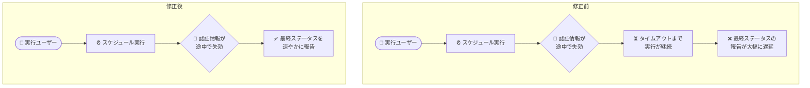

# Agent Platform Workbench: スケジュール実行ノートブックの認証情報失効時のステータス報告修正

**リリース日**: 2026-08-23

**サービス**: Gemini Enterprise Agent Platform Workbench

**機能**: スケジュール実行ノートブックの認証情報失効時のステータス報告修正 / 最新アップストリームパッケージの適用

**ステータス**: Fixed / Changed (M147 Release ほか)

📊 [このアップデートのインフォグラフィックを見る](https://takech9203.github.io/google-cloud-news-summary/20260823-agent-platform-workbench-scheduled-notebook-execution-fix.html)

## 概要

2026 年 8 月 23 日、Gemini Enterprise Agent Platform Workbench の一連のリリース (M147 Release および 20260823-2130/2230/2330-rc0 の複数の rc リリース) が公開されました。

主要な修正は、スケジュール実行されるノートブックに関するものです。従来は、実行ユーザーの認証情報 (credentials) が実行の途中で無効になった場合、実行が最終ステータスを報告せず、実行タイムアウトまで継続してしまう問題がありました。今回の修正により、認証情報が途中で失効した場合でも、実行が最終ステータスを速やかに報告するようになりました。

あわせて、アップストリーム依存関係の最新パッケージがインストールされています (定常的なパッケージ更新)。Workbench でスケジュール実行 (executor) を利用してノートブックの定期実行を運用しているデータサイエンティストや ML エンジニアに関係するアップデートです。

**アップデート前の課題**

- 実行ユーザーの認証情報が実行途中で無効になった場合、スケジュール実行は最終ステータスを報告せず、実行タイムアウトに達するまで実行が継続していた
- 失敗の検知がタイムアウトまで遅延するため、後続の運用対応 (再実行や認証情報の修復) の開始が遅れていた

**アップデート後の改善**

- 認証情報が途中で機能しなくなった時点で、スケジュール実行が最終ステータスを報告するようになった
- タイムアウトを待たずに実行の失敗を把握できるようになり、障害検知と対応の迅速化が期待できる
- あわせてアップストリーム依存パッケージが最新化された

## アーキテクチャ図

認証情報が実行途中で失効した際の挙動の Before/After 比較です。修正後はタイムアウトを待たずに最終ステータスが報告されます。

## サービスアップデートの詳細

### 主要な変更点

1. **スケジュール実行の最終ステータス報告の修正 (Fixed)**
   - 実行ユーザーの認証情報が実行の途中で無効になった場合、従来は実行タイムアウトまで実行が継続していた
   - 修正後は、その時点で実行が最終ステータスを報告するようになった

2. **最新アップストリームパッケージの適用 (Changed)**
   - アップストリーム依存関係の最新パッケージがインストールされた
   - 対象リリース: 20260823-2130-rc0、20260823-2230-rc0、20260823-2330-rc0、M147 Release

### スケジュール実行 (executor) の背景

Agent Platform Workbench の executor は、ノートブックファイルを 1 回限りまたはスケジュールベースで実行する機能です。インスタンスがシャットダウンされていてもスケジュールに従って実行され、結果は Cloud Storage バケットに保存されます。実行結果は Google Cloud コンソールの Executions / Schedules ページや JupyterLab の Notebook Executor から確認できます。

## メリット

### 技術面

- **障害検知の迅速化**: 認証情報の失効による失敗がタイムアウトを待たずにステータスへ反映されるため、監視・アラートでの検知が早くなる
- **無駄な実行時間の削減**: 失効後に実行がタイムアウトまで継続することがなくなる

### 運用面

- **対応の早期化**: 認証情報の修復やスケジュールの再設定など、後続の運用対応を早く開始できる
- **ユーザー側の作業は不要**: プラットフォーム側の修正であり、既存のスケジュール実行に対する設定変更は不要

## ユースケース

### ユースケース: 定期実行ノートブックの運用監視

**シナリオ**: 夜間にスケジュール実行しているデータ処理ノートブックで、実行ユーザーの認証情報が途中で無効化された。

**効果**: 従来は実行タイムアウトまでステータスが確定せず、翌朝まで失敗に気付けない可能性があったが、修正後は失効時点で最終ステータスが報告されるため、監視から早期に検知して対応できる。

## 関連サービス・機能

- **Cloud Storage**: スケジュール実行されたノートブックの出力の保存先
- **IAM**: 実行に必要なロール (`roles/notebooks.runner`、`roles/storage.admin` など) や認証情報の管理
- **Agent Platform custom training**: executor によるノートブック実行の基盤

## 参考リンク

- 📊 [インフォグラフィック](https://takech9203.github.io/google-cloud-news-summary/20260823-agent-platform-workbench-scheduled-notebook-execution-fix.html)
- [公式リリースノート](https://docs.cloud.google.com/release-notes#August_23_2026)
- [Schedule a notebook run](https://docs.cloud.google.com/gemini-enterprise-agent-platform/notebooks/workbench/instances/schedule-notebook-run-quickstart)
- [Agent Platform Workbench Introduction](https://docs.cloud.google.com/gemini-enterprise-agent-platform/notebooks/workbench/introduction)

## まとめ

Agent Platform Workbench のスケジュール実行において、認証情報が途中で失効した場合でも最終ステータスが速やかに報告されるようになりました。プラットフォーム側の修正のためユーザーの作業は不要ですが、スケジュール実行を運用しているチームは、失敗ステータスの監視・アラート設定を見直すことでこの改善を活かせます。

---

**タグ**: #AgentPlatformWorkbench #GeminiEnterprise #Notebooks #JupyterLab #ScheduledExecution #BugFix
