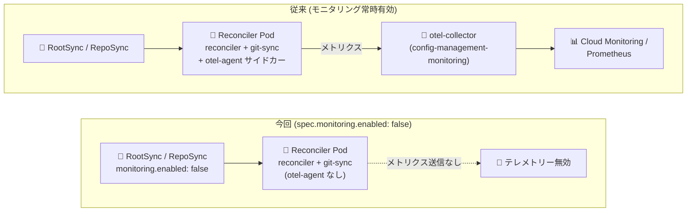

# Anthos Config Management (Config Sync): RootSync/RepoSync 単位でのモニタリング無効化と CVE 対応

**リリース日**: 2026-08-24

**サービス**: Anthos Config Management (Config Sync)

**機能**: RootSync/RepoSync オブジェクト単位でのモニタリング無効化 (`spec.monitoring.enabled`)、依存関係更新による CVE 対応

**ステータス**: GA (一般提供)

📊 [このアップデートのインフォグラフィックを見る](https://takech9203.github.io/google-cloud-news-summary/20260824-anthos-config-management-config-sync-disable-monitoring.html)

## 概要

Anthos Config Management の Config Sync において、カスタムの RootSync または RepoSync オブジェクトごとにモニタリング (メトリクステレメトリーの収集とエクスポート) を無効化できるようになりました。RootSync/RepoSync カスタムリソースの `spec.monitoring.enabled` フィールドを `false` に設定すると、そのオブジェクトに対応する Reconciler のメトリクス収集・エクスポートが無効化され、Reconciler Pod から `otel-agent` サイドカーコンテナが省略されます。これにより、クラスタのリソース消費を削減できます。

このアップデートは、多数の RootSync/RepoSync オブジェクトを運用する大規模な GitOps 環境や、リソースに制約のあるクラスタ (エッジ環境や小規模ノードプールなど) で Config Sync を利用するプラットフォームチームにとって有用です。同期対象ごとにモニタリングの要否を選択できるため、重要な同期のみメトリクスを収集し、それ以外はオーバーヘッドを削減するといった柔軟な運用が可能になります。

あわせて、依存関係 (dependencies) の更新により複数の CVE (Common Vulnerabilities and Exposures) への対応が行われました。セキュリティ観点からも最新バージョンへの更新が推奨されます。

**アップデート前の課題**

- Config Sync はデフォルトですべての RootSync/RepoSync オブジェクトのメトリクスを収集しており、オブジェクト単位でモニタリングを無効化する手段がなかった
- RootSync/RepoSync オブジェクトごとに Reconciler Pod に `otel-agent` サイドカーコンテナが常時起動するため、同期対象が多い環境ではその分のクラスタリソース (CPU/メモリ) を消費していた
- メトリクスが不要な同期対象についても Cloud Monitoring へのサンプル取り込みが発生し得た

**アップデート後の改善**

- `spec.monitoring.enabled: false` を設定することで、特定のカスタム RootSync/RepoSync オブジェクトのメトリクステレメトリー収集・エクスポートを無効化できるようになった
- モニタリングを無効化した Reconciler Pod では `otel-agent` サイドカーコンテナが省略され、クラスタのリソース消費を削減できるようになった
- 依存関係の更新により複数の CVE が解消され、セキュリティ体制が強化された

## アーキテクチャ図



従来はすべての Reconciler Pod に `otel-agent` サイドカーが付与されメトリクスが収集されていましたが、今回のアップデートによりオブジェクト単位でサイドカーを省略し、テレメトリー収集を無効化できるようになりました。

## サービスアップデートの詳細

### 主要機能

1. **RootSync/RepoSync 単位のモニタリング無効化 (`spec.monitoring.enabled`)**
   - RootSync または RepoSync カスタムリソースの `spec.monitoring.enabled` フィールドを `false` に設定すると、そのオブジェクトのメトリクステレメトリー収集・エクスポートが無効化される
   - デフォルト値は `true` (モニタリング有効) で、このフィールドはオプション
   - 無効化すると Reconciler Pod から `otel-agent` サイドカーコンテナが省略され、リソース消費の削減に寄与する

2. **カスタムオブジェクトのみサポート**
   - このフィールドはカスタムの RootSync オブジェクト、および任意の RepoSync オブジェクトに設定できる
   - Google Cloud コンソール、gcloud CLI、Terraform で Config Sync をインストールした際に自動作成されるデフォルトの `root-sync` オブジェクトではサポートされず、`spec.monitoring.enabled` フィールドへの変更は自動的に元に戻される (revert される)

3. **依存関係更新による CVE 対応**
   - 依存関係 (dependencies) の更新により、複数の CVE に対応
   - コンテナイメージや内部ライブラリの脆弱性が解消されるため、最新バージョンへのアップグレードが推奨される

## 技術仕様

### `spec.monitoring.enabled` フィールド

| 項目 | 詳細 |
|------|------|
| フィールド | `spec.monitoring.enabled` |
| 型 / デフォルト | boolean / `true` (オプション) |
| 対象リソース | カスタム RootSync オブジェクト、任意の RepoSync オブジェクト |
| 非対応 | デフォルトの `root-sync` オブジェクト (コンソール / gcloud CLI / Terraform で作成されたもの) では変更が自動的に元に戻される |
| `false` 設定時の動作 | 対象 Reconciler のメトリクステレメトリー収集・エクスポートが無効化され、Reconciler Pod から `otel-agent` サイドカーが省略される |

### Config Sync のメトリクス収集の仕組み

Config Sync は OpenCensus でメトリクスを作成・記録し、OpenTelemetry を使用して Prometheus および Cloud Monitoring にエクスポートします。`otel-collector` Deployment は `config-management-monitoring` Namespace で実行され、GKE 上では `otel-collector-google-cloud` ConfigMap により Cloud Monitoring へのエクスポートが構成されます。今回のフィールドは、この収集パイプラインへの Reconciler 単位でのテレメトリー送信を制御します。

### 設定例

```yaml
apiVersion: configsync.gke.io/v1beta1
kind: RootSync # または RepoSync
metadata:
  name: SYNC_NAME
  namespace: SYNC_NAMESPACE
spec:
  monitoring:
    enabled: false
```

## 設定方法

### 前提条件

1. Config Sync がインストールされたクラスタ (GKE または登録済みクラスタ)
2. モニタリングを無効化する対象がカスタム RootSync オブジェクトまたは RepoSync オブジェクトであること (デフォルトの `root-sync` は対象外)
3. RootSync/RepoSync リソースを編集できる Kubernetes RBAC 権限

### 手順

#### ステップ 1: 対象の RootSync/RepoSync マニフェストに `spec.monitoring.enabled: false` を追加

```yaml
apiVersion: configsync.gke.io/v1beta1
kind: RepoSync
metadata:
  name: repo-sync-app
  namespace: my-app
spec:
  monitoring:
    enabled: false
  sourceFormat: unstructured
  git:
    repo: https://github.com/example/app-configs
    branch: main
    auth: none
```

`spec.monitoring.enabled` を `false` に設定します。

#### ステップ 2: マニフェストを適用し、Reconciler Pod を確認

```bash
kubectl apply -f repo-sync-app.yaml

# Reconciler Pod に otel-agent サイドカーがないことを確認
kubectl get pods -n config-management-system \
  -o jsonpath='{range .items[*]}{.metadata.name}{": "}{range .spec.containers[*]}{.name}{" "}{end}{"\n"}{end}'
```

適用後、対象の Reconciler Pod のコンテナ一覧に `otel-agent` が含まれていないことを確認します。

## メリット

### ビジネス面

- **クラスタコストの最適化**: 同期対象ごとに不要なサイドカーコンテナを省略することで、CPU/メモリ消費を削減し、ノードリソースを有効活用できる
- **モニタリングコストの抑制**: Config Sync メトリクスは Cloud Monitoring のサンプル取り込み量に応じて課金されるため、不要なメトリクスの収集を止めることで観測コストを削減できる

### 技術面

- **きめ細かいテレメトリー制御**: クラスタ全体ではなく RootSync/RepoSync オブジェクト単位でモニタリングの有効/無効を選択でき、重要な同期のみ観測する運用が可能
- **宣言的な設定**: カスタムリソースのフィールド 1 つで制御でき、GitOps のワークフローの中でモニタリング設定自体もコード管理できる
- **セキュリティ強化**: 依存関係の更新により複数の CVE が解消され、脆弱性リスクが低減する

## デメリット・制約事項

### 制限事項

- デフォルトの `root-sync` オブジェクト (Google Cloud コンソール、gcloud CLI、Terraform で作成) では `spec.monitoring.enabled` はサポートされず、変更しても自動的に元に戻される
- モニタリングを無効化した Reconciler については、同期の状態やパフォーマンスに関するメトリクスが Cloud Monitoring / Prometheus で確認できなくなる

### 考慮すべき点

- メトリクスが取得できなくなるため、無効化した同期対象のトラブルシューティングは RootSync/RepoSync オブジェクトのステータスや Reconciler のログ (`kubectl logs`) に依存することになる
- 本番環境で重要な構成を同期している RootSync/RepoSync では、可観測性とリソース削減のトレードオフを慎重に判断する必要がある

## ユースケース

### ユースケース 1: 多数の RepoSync を運用するマルチテナントクラスタのリソース削減

**シナリオ**: 数十の Namespace それぞれに RepoSync を構成しているマルチテナント GKE クラスタで、Reconciler Pod ごとの `otel-agent` サイドカーの積み上げによる CPU/メモリ消費が無視できなくなっている。

**実装例**:
```yaml
apiVersion: configsync.gke.io/v1beta1
kind: RepoSync
metadata:
  name: repo-sync
  namespace: tenant-a
spec:
  monitoring:
    enabled: false
  git:
    repo: https://github.com/example/tenant-a-configs
    branch: main
```

**効果**: 重要度の低いテナントの RepoSync でテレメトリーを無効化することで、クラスタ全体のリソース消費と Cloud Monitoring のサンプル取り込みコストを削減できる。

### ユースケース 2: リソース制約の厳しいエッジ/小規模クラスタでの Config Sync 運用

**シナリオ**: エッジ拠点の小規模クラスタで Config Sync による構成同期を行っているが、ノードのリソースが限られており、監視コンポーネントのオーバーヘッドを最小化したい。

**効果**: カスタム RootSync でモニタリングを無効化し、同期状態の確認は RootSync のステータスとログで代替することで、限られたリソースを本来のワークロードに割り当てられる。

## 料金

Anthos Config Management (Config Sync) 自体の料金体系に変更はありません。なお、Config Sync のメトリクスは Google Cloud Managed Service for Prometheus を通じて Cloud Monitoring に取り込まれ、取り込まれたサンプル数に基づいて課金されます。モニタリングを無効化することで、この取り込みコストを削減できる場合があります。

詳細は以下の料金ページを参照してください。

- [Google Kubernetes Engine の料金](https://cloud.google.com/kubernetes-engine/pricing)
- [Cloud Monitoring の料金](https://cloud.google.com/stackdriver/pricing#monitoring-pricing-summary)

## 関連サービス・機能

- **Cloud Monitoring**: Config Sync のメトリクスのエクスポート先。本機能で Reconciler 単位のメトリクス送信を制御できる
- **Google Cloud Managed Service for Prometheus**: Config Sync メトリクスの Cloud Monitoring への取り込みに使用される
- **GKE (Google Kubernetes Engine)**: Config Sync の主要な実行環境。GKE Enterprise の構成管理機能として提供される
- **OpenTelemetry**: Config Sync がメトリクスのエクスポートに使用する仕組み。無効化時は `otel-agent` サイドカーが省略される

## 参考リンク

- 📊 [インフォグラフィック](https://takech9203.github.io/google-cloud-news-summary/20260824-anthos-config-management-config-sync-disable-monitoring.html)
- [公式リリースノート](https://docs.cloud.google.com/release-notes#August_24_2026)
- [ドキュメント: Config Sync のモニタリングを無効化する](https://docs.cloud.google.com/kubernetes-engine/config-sync/docs/how-to/monitoring-config-sync#disable-monitoring)
- [ドキュメント: RootSync / RepoSync フィールドリファレンス](https://docs.cloud.google.com/kubernetes-engine/config-sync/docs/reference/rootsync-reposync-fields)
- [料金ページ (Cloud Monitoring)](https://cloud.google.com/stackdriver/pricing#monitoring-pricing-summary)

## まとめ

Config Sync の `spec.monitoring.enabled` フィールドにより、RootSync/RepoSync オブジェクト単位でメトリクステレメトリーを無効化し、`otel-agent` サイドカーの省略によるクラスタリソースの削減が可能になりました。多数の同期オブジェクトを運用する環境やリソース制約のあるクラスタでは、可観測性とのトレードオフを踏まえた上で適用を検討する価値があります。あわせて複数の CVE に対応した依存関係の更新が行われているため、Config Sync を利用中の環境では最新バージョンへのアップグレードを推奨します。

---

**タグ**: #AnthosConfigManagement #ConfigSync #GitOps #GKE #Monitoring #OpenTelemetry #Security #CVE
