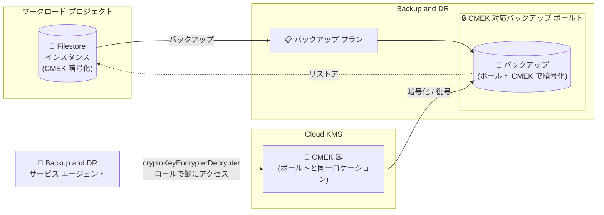

# Backup and DR: Filestore インスタンスの CMEK 対応バックアップ ボールトが GA

**リリース日**: 2026-08-24

**サービス**: Backup and DR

**機能**: CMEK で暗号化された Filestore インスタンスのバックアップ ボールト サポート

**ステータス**: GA (一般提供)

📊 [このアップデートのインフォグラフィックを見る](https://takech9203.github.io/google-cloud-news-summary/20260824-backup-and-dr-filestore-cmek-backup-vault-ga.html)

## 概要

顧客管理暗号鍵 (CMEK) で暗号化された Filestore インスタンスに対するバックアップ ボールトのサポートが一般提供 (GA) になりました。Filestore インスタンスを CMEK 対応のバックアップ ボールトにバックアップすると、バックアップ データはバックアップ ボールトに設定された CMEK 鍵を使用して暗号化されます。

Backup and DR の CMEK 保護には、バックアップ ボールトに直接設定した Cloud KMS 鍵でバックアップを暗号化する「ボールトレベル CMEK」と、ソース ワークロードの鍵を継承する「ソースレベル CMEK」の 2 つの方式があります。Filestore インスタンスのバックアップは前者の「ボールトレベル CMEK」に該当し、Backup and DR サービス エージェントがバックアップ ボールトの CMEK を使用してボールト内のバックアップを暗号化します。

コンプライアンスや規制要件により暗号鍵を自社で管理する必要がある金融、医療、公共分野などの組織が、Filestore のファイル共有データのバックアップまで一貫して自社管理の鍵で保護できるようになります。

**アップデート前の課題**

- CMEK で暗号化された Filestore インスタンスのバックアップ ボールト保護は一般提供されておらず、本番環境での利用が難しかった
- 暗号鍵の自社管理が求められる規制要件を持つ組織は、Filestore のバックアップ データを CMEK で保護する手段が限られていた
- ソース ワークロードは CMEK で保護できても、バックアップ側の暗号化を Google 管理鍵に依存せざるを得ないケースがあった

**アップデート後の改善**

- CMEK 対応バックアップ ボールトへの Filestore インスタンスのバックアップが GA となり、本番ワークロードで SLA のもと利用できるようになった
- バックアップ ボールトに設定した CMEK 鍵でバックアップが暗号化され、鍵のライフサイクル (アクセス制御、無効化、破棄) を Cloud KMS で一元管理できるようになった
- ソースの Filestore インスタンスからバックアップまで、エンドツーエンドで顧客管理鍵による暗号化を実現できるようになった

## アーキテクチャ図



Filestore インスタンスのバックアップは CMEK 対応バックアップ ボールトに保存され、Backup and DR サービス エージェントがボールトに設定された Cloud KMS の CMEK 鍵を使用してバックアップ データを暗号化・復号します。

## サービスアップデートの詳細

### 主要機能

1. **ボールトレベル CMEK による Filestore バックアップの暗号化**
   - Filestore インスタンスを CMEK 対応バックアップ ボールトにバックアップすると、ボールトに設定された CMEK 鍵でバックアップが暗号化される
   - Compute Engine ディスクや Cloud SQL のようにソース側の鍵を継承する方式ではなく、バックアップ ボールト側の鍵を使用する方式

2. **Cloud KMS による鍵の一元管理**
   - 鍵は Cloud Key Management Service で管理し、IAM 権限で鍵へのアクセスを制御する
   - 鍵を一時的に無効化または完全に破棄すると、その鍵で保護されたデータにはアクセスできなくなる

3. **サービス エージェントによる暗号化処理**
   - Backup and DR サービス エージェント (`service-VAULT_PROJECT_NUMBER@gcp-sa-backupdr.iam.gserviceaccount.com`) がボールトの CMEK を使用してバックアップを暗号化する
   - 復号権限はボールト プロジェクトのサービス エージェントに紐付くため、元のワークロード プロジェクトが削除されてもバックアップをリストアできる

### ワークロード別の暗号鍵の使い分け

| ワークロード | バックアップに使用される暗号鍵 | CMEK サポート |
|------|------|------|
| Compute Engine インスタンス | バックアップ ボールトの CMEK | サポート |
| Compute Engine ディスク | ソース ディスクの暗号鍵 | サポート |
| Cloud SQL | ソース インスタンスの暗号鍵 | サポート |
| AlloyDB クラスタ | バックアップ ボールトの CMEK | サポート |
| **Filestore インスタンス** | **バックアップ ボールトの CMEK** | **サポート (今回 GA)** |
| VMware Engine、Oracle、SQL Server | - | 未サポート |

## 技術仕様

### CMEK 対応バックアップ ボールトの要件

| 項目 | 詳細 |
|------|------|
| CMEK の設定タイミング | バックアップ ボールト作成時のみ (既存ボールトへの追加・変更・削除は不可) |
| 鍵のロケーション | バックアップ ボールトと同一ロケーションの Cloud KMS 鍵が必要 (リージョン ボールトは同一リージョン、マルチリージョン ボールトは同一マルチリージョンの鍵) |
| クロスリージョン バックアップ | バックアップ ボールトと同一リージョンの鍵を使用する必要がある |
| 必要な IAM ロール | Backup and DR サービス エージェントに対象鍵の `roles/cloudkms.cryptoKeyEncrypterDecrypter` ロールが必要 |
| CSEK (顧客指定暗号鍵) | 未サポート |
| デフォルト ボールト | デフォルトのバックアップ ボールト / バックアップ プランは Google 管理暗号化を使用。CMEK を使うには新規ボールトの作成と明示的な CMEK 有効化が必要 |

## 設定方法

### 前提条件

1. Cloud KMS でバックアップ ボールトと同一ロケーションに鍵リングと鍵を作成済みであること
2. Backup and DR サービス エージェントに鍵への `roles/cloudkms.cryptoKeyEncrypterDecrypter` ロールを付与できる権限があること

### 手順

#### ステップ 1: サービス エージェントへの鍵アクセス権限付与

```bash
gcloud kms keys add-iam-policy-binding KEY_NAME \
  --location=KMS_LOCATION \
  --keyring=KEY_RING \
  --member=serviceAccount:service-VAULT_PROJECT_NUMBER@gcp-sa-backupdr.iam.gserviceaccount.com \
  --role=roles/cloudkms.cryptoKeyEncrypterDecrypter \
  --project=KMS_PROJECT_ID
```

最小権限の原則に従い、鍵リング全体ではなく特定の鍵に対してロールを付与することが推奨されています。Google Cloud コンソールでボールト作成時に鍵を選択した場合、十分な権限があれば自動付与が提案されることもあります。

#### ステップ 2: CMEK 対応バックアップ ボールトの作成

1. Google Cloud コンソールで「バックアップ ボールト」ページに移動し、「バックアップ ボールトを作成」をクリック
2. 名前やロケーションなどを入力
3. 「暗号化」セクションで「顧客管理の暗号鍵 (CMEK)」を選択し、使用する Cloud KMS 鍵を選択
4. その他の設定を行い「作成」をクリック

CMEK はボールト作成時にのみ有効化できます。

#### ステップ 3: バックアップ プランの作成と Filestore インスタンスへの適用

1. バックアップ プランの作成時に、作成した CMEK 対応バックアップ ボールトをターゲットとして選択
2. バックアップ プランを Filestore インスタンスに適用

なお、ボールト プロジェクトのサービス エージェントがボールトの CMEK 鍵への権限を持たない場合、Backup and DR はバックアップ プランの関連付け (BPA) の作成を事前にブロックします。

## メリット

### ビジネス面

- **コンプライアンス要件への対応**: 暗号鍵の自社管理が求められる規制要件 (金融、医療、公共など) に対し、Filestore バックアップも含めて CMEK で保護できる
- **GA による本番利用**: 一般提供となったことで、本番環境のファイル共有ワークロードの保護に安心して採用できる

### 技術面

- **鍵のライフサイクル管理**: Cloud KMS で鍵のアクセス制御、ローテーション、無効化、破棄を一元管理できる
- **プロジェクト削除への耐性**: 復号権限がボールト プロジェクトのサービス エージェントに紐付くため、元のワークロード プロジェクトが削除されてもバックアップをリストア可能
- **暗号化アクセスの即時遮断**: サービス エージェントの鍵アクセスを取り消すことで、新規バックアップの作成と既存バックアップのリストアを停止できる (クリプトシュレッディングの一環として活用可能)

## デメリット・制約事項

### 制限事項

- CMEK はバックアップ ボールト作成時にのみ設定可能で、既存ボールトでの有効化・無効化・変更はできない
- Cloud KMS 鍵はバックアップ ボールトと同一ロケーションに存在する必要がある
- 顧客指定暗号鍵 (CSEK) はサポートされない
- CMEK 保護はバックアップ ボールト保存のバックアップのうち、Compute Engine インスタンス、Persistent Disk、Filestore、Cloud SQL、AlloyDB クラスタに限定される

### 考慮すべき点

- **鍵の無効化・削除は重大な影響を持つ**: アクティブな Filestore バックアップ チェーンで使用中の CMEK を無効化・削除、または権限を変更すると、それらのバックアップは恒久的にリストア不能になる
- Backup and DR サービス エージェントから鍵へのアクセスを取り消すと、新規バックアップの作成と既存バックアップのリストアができなくなる
- デフォルトのバックアップ ボールトは Google 管理暗号化のため、CMEK を使うには新規ボールトの作成が必要

## ユースケース

### ユースケース 1: 規制業界におけるファイル共有データのエンドツーエンド暗号化

**シナリオ**: 金融機関が Filestore 上に業務ファイル共有を構築しており、規制要件によりデータの暗号鍵を自社管理する必要がある。ソースの Filestore インスタンスは CMEK で暗号化済みだが、バックアップも顧客管理鍵で保護したい。

**実装例**:
```bash
# 1. サービス エージェントに鍵の暗号化/復号権限を付与
gcloud kms keys add-iam-policy-binding fileshare-backup-key \
  --location=asia-northeast1 \
  --keyring=backup-keyring \
  --member=serviceAccount:service-123456789@gcp-sa-backupdr.iam.gserviceaccount.com \
  --role=roles/cloudkms.cryptoKeyEncrypterDecrypter

# 2. コンソールで CMEK 対応バックアップ ボールトを作成し、
#    バックアップ プランで Filestore インスタンスを保護
```

**効果**: ソースからバックアップまで一貫して顧客管理鍵で暗号化され、監査時に鍵管理の統制を証明できる。

### ユースケース 2: 鍵アクセス制御によるバックアップ データの統制

**シナリオ**: 企業のセキュリティ ポリシーとして、退役したワークロードのバックアップ データへのアクセスを暗号的に遮断したい。

**効果**: Cloud KMS 上で鍵のアクセス権限を制御することで、バックアップ データの利用可否を鍵側で統制できる。ただし、アクティブなバックアップ チェーンで使用中の鍵の無効化はバックアップの恒久的なリストア不能につながるため、慎重な運用が必要。

## 料金

Backup and DR は CMEK の使用に対して追加料金を請求しません。ただし、Cloud Key Management Service での鍵の使用に対しては課金されます (鍵のバージョン保持と暗号化オペレーションに対する KMS 料金)。

バックアップ ボールトのストレージ料金は通常どおり発生します。詳細は以下の料金ページを参照してください。

- [Backup and DR の料金](https://cloud.google.com/backup-disaster-recovery/pricing)
- [Cloud KMS の料金](https://docs.cloud.google.com/kms/pricing)

## 関連サービス・機能

- **Cloud Key Management Service (Cloud KMS)**: CMEK 鍵の作成・管理・アクセス制御を担うサービス。バックアップ ボールトと同一ロケーションの鍵が必要
- **Filestore**: バックアップ対象のフルマネージド NFS ファイル ストレージ。ソース インスタンス自体も CMEK で暗号化可能
- **IAM / サービス エージェント**: Backup and DR サービス エージェントへの `cryptoKeyEncrypterDecrypter` ロール付与により鍵アクセスを制御
- **組織ポリシー**: CMEK の使用を強制する組織ポリシー (CMEK organization policies) と組み合わせて統制を強化可能

## 参考リンク

- 📊 [インフォグラフィック](https://takech9203.github.io/google-cloud-news-summary/20260824-backup-and-dr-filestore-cmek-backup-vault-ga.html)
- [公式リリースノート](https://docs.cloud.google.com/release-notes#August_24_2026)
- [顧客管理の暗号鍵 (CMEK) の概念](https://docs.cloud.google.com/backup-disaster-recovery/docs/concepts/cmek)
- [Filestore インスタンスをバックアップ ボールトにバックアップする](https://docs.cloud.google.com/backup-disaster-recovery/docs/cloud-console/filestore/filestore-instance-backup)
- [バックアップ ボールトから Filestore インスタンスをリストアする](https://docs.cloud.google.com/backup-disaster-recovery/docs/cloud-console/filestore/filestore-instance-restore)
- [Backup and DR での CMEK の設定](https://docs.cloud.google.com/backup-disaster-recovery/docs/configuration/set-up-cmek)
- [Cloud KMS の料金ページ](https://docs.cloud.google.com/kms/pricing)

## まとめ

CMEK で暗号化された Filestore インスタンスのバックアップ ボールト サポートが GA となり、規制要件を持つ組織でもファイル共有データのバックアップを顧客管理鍵で保護する構成を本番環境で採用できるようになりました。CMEK はボールト作成時にのみ設定可能なため、既存の Google 管理暗号化ボールトを利用中の場合は CMEK 対応ボールトの新規作成とバックアップ プランの見直しを検討してください。また、アクティブなバックアップ チェーンで使用中の鍵の無効化・削除はバックアップの恒久的なリストア不能につながるため、鍵のライフサイクル運用ルールを事前に整備することを推奨します。

---

**タグ**: Backup and DR, Filestore, CMEK, Cloud KMS, バックアップ ボールト, 暗号化, セキュリティ, GA
