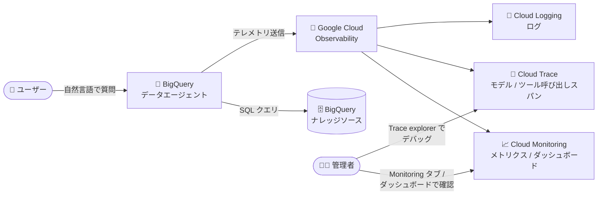

# BigQuery: Google Cloud Observability によるデータエージェントのモニタリング (Preview)

**リリース日**: 2026-08-24

**サービス**: BigQuery

**機能**: データエージェントと会話のモニタリング (Google Cloud Observability 統合)

**ステータス**: Preview

📊 [このアップデートのインフォグラフィックを見る](https://takech9203.github.io/google-cloud-news-summary/20260824-bigquery-data-agent-monitoring.html)

## 概要

BigQuery のデータエージェント (Conversational Analytics のエージェント) と、そのエージェントとの会話について、パフォーマンス、採用状況 (アダプション)、レイテンシ、コストを Google Cloud Observability (Cloud Monitoring / Cloud Trace / Cloud Logging) でモニタリングできるようになりました。本機能は Preview として提供されます。

BigQuery のデータエージェントは、自然言語でデータに質問できる Conversational Analytics の中核機能です。組織でデータエージェントの利用が広がるにつれ、「どのエージェントがよく使われているか」「回答のレイテンシはどの程度か」「トークン消費 (コスト) はどれくらいか」といった運用面の可視化が課題となっていました。今回のアップデートにより、エージェントの利用状況・ユーザーエンゲージメント・回答レイテンシ・トークン使用量の予測などのメトリクスを、BigQuery コンソールの Agents ページの Monitoring タブや Cloud Monitoring の専用ダッシュボードで確認できます。

データエージェントを組織的に展開するデータプラットフォーム管理者や、エージェントの品質・コストを管理する Solutions Architect / データエンジニアにとって、エージェント運用の PDCA を回すための基盤となるアップデートです。

**アップデート前の課題**

- データエージェントの利用状況 (誰が・どのエージェントを・どれだけ使っているか) を定量的に把握する組み込みの手段がなかった
- 会話ターン内のモデル呼び出しやツール呼び出しのシーケンスを可視化できず、エラーやレイテンシのトラブルシューティングが困難だった
- トークン使用量の見通しが立てにくく、エージェント運用のコスト管理が難しかった

**アップデート後の改善**

- エージェント数、質問したユーザー数、作成された会話数、最も多く回答したエージェント、よく使われるナレッジソースなどのメトリクスをダッシュボードで確認できるようになった
- Cloud Trace の Trace explorer で会話ターン内のモデル呼び出し・ツール呼び出しのスパンを可視化し、エラーやレイテンシの原因を調査できるようになった
- トークン使用量の予測 (Projected token usage) や時間別の回答レイテンシを把握でき、コストとパフォーマンスの管理が容易になった

## アーキテクチャ図



データエージェントとの会話のテレメトリが Google Cloud Observability に送信され、管理者は BigQuery コンソールの Monitoring タブや Cloud Monitoring / Cloud Trace で利用状況・レイテンシ・コストを可視化できます。

## サービスアップデートの詳細

### 主要機能

1. **エージェント利用状況メトリクスの可視化**
   - エージェントオブザーバビリティを有効化すると、以下のようなメトリクスを確認できる
     - 会話で使用されたエージェント数
     - 質問したユーザー数
     - 作成された会話数
     - 最も多くの質問に回答したエージェント
     - 最もよく使われているナレッジソース
     - ユーザーエンゲージメント
     - トークン使用量の予測 (Projected token usage)
     - 時間別の回答レイテンシ
   - BigQuery コンソールの Agents ページ内 Monitoring タブ、または Cloud Monitoring の「BigQuery Conversational Analytics」ダッシュボードで閲覧できる

2. **Cloud Trace によるモデル呼び出しのデバッグ**
   - 会話ターン内の処理シーケンス (モデル呼び出し、ツール呼び出しなど) をスパンとして可視化
   - Trace explorer でスパンの詳細を確認し、エラーやレイテンシの原因を特定できる
   - カスタムトレースダッシュボードの作成にも対応

3. **プロジェクト / 組織単位での有効化・無効化**
   - エージェントオブザーバビリティはデフォルトで無効。管理者がプロジェクトまたは組織単位で有効化する
   - Google Cloud コンソール、gcloud CLI (`gcloud gemini gibq-observability-settings`)、REST API (`cloudaicompanion.googleapis.com`) で設定を作成し、プロジェクトにバインドする
   - メトリクスとトレースを個別に有効/無効化できる (`--conversational-analytics-setting-metrics-enabled` / `--conversational-analytics-setting-traces-enabled`)

## 技術仕様

### 前提となる API と必要な権限

| 項目 | 詳細 |
|------|------|
| 有効化が必要な API | Cloud Trace API、Cloud Monitoring API、Cloud Logging API |
| 有効化に必要な主な権限 | `cloudaicompanion.gibqObservabilitySettings.create/list/update`、`geminidataanalytics.dataAgents.create`、`observability.traceScopes.create`、`resourcemanager.projects.update`、`serviceusage.services.enable` など |
| モニタリング閲覧用ロール | Monitoring Viewer (`roles/monitoring.viewer`) |
| トレース閲覧用ロール | Cloud Trace User (`roles/cloudtrace.user`) |
| ログ閲覧用ロール | Logs Viewer (`roles/logging.viewer`) |
| データセット閲覧用ロール | BigQuery Data Viewer (`roles/bigquery.dataViewer`) |
| 管理者設定閲覧用ロール | Gemini for Google Cloud User (`roles/cloudaicompanion.user`) |

### 収集されるメトリクスのカテゴリ

| カテゴリ | 内容 |
|------|------|
| 採用状況 (アダプション) | エージェント数、ユーザー数、会話数、エンゲージメント |
| パフォーマンス | 時間別の回答レイテンシ、エージェントのヘルス |
| コスト | トークン使用量の予測、モデル呼び出し回数 |
| 利用内訳 | 回答数の多いエージェント、よく使われるナレッジソース、ツール使用状況 |

## 設定方法

### 前提条件

1. Cloud Trace、Cloud Monitoring、Cloud Logging の各 API を有効化する
2. オブザーバビリティ設定を作成・更新するための IAM 権限 (上記「技術仕様」参照) を持っていること
3. BigQuery のデータエージェント (Conversational Analytics) を利用していること

### 手順

#### ステップ 1: オブザーバビリティ設定の作成

```bash
gcloud gemini gibq-observability-settings create SETTING_NAME \
  --conversational-analytics-setting-metrics-enabled \
  --conversational-analytics-setting-traces-enabled \
  --project=PROJECT_ID \
  --location=global
```

メトリクスとトレースを有効にしたオブザーバビリティ設定を作成します。コンソールから有効化した場合、設定名は `default` になります。

#### ステップ 2: 設定をプロジェクトにバインド

```bash
gcloud gemini gibq-observability-settings setting-bindings create BINDING_NAME \
  --gibq-observability-setting=SETTING_NAME \
  --target=projects/PROJECT_ID \
  --location=global \
  --project=PROJECT_ID
```

バインディング名には `binding-PROJECT_ID` の形式が推奨されています。コンソールの場合は、BigQuery の Agents ページ → Monitoring タブからプロンプトに従って有効化できます。

#### ステップ 3: メトリクスとトレースの確認

```text
# メトリクスの確認
BigQuery コンソール → Agents ページ → Monitoring タブ
または Cloud Monitoring → Dashboards → 「BigQuery Conversational Analytics」

# トレースの確認
Cloud Monitoring → Trace explorer → スパンを選択して詳細を確認
```

メトリクスはオブザーバビリティ有効化後から収集されます。過去のデータはバックフィルされません。

#### (参考) 無効化する場合

```bash
gcloud gemini gibq-observability-settings update SETTING_NAME \
  --no-conversational-analytics-setting-metrics-enabled \
  --no-conversational-analytics-setting-traces-enabled \
  --project=PROJECT_ID \
  --location=global
```

## メリット

### ビジネス面

- **エージェント導入効果の定量化**: ユーザー数・会話数・エンゲージメントのメトリクスにより、データエージェントの社内浸透度や ROI を定量的に評価できる
- **コストの見通し向上**: トークン使用量の予測により、エージェント運用コストの予算管理・チャージバックの検討材料が得られる
- **改善サイクルの確立**: よく使われるナレッジソースや回答数の多いエージェントを特定し、エージェントのコンテキスト整備やナレッジソース拡充の優先順位付けに活用できる

### 技術面

- **標準的な Observability スタックとの統合**: 専用ツールを導入せず、Cloud Monitoring / Cloud Trace / Cloud Logging という既存の運用基盤でエージェントを監視できる
- **トレースによる詳細なデバッグ**: 会話ターン内のモデル呼び出し・ツール呼び出しをスパン単位で追跡でき、エラーや高レイテンシの根本原因分析が可能
- **柔軟な有効化スコープ**: プロジェクト単位・組織単位で有効化でき、メトリクスとトレースを個別に制御できる

## デメリット・制約事項

### 制限事項

- Preview 段階の機能であり、Pre-GA Offerings Terms が適用される (サポートが限定される可能性がある)
- エージェントオブザーバビリティはデフォルトで無効のため、管理者による明示的な有効化が必要
- メトリクスは有効化後から収集され、有効化以前のデータはバックフィルされない

### 考慮すべき点

- Cloud Trace / Cloud Monitoring / Cloud Logging の各 API の有効化と、複数の IAM 権限・ロールの付与が必要なため、事前に権限設計を行うこと
- メトリクス・トレース・ログの閲覧には、監視対象とは別に閲覧系ロール (Monitoring Viewer など) の付与が必要
- フィードバックやサポート依頼は専用メールアドレス (bqca-feedback-external@google.com) 経由となる

## ユースケース

### ユースケース 1: 全社展開したデータエージェントの利用状況ダッシュボード

**シナリオ**: データプラットフォームチームが複数部門にデータエージェントを展開しており、部門ごとの浸透状況やよく使われるナレッジソースを把握して、エージェントの改善やナレッジソース拡充の優先順位を決めたい。

**実装例**:
```bash
# オブザーバビリティを有効化した後、Cloud Monitoring で確認
# ダッシュボード: 「BigQuery Conversational Analytics」
# 確認するメトリクス: ユーザー数、会話数、回答数の多いエージェント、
#                     よく使われるナレッジソース、ユーザーエンゲージメント
```

**効果**: 利用実態にもとづいてエージェントのコンテキスト整備やナレッジソース追加を判断でき、データ活用の民主化を効率的に推進できる。

### ユースケース 2: 回答レイテンシとエラーのトラブルシューティング

**シナリオ**: 特定のエージェントで「回答が遅い」というユーザーからの報告があり、会話ターンのどの処理 (モデル呼び出し、ツール呼び出し、SQL 実行) がボトルネックかを特定したい。

**効果**: Trace explorer でスパンを確認することで、レイテンシの内訳やエラー発生箇所を特定し、エージェントの指示 (instructions) やナレッジソースの見直しなど具体的な改善につなげられる。

### ユースケース 3: トークン使用量にもとづくコスト管理

**シナリオ**: エージェントの利用拡大に伴い、トークン消費とクエリコストの増加を管理したい。

**効果**: Projected token usage メトリクスでコストの見通しを立て、必要に応じて Conversational Analytics API の `big_query_max_billed_bytes` 設定や BigQuery クォータと組み合わせた多層的なコスト管理を実現できる。

## 料金

モニタリング機能自体の追加料金は Release Notes には記載されていません。関連する料金は以下を参照してください。

- データエージェントの会話やエージェント作成時に実行されるクエリには BigQuery のコンピューティング料金が適用されます
- 収集されるメトリクス・トレース・ログには Google Cloud Observability (Cloud Monitoring / Cloud Trace / Cloud Logging) の料金体系が適用される可能性があります

詳細は以下の料金ページを確認してください。

- [BigQuery の料金](https://cloud.google.com/bigquery/pricing)
- [データエージェントの料金](https://cloud.google.com/products/data-agents/pricing)
- [Google Cloud Observability の料金](https://cloud.google.com/stackdriver/pricing)

## 利用可能リージョン

公式ドキュメントに本機能固有のリージョン情報の記載はありません。なお、Conversational Analytics 自体はエージェント・会話リソースの保存場所として US MREP、EU MREP、Global の 3 つのロケーションをサポートしています。詳細は [Conversational analytics overview](https://docs.cloud.google.com/bigquery/docs/conversational-analytics) を参照してください。

## 関連サービス・機能

- **Cloud Monitoring**: エージェントメトリクスの収集・ダッシュボード表示 (「BigQuery Conversational Analytics」ダッシュボード、Metrics explorer)
- **Cloud Trace**: 会話ターン内のモデル呼び出し・ツール呼び出しのスパン可視化とデバッグ
- **Cloud Logging**: エージェント関連のログの閲覧
- **Gemini for Google Cloud**: Conversational Analytics を支える基盤。オブザーバビリティ設定は `cloudaicompanion.googleapis.com` API で管理
- **Conversational Analytics API**: データエージェントのプログラマティックな作成・管理。`big_query_max_billed_bytes` によるクエリコスト制限と組み合わせたコスト管理が可能
- **BigQuery agent analytics**: ADK / LangGraph などで構築した独自エージェントのインタラクションログを BigQuery にストリーミングして分析するオープンソースソリューション。本機能 (マネージドなデータエージェントの監視) と補完関係にある

## 参考リンク

- 📊 [インフォグラフィック](https://takech9203.github.io/google-cloud-news-summary/20260824-bigquery-data-agent-monitoring.html)
- [公式リリースノート](https://docs.cloud.google.com/release-notes#August_24_2026)
- [ドキュメント: Monitor agents and conversations](https://docs.cloud.google.com/bigquery/docs/create-data-agents#monitor_agents_and_conversations)
- [Conversational analytics overview](https://docs.cloud.google.com/bigquery/docs/conversational-analytics)
- [Conversational Analytics API のコスト管理](https://docs.cloud.google.com/gemini/data-agents/conversational-analytics-api/manage-costs)
- [BigQuery の料金](https://cloud.google.com/bigquery/pricing)

## まとめ

BigQuery のデータエージェントに Google Cloud Observability による組み込みのモニタリングが加わり、利用状況・レイテンシ・コストの可視化とトレースによるデバッグが可能になりました。データエージェントを組織展開している、または展開を検討しているチームは、Preview 段階から有効化して利用実態を把握し、エージェント改善とコスト管理のサイクルを確立することを推奨します。メトリクスは有効化後からしか収集されないため、早めの有効化が有益です。

---

**タグ**: BigQuery, Conversational Analytics, データエージェント, Google Cloud Observability, Cloud Monitoring, Cloud Trace, Preview, 生成 AI, Gemini
