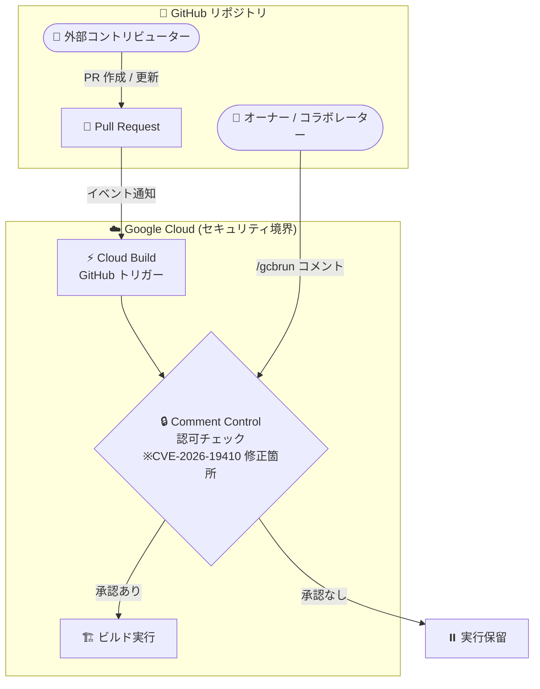

# Cloud Build: GitHub トリガー Comment Control の Incorrect Authorization 脆弱性 (CVE-2026-19410) の修正

**リリース日**: 2026-08-24

**サービス**: Cloud Build

**機能**: GitHub Trigger Comment Control の脆弱性修正 (CVE-2026-19410)

**ステータス**: Security (修正済み)

📊 [このアップデートのインフォグラフィックを見る](https://takech9203.github.io/google-cloud-news-summary/20260824-cloud-build-cve-2026-19410-fix.html)

## 概要

Cloud Build の GitHub トリガーにおける Comment Control 機能で、Incorrect Authorization (不適切な認可) の脆弱性 CVE-2026-19410 が修正されました。この修正は Google 側で完了しており、**ユーザー側の対応は不要**です。

Comment Control は、GitHub の Pull Request をイベントとするビルドトリガーにおいて、ビルドの自動実行を制御するセキュリティ機能です。リポジトリのオーナーまたはコラボレーターが Pull Request 上で `/gcbrun` とコメントするまでビルドの実行を保留することで、外部コントリビューターによる悪意あるコードの実行 (例: CI 環境での不正なビルド実行や認証情報の窃取) を防止する役割を担っています。

今回のアップデートは、この認可制御メカニズム自体に存在した脆弱性の修正であり、Pull Request 駆動の CI/CD パイプラインを Cloud Build で運用しているすべてのユーザーに関係する重要なセキュリティ修正です。

**アップデート前の課題**

- GitHub トリガーの Comment Control 機能に Incorrect Authorization (CWE でいう不適切な認可) に分類される脆弱性 CVE-2026-19410 が存在していた

**アップデート後の改善**

- 脆弱性 CVE-2026-19410 が Google 側で修正され、Comment Control による認可制御が意図したとおりに機能するようになった
- 修正はサーバーサイドで適用済みのため、ユーザー側での設定変更やアップデート作業は不要

## アーキテクチャ図



外部コントリビューターの Pull Request は、オーナーまたはコラボレーターによる `/gcbrun` コメント (認可) がない限りビルドが実行されない仕組みです。今回の修正は、この認可チェック部分に存在した Incorrect Authorization 脆弱性を解消するものです。

## サービスアップデートの詳細

### 主要機能

1. **CVE-2026-19410 の修正**
   - Cloud Build の GitHub Trigger Comment Control における Incorrect Authorization 脆弱性が修正された
   - 修正は Google 側で完了しており、ユーザー側の対応は不要

2. **Comment Control 機能 (修正対象の機能)**
   - GitHub の Pull Request イベントで起動するトリガーに対して、ビルドの自動実行可否を制御する機能
   - リポジトリの読み取りアクセス権を持つ任意のユーザーが Pull Request を送信できるため、ソースコード変更を含むビルドが意図せず実行されるリスクを軽減する目的で提供されている

## 技術仕様

### Comment Control の設定オプション

Comment Control には以下の 3 つのモードがあります (`gcloud builds triggers create github` の `--comment-control` フラグに対応)。

| 設定値 | コンソール表記 | 動作 |
|------|------|------|
| `COMMENTS_ENABLED` | Required | 誰が PR を作成・更新しても、オーナーまたはコラボレーターが `/gcbrun` とコメントするまでビルドは実行されない |
| `COMMENTS_ENABLED_FOR_EXTERNAL_CONTRIBUTORS_ONLY` | Required except for owners and collaborators | オーナー / コラボレーターの PR は自動実行。外部コントリビューターの PR は `/gcbrun` コメント後にのみ実行 |
| `COMMENTS_DISABLED` | Not required | 誰が PR を作成・更新しても、トリガーによりビルドが自動実行される |

### 設定確認コマンドの例

Pull Request トリガーの Comment Control 設定は、トリガー作成・更新時に指定できます。

```bash
gcloud builds triggers create github \
  --name="my-pr-trigger" \
  --repo-owner="OWNER" \
  --repo-name="REPO" \
  --pull-request-pattern="^main$" \
  --comment-control="COMMENTS_ENABLED" \
  --build-config="cloudbuild.yaml"
```

## メリット

### ビジネス面

- **対応作業が不要**: 修正はマネージドサービス側で完了しており、ユーザーの運用負荷やダウンタイムは発生しない
- **CI/CD パイプラインの信頼性向上**: Pull Request 駆動のビルドにおける認可制御が正しく機能することで、サプライチェーンのセキュリティリスクが低減される

### 技術面

- **認可制御の健全性回復**: Comment Control による `/gcbrun` ゲートが設計どおりに機能する
- **多層防御の一層を確保**: 外部コントリビューターからのコード実行を防ぐ防御レイヤーが正常化された

## デメリット・制約事項

### 考慮すべき点

- 本リリースノートでは脆弱性の深刻度 (Severity) や悪用可能性の詳細は公表されていない
- 公開リポジトリで Pull Request トリガーを利用する場合、Comment Control に加えて手動承認 (Manual approvals) の利用が公式ドキュメントで推奨されている。リポジトリの読み取りアクセス権を持つ任意のユーザーが Pull Request を送信でき、その変更を含むビルドが実行される可能性があるためである

## ユースケース

### ユースケース 1: OSS プロジェクトの CI/CD 保護設定の再点検

**シナリオ**: 公開 GitHub リポジトリで Cloud Build の Pull Request トリガーを運用しているチームが、今回の修正を機に Comment Control の設定を再点検する。

**実装例**:
```bash
# 既存トリガーの設定を確認
gcloud builds triggers describe TRIGGER_NAME --region=REGION \
  --format="yaml(github.pullRequest.commentControl)"
```

**効果**: 外部コントリビューターの PR に対して `/gcbrun` による承認ゲートが有効になっていることを確認でき、意図しないビルド実行を防止できる。

### ユースケース 2: ビルド承認との組み合わせによる多層防御

**シナリオ**: 機密性の高いビルド環境で、Comment Control に加えて Cloud Build の手動承認 (`--require-approval`) を有効化し、ビルド実行前に二重のゲートを設ける。

**効果**: 認可制御のいずれかのレイヤーに問題が生じた場合でも、もう一方のゲートで不正なビルド実行を阻止できる。

## 関連サービス・機能

- **Cloud Build トリガー (GitHub 連携)**: 今回の修正対象である Comment Control は GitHub App ベースの Pull Request トリガーの機能
- **Cloud Build 手動承認 (Manual approvals)**: 公開リポジトリでのビルド実行をゲートする推奨手段として公式ドキュメントで案内されている
- **Secret Manager / IAM**: ビルド時の権限はトリガーに紐づくサービスアカウントに依存するため、最小権限の原則に基づいた構成が推奨される

## 参考リンク

- 📊 [インフォグラフィック](https://takech9203.github.io/google-cloud-news-summary/20260824-cloud-build-cve-2026-19410-fix.html)
- [公式リリースノート](https://docs.cloud.google.com/release-notes#August_24_2026)
- [GitHub からのリポジトリのビルド (Comment Control の説明)](https://docs.cloud.google.com/build/docs/automating-builds/github/build-repos-from-github)
- [gcloud builds triggers create github リファレンス](https://docs.cloud.google.com/sdk/gcloud/reference/builds/triggers/create/github)
- [ビルドの手動承認](https://docs.cloud.google.com/build/docs/automating-builds/approve-builds)
- [Cloud Build セキュリティ情報 (Security Bulletins)](https://docs.cloud.google.com/build/docs/security-bulletins)

## まとめ

Cloud Build の GitHub トリガー Comment Control における Incorrect Authorization 脆弱性 CVE-2026-19410 が修正されました。修正は Google 側で完了しており、ユーザーの対応は不要です。ただし、これを機に Pull Request トリガーの Comment Control 設定や手動承認の有効化状況を再点検し、CI/CD パイプラインの多層防御を確認することを推奨します。

---

**タグ**: #CloudBuild #セキュリティ #CVE #CICD #GitHub #脆弱性修正
