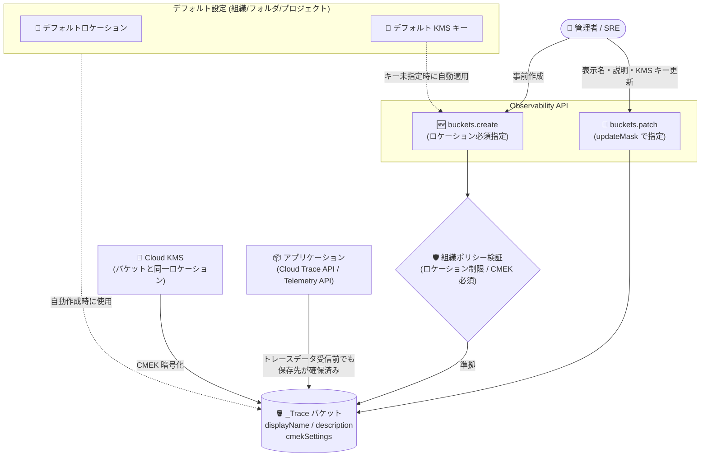

# Cloud Trace: Observability Bucket の手動作成と更新 (表示名・説明・Cloud KMS キー) に対応

**リリース日**: 2026-08-24

**サービス**: Cloud Trace, Google Cloud Observability

**機能**: `_Trace` Observability Bucket の手動作成、および表示名・説明・Cloud KMS キーの更新

**ステータス**: Feature (リリースノートおよびドキュメントに Preview 表記なし)

📊 [このアップデートのインフォグラフィックを見る](https://takech9203.github.io/google-cloud-news-summary/20260824-cloud-trace-observability-buckets-management.html)

## 概要

Google Cloud は Cloud Trace のトレースデータを格納する `_Trace` Observability Bucket について、ライフサイクル管理を強化する 2 つの機能を発表した。1 つ目は、プロジェクトがトレースデータを受信する前に `_Trace` Observability Bucket を手動で作成できるようになったこと。2 つ目は、既存の Observability Bucket の表示名 (display name)、説明 (description)、および適用される Cloud KMS キーを更新できるようになったことである。

従来、`_Trace` バケットはプロジェクトが最初のトレーススパンを受信したタイミングでシステムにより自動作成される仕組みであり、ユーザーが作成タイミングやバケット単位の設定を直接制御することはできなかった。今回のアップデートにより、データ受信前にストレージロケーションと CMEK (顧客管理の暗号化キー) を明示的に指定してバケットをプロビジョニングでき、作成後も CMEK キーのローテーションやメタデータの変更が可能になった。バケット作成時には、指定がない限りデフォルト設定 (default settings for observability buckets) に定義された Cloud KMS キーが自動適用される。

主な対象ユーザーは、データレジデンシーや CMEK によるコンプライアンス要件を持つエンタープライズ企業のクラウドアーキテクト、セキュリティ管理者、および可観測性基盤を運用する SRE チームである。

**アップデート前の課題**

- `_Trace` Observability Bucket はトレースデータの受信を契機にシステムが自動作成するもので、ユーザーが事前に作成する手段がなかった
- Cloud Run、Cloud Run functions、App Engine が生成するトレースデータはバケットの自動作成をトリガーしないため、バケットが存在しない場合これらのスパンは保存されなかった
- バケットのロケーションや CMEK は組織・フォルダ・プロジェクトのデフォルト設定による間接的な制御のみで、個々のバケット作成リクエストで直接指定できなかった
- 一度作成されたバケットの表示名・説明・Cloud KMS キーを変更する手段がなく、キーローテーション運用が困難だった

**アップデート後の改善**

- トレースデータ受信前に `projects.locations.buckets.create` エンドポイントで `_Trace` バケットを手動作成し、ストレージロケーションを明示的に指定できるようになった
- 作成リクエストで Cloud KMS キーを直接指定できるようになった (指定しない場合はデフォルト設定のキーが自動適用)
- `projects.locations.buckets.patch` エンドポイントで既存バケットの表示名・説明・Cloud KMS キーを更新できるようになり、CMEK キーのローテーションが可能になった
- バケット作成リクエストは組織ポリシー (ロケーション制限、CMEK 必須化、使用可能キーの制限) への準拠が検証されるため、ガバナンスを維持したままセルフサービスでの作成が可能になった

## アーキテクチャ図



管理者は Observability API の `buckets.create` で `_Trace` バケットを事前作成でき (組織ポリシー準拠を検証)、`buckets.patch` で表示名・説明・Cloud KMS キーを更新できる。作成時にキーを指定しない場合は、リソース階層のデフォルト設定に定義された Cloud KMS キーが自動適用される。

## サービスアップデートの詳細

### 主要機能

1. **`_Trace` Observability Bucket の手動作成**
   - プロジェクトがトレースデータを受信する前に、`projects.locations.buckets.create` エンドポイントでバケットを作成可能
   - 作成時にはストレージロケーションの指定が必須
   - `displayName`、`description`、CMEK (Cloud KMS キー) をオプションで指定可能
   - CMEK を指定しない場合、バケットの親リソースに適用されるデフォルト設定の Cloud KMS キーで暗号化される。デフォルト設定にキーがない場合は Google のデフォルト暗号化が使用される
   - トレースデータの取り込みが先行した場合は、従来どおりデフォルト設定に基づいてシステムが自動プロビジョニングする

2. **Observability Bucket の更新 (表示名・説明・Cloud KMS キー)**
   - `projects.locations.buckets.patch` エンドポイントで、`updateMask` に指定したフィールド (例: `description`、`cmekSettings.kmsKey`) のみを更新可能
   - Cloud KMS キーの更新は保存済みデータに影響しない。更新完了前は元のキーが、完了後は新しいキーが新規データを暗号化する
   - 元のキーが有効 (enabled) で、Observability サービスアカウントが暗号化/復号権限を保持している限り、保存済みデータへのアクセスは継続できる
   - patch メソッドは通常 1 分未満で完了する

3. **組織ポリシーとの統合**
   - バケット作成リクエストは、コマンドパラメータが組織ポリシーに準拠しているかを検証する
   - リソースロケーションを制限する組織ポリシーがある場合、制限対象のロケーションを指定した作成リクエストは失敗する
   - 適用されるデフォルト設定に Cloud KMS キーが定義されている場合、Google デフォルト暗号化のバケットは作成できない (デフォルト暗号化を使うにはデフォルト設定からキーを外す必要がある)

## 技術仕様

### Observability Bucket の作成・更新に関する制約

| 項目 | 詳細 |
|------|------|
| バケット ID | `_Trace` 固定 (1 プロジェクトにつき最大 1 個) |
| 作成可能なリソース | Google Cloud プロジェクトのみ |
| ロケーション | 作成時に必須指定。[サポート対象ロケーション](https://docs.cloud.google.com/stackdriver/docs/observability/observability-bucket-locations)から選択。**作成後の変更は不可** |
| 表示名 (displayName) | 最大 100 エンコード済みバイト |
| 説明 (description) | 最大 1,000 エンコード済みバイト |
| データ保持期間 | 30 日固定 (省略するか `30` を指定) |
| Cloud KMS キー | キーのロケーションはバケットの親ロケーションと完全一致が必要 |
| 更新可能なフィールド | 表示名、説明、Cloud KMS キー (Google デフォルト暗号化のバケットへの CMEK 適用は不可) |

### Bucket リソースの構造 (Observability API v1)

```json
{
  "name": "projects/PROJECT_ID/locations/LOCATION/buckets/_Trace",
  "displayName": "ユーザー定義の表示名",
  "description": "バケットの説明",
  "cmekSettings": {
    "kmsKey": "projects/KMS_PROJECT_ID/locations/LOCATION/keyRings/KEYRING/cryptoKeys/KEY",
    "kmsKeyVersion": "(出力専用)",
    "serviceAccountId": "(出力専用)"
  },
  "createTime": "(出力専用)",
  "updateTime": "(出力専用)"
}
```

### 必要な IAM ロール・権限

| 操作 | 必要なロール / 権限 |
|------|-------------------|
| バケットの作成・更新 | `roles/observability.editor` (Observability Editor) |
| KMS キーへのアクセス (サービスアカウント) | `roles/cloudkms.cryptoKeyEncrypterDecrypter` |
| API の有効化 | `serviceusage.services.enable` 権限 |

## 設定方法

### 前提条件

1. プロジェクトで Observability API が有効化されていること
2. プロジェクトに対する `roles/observability.editor` ロール
3. CMEK を使用する場合: Cloud KMS API の有効化と、バケットと同一ロケーションのキーリングおよびキー
4. gcloud CLI を使用する場合: バージョン 563.0.0 以降

### 手順

#### ステップ 1: Cloud KMS キーの準備 (CMEK を使用する場合のみ)

Observability サービスアカウントを確認し、KMS キーへの暗号化/復号権限を付与する。

```bash
# デフォルト設定を確認 (Observability サービスアカウントが未作成の場合は作成される)
gcloud beta observability settings describe \
  --location=global --project=PROJECT_ID

# サービスアカウントに Cloud KMS CryptoKey Encrypter/Decrypter ロールを付与
gcloud kms keys add-iam-policy-binding \
  --project=KMS_PROJECT_ID \
  --member=serviceAccount:service-PROJECT_NUMBER@gcp-sa-observability.iam.gserviceaccount.com \
  --role=roles/cloudkms.cryptoKeyEncrypterDecrypter \
  --location=KMS_KEY_LOCATION \
  --keyring=KMS_KEY_RING \
  KMS_KEY_NAME
```

#### ステップ 2: Observability Bucket の作成 (REST)

`projects.locations.buckets.create` エンドポイントにリクエストを送信する。parent パラメータは `projects/PROJECT_ID/locations/LOCATION` の形式で指定する。

```json
{
  "name": "projects/PROJECT_ID/locations/LOCATION/buckets/_Trace",
  "displayName": "Production trace bucket",
  "description": "Trace data for production workloads",
  "cmekSettings": {
    "kmsKey": "projects/KMS_PROJECT_ID/locations/LOCATION/keyRings/KEYRING/cryptoKeys/KEY"
  }
}
```

レスポンスは `Operation` オブジェクトであり、`Operation.done` が `true` になるまで `projects.locations.operations.get` でポーリングする。CMEK を省略すると、親リソースに適用されるデフォルト設定のキー、またはデフォルト設定にキーがなければ Google のデフォルト暗号化が使用される。

#### ステップ 3: Observability Bucket の更新 (REST)

`projects.locations.buckets.patch` エンドポイントにリクエストを送信する。クエリパラメータの `updateMask` で更新対象フィールドを指定する (例: `updateMask=description,cmekSettings.kmsKey`)。リクエストボディには updateMask で指定したフィールドのみを含める。

```json
{
  "description": "Updated description for my observability bucket."
}
```

patch メソッドは通常 1 分未満で完了する。

#### ステップ 4: 作成・更新結果の確認

```bash
# すべてのロケーションのバケットを一覧表示 (--location=- で全ロケーション)
gcloud beta observability buckets list \
  --location=- --project=PROJECT_ID
```

レスポンスにはバケットの `name`、`description`、`createTime` などが含まれる。

## メリット

### ビジネス面

- **コンプライアンスの事前担保**: トレースデータの受信前にロケーションと CMEK を確定したバケットを用意できるため、データレジデンシーや暗号化要件を「最初の 1 スパン」から確実に満たせる
- **鍵運用ポリシーへの適合**: Cloud KMS キーの更新に対応したことで、定期的なキーローテーションを求めるセキュリティポリシーや監査要件に対応しやすくなった

### 技術面

- **プロビジョニングの確実性**: Cloud Run functions、Cloud Run、App Engine のようにバケットの自動作成をトリガーしないサービスでも、事前にバケットを作成しておけばスパンを確実に保存できる
- **デフォルト設定との連携**: 作成時にキーを指定しなければデフォルト設定の Cloud KMS キーが自動適用されるため、組織の標準設定を維持しつつ、必要な場合のみ個別のキーでオーバーライドできる
- **組織ポリシーによるガードレール**: 作成リクエストが組織ポリシー (ロケーション制限、CMEK 必須化、キー制限) に照らして検証されるため、非準拠なバケットの作成を防止できる
- **無停止のキー更新**: KMS キーの更新は保存済みデータに影響を与えず、更新完了後の新規データから新しいキーで暗号化される

## デメリット・制約事項

### 制限事項

- バケットのロケーションは作成後に変更できない (更新操作でコンプライアンス問題を解消することはできない)
- Google デフォルト暗号化を使用しているバケットに、後から Cloud KMS キーを適用することはできない
- バケット ID は `_Trace` 固定で、1 プロジェクトに最大 1 個のみ作成可能
- データ保持期間は 30 日固定で変更できない
- 表示名は最大 100 エンコード済みバイト、説明は最大 1,000 エンコード済みバイトの制限がある
- バケットの作成・更新操作は REST (Observability API) で提供され、一覧表示などの確認操作には gcloud CLI (563.0.0 以降、beta コマンド) を使用する

### 考慮すべき点

- KMS キーを更新した後も、元のキーで暗号化されたデータを参照するには元のキーが有効なまま維持され、サービスアカウントが暗号化/復号権限を保持している必要がある
- 元の Cloud KMS キーを無効化または破棄すると、そのキーが有効だった期間に書き込まれたデータは即座に恒久的にアクセス不能・読み取り不能になる
- 適用されるデフォルト設定に Cloud KMS キーが定義されている場合、Google デフォルト暗号化でのバケット作成はできない
- CMEK を指定する場合、キーのロケーションはバケットの親ロケーションと完全一致していなければならない

## ユースケース

### ユースケース 1: 新規プロジェクトでのコンプライアンス準拠ストレージの事前プロビジョニング

**シナリオ**: 金融機関が新しいマイクロサービス用プロジェクトを立ち上げる際、監査要件により「トレースデータは最初の 1 件から指定リージョンに CMEK で暗号化して保存する」ことが求められている場合。

**実装例**:
```text
# 1. KMS キーへの権限付与 (ステップ 1 参照)
# 2. アプリケーションのデプロイ前にバケットを作成
POST https://observability.googleapis.com/v1/projects/PROJECT_ID/locations/us-central1/buckets?bucketId=_Trace
{
  "name": "projects/PROJECT_ID/locations/us-central1/buckets/_Trace",
  "cmekSettings": {
    "kmsKey": "projects/kms-project/locations/us-central1/keyRings/audit-ring/cryptoKeys/trace-key"
  }
}
```

**効果**: アプリケーションが最初のスパンを送信する前に、ロケーションと暗号化キーが確定したストレージが確保される。自動プロビジョニングのタイミングに依存せず、監査要件を確実に満たせる。

### ユースケース 2: セキュリティポリシーに基づく CMEK キーローテーション

**シナリオ**: 社内のセキュリティポリシーで暗号化キーの定期ローテーションが義務付けられており、`_Trace` バケットに適用中の Cloud KMS キーを新しいキーに切り替える必要がある場合。

**実装例**:
```text
PATCH https://observability.googleapis.com/v1/projects/PROJECT_ID/locations/us/buckets/_Trace?updateMask=cmekSettings.kmsKey
{
  "cmekSettings": {
    "kmsKey": "projects/kms-project/locations/us/keyRings/audit-ring/cryptoKeys/trace-key-v2"
  }
}
```

**効果**: 保存済みデータに影響を与えることなく、新規データから新しいキーで暗号化される。元のキーを有効なまま維持すれば過去データへのアクセスも継続でき、ダウンタイムなしでキーローテーションを完了できる。

### ユースケース 3: Cloud Run 中心のサーバーレス環境でのトレース保存の確実化

**シナリオ**: Cloud Run と Cloud Run functions のみで構成されたサーバーレスアーキテクチャを採用しており、これらのサービスのトレースデータはバケットの自動作成をトリガーしないため、初期のスパンが保存されないリスクがある場合。

**効果**: プロジェクト作成直後にバケットを手動作成しておくことで、サーバーレスサービスからのスパンを最初から確実に保存できる。トレース欠損によるトラブルシューティングの盲点を解消できる。

## 料金

Observability Bucket の作成・更新操作自体に関する追加料金の記載は確認できなかった。Cloud Trace の料金はスパンの取り込み量に基づいて課金される。CMEK を使用する場合は Cloud KMS の料金が別途発生する。

詳細な料金情報については以下を参照のこと。

- [Cloud Trace の料金](https://cloud.google.com/stackdriver/pricing#trace-costs)
- [Cloud KMS の料金](https://cloud.google.com/kms/pricing)

## 利用可能リージョン

バケット作成時にはサポート対象ロケーションの指定が必須である。2026 年 5 月 1 日のアップデートで australia-southeast1、europe-central2、europe-north1、europe-southwest1、europe-west2、europe-west10、europe-west12、me-central2、northamerica-northeast1、us-east4 が追加されるなど、対象ロケーションは拡大が続いている。最新のサポート対象ロケーションは以下を参照のこと。

- [Observability Bucket のロケーション一覧](https://docs.cloud.google.com/stackdriver/docs/observability/observability-bucket-locations)

## 関連サービス・機能

- **Observability Buckets のデフォルト設定**: 組織・フォルダ・プロジェクトの各レベルでデフォルトのストレージロケーションと Cloud KMS キーを設定できる機能。手動作成時にキーを指定しない場合、この設定が自動適用される (2026 年 2 月の Preview 発表、4 月に CMEK / デフォルトロケーション機能を提供)
- **組織ポリシー**: バケットのロケーション制限、CMEK の必須化、使用可能な Cloud KMS キーの制限に使用。2026 年 6 月 1 日以降、バケット作成フローで組織ポリシーが強制される
- **Cloud KMS**: CMEK によるトレースデータの暗号化に使用。キーはバケットの親ロケーションと完全一致するロケーションに存在する必要がある
- **Cloud Logging**: ログバケットにも表示名・説明・CMEK の管理機能があるが、Observability Bucket とは独立したリソースであり別途管理が必要
- **BigQuery**: Observability Bucket のデータセットにリンクを作成すると、BigQuery からトレースデータを SQL でクエリ・分析可能

## 参考リンク

- 📊 [インフォグラフィック](https://takech9203.github.io/google-cloud-news-summary/20260824-cloud-trace-observability-buckets-management.html)
- [公式リリースノート](https://docs.cloud.google.com/release-notes#August_24_2026)
- [Observability Bucket の作成](https://docs.cloud.google.com/trace/docs/create-observability-buckets)
- [Observability Bucket の更新](https://docs.cloud.google.com/trace/docs/update-observability-buckets)
- [Observability Buckets のデフォルト設定](https://docs.cloud.google.com/stackdriver/docs/observability/set-defaults-for-observability-buckets)
- [Trace ストレージの概要](https://docs.cloud.google.com/trace/docs/storage-overview)
- [Trace ストレージの管理](https://docs.cloud.google.com/trace/docs/storage-manage)
- [Cloud Trace の料金](https://cloud.google.com/stackdriver/pricing#trace-costs)

## まとめ

今回のアップデートにより、Cloud Trace の `_Trace` Observability Bucket はシステム任せの自動作成リソースから、事前作成・更新が可能な管理対象リソースへと進化した。特にデータレジデンシーや CMEK 要件を持つ組織は、プロジェクト立ち上げ時のバケット事前作成とキーローテーション運用を標準手順に組み込むことを推奨する。デフォルト設定 (2026 年 2 月発表) や組織ポリシー強制 (2026 年 6 月) と組み合わせることで、トレースデータのガバナンスをエンドツーエンドで実現できる。

---

**タグ**: #CloudTrace #Observability #ObservabilityBuckets #CMEK #CloudKMS #DataResidency #コンプライアンス #KeyRotation
