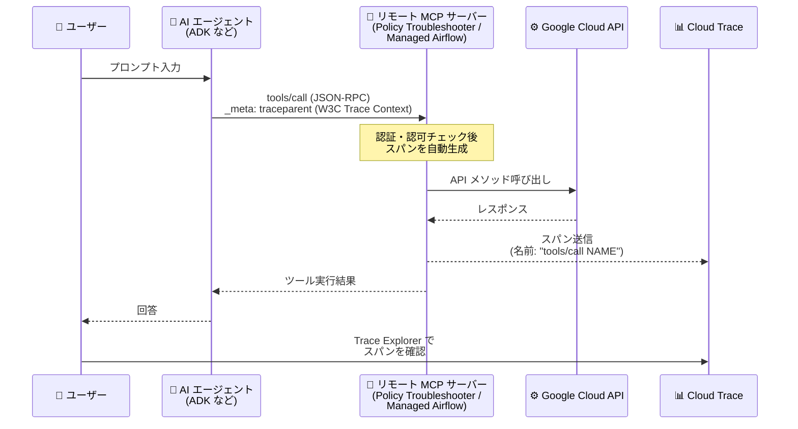

# Cloud Trace: リモート MCP サーバー (Policy Troubleshooter / Managed Service for Apache Airflow) が tools/call のトレーススパンを自動生成

**リリース日**: 2026-08-24

**サービス**: Cloud Trace

**機能**: リモート MCP サーバーによる `tools/call` トレーススパンの自動生成 (対応サービスの追加)

**ステータス**: Feature

📊 [このアップデートのインフォグラフィックを見る](https://takech9203.github.io/google-cloud-news-summary/20260824-cloud-trace-remote-mcp-server-spans.html)

## 概要

Google Cloud のリモート MCP (Model Context Protocol) サーバーのうち、**Policy Troubleshooter** と **Managed Service for Apache Airflow** の 2 つが、`tools/call` オペレーションに対してトレーススパンを自動生成するようになりました。生成されたスパンは Cloud Trace に保存され、AI エージェント (エージェンティックアプリケーション) がこれらの MCP サーバーのツールを呼び出した際の挙動やレイテンシを可視化できます。

MCP は、AI エージェントが外部のツール・データソース・リソースと標準化された方法で連携するための仕様です。Google Cloud の各プロダクトが提供するリモート MCP サーバーを利用すると、エージェントは Google Cloud API のメソッドをツールとして呼び出せます。今回のアップデートにより、IAM ポリシーのトラブルシューティング (Policy Troubleshooter) や Apache Airflow 環境の操作 (Managed Service for Apache Airflow) をエージェントから実行した場合でも、その呼び出しがトレースの一部として記録されるようになります。

対象ユーザーは、ADK (Agent Development Kit) などのフレームワークで AI エージェントを構築し、Google Cloud のリモート MCP サーバーを組み込んでいる開発者・SRE です。エージェントのツール呼び出しをエンドツーエンドのトレースとして観測したいケースで特に有用です。

**アップデート前の課題**

- Policy Troubleshooter と Managed Service for Apache Airflow のリモート MCP サーバーは `tools/call` に対するトレーススパンを生成しておらず、エージェントからのツール呼び出しがトレース上で可視化されなかった
- エージェントのエンドツーエンドのトレースにおいて、これらの MCP サーバー呼び出し部分のステータスやレイテンシがブラックボックスになっていた

**アップデート後の改善**

- Policy Troubleshooter と Managed Service for Apache Airflow のリモート MCP サーバーが `tools/call` オペレーションのトレーススパンを自動生成するようになった
- クライアント側から W3C Trace Context (`traceparent`) を `_meta` フィールドで伝播させることで、エージェントのトレースにサーバー側スパンが結合され、呼び出しの挙動とレイテンシを Trace Explorer で分析できるようになった
- トレーススパン生成に対応するリモート MCP サーバーは、Cloud Logging、Cloud Monitoring、GKE、Cloud Run、Compute Engine、BigQuery、Cloud SQL、AlloyDB などに加えて計 15 プロダクト超に拡大した

## アーキテクチャ図



AI エージェントが `_meta` フィールドでトレースコンテキストを渡して `tools/call` を実行すると、リモート MCP サーバーがスパンを自動生成して Cloud Trace に記録し、エージェントのトレースに結合されます。

## サービスアップデートの詳細

### 主要機能

1. **`tools/call` オペレーションのスパン自動生成 (対応サービスの追加)**
   - Policy Troubleshooter と Managed Service for Apache Airflow のリモート MCP サーバーが、ツール呼び出しを受信するとトレーススパンを生成する
   - スパンには呼び出しのステータスとレイテンシ情報が記録され、エージェントのエンドツーエンドのトレースの一部として分析できる

2. **W3C Trace Context によるトレースコンテキストの伝播**
   - MCP 標準の `_meta` フィールドに `traceparent` (および任意で `tracestate`) を含めることで、クライアント側スパンとサーバー側スパンが同一トレースに紐付く
   - OpenTelemetry Semantic Conventions for MCP に対応するフレームワーク・SDK (ADK など) がこの伝播をサポートする

3. **Trace Explorer でのスパン検索**
   - スパン名は OpenTelemetry Semantic Conventions for MCP に従い `tools/call NAME` (NAME は呼び出したツール名) の形式で記録される
   - Trace Explorer のフィルタバーで属性 `mcp.method.name` = `tools/call` を指定して、MCP サーバーが生成したスパンを絞り込める

### 対応プロダクト一覧 (トレーススパン生成に対応するリモート MCP サーバー)

| プロダクト | 備考 |
|------|------|
| **Policy Troubleshooter** | 今回追加 |
| **Managed Service for Apache Airflow** | 今回追加 |
| Cloud Logging / Cloud Monitoring | 対応済み |
| GKE / Cloud Run / Compute Engine | 対応済み |
| BigQuery / Cloud SQL / AlloyDB for PostgreSQL | 対応済み |
| Google Security Operations / Agent Search / Personalized Service Health / Cloud Billing / Maps Grounding Lite | 対応済み |

## 技術仕様

### トレースコンテキストの伝播 (`_meta` フィールド)

`tools/call` リクエストの `params._meta` に W3C Trace Context を含めます。

```json
{
  "jsonrpc": "2.0",
  "method": "tools/call",
  "params": {
    "name": "NAME",
    "arguments": {
      // ツールの MCP 仕様に従って指定
    },
    "_meta": {
      "traceparent": "00-TRACE_ID-PARENT_SPAN_ID-SAMPLED_FLAG",
      "tracestate": "Vendor specific information."
    }
  },
  "id": 1
}
```

| `traceparent` の構成要素 | 説明 |
|------|------|
| `00` | traceparent 仕様のバージョン |
| `TRACE_ID` | トレースの ID |
| `PARENT_SPAN_ID` | 呼び出し元スパンの ID |
| `SAMPLED_FLAG` | サンプリングフラグ (サンプリング時は `01`、非サンプリング時は `00`) |

## 設定方法

### 前提条件

1. AI エージェントが対象プロダクトのリモート MCP サーバーを利用していること
2. トレースコンテキストを `_meta` フィールドで伝播できるフレームワーク・SDK (OpenTelemetry Semantic Conventions for MCP に対応するもの。例: ADK) を使用していること
3. リクエストが認証・認可を通過すること (スパンは認証・認可などの内部チェックを通過したリクエストに対してのみ生成される)

### 手順

#### ステップ 1: アプリケーションでトレースコンテキストを伝播する

ADK などのフレームワークを使用するか、`tools/call` リクエストの `_meta` フィールドに W3C Trace Context 形式の `traceparent` を設定します。サンプリングフラグは `1` (サンプリング有効) にする必要があります。

#### ステップ 2: Trace Explorer でスパンを確認する

Google Cloud コンソールの Trace Explorer を開き、フィルタバーで属性 `mcp.method.name` に値 `tools/call` を指定してスパンを検索します。スパン名は `tools/call NAME` の形式で表示されます。

## メリット

### ビジネス面

- **エージェンティックアプリケーションの信頼性向上**: IAM ポリシー診断や Airflow 操作を含むエージェントのワークフローを可観測にし、問題の切り分けと解決を迅速化できる
- **追加実装コストの削減**: サーバー側のスパン生成は MCP サーバー側の統合として提供されるため、サーバー側の計装を自前で行う必要がない

### 技術面

- **エンドツーエンドのトレーサビリティ**: クライアント (エージェント) 側のスパンとサーバー側のスパンが W3C Trace Context で結合され、呼び出しシーケンス全体のレイテンシを分析できる
- **標準準拠**: スパン命名やトレースコンテキストの伝播は OpenTelemetry Semantic Conventions for MCP と W3C Trace Context に準拠しており、特定ベンダーにロックインされない

## デメリット・制約事項

### 制限事項

- トレースコンテキストは W3C Trace Context 標準に従う必要があり、サンプリングフラグを `1` に設定しなければならない
- リモート Google Cloud MCP サーバーが生成するのは `tools/call` オペレーションに対する単一のスパンのみで、その他のオペレーションのスパンや `tools/call` の子スパンは生成されない
- スパンは、リクエストが認証・認可などの内部チェックを通過した場合にのみ生成される

### 考慮すべき点

- 生成されたスパンは Cloud Trace のスパン取り込みとして課金対象になるため、無料枠 (月 250 万スパン) を超える利用がある場合はサンプリングレートの調整を検討する
- セルフホストの MCP サーバーは対象外のため、OpenTelemetry による計装を自前で行う必要がある (Python の場合は `tools/call` のスパン生成に対応した計装手順が提供されている)

## ユースケース

### ユースケース 1: エージェントによる IAM アクセス診断の可観測化

**シナリオ**: 社内の運用支援エージェントが Policy Troubleshooter MCP サーバーのツールを呼び出して「なぜこのユーザーはリソースにアクセスできないのか」を診断している。回答が遅い・失敗するケースの原因を特定したい。

**効果**: `tools/call` スパンによりツール呼び出しのステータスとレイテンシがトレース上で可視化され、遅延がエージェント側 (モデル推論) と MCP サーバー側のどちらで発生しているかを切り分けられる。

### ユースケース 2: Airflow 運用エージェントのワークフロー分析

**シナリオ**: Managed Service for Apache Airflow の MCP サーバーを利用して DAG の状態確認や運用タスクを行うエージェントを構築しており、複数ツール呼び出しからなる一連の処理の挙動を把握したい。

**効果**: Trace Explorer で `mcp.method.name = tools/call` のフィルタを使い、呼び出されたツールの順序・回数・レイテンシをトレース単位で分析できる。

## 料金

MCP サーバーが生成するスパンは Cloud Trace のスパン取り込みとして課金されます。

| 項目 | 料金 | 無料枠 (月あたり) |
|--------|-----------------|-----------------|
| Trace スパン取り込み | $0.20 / 100 万スパン | 最初の 250 万スパン |

詳細は [Google Cloud Observability の料金ページ](https://cloud.google.com/products/observability/pricing) を参照してください。

## 関連サービス・機能

- **Policy Troubleshooter**: IAM ポリシーによるアクセス可否の診断機能。今回そのリモート MCP サーバーがスパン生成に対応した
- **Managed Service for Apache Airflow**: Google Cloud のマネージド Airflow サービス。今回そのリモート MCP サーバーがスパン生成に対応した
- **Cloud Trace / Trace Explorer**: スパンの保存・分析基盤。`mcp.method.name` 属性でのフィルタリングにより MCP スパンを検索できる
- **Agent Development Kit (ADK)**: トレースコンテキストの伝播に対応したエージェント開発フレームワーク。OpenTelemetry による計装手順が提供されている
- **Cloud Monitoring**: 「Monthly trace spans ingested」指標を使ったスパン取り込み量のアラート設定により、コストを監視できる

## 参考リンク

- 📊 [インフォグラフィック](https://takech9203.github.io/google-cloud-news-summary/20260824-cloud-trace-remote-mcp-server-spans.html)
- [公式リリースノート](https://docs.cloud.google.com/release-notes#August_24_2026)
- [ドキュメント: View calls made to remote MCP servers](https://docs.cloud.google.com/trace/docs/trace-remote-mcp-server-calls)
- [Policy Troubleshooter MCP リファレンス](https://docs.cloud.google.com/policy-intelligence/docs/reference/policytroubleshooter/mcp)
- [Managed Service for Apache Airflow MCP リファレンス](https://docs.cloud.google.com/composer/docs/reference/mcp)
- [Find and explore traces](https://docs.cloud.google.com/trace/docs/finding-traces)
- [Instrument a self-hosted MCP server with OpenTelemetry](https://docs.cloud.google.com/stackdriver/docs/instrumentation/self-hosted-mcp-servers)
- [料金ページ](https://cloud.google.com/products/observability/pricing)

## まとめ

Policy Troubleshooter と Managed Service for Apache Airflow のリモート MCP サーバーが `tools/call` のトレーススパンを自動生成するようになり、AI エージェントから Google Cloud を操作するワークフローの可観測性がさらに広がりました。これらの MCP サーバーを利用するエージェントを運用している場合は、ADK などトレースコンテキスト伝播に対応したフレームワークを採用し、Trace Explorer の `mcp.method.name` フィルタでツール呼び出しの挙動を確認することを推奨します。

---

**タグ**: #CloudTrace #MCP #ModelContextProtocol #PolicyTroubleshooter #ApacheAirflow #Observability #AIAgent #OpenTelemetry
