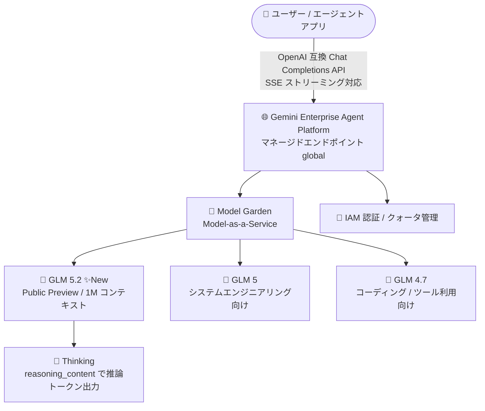

# Gemini Enterprise Agent Platform: Z.ai GLM 5.2 が Model Garden のマネージドモデル (MaaS) として Preview 提供開始

**リリース日**: 2026-08-24

**サービス**: Gemini Enterprise Agent Platform (Model Garden / MaaS)

**機能**: Z.ai GLM 5.2 モデルの提供 (Public Preview)

**ステータス**: Public Preview

📊 [このアップデートのインフォグラフィックを見る](https://takech9203.github.io/google-cloud-news-summary/20260824-gemini-enterprise-agent-platform-glm-5-2.html)

## 概要

2026 年 8 月 24 日、Z.ai の最新モデル **GLM 5.2** が Gemini Enterprise Agent Platform の Model Garden において、フルマネージドなモデル (Model-as-a-Service、MaaS) として Public Preview で利用可能になりました。GLM 5.2 は長時間 (long-horizon) のエージェントタスクとコーディングタスク向けに設計されたモデルで、**100 万トークンのコンテキストウィンドウ**をサポートします。

MaaS 型のマネージド API として提供されるため、ユーザーは GPU インフラのプロビジョニングやモデルのデプロイ作業を行うことなく、Gemini Enterprise Agent Platform のエンドポイントに直接リクエストを送信するだけで GLM 5.2 を利用できます。サーバー送信イベント (SSE) によるレスポンスのストリーミングにも対応しています。

これまで Model Garden の GLM ファミリーには GLM 4.7 (コーディング・ツール利用・複雑な推論向け) と GLM 5 (複雑なシステムエンジニアリング・長時間エージェントタスク向け) が提供されていました。今回の GLM 5.2 の追加により、1M トークンという大幅に拡張されたコンテキストウィンドウを活用した大規模コードベースの解析や長時間のエージェントワークフローを、Google Cloud の統一された認証・課金・ガバナンスの枠組みの中で実現できるようになります。

**アップデート前の課題**

- Model Garden で利用できる GLM モデルは GLM 4.7 / GLM 5 までであり、Z.ai の最新世代モデルを Google Cloud 上で利用できなかった
- 大規模コードベース全体の解析や長時間のエージェントセッションなど、非常に長いコンテキストを必要とするタスクに対応する GLM モデルの選択肢が限られていた
- Z.ai の最新モデルを利用するには外部 API を直接利用する必要があり、Google Cloud の IAM・課金・ガバナンスの枠組みの外で管理する必要があった

**アップデート後の改善**

- GLM 5.2 をフルマネージドな MaaS モデルとして Public Preview で利用できるようになった
- 100 万トークンのコンテキストウィンドウにより、大規模なコードベースや長大なドキュメント群を単一のコンテキストで扱えるようになった
- インフラ管理不要のサーバーレスなマネージド API として、Google Cloud の IAM 認証・課金体系のまま Z.ai の最新モデルを利用できるようになった

## アーキテクチャ図



ユーザーは Gemini Enterprise Agent Platform のマネージドエンドポイント (global) 経由で Model Garden の GLM モデル群を呼び出します。今回追加された GLM 5.2 は 1M トークンのコンテキストウィンドウと Thinking (推論) 機能をサポートし、インフラ管理不要で利用できます。

## サービスアップデートの詳細

### 主要機能

1. **GLM 5.2 の Public Preview 提供**
   - 長時間 (long-horizon) のエージェントタスクとコーディングタスク向けに構築されたモデル
   - モデル ID は `glm-5.2-maas`。リリース日は 2026 年 8 月 24 日、ローンチステージは Preview
   - `glm-5.2-maas` エンドポイントは少なくとも 2026 年 10 月 8 日まで提供され、利用状況と需要に応じて延長される可能性がある

2. **100 万トークンのコンテキストウィンドウ**
   - コンテキスト長は 1,000,000 トークン、最大出力は 64,000 トークン (global)
   - 大規模コードベースの解析や長時間にわたるエージェントセッションの履歴保持に活用できる

3. **フルマネージドな MaaS としての提供**
   - サーバーレスなマネージド API のため、インフラのプロビジョニングや管理が不要
   - SSE によるレスポンスストリーミングに対応し、エンドユーザーの体感レイテンシを低減できる
   - Function calling、Structured output、Thinking をサポート

4. **Thinking (推論) 機能のデフォルト有効化**
   - 推論はデフォルトで有効。推論トークンは `reasoning_content`、通常の応答テキストは `content` に出力される
   - `"chat_template_kwargs": { "enable_thinking": false }` で推論トークンの無効化が可能

## 技術仕様

### GLM 5.2 のモデル仕様 (公式ドキュメント記載)

| 項目 | 詳細 |
|------|------|
| モデル ID | `glm-5.2-maas` (リクエスト時のモデル名は `zai-org/glm-5.2-maas`) |
| ローンチステージ | Preview (リリース日: 2026-08-24) |
| モダリティ | テキスト入出力のみ (画像・音声・動画は非対応) |
| コンテキスト長 | 1,000,000 トークン (global) |
| 最大出力 | 64,000 トークン (global) |
| Function calling | サポート |
| Structured output | サポート |
| Thinking | サポート (デフォルト有効) |
| Provisioned Throughput | 非対応 |
| Batch inference | 非対応 |
| 課金方式 | Standard Pay-as-you-go (PayGo) |
| Fixed quota | 非対応 |
| 提供リージョン | global |
| ML 処理 | マルチリージョン: us |
| 最低提供期間 | 少なくとも 2026 年 10 月 8 日まで (延長の可能性あり) |

### Model Garden の GLM ファミリー (2026 年 8 月時点)

| モデル | モデル名 | 特徴 (公式ドキュメント記載) |
|------|------|------|
| GLM 5.2 (今回追加) | `glm-5.2-maas` | 長時間のエージェント・コーディングタスク向け。1M トークンコンテキスト |
| GLM 5 | `glm-5-maas` | 複雑なシステムエンジニアリングと長時間のエージェントタスク向け |
| GLM 4.7 | `glm-4.7-maas` | コアコーディング / vibe coding、ツール利用、複雑な推論向け |

## 設定方法

### 前提条件

1. Google Cloud プロジェクトで Gemini Enterprise Agent Platform (Vertex AI API) が有効化されていること
2. オープンモデルへのユーザーアクセス権が付与されていること ([オープンモデルへのアクセス権付与](https://docs.cloud.google.com/gemini-enterprise-agent-platform/models/maas/grant-access-open-models)を参照)

### 手順

#### ステップ 1: Model Garden でモデルカードを確認

Google Cloud コンソールの [Model Garden](https://console.cloud.google.com/agent-platform/publishers/zai-org/model-garden/glm-5.2-maas) で GLM 5.2 のモデルカードを開き、仕様と利用条件を確認します。

#### ステップ 2: マネージドエンドポイントへリクエストを送信

GLM 5.2 は OpenAI 互換の Chat Completions エンドポイント (global) 経由で呼び出せます。

```bash
curl -X POST \
  -H "Authorization: Bearer $(gcloud auth print-access-token)" \
  -H "Content-Type: application/json" \
  "https://aiplatform.googleapis.com/v1/projects/PROJECT_ID/locations/global/endpoints/openapi/chat/completions" \
  -d '{
    "model": "zai-org/glm-5.2-maas",
    "messages": [
      {"role": "user", "content": "こんにちは"}
    ]
  }'
```

推論はデフォルトで有効であり、レスポンスの `reasoning_content` に推論トークン、`content` に応答テキストが出力されます。推論を無効化する場合は以下を指定します。

```json
{
  "model": "zai-org/glm-5.2-maas",
  "messages": [{"role": "user", "content": "..."}],
  "chat_template_kwargs": { "enable_thinking": false }
}
```

ストリーミング (`"stream": true`) を指定すると SSE でレスポンスが逐次返却され、体感レイテンシを低減できます。

## メリット

### ビジネス面

- **マルチモデル戦略の強化**: Gemini、DeepSeek、Llama、Qwen、Kimi K2、MiniMax などと同一プラットフォーム上で Z.ai の最新モデルを比較・選択でき、ユースケースごとの最適なモデル選定が可能
- **統一されたガバナンス**: Google Cloud の IAM、課金、アクセス管理の枠組みのまま最新のオープンモデルを利用でき、外部 API の個別管理が不要

### 技術面

- **1M トークンコンテキスト**: 大規模なコードベースや長大なドキュメント群を分割せずに単一コンテキストで処理できる
- **インフラ管理不要**: サーバーレスな MaaS のため、GPU のプロビジョニングやモデルデプロイ作業が不要
- **エージェント構築に必要な機能を網羅**: Function calling、Structured output、Thinking をサポートし、ツール呼び出しを伴うエージェントワークフローを構築しやすい
- **OpenAI 互換 API**: 既存の OpenAI SDK ベースの実装からエンドポイントとモデル名の変更のみで移行しやすい

## デメリット・制約事項

### 制限事項

- Public Preview 段階のため Pre-GA Offerings Terms が適用され、サポートが限定される場合がある
- テキスト入出力のみの対応で、画像・音声・動画のマルチモーダル入力は非対応
- Provisioned Throughput、Batch inference、Fixed quota は非対応 (Standard PayGo のみ)
- 提供リージョンは global エンドポイントのみで、ML 処理は米国 (us) マルチリージョンで実行される

### 考慮すべき点

- `glm-5.2-maas` エンドポイントの提供保証期間は「少なくとも 2026 年 10 月 8 日まで」であり、Preview モデルの[最低提供期間ポリシー](https://docs.cloud.google.com/gemini-enterprise-agent-platform/models/deprecations/open-models#minimum-availability)に基づき将来変更される可能性がある。本番採用時は提供期間の最新情報を確認する必要がある
- ML 処理が us マルチリージョンで行われるため、データレジデンシー要件がある場合は事前に確認が必要
- 推論 (Thinking) がデフォルトで有効なため、推論トークンの出力分を考慮したコスト・レイテンシ設計が必要 (不要な場合は `enable_thinking: false` を指定)

## ユースケース

### ユースケース 1: 大規模コードベースを対象とした長時間コーディングエージェント

**シナリオ**: 数十万行規模のモノレポ全体を理解した上で、リファクタリングや機能追加を複数ステップで実行するコーディングエージェントを構築したい。

**効果**: 1M トークンのコンテキストウィンドウにより、リポジトリの主要ファイル群とエージェントの作業履歴を単一コンテキストに保持でき、Function calling と Thinking を組み合わせた長時間 (long-horizon) のエージェントワークフローを実現できる。

### ユースケース 2: マルチモデル環境でのエージェント用モデルの比較評価

**シナリオ**: エージェントタスク向けのモデルとして、Gemini、Kimi K2 Thinking、MiniMax M2、Qwen3 Coder などと GLM 5.2 をユースケース別に比較評価したい。

**効果**: 単一の Google Cloud プロジェクト・認証基盤・課金体系のまま、同一の OpenAI 互換エンドポイントでモデル名を切り替えるだけで複数のオープンモデルを比較検証できる。

## 料金

GLM 5.2 は Standard Pay-as-you-go (PayGo) で課金されます。個別の単価は以下の公式料金ページで確認してください。

- [Gemini Enterprise Agent Platform の生成 AI 料金](https://cloud.google.com/gemini-enterprise-agent-platform/generative-ai/pricing)

## 利用可能リージョン

| 項目 | 詳細 |
|------|------|
| モデル提供 | global エンドポイント |
| ML 処理 | マルチリージョン: us |

最新のリージョン情報は[モデルの提供状況](https://docs.cloud.google.com/gemini-enterprise-agent-platform/resources/locations)を確認してください。

## 関連サービス・機能

- **Model Garden**: Google、パートナー、オープンモデルを検索・利用できるモデルカタログ。GLM 5.2 のモデルカードもここから確認できる
- **マネージドオープンモデル (MaaS)**: DeepSeek、Gemma、gpt-oss、Kimi K2、Llama、MiniMax M2、Qwen3 など、キュレーションされたオープンモデル群をサーバーレスのマネージド API として提供する仕組み。GLM 5.2 もこの一部として提供される
- **Function calling / Structured output / Thinking**: GLM 5.2 がサポートするエージェント構築向け機能。ツール呼び出し、構造化出力、推論トークンの制御が可能
- **オープンモデルへのアクセス権付与**: オープンモデルの利用前に必要なユーザーアクセス権の設定

## 参考リンク

- 📊 [インフォグラフィック](https://takech9203.github.io/google-cloud-news-summary/20260824-gemini-enterprise-agent-platform-glm-5-2.html)
- [公式リリースノート](https://docs.cloud.google.com/release-notes#August_24_2026)
- [GLM 5.2 モデルドキュメント](https://docs.cloud.google.com/gemini-enterprise-agent-platform/models/maas/zaiorg/glm-52)
- [GLM モデル (MaaS) ドキュメント](https://docs.cloud.google.com/gemini-enterprise-agent-platform/models/maas/zaiorg)
- [マネージドオープンモデルの利用](https://docs.cloud.google.com/gemini-enterprise-agent-platform/models/maas/use-open-models)
- [オープンモデル API の呼び出し](https://docs.cloud.google.com/gemini-enterprise-agent-platform/models/maas/call-open-model-apis)
- [料金ページ](https://cloud.google.com/gemini-enterprise-agent-platform/generative-ai/pricing)

## まとめ

Z.ai の GLM 5.2 が Model Garden のフルマネージドモデル (MaaS) として Public Preview で追加され、1M トークンのコンテキストウィンドウを備えた長時間エージェント・コーディングタスク向けモデルを、インフラ管理不要で Google Cloud 上から利用できるようになりました。エージェントアプリケーションや大規模コードベース解析のモデル選定を進めている場合は、Preview 段階での評価を推奨します。Preview モデルの提供期間 (少なくとも 2026 年 10 月 8 日まで) と料金の最新情報は、モデルカードおよび公式ドキュメントで確認してください。

---

**タグ**: #GeminiEnterpriseAgentPlatform #ModelGarden #MaaS #ZAI #GLM #生成AI #Preview #エージェント
