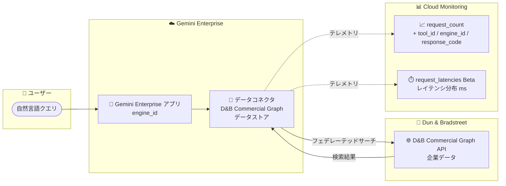

# Gemini Enterprise: D&B Commercial Graph データストア (Public Preview) とデータコネクタの Cloud Monitoring 可観測性強化

**リリース日**: 2026-08-24

**サービス**: Gemini Enterprise

**機能**: D&B Commercial Graph データストア / データコネクタの Cloud Monitoring 可観測性強化

**ステータス**: Public Preview (D&B Commercial Graph データストア) / Beta (レイテンシメトリクス)

📊 [このアップデートのインフォグラフィックを見る](https://takech9203.github.io/google-cloud-news-summary/20260824-gemini-enterprise-dnb-commercial-graph-connector-monitoring.html)

## 概要

Gemini Enterprise に、データコネクタ (データストア) に関する 2 つの関連アップデートが発表されました。1 つ目は、**D&B Commercial Graph データストアの Public Preview 提供**です。Dun & Bradstreet 社が提供する世界最大級の企業データベースである D&B Commercial Graph を Gemini Enterprise に接続し、自然言語で企業データを検索・インポートできるようになりました。フェデレーテッドサーチ (連合検索) 方式で動作し、クエリは D&B Commercial Graph API に直接送信され、他の接続済みデータソースの結果とブレンドされて表示されます。

2 つ目は、**データコネクタの Cloud Monitoring 可観測性の強化**です。既存のリクエスト数メトリクス `discoveryengine.googleapis.com/dataconnector/request_count` に `tool_id`、`engine_id`、`response_code` の 3 つのディメンションが追加され、新たにツール呼び出しレイテンシの分布を監視できる `discoveryengine.googleapis.com/dataconnector/request_latencies` メトリクス (Beta) が利用可能になりました。

これらのアップデートにより、営業・マーケティング・与信管理などで企業データを活用したい組織は D&B の信頼性の高い企業情報に AI 検索でアクセスできるようになり、また、増え続けるサードパーティコネクタの運用状況をアプリ単位・ツール単位で詳細に監視できるようになります。

**アップデート前の課題**

- D&B Commercial Graph の企業データを Gemini Enterprise から直接検索する手段がなく、別途 D&B のツールや API を使う必要があった
- `dataconnector/request_count` メトリクスは `status` ディメンションのみで、どのアプリ (engine) やどのコネクタツールでリクエストが発生したかを区別できなかった
- データコネクタのツール呼び出しレイテンシを測定する専用メトリクスがなく、コネクタ経由の検索が遅い場合の原因切り分けが困難だった

**アップデート後の改善**

- D&B Commercial Graph データストアを作成し、自然言語で企業 (Company) データを検索・インポートできるようになった。Google 管理の OAuth を使用するため、独自の OAuth アプリケーションやクライアント ID・シークレットの用意が不要
- `request_count` メトリクスに `tool_id` (呼び出されたコネクタツール)、`engine_id` (Gemini Enterprise アプリ)、`response_code` (gRPC レスポンスコード) が追加され、多次元での分析が可能になった
- 新しい `request_latencies` メトリクス (Beta) により、ツール呼び出しレイテンシの分布をミリ秒単位で監視し、パフォーマンス劣化の検知やアラート設定が可能になった

## アーキテクチャ図



ユーザーの自然言語クエリは Gemini Enterprise アプリからデータコネクタ経由で D&B Commercial Graph API に直接送信され、結果が他のデータソースとブレンドされます。コネクタへのリクエスト数とレイテンシは拡張された Cloud Monitoring メトリクスで監視できます。

## サービスアップデートの詳細

### 主要機能

1. **D&B Commercial Graph データストア (Public Preview)**
   - D&B Commercial Graph を Gemini Enterprise に接続し、自然言語で企業データを検索・インポート可能
   - 検索対象エンティティとして Company (企業) を選択して構成
   - フェデレーテッドサーチ方式: クエリは D&B Commercial Graph API に直接送信され、他の接続データソースの結果とブレンドして表示
   - Google 管理の OAuth を使用。独自の OAuth アプリケーション作成やクライアント ID・シークレットの提供は不要で、アプリでコネクタを有効化する際に D&B アカウントで認可する

2. **`dataconnector/request_count` メトリクスの新ディメンション**
   - `tool_id`: 呼び出されたコネクタツールの識別子 (例: search_tool、create_issue)
   - `engine_id`: リクエストが属する Gemini Enterprise アプリ (エンジン) の識別子
   - `response_code`: gRPC 正規レスポンスコード (例: OK、INVALID_ARGUMENT、UNAVAILABLE)
   - 既存の `status` ディメンション (SUCCESS、FAILURE など) は引き続きサポート

3. **新しいレイテンシメトリクス `dataconnector/request_latencies` (Beta)**
   - データコネクタへのツール呼び出しレイテンシの分布をミリ秒単位で監視
   - `status`、`response_code`、`tool_id`、`engine_id` の 4 つのディメンションを含む
   - Metrics Explorer で「Gemini Enterprise DataConnector Request Latencies」として表示

## 技術仕様

### D&B Commercial Graph データストア

| 項目 | 詳細 |
|------|------|
| ステータス | Public Preview (Pre-GA Offerings Terms が適用) |
| 検索方式 | フェデレーテッドサーチ (クエリを D&B Commercial Graph API に直接送信) |
| 検索対象エンティティ | Company (企業) |
| 認証 | Google 管理の OAuth (独自 OAuth アプリ不要) |
| 対応ロケーション | global、us、eu のみ |
| 必要な IAM ロール | Discovery Engine Editor (`roles/discoveryengine.editor`) |
| 暗号化 | Google 管理キーまたは Cloud KMS キー (CMEK、us / eu 選択時) |
| 静的 IP | Advanced options で静的 IP エグレスを有効化可能 (許可リスト運用向け) |

### Cloud Monitoring メトリクス

| メトリクス | 種別 / 単位 | ステータス | ディメンション |
|-----------|------------|-----------|---------------|
| `discoveryengine.googleapis.com/dataconnector/request_count` | DELTA, INT64, 1 | Beta | `status`、`response_code` (新規)、`tool_id` (新規)、`engine_id` (新規) |
| `discoveryengine.googleapis.com/dataconnector/request_latencies` | 分布 (DISTRIBUTION), ms | Beta (新規) | `status`、`response_code`、`tool_id`、`engine_id` |

- モニタリング対象リソース: `discoveryengine.googleapis.com/DataConnector` (ラベル: `resource_container`、`location`、`connector_id`、`data_source`)
- `request_count` は 30 秒ごとにサンプリングされ、サンプリング後最大 360 秒間はデータが表示されない場合がある
- メトリクスデータは 1 分ごとに更新される

## 設定方法

### 前提条件

1. Google Cloud プロジェクトと Gemini Enterprise の利用環境
2. データストアを作成するユーザーに Discovery Engine Editor ロール (`roles/discoveryengine.editor`) を付与
3. D&B Commercial Graph のアカウント (認可時に使用)

### 手順

#### ステップ 1: D&B Commercial Graph データストアの作成

1. Google Cloud コンソールで **Gemini Enterprise** ページに移動
2. ナビゲーションメニューで **Data stores** をクリックし、**Create data store** をクリック
3. **Source** セクションで「D&B Commercial Graph」を検索して **Select** をクリック
4. **Data** セクションの **Entities to search** で **Company** を選択して **Continue**
5. (任意) **Advanced options** で **Enable Static IP Addresses** を選択 (送信元 IP の固定化)
6. **Configuration** セクションでマルチリージョン (global / us / eu) とコネクタ名を設定。us / eu の場合は暗号化設定 (Google 管理キーまたは Cloud KMS キー) を構成
7. **Billing** セクションで General pricing または Configurable pricing を選択し、**Create** をクリック

データストアのステータスが **Creating** から **Active** に変わると利用可能になります。その後、既存アプリへの接続または新規アプリの作成を行い、クエリ実行前に Gemini Enterprise から D&B Commercial Graph へのアクセスを認可します。

#### ステップ 2: Metrics Explorer でコネクタメトリクスを確認

1. Google Cloud コンソールで **Metrics Explorer** ページに移動
2. Gemini Enterprise アプリを作成したプロジェクトを選択
3. **Select a metric** で以下を検索して選択:
   - 「Gemini Enterprise DataConnector Request Count」
   - 「Gemini Enterprise DataConnector Request Latencies」(Beta)
4. 必要に応じて `metric.labels.engine_id` や `metric.labels.tool_id` などのラベルフィルタ、集計、期間を設定

```text
# ラベルフィルタの例 (特定アプリ・特定ツールに絞り込み)
metric.labels.engine_id = "my-engine-id"
metric.labels.tool_id = "search_tool"
metric.labels.response_code = "UNAVAILABLE"
```

## メリット

### ビジネス面

- **信頼性の高い企業データへの AI アクセス**: D&B の企業データベースを自然言語で検索でき、営業リサーチ、リード獲得、与信・コンプライアンス調査などの業務を Gemini Enterprise 上で完結できる
- **横断検索による生産性向上**: D&B の企業データと社内の他データソースの検索結果がブレンドされ、複数ツールを行き来する手間が削減される
- **運用品質の可視化**: コネクタごとのエラー率やレイテンシをアプリ単位で把握でき、エンドユーザー体験の劣化を早期に検知できる

### 技術面

- **OAuth 構成の簡素化**: Google 管理の OAuth により、独自の OAuth アプリケーションの作成・管理が不要
- **多次元でのメトリクス分析**: `engine_id` × `tool_id` × `response_code` の組み合わせで、障害や遅延の発生箇所を精緻に切り分けられる
- **レイテンシ分布による SLO 運用**: `request_latencies` は分布メトリクスのため、パーセンタイル (p50 / p95 / p99) ベースのアラートやダッシュボードを構築できる
- **セキュリティ要件への対応**: 静的 IP エグレスや CMEK (us / eu) に対応し、エンタープライズのネットワーク・暗号化要件に適合しやすい

## デメリット・制約事項

### 制限事項

- D&B Commercial Graph データストアは Public Preview であり、Pre-GA Offerings Terms が適用される (サポートが限定される可能性がある)
- 対応ロケーションは global、us、eu のみ
- 既存の D&B Commercial Graph データストアに VPC Service Controls 境界を適用することはできない。VPC Service Controls を適用するにはデータストアの削除・再作成が必要
- 新規アプリの作成や既存アプリへのデータストア追加では、アクションを持つデータストアは単一コネクタタイプにつき 1 つのみ関連付けることが推奨される
- `request_latencies` メトリクスは Beta であり、仕様が変更される可能性がある

### 考慮すべき点

- フェデレーテッドサーチでは、クエリ文字列がサードパーティ (D&B Commercial Graph API) に送信され、サードパーティがクエリをユーザーの ID と関連付ける可能性がある。複数のフェデレーテッドサーチデータソースを有効にしている場合、クエリがすべてのソースに送信されることがある
- 精度向上のため LLM がクエリを書き換えることがあり、その際にセッションのクエリ履歴の一部が D&B Commercial Graph API への送信クエリに含まれる可能性がある。データ取り扱いポリシーの確認が必要
- サードパーティシステムに到達したデータは、そのシステムの利用規約とプライバシーポリシーに準拠する
- `request_count` はサンプリング後最大 360 秒間データが表示されないため、リアルタイム性が求められるアラートでは遅延を考慮した設定が必要

## ユースケース

### ユースケース 1: 営業チームの企業リサーチの効率化

**シナリオ**: 営業チームが見込み顧客の企業情報 (規模、業種、所在地など) を調査する際、これまで D&B のポータルと社内 CRM・ドキュメントを別々に検索していた。

**実装例**:
```text
1. D&B Commercial Graph データストアを作成 (Entities: Company)
2. 営業向け Gemini Enterprise アプリにデータストアを接続し、ユーザー認可を実施
3. 「〇〇業界で従業員 1,000 人以上の企業を教えて」のような自然言語クエリで検索
```

**効果**: D&B の企業データと社内データソースの検索結果が 1 つの画面にブレンドされ、リサーチ時間を短縮できる。

### ユースケース 2: データコネクタの SLO 監視とアラート運用

**シナリオ**: 複数の Gemini Enterprise アプリで多数のサードパーティコネクタを運用しており、特定のコネクタの遅延やエラーがどのアプリに影響しているかを把握したい。

**実装例**:
```text
1. Metrics Explorer で dataconnector/request_latencies を選択
2. engine_id と tool_id でグループ化し、p95 レイテンシのダッシュボードを作成
3. response_code が UNAVAILABLE / DEADLINE_EXCEEDED の request_count 比率に
   対するアラートポリシーを Cloud Monitoring で設定
```

**効果**: コネクタ単位・アプリ単位でのパフォーマンス劣化や障害を早期に検知し、影響範囲の特定と対応を迅速化できる。

## 料金

D&B Commercial Graph データストアの作成時には、Billing セクションで General pricing または Configurable pricing を選択します。Gemini Enterprise の料金はエディションとライセンスに基づきます。Cloud Monitoring のメトリクス利用には Cloud Monitoring の料金体系が適用されます (Google Cloud サービスのシステムメトリクスは無料枠の対象)。詳細は以下を参照してください。

- [Gemini Enterprise のライセンス](https://docs.cloud.google.com/gemini/enterprise/docs/licenses)
- [Cloud Monitoring の料金](https://cloud.google.com/stackdriver/pricing)

なお、D&B Commercial Graph 自体の利用には Dun & Bradstreet との契約・アカウントが別途必要です。

## 利用可能リージョン

- **D&B Commercial Graph データストア**: global、us、eu のマルチリージョンのみサポート

## 関連サービス・機能

- **Cloud Monitoring**: 今回拡張された `request_count` と新設の `request_latencies` メトリクスの表示・アラート設定に使用。Metrics Explorer でチャート作成やラベルフィルタリングが可能
- **Cloud KMS (CMEK)**: us / eu ロケーション選択時にデータストアの暗号化キーとして顧客管理鍵を利用可能
- **VPC Service Controls**: データストアをセキュリティ境界で保護可能 (既存の D&B データストアへの適用は不可、再作成が必要)
- **他のサードパーティコネクタ**: 直近では Atlan、Stripe、FactSet AI-Ready Data など多数のデータストアが Public Preview で追加されており、今回の可観測性強化はこれらすべてのデータコネクタの監視に有効

## 参考リンク

- 📊 [インフォグラフィック](https://takech9203.github.io/google-cloud-news-summary/20260824-gemini-enterprise-dnb-commercial-graph-connector-monitoring.html)
- [公式リリースノート](https://docs.cloud.google.com/release-notes#August_24_2026)
- [Connect D&B Commercial Graph (ドキュメント)](https://docs.cloud.google.com/gemini/enterprise/docs/connectors/d-and-b-commercial-graph)
- [Set up a D&B Commercial Graph data store (ドキュメント)](https://docs.cloud.google.com/gemini/enterprise/docs/connectors/d-and-b-commercial-graph/set-up-data-store)
- [Access metrics (ドキュメント)](https://docs.cloud.google.com/gemini/enterprise/docs/access-metrics)
- [Google Cloud metrics 一覧 (discoveryengine)](https://docs.cloud.google.com/monitoring/api/metrics_gcp)
- [Gemini Enterprise のライセンス](https://docs.cloud.google.com/gemini/enterprise/docs/licenses)

## まとめ

D&B Commercial Graph データストアの Public Preview により、Gemini Enterprise から自然言語で信頼性の高い企業データを検索できるようになり、営業・リサーチ業務の効率化が期待できます。あわせて強化された Cloud Monitoring メトリクスにより、増え続けるデータコネクタの運用状況をアプリ単位・ツール単位で詳細に監視できます。企業データを活用する組織は Preview で D&B コネクタを検証しつつ、既存コネクタの監視ダッシュボードに新しいディメンションとレイテンシメトリクスを組み込むことを推奨します。

---

**タグ**: #GeminiEnterprise #DnBCommercialGraph #DataConnector #FederatedSearch #CloudMonitoring #Observability #PublicPreview
