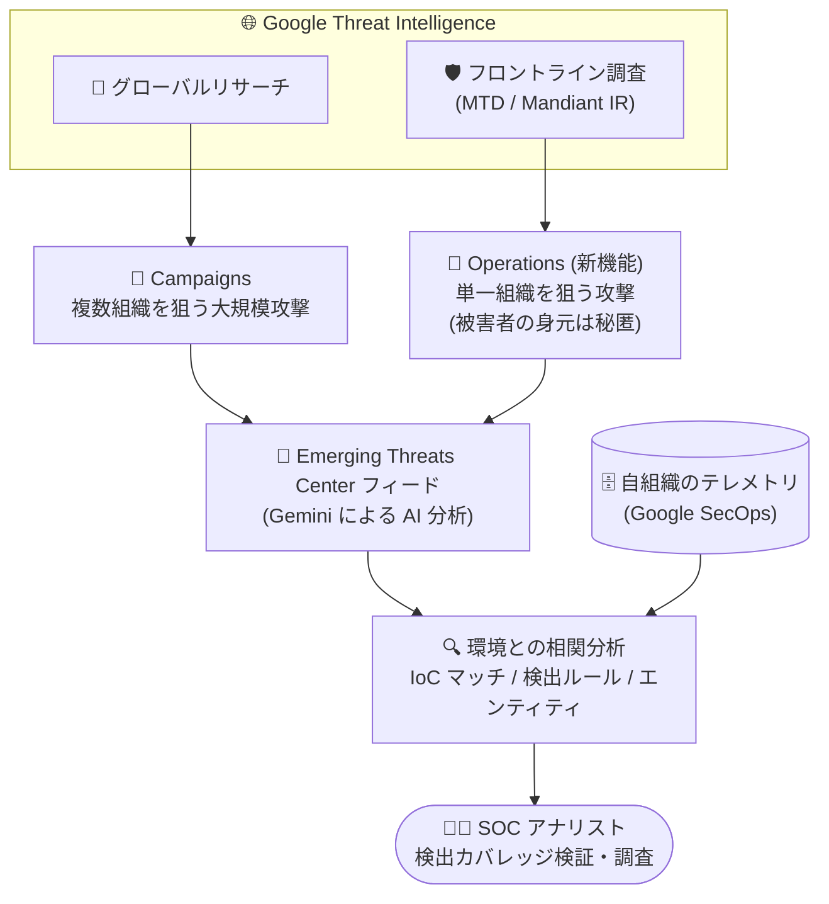

# Google SecOps: Emerging Threats Center の Operations サポート

**リリース日**: 2026-08-24

**サービス**: Google SecOps

**機能**: Emerging Threats Center における Operations (Spotlight Feature)

**ステータス**: 提供開始 (Spotlight Feature)

📊 [このアップデートのインフォグラフィックを見る](https://takech9203.github.io/google-cloud-news-summary/20260824-google-secops-emerging-threats-center-operations.html)

## 概要

Google SecOps の **Emerging Threats Center** フィードが、新たに **Operations (オペレーション)** をサポートしました。Operations は、単一の組織を標的とした脅威アクティビティの詳細を迅速に可視化する仕組みで、複数の組織を横断的に狙う大規模な **Campaigns (キャンペーン)** を補完する、より粒度の細かい脅威インテリジェンスを提供します。

Operations は、Managed Threat Defense (MTD) エンゲージメントなど、Mandiant の最前線 (フロントライン) での調査から得られたインテリジェンスに基づいています。実在の被害組織が関与するため、組織の身元を秘匿するプライバシー保護が組み込まれており、匿名性を保ったまま、パーソナライズされた脅威の手がかりとローカライズされた防御戦略を利用できます。

Emerging Threats Center は Google Threat Intelligence (GTI) と Gemini モデルを活用した AI 駆動の脅威インテリジェンス機能で、Google SecOps Enterprise Plus ライセンスで利用可能です。今回のアップデートにより、SOC アナリストはグローバルなキャンペーンと個別組織を狙うオペレーションの両方を単一のフィードで把握し、敵対者の TTPs (戦術・技術・手順) の全体像を捉えられるようになります。

**アップデート前の課題**

- Emerging Threats Center のフィードは、複数の組織・業界・地域を横断する大規模な Campaigns と Reports のみを表示しており、単一組織を標的とする局所的な攻撃活動を追跡する仕組みがなかった
- Managed Threat Defense などのフロントライン調査で得られる、個別ミッションに固有の粒度の細かい脅威インテリジェンスを、Emerging Threats Center のワークフロー内で活用できなかった
- グローバルな脅威動向と自組織に類似した個別攻撃事例を突き合わせて、敵対者の TTPs の全体像を把握することが難しかった

**アップデート後の改善**

- **Focused threat insights (焦点を絞った脅威インサイト)**: 局所的な敵対者アクティビティと、個別ミッションに固有のパーソナライズされた攻撃ベクトルに焦点を当てた分析が可能になった
- **Holistic threat mapping (包括的な脅威マッピング)**: Operations をグローバルな Campaigns と並べて表示し、敵対者の TTPs の全体像を把握できるようになった
- フィードのフィルタ (Object types) で Campaigns / Operations / Reports を切り替えて調査でき、IoC マッチや検出ルールのバッジ表示、詳細ビュー (関連ルール、無効化されたルール、関連エンティティ、IoC) も Operations に対応した

## アーキテクチャ図



GTI のグローバルリサーチ由来の Campaigns に加え、MTD などのフロントライン調査由来の Operations が Emerging Threats Center フィードに統合され、自組織のテレメトリと相関分析された結果を SOC アナリストが調査に活用します。

## サービスアップデートの詳細

### 主要機能

1. **Operations による単一組織標的の脅威可視化**
   - Operation はキャンペーンをより小規模かつ焦点を絞ったもので、多数の被害者にまたがるグローバルな攻撃ではなく、単一の組織に対する特定のミッションに焦点を当てる
   - Managed Threat Defense チームが実施するようなフロントライン調査から導出される
   - 実在の被害者が関与するため、組織の身元を隠すプライバシー保護が組み込まれており、その上でパーソナライズされた脅威の手がかりとローカライズされた防御戦略を提供する

2. **Campaigns との併用による包括的な脅威マッピング**
   - Campaign は、特定の目的を持つ脅威アクターが特定の期間内に複数の業界・地域の組織を標的として実行する、大規模で組織的な一連の攻撃
   - Operations を Campaigns と並べて表示することで、敵対者の TTPs の全体像 (グローバルな動向 + 局所的な実例) を把握できる

3. **フィード・フィルタ・詳細ビューの Operations 対応**
   - フィードのフィルタカテゴリ「Object types」で Campaigns / Operations / Reports を選択可能
   - 関連マルウェア、関連ツール、送信元地域、標的業界、標的地域、関連脅威アクター、IoC マッチ有無によるフィルタリングが Operations にも適用される
   - 脅威カードの IOCs バッジ (環境内の IoC マッチ) と Rules バッジ (有効化済み検出ルール数、例: 1/2 rules) が Operations でも表示される
   - 詳細ビューの各パネル (Associated Rules、Disabled Rules、Recent Associated Entities、IOCs) が Operations に対応

4. **Gemini による検出カバレッジの自動検証 (Emerging Threats Center 共通基盤)**
   - GTI からキャンペーン / オペレーションのインテリジェンスを自動収集 (グローバルリサーチ、Mandiant インシデントレスポンス、Mandiant Managed Defense のテレメトリを含む)
   - Gemini が実際の敵対者の挙動を模した高忠実度の匿名化されたシミュレーションログイベントを生成
   - シミュレーションイベントを Google Cloud Threat Intelligence (GCTI) キュレート検出ルールに対して実行し、検出カバレッジとギャップを自動的に可視化
   - ギャップが特定されると Gemini が新しい検出ルールのドラフトを自動作成 (本番反映には人間によるレビューと承認が必要)

## 技術仕様

### Campaign と Operation の比較

| 項目 | Campaign | Operation (新機能) |
|------|----------|--------------------|
| 標的範囲 | 複数の組織 (業界・地域横断) | 単一の組織 |
| 規模 | 大規模・組織的な一連の攻撃 | 特定ミッションに焦点を絞った攻撃 |
| 主な情報源 | GTI のグローバルリサーチ | フロントライン調査 (MTD エンゲージメントなど) |
| プライバシー | - | 被害組織の身元を秘匿する保護が組み込み |
| 提供価値 | 敵対者活動の「全体像」、グローバルに使われる戦術・ツール・マルウェアの可視化 | パーソナライズされた脅威の手がかり、ローカライズされた防御戦略 |
| 検出ルール関連付け (Rules バッジ) | 対応 | 対応 |
| IoC マッチ (IOCs バッジ) | 対応 | 対応 |

### 前提条件・アクセス要件

| 項目 | 詳細 |
|------|------|
| 必要ライセンス | Google SecOps Enterprise Plus |
| 必要な IAM 権限 | Emerging Threats ページへのアクセスには `threatCollections` および `iocAssociations` に関する権限が必要 |
| フィード表示範囲 | 過去 1 年以内に更新された脅威コレクションのみ表示 |
| レポートの範囲 | GTI が作成したレポートのみ (GTI 上のクラウドソースレポートは含まれない) |
| カバレッジ分析の対象 | Endpoint Detection and Response (EDR) データソースのみ |

## 設定方法

### 前提条件

1. Google SecOps Enterprise Plus ライセンスを保有していること
2. Emerging Threats ページへのアクセスに必要な IAM 権限 (`threatCollections`、`iocAssociations`) が付与されていること

### 手順

#### ステップ 1: Emerging Threats Center フィードを開く

Google SecOps コンソールで Emerging Threats Center フィードを開くと、Campaigns、Operations、Reports がカード形式で表示されます。

#### ステップ 2: フィルタで Operations を絞り込む

1. フィードで **Filter** をクリック
2. 論理演算子 (OR / AND) を選択
3. フィルタカテゴリ **Object types** で **Operations** を選択 (関連マルウェア、標的業界、IoC マッチ有無などとの組み合わせも可能)

選択したフィルタはテーブル上部にチップとして表示されます。

#### ステップ 3: Operation の詳細を調査する

脅威カードをクリックすると詳細ビューが開き、以下のパネルで GTI の情報と自組織環境のデータを組み合わせて影響とカバレッジを分析できます。

- **Associated Rules**: 関連検出ルールと MITRE ATT&CK マトリクスによるカバレッジ可視化
- **Disabled Rules**: 無効化されている関連ルール (カバレッジギャップの特定)
- **Recent Associated Entities**: 脅威に関連し影響を受ける可能性のある自組織のユーザー / アセット
- **IOCs**: 環境内でマッチした IoC と GTI 関連 IoC

## メリット

### ビジネス面

- **自組織に即した脅威対応**: グローバルな統計ではなく、単一組織を狙った実際の攻撃事例に基づくインテリジェンスにより、自組織の状況に近い脅威への備えを優先順位付けできる
- **フロントライン知見の活用**: MTD エンゲージメントなど Mandiant の実戦調査から得られた知見を、追加の手作業なしに自社の SecOps ワークフローで活用できる
- **運用負荷の削減**: 検出ルールの自動生成・カバレッジ自動検証により、脅威レポートを手動で解析して検出機会を洗い出す工数を削減できる

### 技術面

- **粒度の細かい脅威インテリジェンス**: 局所的な敵対者アクティビティと個別ミッション固有の攻撃ベクトルに焦点を絞った分析が可能
- **TTPs の全体像把握**: Operations と Campaigns を同一フィードで俯瞰し、敵対者の戦術・技術・手順をグローバルとローカルの両面から相関できる
- **環境との自動相関**: IoC マッチ、関連検出ルールの有効 / 無効状態、関連エンティティのリスクスコアが Operations に対しても自動で関連付けられる

## デメリット・制約事項

### 制限事項

- Emerging Threats Center は Google SecOps **Enterprise Plus ライセンスでのみ利用可能**
- フィードに表示されるのは過去 1 年以内に更新された脅威コレクションのみ
- 検出カバレッジ分析 (Associated Rules の MITRE ATT&CK カバレッジ) は EDR データソースのみが対象
- 表示されるレポートは GTI 作成のものに限定され、クラウドソースレポートは含まれない

### 考慮すべき点

- Operations は実在の被害組織に関する情報を基にしているため、プライバシー保護により被害組織の身元は秘匿される (被害者を特定する用途には使えない)
- Gemini が自動生成した検出ルールのドラフトを本番運用に移すには、人間によるレビューと承認が必要
- Emerging Threats ページへのアクセスには適切な機能 RBAC 権限 (`threatCollections`、`iocAssociations`) の設定が必要

## ユースケース

### ユースケース 1: 同業他社を狙った攻撃事例に基づく先回り防御

**シナリオ**: 金融業界の SOC チームが、自社と同じ業界・地域の組織を標的とした攻撃活動を早期に把握し、同種の攻撃への防御を先回りして強化したい。

**実装例**:
```
1. Emerging Threats Center フィードで Filter をクリック
2. Object types = Operations、Targeted industries = 自業界、
   Targeted regions = 自地域 で AND フィルタを適用
3. 表示された Operation カードの IOCs / Rules バッジを確認
4. 詳細ビューの Disabled Rules パネルで無効化されている関連ルールを特定し、有効化を検討
```

**効果**: 単一組織を狙った実際の攻撃で使われた攻撃ベクトルに基づき、自社の検出カバレッジギャップを事前に埋められる。

### ユースケース 2: グローバルキャンペーンとローカル攻撃の相関分析

**シナリオ**: 特定の脅威アクターによるグローバルキャンペーンが報じられた際、そのアクターが個別組織に対して実際にどのような TTPs を用いたかを詳細に把握したい。

**効果**: Associated threat actors フィルタで同一アクターの Campaigns と Operations を並べて表示し、グローバルな傾向とフロントライン調査で観測された具体的な攻撃手法の両面から、敵対者の TTPs の全体像を把握できる。IoC マッチや Recent Associated Entities により、自組織への影響有無も即座に確認できる。

## 料金

Emerging Threats Center は Google SecOps **Enterprise Plus ライセンス**に含まれる機能であり、追加の従量課金は発表されていません。Google SecOps の料金はライセンスベースで提供されます。詳細は料金ページを参照してください。

- [Google SecOps の料金](https://cloud.google.com/security/products/security-operations)

## 利用可能リージョン

リージョン別の提供状況は公式ドキュメントに明記されていません。最新情報は [Google SecOps ドキュメント](https://docs.cloud.google.com/chronicle/docs/detection/emerging-threats)を参照してください。

## 関連サービス・機能

- **Google Threat Intelligence (GTI)**: Operations / Campaigns のインテリジェンス供給元。Mandiant のフロントライン調査とグローバルリサーチのデータを含む
- **Mandiant Managed Defense / Managed Threat Defense (MTD)**: Operations の主要な情報源となるフロントライン調査・マネージド検知対応サービス
- **Gemini in Google SecOps**: シミュレーションログイベントの生成、検出カバレッジの自動検証、検出ルールドラフトの自動作成を担う
- **Applied Threat Intelligence (ATI)**: Emerging Threats Center の基盤となる脅威インテリジェンス適用機能
- **Google Cloud Threat Intelligence (GCTI) キュレート検出**: カバレッジ検証の対象となるキュレート済み検出ルールセット (Mandiant Frontline Threats、Mandiant Intel Emerging Threats など)
- **Risk Analytics**: Recent Associated Entities パネルからエンティティのリスクスコア詳細を確認する際に連携

## 参考リンク

- 📊 [インフォグラフィック](https://takech9203.github.io/google-cloud-news-summary/20260824-google-secops-emerging-threats-center-operations.html)
- [公式リリースノート](https://docs.cloud.google.com/release-notes#August_24_2026)
- [Emerging Threats Center overview - What is an operation?](https://docs.cloud.google.com/chronicle/docs/detection/emerging-threats#what_is_an_operation)
- [Emerging Threats Center detail view](https://docs.cloud.google.com/chronicle/docs/detection/emerging-threats-detailed-view)
- [Google SecOps 製品ページ (料金含む)](https://cloud.google.com/security/products/security-operations)

## まとめ

Emerging Threats Center の Operations サポートにより、グローバルな Campaigns だけでなく、単一組織を標的としたフロントライン調査由来の粒度の細かい脅威インテリジェンスを Google SecOps 内で直接活用できるようになりました。Google SecOps Enterprise Plus を利用中の組織は、Object types フィルタで Operations を確認し、自業界・自地域を狙った攻撃事例に対する検出カバレッジ (特に Disabled Rules によるギャップ) の点検から始めることを推奨します。

---

**タグ**: Google SecOps, Emerging Threats Center, Operations, Google Threat Intelligence, Managed Threat Defense, Mandiant, 脅威インテリジェンス, セキュリティ, Gemini
