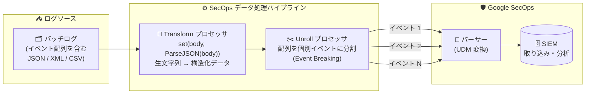

# Google SecOps: データ処理パイプライン向け Unroll プロセッサ (イベントブレーキング)

**リリース日**: 2026-08-24

**サービス**: Google SecOps / Google SecOps SIEM

**機能**: データ処理パイプラインにおける Unroll プロセッサ (Event Breaking)

**ステータス**: Feature (データ処理パイプライン自体は Pre-GA 提供)

📊 [このアップデートのインフォグラフィックを見る](https://takech9203.github.io/google-cloud-news-summary/20260824-google-secops-unroll-processor.html)

## 概要

Google SecOps のデータ処理パイプライン (Data Processing Pipelines) が、新たに **Unroll プロセッサ (イベントブレーキング)** をサポートしました。このプロセッサを使用すると、複数イベントの配列 (array) やスライス (slice) を含む 1 件のログエントリを、パースおよび取り込み (インジェスト) の前に複数の個別ログイベントへ自動分割できます。本アップデートは Google SecOps と Google SecOps SIEM の両方で発表されています。

多くの SaaS やセキュリティ製品の API は、複数のイベントを 1 つの JSON 配列としてまとめて返します。従来、このようなバッチ形式のログをそのまま取り込むと、パーサーが 1 件のログとして処理してしまい、個々のイベントを正しく UDM (Unified Data Model) イベントへ変換できない、あるいは事前に外部ツールで分割処理を行う必要がありました。Unroll プロセッサはこの「イベント分割」をパイプライン内で完結させます。

なお、Unroll プロセッサは構造化されたデータ入力を前提としており、生の文字列ペイロードに対しては直接動作しません。生ログはまず Transform プロセッサ (例: `set(body, ParseJSON(body))`) でパースし、その後段に Unroll プロセッサを配置する必要があります。対象ユーザーは、Google SecOps Enterprise / Enterprise Plus を利用し、Bindplane コンソールまたは Data Pipeline API でログの前処理を管理するセキュリティエンジニアです。

**アップデート前の課題**

- 複数イベントを配列として含むログ (バッチ形式の JSON など) を 1 件のログとして取り込むと、パーサーが個々のイベントを正しく分解・UDM 変換できない場合があった
- イベント分割を行うには、取り込み前に外部のスクリプトや中間処理基盤で配列を分割するなどの追加の仕組みが必要だった
- データ処理パイプラインのプロセッサ (Filter / Transform / Redaction) には、ログを複数イベントに分割する機能が存在しなかった

**アップデート後の改善**

- Unroll プロセッサにより、ログ配列を個別のログイベントへ自動展開 (イベントブレーキング) できるようになった
- パースと取り込みの前段でイベント分割がパイプライン内で完結し、外部の分割処理が不要になった
- Transform プロセッサ (ParseJSON など) と組み合わせることで、JSON / XML / CSV / YAML 形式のバッチログにも対応できるようになった

## アーキテクチャ図



イベント配列を含む生ログはまず Transform プロセッサで構造化データにパースされ、その後段の Unroll プロセッサで個別のログイベントに分割されてから、Google SecOps のパーサー (UDM 変換) と取り込みに渡されます。

## サービスアップデートの詳細

### 主要機能

1. **イベントブレーキング (Event Breaking)**
   - 1 件のログエントリに含まれるイベントの配列・スライスを、複数の個別ログイベントへ自動展開する
   - 分割はパース・取り込みの前段 (プリパース) で実行されるため、後段のパーサーは 1 イベント = 1 ログとして処理できる
   - OpenTelemetry Collector の [unrollprocessor](https://github.com/open-telemetry/opentelemetry-collector-contrib/tree/main/processor/unrollprocessor) をベースにしている

2. **Transform プロセッサとの連携 (プリパース要件)**
   - Unroll プロセッサは生の文字列には直接動作せず、パース済み JSON / XML / CSV などの構造化された内部オブジェクト表現を必要とする
   - 生の JSON ペイロードの場合、前段に OTTL ステートメント `set(body, ParseJSON(body))` を持つ Transform プロセッサを配置する
   - CSV / XML / YAML 形式のログにも、同様のプリパース用 Transform ステップを前段に配置することで対応可能

3. **既存プロセッサ群への追加**
   - データ処理パイプラインのプロセッサタイプとして、従来の Filter (条件・正規表現・重大度などによるフィルタ)、Redaction (機密データのマスキング)、Transform (フィールド操作・各種パース) に加えて Unroll が選択可能になった
   - Bindplane コンソールの Edit Processors ウィンドウから追加でき、Input / Output ペインで処理結果を即座にテスト・確認できる

## 技術仕様

### Unroll プロセッサの要件と仕様

| 項目 | 詳細 |
|------|------|
| 機能分類 | Event breaking (ログのスライスを複数の個別ログイベントに分割) |
| 入力要件 | 構造化された内部オブジェクト表現 (パース済み JSON / XML / CSV など)。生文字列には直接動作しない |
| 前段の必須構成 | ログペイロードをパースする Transform プロセッサを Unroll プロセッサの前に配置 |
| JSON の例 | Transform プロセッサに OTTL 文 `set(body, ParseJSON(body))` を設定 |
| その他の形式 | CSV / XML / YAML も同様のプリパース Transform が必要 |
| ベース実装 | OpenTelemetry Collector contrib の unrollprocessor |
| プロセッサ数の上限 | 1 パイプラインあたり最大 10 プロセッサ |
| 対応エディション | Google SecOps Enterprise / Enterprise Plus |
| 提供ステータス | データ処理パイプライン機能は Pre-GA Offerings Terms の対象 |

### プロセッサの実行順序

データ処理コンテナのプロセッサノード内では、プロセッサは記載順に逐次実行されます。最初のプロセッサが生ストリームデータを処理し、その出力が次のプロセッサの入力になります。

```text
[Stream (生ログ)]
  → Transform: set(body, ParseJSON(body))   # 生文字列を構造化データにパース
  → Unroll: イベント配列を個別ログに分割     # Event Breaking
  → (必要に応じて Filter / Redaction など)
  → Destination: Google SecOps (パース・取り込み)
```

## 設定方法

### 前提条件

1. Google SecOps Enterprise または Enterprise Plus のライセンス
2. Bindplane コンソール (バージョン 1.96.4 以降) のインストールと、Google SecOps インスタンスとの接続設定 (または Google SecOps Data Pipeline API の直接利用)
3. 設定に使用するユーザー / サービスアカウントへの Chronicle API 管理者ロール (`roles/chronicle.admin`)、または `chronicle.logProcessingPipelines.*` 権限を含むカスタムロールの付与

### 手順

#### ステップ 1: パイプラインとストリームの構成

Bindplane コンソールの **SecOps Pipelines** タブで対象のパイプラインを開き (未作成の場合は **Create SecOps Pipeline** で作成)、Pipeline configuration カードでログタイプと取り込み方法を指定したストリームを追加します。

#### ステップ 2: Transform プロセッサ (プリパース) の追加

Processor ノードをクリックして Edit Processors ウィンドウを開き、**Add Processor** から Transform プロセッサを追加します。生の JSON ペイロードの場合は次の OTTL 文を設定します。

```text
set(body, ParseJSON(body))
```

#### ステップ 3: Unroll プロセッサの追加

Transform プロセッサの **後段** に Unroll プロセッサを追加し、分割対象の配列を指定します。Edit Processors ウィンドウの Input / Output ペインで、受信サンプルデータに対する分割結果を即座に確認できます。

#### ステップ 4: ロールアウト

構成完了後に **Start rollout** をクリックしてパイプラインを有効化します。成功するとデータ処理コンテナのバージョン番号がインクリメントされ、以降の受信データに Unroll 処理が適用されます。

## メリット

### ビジネス面

- **取り込みデータの品質向上**: バッチ形式のログが個々のイベントとして正しく UDM 化されるため、検索・検知ルール・ダッシュボードでのイベント単位の分析精度が向上する
- **運用コストの削減**: 取り込み前段の外部分割スクリプトや中間処理基盤が不要になり、パイプラインの構築・保守コストを削減できる

### 技術面

- **パイプライン内で完結するイベント分割**: Transform → Unroll の 2 プロセッサ構成だけで、JSON 配列などのバッチログを個別イベントへ展開できる
- **標準技術ベース**: OpenTelemetry Collector の unrollprocessor がベースであり、OTTL による柔軟な前処理 (ParseJSON / ParseCSV / ParseXML など) と組み合わせられる
- **即時テスト可能**: Bindplane コンソールの Input / Output ペインで、実際の受信データに対する分割結果を保存時に即座に検証できる

## デメリット・制約事項

### 制限事項

- Unroll プロセッサは生文字列に直接動作しないため、必ず前段に対応する Transform プロセッサ (ParseJSON など) を配置する必要がある
- 1 つのパイプラインに定義できるプロセッサは最大 10 個
- データ処理パイプライン機能自体が Pre-GA (Pre-GA Offerings Terms 対象) であり、サポートが限定される場合や後方互換性のない変更が入る可能性がある
- Google SecOps Enterprise / Enterprise Plus ユーザーのみ利用可能

### 考慮すべき点

- データ処理パイプラインはパーサー到達前に生ログを変更するため、分割・変換によって既存パーサーの UDM イベント生成に影響が出ないか、有効化前に検証が必要
- イベント分割により取り込みイベント数が増加するため、後段の検知ルールやダッシュボードへの影響 (イベント件数の変化) を考慮する
- Data Processing Manager のフィルタは Chronicle Ingestion API の受信後に適用されるため、Ingestion API のクォータ・上限対策としては機能しない (ソース側でのフィルタリングを推奨)

## ユースケース

### ユースケース 1: SaaS API からのバッチ JSON ログの分割取り込み

**シナリオ**: SaaS 製品の監査ログ API が、複数のイベントを 1 つの JSON 配列 (例: `{"events": [ {...}, {...}, {...} ]}`) として返す。フィード経由でそのまま取り込むと 1 件のログとして扱われ、イベント単位の検知・検索ができない。

**実装例**:
```text
プロセッサ構成 (実行順):
1. Transform: set(body, ParseJSON(body))   # 生 JSON 文字列を構造化オブジェクトへ
2. Unroll: events 配列を個別ログイベントに展開
```

**効果**: 配列内の各イベントが個別のログとして SecOps パーサーに渡り、イベント単位で正確に UDM 変換・検知ルール評価が行われる。

### ユースケース 2: CSV / XML 形式のエクスポートログのイベント分割

**シナリオ**: レガシー機器やアプライアンスが複数レコードを 1 つの CSV / XML ペイロードとしてまとめて送信しており、レコード単位での分析が必要。

**効果**: Parse CSV / Parse XML の Transform プロセッサでプリパースした後に Unroll プロセッサを適用することで、レコードごとの個別ログイベントとして取り込める。外部での事前分割処理が不要になる。

## 料金

Unroll プロセッサ自体の追加料金に関する公式情報はありません。データ処理パイプライン機能は Google SecOps Enterprise / Enterprise Plus パッケージの一部として提供されます。ライセンス体系の詳細は以下を参照してください。

- [Google SecOps の料金・パッケージ](https://cloud.google.com/security/products/security-operations)

## 利用可能リージョン

リージョン固有の制約に関する公式情報はリリースノートに記載されていません。データ処理パイプラインは Google SecOps Enterprise / Enterprise Plus のインスタンスで利用できます。詳細は[公式ドキュメント](https://docs.cloud.google.com/chronicle/docs/ingestion/data-processing-pipeline)を参照してください。

## 関連サービス・機能

- **Bindplane (Bindplane コンソール / エージェント)**: データ処理パイプラインの構成・管理 UI。Unroll プロセッサの追加・テスト・ロールアウトに使用する (バージョン 1.96.4 以降が必要)
- **Google SecOps Data Pipeline API (Chronicle API)**: Bindplane コンソールを使わずにパイプラインをプログラマティックに構成する場合に使用
- **UDM (Unified Data Model)**: 分割後の個別イベントがパーサーにより変換されるデータモデル。パイプラインによる生ログ変更は UDM 変換結果に影響するため事前検証が必要
- **OpenTelemetry Collector (unrollprocessor / OTTL)**: Unroll プロセッサのベース実装。Transform プロセッサの記述には OTTL を使用する
- **Filter / Redaction プロセッサ**: 同じパイプライン内で組み合わせ可能な既存プロセッサ。ノイズ除去による取り込みコスト削減や機密データのマスキングに使用

## 参考リンク

- 📊 [インフォグラフィック](https://takech9203.github.io/google-cloud-news-summary/20260824-google-secops-unroll-processor.html)
- [公式リリースノート](https://docs.cloud.google.com/release-notes#August_24_2026)
- [ドキュメント: データ処理パイプラインの設定と管理 (Configure processors)](https://docs.cloud.google.com/chronicle/docs/ingestion/data-processing-pipeline#configure-processors)
- [OpenTelemetry Collector unrollprocessor](https://github.com/open-telemetry/opentelemetry-collector-contrib/tree/main/processor/unrollprocessor)
- [Google SecOps 製品ページ](https://cloud.google.com/security/products/security-operations)

## まとめ

Unroll プロセッサの追加により、複数イベントを含むバッチ形式のログを Google SecOps のパイプライン内で個別イベントに分割してから取り込めるようになり、外部の前処理基盤が不要になりました。バッチ JSON を返す SaaS API のログや CSV / XML 形式のエクスポートログを扱っている場合は、Transform (ParseJSON など) + Unroll の構成を検証し、UDM 変換への影響を確認した上でパイプラインへの導入を検討することを推奨します。

---

**タグ**: #GoogleSecOps #SecOpsSIEM #Chronicle #DataProcessingPipeline #UnrollProcessor #EventBreaking #Bindplane #OpenTelemetry #ログ取り込み #SIEM
