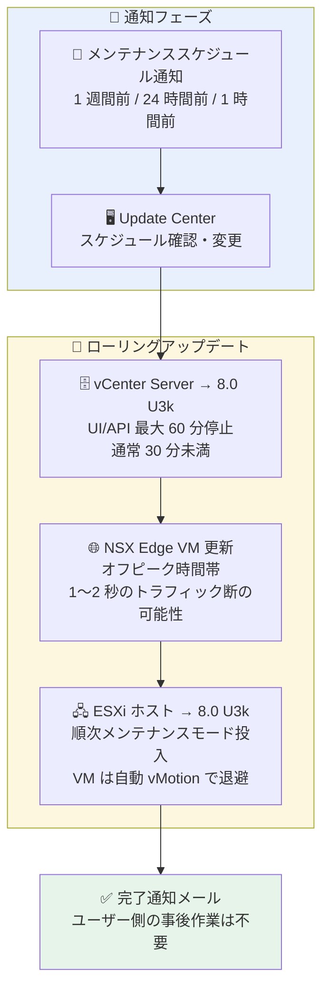

# Google Cloud VMware Engine: vCenter Server / ESXi 8.0 Update 3k セキュリティアップデート

**リリース日**: 2026-08-24

**サービス**: Google Cloud VMware Engine

**機能**: VMware コンポーネントアップデート (vCenter Server / ESXi 8.0 Update 3k)

**ステータス**: Announcement (セキュリティアップデート)

📊 [このアップデートのインフォグラフィックを見る](https://takech9203.github.io/google-cloud-news-summary/20260824-vmware-engine-vcenter-esxi-8-0-u3k-security-update.html)

## 概要

Google Cloud VMware Engine の運用チームは、2026 年 8 月より vCenter Server と ESXi をバージョン 8.0 Update 3k に更新するメンテナンスを開始すると発表しました。このアップデートは、Broadcom Security Advisory [VMSA-2026-0006](https://support.broadcom.com/web/ecx/support-content-notification/-/external/content/SecurityAdvisories/0/38017) で公表されたセキュリティ脆弱性に対処するものです。

VMSA-2026-0006 は最大 CVSSv3 スコア 9.8 の Critical 評価を含むアドバイザリで、vCenter Server の認証バイパス (CVE-2026-59309) やディレクトリトラバーサル (CVE-2026-59310)、ESXi の VMXNET3 アダプタにおける境界外書き込み (CVE-2026-47876、ゲストからホストへのエスケープにつながる可能性) など、深刻な脆弱性が含まれています。Broadcom によると、これらの脆弱性には回避策 (ワークアラウンド) が存在せず、パッチ適用が唯一の対処方法です。

VMware Engine はマネージドサービスであるため、このパッチ適用は Google Cloud の運用チームがローリング方式で実施します。ユーザーはプライベートクラウドごとにメールでメンテナンスウィンドウの通知を受け取り、Update Center でスケジュールの確認・変更や進捗の追跡ができます。ワークロード VM のダウンタイムは想定されていませんが、事前準備の推奨事項が案内されています。

**アップデート前の課題**

- vCenter Server / ESXi 8.0 Update 3 系の既存バージョンには、VMSA-2026-0006 で公表された認証バイパス、ディレクトリトラバーサル、ゲストからホストへのエスケープなどの脆弱性が存在していた
- これらの脆弱性には回避策がなく、パッチ適用以外に恒久的な対処方法がなかった
- vCenter へネットワークアクセス可能な攻撃者による不正アクセスや任意コード実行のリスクがあった

**アップデート後の改善**

- vCenter Server と ESXi が 8.0 Update 3k (修正済みバージョン) に更新され、VMSA-2026-0006 記載の脆弱性が解消される
- パッチ適用は VMware Engine 運用チームがローリング方式で実施するため、ユーザー自身によるパッチ作業は不要
- 更新はサービス料金に含まれており、追加コストなしでセキュリティ体制が強化される

## アーキテクチャ図



VMware Engine 運用チームが実施するローリングアップデートの流れです。vCenter → NSX Edge → ESXi ホストの順に段階的に更新され、ワークロード VM は他ホストへ自動移行されるためダウンタイムは想定されていません。

## サービスアップデートの詳細

### 主要機能

1. **VMSA-2026-0006 で公表された脆弱性への対処**
   - CVE-2026-59309: vCenter (VMware Directory Service) の認証バイパス — CVSSv3 9.8 (Critical)。ネットワークアクセス可能な攻撃者が認証を回避して不正アクセスできる可能性
   - CVE-2026-59310: vCenter (Syslog サーバー) のディレクトリトラバーサル — CVSSv3 9.8 (Critical)。任意コード実行につながる可能性
   - CVE-2026-47876: ESXi の VMXNET3 アダプタにおける境界外書き込み — CVSSv3 9.3 (Critical)。VM 内のローカル管理者権限からホスト上でのコード実行 (ゲスト → ホストエスケープ) につながる可能性
   - CVE-2026-41703: 境界外読み取り — CVSSv3 7.6 (Important)。情報漏えいまたは DoS の可能性
   - CVE-2026-41709: ESXi のロギング不備 — CVSSv3 2.7 (Low)

2. **ローリング方式による無停止志向のアップデート**
   - vCenter Server: 更新中は vCenter の UI と API が最大 60 分間 (通常は 30 分未満) 利用不可
   - NSX Edge: オフピーク時間帯 (月〜金の現地時間 20:00〜8:00) に更新。VM フェイルオーバーまたは BGP 再確立時に 1〜2 秒のトラフィック断が発生する可能性
   - ESXi: ホストを順次メンテナンスモードに移行し、VM をクラスタ内の他ホストへ自動移行してから更新

3. **通知とスケジュール管理**
   - 全プロジェクトユーザーと[追加設定されたメールアドレス](https://docs.cloud.google.com/vmware-engine/docs/environment/howto-account#set_up_email_alerts)にメンテナンススケジュールをメール通知
   - 1 週間前、24 時間前、1 時間前にリマインダーメールを送信し、完了時にも確認メールを送信
   - [Update Center](https://docs.cloud.google.com/vmware-engine/docs/update-center) でスケジュールの確認・変更、進捗の追跡が可能

## 技術仕様

### アップデート後の VMware コンポーネントバージョン

| VMware コンポーネント | バージョン | ビルド |
|----------------------|-----------|--------|
| vCenter Server | 8.0 Update 3k | 25600417 |
| ESXi | 8.0 Update 3k | 25595708 |

### アップデートの影響範囲

| 対象 | 影響 |
|------|------|
| vCenter Server | UI / API が最大 60 分間利用不可 (通常 30 分未満) |
| NSX Edge | フェイルオーバー / BGP 再確立時に 1〜2 秒のトラフィック断の可能性 (オフピーク時間帯に実施) |
| ワークロード VM (ESXi) | ダウンタイムは想定なし (ホストを順次メンテナンスモード化し VM を自動移行) |
| 所要時間 | クラスタサイズ、ストレージ使用率、プライベートクラウドの複雑さに応じて数時間〜数日 |

## 設定方法

### 前提条件 (推奨される事前準備)

1. **メンテナンスウィンドウの確認・変更**: [Update Center](https://docs.cloud.google.com/vmware-engine/docs/update-center) でスケジュールを確認し、必要に応じて変更する
2. **サードパーティソリューションの互換性確認**: vCenter に接続するバックアップ、監視、災害復旧ツールがターゲットバージョン (8.0 U3k) に対応していることを確認する
3. **カスタム構成の確認**: [プライベートクラウドの更新準備](https://docs.cloud.google.com/vmware-engine/docs/concepts-maintenance-updates#preparation)の手順を完了する。ホストのメンテナンスモード移行を妨げる構成は、更新中に無効化される
4. **空きストレージ容量の確保**: 更新開始前にプライベートクラウドに 30% 以上の空きストレージ容量を確保する

### 手順

このアップデートは VMware Engine 運用チームが実施するため、ユーザー側でのパッチ適用作業や更新完了後の対応は不要です。進捗は Update Center で追跡できます。

## メリット

### ビジネス面

- **セキュリティリスクの低減**: 最大 CVSSv3 9.8 の Critical な脆弱性が解消され、認証バイパスや任意コード実行、ゲストからホストへのエスケープのリスクが排除される
- **運用負荷ゼロのパッチ適用**: マネージドサービスとして Google の運用チームが更新を実施するため、自社でのパッチ計画・検証・適用の工数が不要
- **追加コストなし**: 定期的な更新とパッチはサービス料金に含まれる

### 技術面

- **ワークロードへの影響の最小化**: ローリング更新と VM の自動移行により、ワークロード VM のダウンタイムは想定されていない
- **柔軟なスケジュール調整**: Update Center からメンテナンスウィンドウの確認・変更が可能で、業務影響を考慮した調整ができる
- **段階的な通知**: 1 週間前から複数回の事前通知が届くため、計画的な準備が可能

## デメリット・制約事項

### 制限事項

- 更新中は vCenter の UI / API が最大 60 分間 (通常 30 分未満) 利用できない
- NSX Edge の更新時に 1〜2 秒のトラフィック断が発生する可能性がある
- ホストのメンテナンスモード移行を妨げるカスタム構成 (DRS ルールなど) は更新中に無効化される

### 考慮すべき点

- 更新開始前にプライベートクラウドの空きストレージ容量を 30% 以上確保する必要がある
- vCenter に接続するバックアップ・監視・DR ツールが 8.0 U3k と互換であることを事前に確認する必要がある
- VMSA-2026-0006 には回避策がないため、メンテナンスウィンドウの過度な延期はセキュリティリスクの放置につながる
- 更新の所要時間は環境の規模により数時間から数日と幅がある

## ユースケース

### ユースケース 1: メンテナンスウィンドウの業務影響を最小化する

**シナリオ**: 基幹システムを VMware Engine 上で稼働させており、vCenter の一時停止 (最大 60 分) が運用ツールや自動化ジョブに影響する可能性がある。

**実装例**:
```
1. スケジュール通知メールを受領後、Update Center でメンテナンスウィンドウを確認
2. vCenter API に依存するバッチ処理や自動化ジョブの実行時間と重ならないよう、必要に応じてウィンドウを変更
3. バックアップ / 監視 / DR ツールのベンダーサポートマトリクスで 8.0 U3k との互換性を確認
4. 空きストレージ容量が 30% 以上あることを確認
```

**効果**: vCenter 停止時間帯の業務影響を回避しつつ、Critical な脆弱性を早期に解消できる。

### ユースケース 2: セキュリティ監査・コンプライアンス対応

**シナリオ**: 社内のセキュリティチームから VMSA-2026-0006 (CVE-2026-59309 ほか) への対応状況の報告を求められている。

**効果**: VMware Engine ではパッチ適用が Google の運用チームにより自動的に実施されるため、Update Center と完了通知メールをエビデンスとして、対応完了 (vCenter / ESXi 8.0 U3k、ビルド 25600417 / 25595708) を報告できる。オンプレミス vSphere と比較して、パッチ管理のコンプライアンス対応工数を大幅に削減できる。

## 料金

このアップデートに伴う追加料金はありません。定期的な更新とパッチの適用は VMware Engine のサービス料金に含まれています。

VMware Engine 自体の料金については[料金ページ](https://cloud.google.com/vmware-engine/pricing)を参照してください。

## 利用可能リージョン

このアップデートは VMware Engine のすべてのプライベートクラウドを対象に、2026 年 8 月から順次適用されます。個々のプライベートクラウドのメンテナンスウィンドウはメール通知および Update Center で確認できます。

## 関連サービス・機能

- **Update Center**: メンテナンススケジュールの確認・変更、更新進捗の追跡を行う VMware Engine の管理機能
- **Essential Contacts / メールアラート設定**: プロジェクトユーザー以外にも通知を届けたい場合、[追加のメールアドレスを設定](https://docs.cloud.google.com/vmware-engine/docs/environment/howto-account#set_up_email_alerts)可能
- **Cloud Customer Care**: 更新に関する質問や支援が必要な場合の問い合わせ窓口
- **サードパーティ連携 (バックアップ / 監視 / DR)**: vCenter に接続するツール (Zerto、Veeam など) はターゲットバージョンとの互換性確認が必要

## 参考リンク

- 📊 [インフォグラフィック](https://takech9203.github.io/google-cloud-news-summary/20260824-vmware-engine-vcenter-esxi-8-0-u3k-security-update.html)
- [公式リリースノート](https://docs.cloud.google.com/release-notes#August_24_2026)
- [Latest service announcements (2026-08-24)](https://docs.cloud.google.com/vmware-engine/docs/service-announcements#2026-08-24)
- [Broadcom Security Advisory VMSA-2026-0006](https://support.broadcom.com/web/ecx/support-content-notification/-/external/content/SecurityAdvisories/0/38017)
- [vCenter Server 8.0 U3k リリースノート](https://techdocs.broadcom.com/us/en/vmware-cis/vsphere/vsphere/8-0/release-notes/vcenter-server-update-and-patch-release-notes/vsphere-vcenter-server-80u3k-release-notes.html)
- [ESXi 8.0 U3k リリースノート](https://techdocs.broadcom.com/us/en/vmware-cis/vsphere/vsphere/8-0/release-notes/esxi-update-and-patch-release-notes/vsphere-esxi-80u3k-release-notes.html)
- [プライベートクラウドの更新準備](https://docs.cloud.google.com/vmware-engine/docs/concepts-maintenance-updates#preparation)
- [料金ページ](https://cloud.google.com/vmware-engine/pricing)

## まとめ

VMSA-2026-0006 は認証バイパスやゲストからホストへのエスケープを含む Critical (最大 CVSSv3 9.8) なアドバイザリであり、回避策が存在しないためパッチ適用が唯一の対処方法です。VMware Engine ではこの更新を Google の運用チームがローリング方式で実施するため、ユーザーはメンテナンスウィンドウの確認・調整、サードパーティツールの互換性確認、空きストレージ 30% 以上の確保という事前準備を早めに完了させることを推奨します。

---

**タグ**: #GoogleCloud #VMwareEngine #vCenter #ESXi #セキュリティ #脆弱性対応 #VMSA-2026-0006 #メンテナンス
