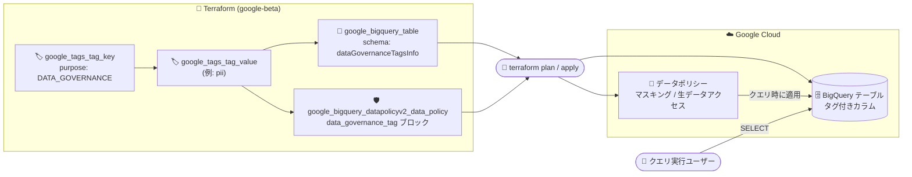

# BigQuery: データガバナンスタグの Terraform サポート (Preview)

**リリース日**: 2026-08-25

**サービス**: BigQuery

**機能**: データガバナンスタグの Terraform サポート

**ステータス**: Preview

📊 [このアップデートのインフォグラフィックを見る](https://takech9203.github.io/google-cloud-news-summary/20260825-bigquery-data-governance-tags-terraform.html)

## 概要

BigQuery のデータガバナンスタグ (data governance tags) が Terraform でサポートされました。本機能は Preview です。データガバナンスタグは、Resource Manager タグの一種 (purpose を `DATA_GOVERNANCE` に設定したタグ) で、機密性の高いカラムに付与し、BigQuery のデータポリシーから参照することで、カラムレベルのアクセス制御とデータマスキングを実現します。

今回のアップデートにより、タグをカラムに付与したテーブルの作成・更新や、タグを参照するデータポリシーの作成を Terraform (google-beta プロバイダ) で宣言的に管理できるようになりました。カラムレベルセキュリティの構成を Infrastructure as Code (IaC) として管理したいデータプラットフォームチームや、ガバナンス設定のレビュー・監査プロセスをコードベースで運用したい組織に有用なアップデートです。

**アップデート前の課題**

- データガバナンスタグのカラムへの付与や、タグを参照するデータポリシーの管理は、gcloud CLI や REST API (tables.insert / tables.update、BigQuery Data Policy API) を使った手続き的な操作が必要だった
- カラムレベルセキュリティの構成を、他の BigQuery リソース (データセット、テーブル) と同じ Terraform コードベースで一元管理できなかった

**アップデート後の改善**

- `google_bigquery_table` リソースのスキーマ定義内で `dataGovernanceTagsInfo` を指定し、テーブル作成時にカラムへデータガバナンスタグを付与できるようになった
- `google_bigquery_datapolicyv2_data_policy` リソースの `data_governance_tag` ブロックで、タグを参照するデータマスキングポリシー / 生データアクセスポリシーを作成できるようになった
- 既存テーブルのカラムに対するタグの追加・変更・削除は in-place で適用され、テーブルの再作成は発生しない

## アーキテクチャ図



Terraform でタグキー/値、タグ付きカラムを持つテーブル、タグを参照するデータポリシーを宣言的に定義し、`terraform apply` で反映します。クエリ実行時には、データポリシーに基づいてマスキングまたは生データアクセスが適用されます。

## サービスアップデートの詳細

### 主要機能

1. **テーブル作成時のカラムへのタグ付与 (google_bigquery_table)**
   - google-beta プロバイダの `google_bigquery_table` リソースで、カラムのスキーマ定義内に `dataGovernanceTagsInfo` オブジェクトを設定してタグを付与できる
   - タグキーは名前空間付き形式 (`PROJECT_ID/TAG_KEY` または `ORGANIZATION_ID/TAG_KEY`)、タグ値は短縮名で指定する

2. **既存テーブルへのタグの追加・更新**
   - `google_bigquery_table` リソースのカラムスキーマで `dataGovernanceTagsInfo` を追加・変更し、構成を再適用する
   - タグの追加・変更・削除は in-place で実行され、テーブルの再作成は発生しない

3. **タグを参照するデータポリシーの作成 (google_bigquery_datapolicyv2_data_policy)**
   - google-beta プロバイダの `google_bigquery_datapolicyv2_data_policy` リソースで、`data_governance_tag` ブロックを指定してポリシーをタグキー/値にバインドする
   - `data_policy_type` に `DATA_MASKING_POLICY` (例: 事前定義の SHA256 マスキングルール) または `RAW_DATA_ACCESS_POLICY` (生データアクセス許可) を指定できる
   - `grantees` にユーザーやサービスアカウントのプリンシパルを指定してアクセスを許可する

## 技術仕様

### Terraform リソース

| 項目 | 詳細 |
|------|------|
| プロバイダ | google-beta (Preview 機能のため) |
| タグ付きカラムの定義 | `google_bigquery_table` のスキーマ内 `dataGovernanceTagsInfo` |
| データポリシーの定義 | `google_bigquery_datapolicyv2_data_policy` の `data_governance_tag` ブロック |
| タグキー/値の作成 | `google_tags_tag_key` / `google_tags_tag_value` |
| ポリシータイプ | `DATA_MASKING_POLICY` / `RAW_DATA_ACCESS_POLICY` |
| タグ更新の挙動 | カラムスキーマの `dataGovernanceTagsInfo` の追加・変更・クリアは in-place (テーブル再作成なし) |
| ポリシー更新の注意 | `data_governance_tag` ブロックとその配下フィールドはイミュータブル。更新・削除するとデータポリシーリソースが再作成される |

### 構成例

タグ付きカラムを持つテーブルの作成:

```hcl
resource "google_bigquery_table" "table" {
  provider   = google-beta
  dataset_id = "DATASET_ID"
  table_id   = "TABLE_ID"
  schema     = <<EOF
[
  {
    "name": "COLUMN_NAME",
    "type": "STRING",
    "mode": "NULLABLE",
    "dataGovernanceTagsInfo": {
      "dataGovernanceTags": {
        "PROJECT_ID/TAG_KEY": "TAG_VALUE"
      }
    }
  }
]
EOF
  deletion_protection = false
}
```

タグを参照するデータマスキングポリシーの作成 (SHA256 マスキング):

```hcl
resource "google_bigquery_datapolicyv2_data_policy" "mask_policy" {
  provider         = google-beta
  location         = "LOCATION"
  data_policy_type = "DATA_MASKING_POLICY"
  data_policy_id   = "POLICY_ID"

  data_masking_policy {
    predefined_expression = "SHA256"
  }

  data_governance_tag {
    key   = "PROJECT_ID/TAG_KEY"
    value = "TAG_VALUE"
  }

  grantees = [
    "principal://goog/subject/EMAIL_ADDRESS"
  ]
}
```

## 設定方法

### 前提条件

1. データガバナンスタグの作成・管理には BigQuery Enterprise エディションが必要
2. Terraform で BigQuery オブジェクトを作成するには Cloud Resource Manager API を有効化し、Application Default Credentials で認証を設定する
3. 必要な IAM ロール:
   - タグの作成: Tag Administrator (`roles/resourcemanager.tagAdmin`)、Organization Viewer (`roles/resourcemanager.organizationViewer`)
   - カラムへのタグ付与/削除: BigQuery Data Owner (`roles/bigquery.dataOwner`)、Tag User (`roles/resourcemanager.tagUser`)
   - データポリシーの作成・管理: BigQuery Data Policy Admin (`roles/bigquerydatapolicy.admin`)

### 手順

#### ステップ 1: Terraform 構成の作成

```bash
mkdir DIRECTORY && cd DIRECTORY && touch main.tf
terraform init
```

`main.tf` にタグキー/値、テーブル (タグ付きカラム)、データポリシーのリソースを定義します。タグキー作成時は purpose を `DATA_GOVERNANCE` に設定します。

#### ステップ 2: 構成の確認と適用

```bash
terraform plan
terraform apply
```

`terraform plan` で作成・更新されるリソースを確認し、`terraform apply` で反映します。適用後、Google Cloud コンソールでリソースを確認できます。

## メリット

### ビジネス面

- **ガバナンス構成の監査性向上**: カラムレベルセキュリティの構成がコードとしてバージョン管理され、変更履歴の追跡やレビューが可能になる
- **一貫したガバナンス適用**: 複数プロジェクト・環境に対して同一のタグ/ポリシー構成をコードで再現でき、設定漏れを防ぎやすい

### 技術面

- **IaC への統合**: データセットやテーブルと同じ Terraform コードベースで、タグとデータポリシーを一元管理できる
- **安全な更新**: カラムのタグ変更は in-place で適用され、テーブル再作成に伴うデータへの影響がない

## デメリット・制約事項

### 制限事項

- 本機能 (データガバナンスタグ、および Terraform サポート) は Preview であり、Pre-GA Offerings Terms が適用される。サポートが限定される場合がある
- Terraform での利用には google-beta プロバイダが必要
- `google_bigquery_datapolicyv2_data_policy` の `data_governance_tag` ブロックはイミュータブルで、更新・削除するとリソースが再作成される
- データガバナンスタグ自体の制限: BigQuery Omni テーブルは非対応、カラムあたり 1 タグ・テーブルあたり最大 1,000 ユニークタグ、STRUCT はリーフフィールドのみタグ付け可能
- Google Cloud コンソールではカラム上のタグの表示は可能だが、バインド/アンバインドは不可
- タグ付きカラムを BigQuery Storage Read API、`tabledata.list`、ワイルドカードテーブルで参照する場合、データポリシーでアクセスが許可されていないとアクセス拒否エラーになる

### 考慮すべき点

- カラムに付与済みのタグ値を削除すると、バインディングはカラムに残るがタグ値が存在しないため、カラムへのアクセスが失われる可能性がある
- デフォルトでは、テーブルが存在するプロジェクトのデータポリシーのみが評価される。組織レベルでデフォルトデータポリシープロジェクトを構成した場合は両方が評価され、競合時はテーブル側プロジェクトのポリシーが優先される
- カラムレベルセキュリティ機能 (データガバナンスタグを含む) を持つテーブルは、クロスリージョンのテーブルコピーが無効になる

## ユースケース

### ユースケース 1: PII カラムのマスキングを IaC で標準化

**シナリオ**: データプラットフォームチームが、複数のデータセットに存在する個人情報 (メールアドレス、電話番号など) のカラムに対し、一貫したマスキングポリシーを適用したい。

**実装例**:
```hcl
# タグ値 "pii" を参照する SHA256 マスキングポリシー
resource "google_bigquery_datapolicyv2_data_policy" "pii_mask" {
  provider         = google-beta
  location         = "us"
  data_policy_type = "DATA_MASKING_POLICY"
  data_policy_id   = "pii-sha256-mask"

  data_masking_policy {
    predefined_expression = "SHA256"
  }

  data_governance_tag {
    key   = "my-project/sensitivity"
    value = "pii"
  }

  grantees = [
    "principal://goog/subject/analyst@example.com"
  ]
}
```

**効果**: タグを付与するだけで対象カラムにマスキングが適用され、ポリシー定義はコードレビューと CI/CD を通じて統制できる。

### ユースケース 2: ガバナンス構成の環境間レプリケーション

**シナリオ**: 開発・ステージング・本番の各環境で、同一のタグキー/値とデータポリシー構成を維持したい。

**効果**: Terraform モジュール化により環境ごとの構成差分を最小化し、本番のみ設定が漏れるといったリスクを低減できる。

## 料金

データガバナンスタグの作成・管理には BigQuery Enterprise エディションが必要です。エディションの詳細と料金は公式ページを参照してください。

- [BigQuery エディションの概要](https://docs.cloud.google.com/bigquery/docs/editions-intro)
- [BigQuery の料金](https://cloud.google.com/bigquery/pricing)

## 関連サービス・機能

- **Resource Manager (タグ)**: データガバナンスタグは Resource Manager タグの一種で、purpose を `DATA_GOVERNANCE` に設定して作成する
- **BigQuery Data Policy API (v2)**: タグを参照するデータポリシー (マスキング / 生データアクセス) の管理に使用。Terraform の `google_bigquery_datapolicyv2_data_policy` が対応するリソース
- **BigQuery カラムレベルアクセス制御 / データマスキング**: データガバナンスタグはこれらの機能をタグベースで構成する仕組み
- **INFORMATION_SCHEMA**: カラムに付与されたデータガバナンスタグは `INFORMATION_SCHEMA.COLUMNS` および `INFORMATION_SCHEMA.COLUMN_FIELD_PATHS` ビューに含まれる

## 参考リンク

- 📊 [インフォグラフィック](https://takech9203.github.io/google-cloud-news-summary/20260825-bigquery-data-governance-tags-terraform.html)
- [公式リリースノート](https://docs.cloud.google.com/release-notes#August_25_2026)
- [ドキュメント: データガバナンスタグによるカラムアクセス制御](https://docs.cloud.google.com/bigquery/docs/tags#data-governance-tags)
- [ドキュメント: カラムレベルアクセス制御の概要](https://docs.cloud.google.com/bigquery/docs/column-level-security-intro)
- [ドキュメント: データマスキングの概要](https://docs.cloud.google.com/bigquery/docs/column-data-masking-intro)
- [Terraform: google_bigquery_table (google-beta)](https://registry.terraform.io/providers/hashicorp/google-beta/latest/docs/resources/bigquery_table)
- [Terraform: google_bigquery_datapolicyv2_data_policy (google-beta)](https://registry.terraform.io/providers/hashicorp/google-beta/latest/docs/resources/bigquery_datapolicyv2_data_policy)
- [料金ページ](https://cloud.google.com/bigquery/pricing)

## まとめ

BigQuery のデータガバナンスタグが Terraform (google-beta プロバイダ) でサポートされ、カラムレベルセキュリティとデータマスキングの構成を IaC として宣言的に管理できるようになりました。カラムのタグ変更は in-place で適用される一方、データポリシーの `data_governance_tag` ブロックはイミュータブルでリソース再作成を伴う点に注意が必要です。Preview 段階のため、まずは非本番環境でタグとデータポリシーの Terraform 管理を検証することを推奨します。

---

**タグ**: BigQuery, Terraform, データガバナンス, カラムレベルセキュリティ, データマスキング, IaC, Preview
