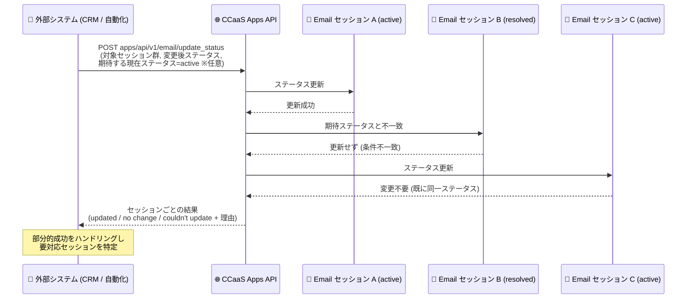
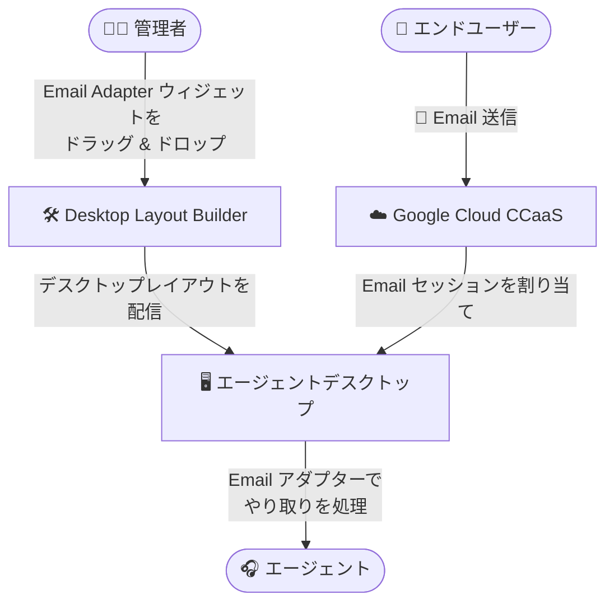

# Google Cloud CCaaS: バージョン 6.7 プレリリースノート (Email 対応強化と多数の修正)

**リリース日**: 2026-08-25

**サービス**: Google Cloud Contact Center as a Service (CCaaS)

**機能**: バージョン 6.7 プレリリースノート (エージェントデスクトップの Email 対応、Email ステータス一括更新 API、多数の不具合修正)

**ステータス**: プレリリース (次期バージョンとして 6.7 を予定)

📊 [このアップデートのインフォグラフィックを見る](https://takech9203.github.io/google-cloud-news-summary/20260825-ccaas-6-7-prerelease.html)

## 概要

Google Cloud Contact Center as a Service (CCaaS) の次期バージョン 6.7 のプレリリースノートが公開されました。プレリリースノートは、次期バージョンで提供が見込まれる新機能や修正内容を事前に告知するものです。なお、公式のリリースノートには「次期バージョンの番号は 6.7 より大きくなる可能性がある」と明記されています。

今回のプレリリースノートの目玉は Email チャネルの強化です。1 つ目は、エージェントデスクトップが Email に対応し、エージェントがデスクトップレイアウト内の Email アダプターを使って Email のやり取りを処理できるようになる点です。管理者向けには、Desktop Layout Builder に新しい **Email Adapter** ウィジェットが追加され、ドラッグ & ドロップでレイアウトに配置できます。2 つ目は、複数の Email セッションのステータスをまとめて変更できる新しい API エンドポイント `apps/api/v1/email/update_status` の追加です。外部システムとのインテグレーションで部分的な成功 (partial success) を適切にハンドリングできる設計になっています。

このほか、CX Insights (Customer Experience Insights) へのトランスクリプト連携、チャット UI、コールカスケード、ダッシュボード表示、Salesforce 連携など、広範囲にわたる 20 件の不具合修正が含まれています。コンタクトセンターの管理者、エージェントデスクトップをカスタマイズする管理者、CCaaS API と連携する外部システムの開発者が対象です。

**アップデート前の課題**

- エージェントデスクトップのデスクトップレイアウトは、コールアダプター (インバウンド / アウトバウンド) とチャットアダプターに対応しており、Email 用のアダプターウィジェットは提供されていなかった
- Email 関連の公開 API (`apps/api/v1/email/...`) は、セッション取得 (`GET /apps/api/v1/email/sessions/{EMAIL_SUPPORT_ID}`) とメッセージ取得 (`GET /apps/api/v1/email/messages/{EMAIL_THREAD_ID}`) の読み取り専用エンドポイントが中心で、複数の Email セッションのステータスを API から一括で変更する手段がなかった
- CX Insights 連携やチャット、コールルーティング、ダッシュボードなどに多数の既知の不具合が存在していた (詳細は「主要な不具合修正」参照)

**アップデート後の改善**

- エージェントが Email のやり取りをエージェントデスクトップ上で処理できるようになる。管理者は Desktop Layout Builder の Email Adapter ウィジェットをレイアウトに配置するだけでよい
- 新エンドポイント `apps/api/v1/email/update_status` により、複数の Email セッションのステータスを一括で指定のステータスに変更できる。期待する現在のステータスを条件として指定でき、セッションごとに「更新済み / 変更不要 / 更新不可 (理由付き)」が返るため、インテグレーション側で部分的成功を処理し、対応が必要なセッションを特定できる
- 20 件の不具合が修正され、CX Insights のトランスクリプト精度、チャット / コールのルーティング、ダッシュボードの表示や応答性が改善される

## アーキテクチャ図

新しい `email/update_status` エンドポイントによる一括ステータス更新のフローです。期待する現在ステータスを条件指定でき、レスポンスがセッション単位の結果を返すため、外部インテグレーションは部分的成功を安全に処理できます。

エージェントデスクトップの Email 対応の構成イメージです。管理者が Desktop Layout Builder で Email Adapter ウィジェットを含むレイアウトを作成し、エージェントはそのレイアウト上で Email インタラクションを処理します。

## サービスアップデートの詳細

### 主要機能

1. **エージェントデスクトップの Email 対応**
   - エージェントデスクトップが Email に対応し、エージェントはデスクトップレイアウト内の Email アダプターで Email のやり取りを処理できる
   - 管理者向けに、Desktop Layout Builder に新しい **Email Adapter** ウィジェットが追加され、パネルへドラッグ & ドロップして配置できる
   - 既存のエージェントデスクトップは、コールアダプター / チャットアダプターに加えて、ライブトランスクリプトやナレッジアシストなどのウィジェットをレイアウトに組み込める仕組みで、Email がこのレイアウト機構に統合される形となる

2. **Email ステータスの一括更新 API (`apps/api/v1/email/update_status`)**
   - 複数の Email セッションのステータスを、指定したステータスへまとめて変更できる新エンドポイント
   - **条件付き更新**: セッションが現在あるはずのステータスをオプションで指定できる。指定したステータスにないセッションは更新されない (楽観的な整合性チェック)
   - **セッション単位の結果レポート**: レスポンスはセッションごとに「更新された / 変更不要だった / 更新できなかった (および理由)」を報告する。これによりインテグレーション側は部分的成功を処理し、依然として対応が必要なセッションを特定できる

### 主要な不具合修正 (20 件)

今回のプレリリースには広範な修正が含まれます。カテゴリ別の主な内容は次のとおりです。

**CX Insights (Customer Experience Insights) 連携**

- ブレンド SMS のトランスクリプトが通話音声レコーディングとして誤認識され、CX Insights 上で欠損・分析不能データとして表示される問題を修正
- スーパーバイザーのチャットメッセージが、CX Insights のトランスクリプトでエンドユーザーの発言として誤って帰属される問題を修正

**チャット**

- エージェントが新しいチャットを受け付けた後、チャットのテキスト入力欄が反応しなくなる問題を修正
- エージェントに接続済みのチャットが Queued Chats ダッシュボードに「Ongoing」ステータスで表示され続ける問題を修正
- エージェントが送信したチャットフォームがエンドユーザーに届かない問題を修正
- バーチャルエージェントから人間のエージェントへエスカレーションされたチャットがキューに滞留し、対応可能なエージェントにオファーされない問題を修正
- チャットキューにエージェントの空きがあるにもかかわらず、待ち時間 API が「対応可能エージェント 0」と誤って報告する問題を修正

**通話ルーティング / キュー**

- コールカスケードのエージェント可用性セーフガードが終端キューパスで適用されず、プライマリキューが最低可用性しきい値を下回っていてもセカンダリキューの通話が割り当てられる問題を修正
- エージェントのキューに複数の通話が待機している場合、直接インバウンド通話や内線ダイヤル (dial-by-extension) の通話がエージェントに届かない問題を修正
- 新規作成した音声キューがグローバルのウィスパー / カウントダウン設定を正しく継承しない問題を修正
- クローズされたキューへコールドトランスファーされた通話について、キュー滞留時間メトリクスに IVR タイムアウト時間が誤って含まれる問題を修正

**エージェント状態 / デスクトップ**

- 既読のボイスメールを再度開いたエージェントが「In-call」ステータスのまま固定され、新しいコンタクトの受付やステータス変更ができなくなる問題を修正
- ラップアップ中にエージェントの割り当て通話 ID がクリアされ、ページ更新後にラップアップのディスポジションを送信できなくなる問題を修正
- バーチャルエージェントから人間のエージェントへエスカレーションされた通話で、感情スコアがエージェントデスクトップのコールアダプターや Salesforce に表示されない問題を修正

**ダッシュボード / 監査 / パフォーマンス**

- 営業時間 (hours of operation) の変更が Audit Dashboard に表示されない問題を修正
- Queue ダッシュボードに数値の代わりに `{{Count}}` や `{{Level}}` という変数名がそのまま表示される問題を修正
- キュー数が多いインスタンスで Queues > Calls ダッシュボードがロードできずタイムアウトする問題を修正
- エージェントアクティビティログのリクエストが高いデータベースレイテンシとゲートウェイタイムアウトを引き起こす問題を修正

**Salesforce 連携**

- Salesforce 連携でアウトバウンド通話が「Inbound」と誤ってラベル付けされ、CCAI Platform の通話 ID が Salesforce のケースアクティビティコメントに渡されない問題を修正

## 技術仕様

### Email セッションのステータス

既存の Email セッション取得 API (`GET /apps/api/v1/email/sessions/{EMAIL_SUPPORT_ID}`) のドキュメントによると、Email セッションのステータスには以下の値があります。

| ステータス | 意味 |
|------|------|
| `unopened` | 未開封 |
| `active` | アクティブ |
| `paused` | 一時停止 |
| `resolved` | 解決済み |
| `closed` | クローズ |
| `reopened` | 再オープン |

### Email 関連 API エンドポイント (6.7 プレリリース時点)

| エンドポイント | メソッド | 用途 |
|------|------|------|
| `/apps/api/v1/email/sessions/{EMAIL_SUPPORT_ID}` | GET | Email セッションのサマリーとメッセージ ID 一覧を取得 (既存) |
| `/apps/api/v1/email/messages/{EMAIL_THREAD_ID}` | GET | 単一 Email メッセージの全文を取得 (既存) |
| `/apps/api/v1/email/update_status` | - | 複数 Email セッションのステータスを一括更新 (**6.7 で追加予定**) |

既存の Email 系エンドポイントは Basic 認証を使用し、API 認証情報が属するインスタンスの Email 情報を返します。

## 設定方法

### エージェントデスクトップの前提条件

エージェントデスクトップを使用するには、エージェントデスクトップ拡張機能を有効化する必要があります。

1. Google Cloud コンソールで、対象インスタンスを含むプロジェクトを選択する
2. ナビゲーションメニューで **CCAI Platform** をクリックし、編集するインスタンスを選択する
3. **Edit > Configure extensions** をクリックし、**Extensions** で **Agent desktop** チェックボックスを選択して保存する

### デスクトップレイアウトへのウィジェット配置 (現行の手順)

1. CCAI Platform ポータルで **Settings > Operation Management** をクリックする
2. **Agent Desktop** ペインで **Desktop Layout** の **Manage Desktop Layout Lists** をクリックし、Desktop Layout Builder を開く
3. レイアウトを追加・編集し、パネルにウィジェットをドラッグして配置し、保存する

バージョン 6.7 では、この Desktop Layout Builder に **Email Adapter** ウィジェットが追加され、同様にドラッグ & ドロップで配置できるようになる予定です。

## メリット

### ビジネス面

- **Email チャネルのエージェント体験統合**: 通話・チャットと同じエージェントデスクトップ上で Email 対応が完結するため、エージェントのツール切り替えが減り、オムニチャネル対応の運用が一貫する
- **バックオフィス業務の効率化**: 一括ステータス更新 API により、大量の Email セッションの棚卸し (例: 解決済みへの一括変更) を外部システムから自動化できる

### 技術面

- **部分的成功を前提とした API 設計**: セッションごとの結果 (updated / no change / couldn't update + 理由) が返るため、リトライ対象の特定やエラーハンドリングを堅牢に実装できる
- **条件付き更新による安全性**: 期待する現在ステータスを指定することで、意図しない状態のセッションを誤って更新するリスクを回避できる
- **広範な不具合修正**: CX Insights のデータ品質、ルーティングの正確性、ダッシュボードの応答性など、運用の信頼性が向上する

## デメリット・制約事項

### 考慮すべき点

- これはプレリリースノートであり、記載された機能は「次期バージョンで提供が見込まれる」内容である。実際のリリース時に内容が変わる可能性がある
- 次期バージョンの番号は 6.7 より大きくなる可能性があると公式に明記されている
- `apps/api/v1/email/update_status` エンドポイントのリクエスト / レスポンスの詳細仕様 (パラメータ形式など) は、本プレリリースノート時点では公開ドキュメントに未掲載

## ユースケース

### ユースケース 1: Email 対応チームのデスクトップレイアウト整備

**シナリオ**: コンタクトセンターで Email 問い合わせ対応チームを立ち上げる。エージェントには Email のやり取りに必要な情報を 1 画面に集約して提供したい。

**実装例**: Desktop Layout Builder で新しいレイアウトを作成し、Email Adapter ウィジェットをパネルに配置。他のパネルにはナレッジアシストやセッションデータフィードなどのウィジェットを組み合わせる。

**効果**: エージェントは通話・チャットと同じデスクトップ環境で Email に対応でき、トレーニングコストと画面切り替えの手間を削減できる。

### ユースケース 2: 外部 CRM からの Email セッション一括クローズ

**シナリオ**: 外部 CRM 側でケースがクローズされた際に、対応する CCaaS 側の Email セッション群のステータスをまとめて変更したい。

**実装例**: CRM のワークフローから `apps/api/v1/email/update_status` を呼び出し、対象セッション群と変更後ステータスを指定。期待する現在ステータスを条件に付けて、想定外の状態のセッションは更新対象から除外する。レスポンスの「couldn't update (理由付き)」のセッションのみを人手対応キューに回す。

**効果**: セッション単位の結果レポートにより部分的成功を安全に処理でき、CRM と CCaaS 間のステータス整合を自動で保てる。

## 関連サービス・機能

- **CCAI Platform エージェントデスクトップ / Desktop Layout Builder**: 今回 Email Adapter ウィジェットが追加される、カスタマイズ可能なエージェント向け UI 基盤
- **Customer Experience Insights (CX Insights)**: 通話・チャットのトランスクリプトを分析するサービス。今回 SMS トランスクリプトの誤認識やスーパーバイザー発言の誤帰属の修正が含まれる
- **Salesforce 連携**: CCaaS の CRM 連携先の 1 つ。アウトバウンド通話のラベルと CCAI Platform 通話 ID の連携に関する修正が含まれる
- **CCaaS Apps API**: Basic 認証を使う CCaaS の公開 API 群。既存の Email セッション / メッセージ取得エンドポイントに加え、今回ステータス一括更新エンドポイントが追加される

## 参考リンク

- 📊 [インフォグラフィック](https://takech9203.github.io/google-cloud-news-summary/20260825-ccaas-6-7-prerelease.html)
- [公式リリースノート](https://docs.cloud.google.com/release-notes#August_25_2026)
- [ドキュメント: エージェントデスクトップの概要](https://docs.cloud.google.com/contact-center/ccai-platform/docs/agent-desktop-overview)
- [ドキュメント: デスクトップレイアウトの作成](https://docs.cloud.google.com/contact-center/ccai-platform/docs/agent-desktop-create-desktop-layouts)
- [ドキュメント: Email セッションとメッセージの取得 API](https://docs.cloud.google.com/contact-center/ccai-platform/docs/get-email-sessions-and-messages)

## まとめ

CCaaS 次期バージョン 6.7 のプレリリースノートは、エージェントデスクトップの Email 対応と Email ステータス一括更新 API という Email チャネルの本格的な強化に加え、CX Insights・チャット・ルーティング・Salesforce 連携など 20 件の不具合修正を予告するものです。Email チャネルを運用中または導入予定のコンタクトセンター管理者は、Desktop Layout Builder での Email Adapter ウィジェットの活用計画と、外部インテグレーションでの `update_status` エンドポイントの利用可否を今のうちに検討しておくことを推奨します。あくまでプレリリースであるため、正式リリース時のリリースノートで最終的な内容を確認してください。

---

**タグ**: `CCaaS`, `Contact Center AI Platform`, `エージェントデスクトップ`, `Email`, `API`, `プレリリース`, `不具合修正`
