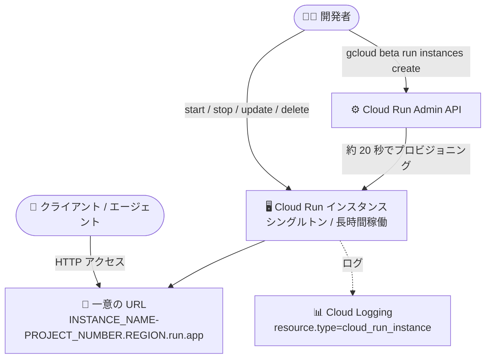

# Cloud Run: Cloud Run インスタンス (Preview)

**リリース日**: 2026-08-25

**サービス**: Cloud Run

**機能**: Cloud Run インスタンス (長時間稼働・個別アドレス可能なシングルトンワークロード)

**ステータス**: Preview

📊 [このアップデートのインフォグラフィックを見る](https://takech9203.github.io/google-cloud-news-summary/20260825-cloud-run-instances-preview.html)

## 概要

Cloud Run に第 4 のリソースタイプとなる「Cloud Run インスタンス (Instances)」が Preview として登場しました。Cloud Run インスタンスは、リクエスト駆動の水平スケーリングではなく、安定的・継続的で個別にアドレス可能なシングルトンランタイムを必要とするワークロード向けに設計されています。これまでの Cloud Run は「サービス (Services)」「ジョブ (Jobs)」「ワーカープール (Worker Pools)」の 3 つのリソースタイプを提供してきましたが、インスタンスの追加により、長時間稼働する AI エージェントや VPS ライクな常時稼働コンピュートといった新しいユースケースに対応します。

Cloud Run インスタンスは以下の特性を持ちます。

- **個別管理可能**: インスタンスごとに作成・更新・削除・起動・停止が可能で、実行状況を個別にモニタリングできる
- **個別アドレス可能**: 各インスタンスに一意の URL (`https://INSTANCE_NAME-PROJECT_NUMBER.REGION.run.app`) が割り当てられる
- **長時間稼働**: 数時間〜数日間、中断なく実行可能。定期的なインフラ更新 (1〜2 週間ごと) 後に自動再起動するよう構成すれば、さらに長期間の稼働も可能
- **高速な作成**: 約 20 秒以内でプロビジョニングされ実行状態になる

同日リリースの gcloud CLI 582.0.0 では、`gcloud run instances` コマンド群が beta トラックに昇格しており、`gcloud beta run instances create / deploy / start / stop / update / delete / list / describe / proxy` などのコマンドでインスタンスのライフサイクル全体を管理できます。

**アップデート前の課題**

- Cloud Run サービスはリクエスト駆動の自動スケーリングを前提としており、単一インスタンスで長時間安定稼働し続けるシングルトンワークロードの実行には適していなかった
- Cloud Run ジョブは最長 7 日間の「完了まで実行」モデルであり、無期限に稼働し続けるワークロードには対応していなかった
- ワーカープールはパブリックエンドポイントを持たないため、個々のインスタンスに外部から直接アクセスするユースケース (エージェントへの個別アクセスなど) には利用できなかった

**アップデート後の改善**

- 自動スケーリングを行わないシングルトンの実行環境を、サーバーレスの俊敏さ (約 20 秒での起動) を保ったまま利用できるようになった
- 各インスタンスに一意の URL が付与され、個別のインスタンスに対して直接 HTTP アクセスできるようになった
- create / start / stop / update / delete といった VM ライクなライフサイクル操作を、gcloud CLI (beta)・クライアントライブラリ・REST API から実行できるようになった

## アーキテクチャ図



開発者が gcloud CLI や REST API でインスタンスを作成すると、一意の URL を持つシングルトンコンテナが約 20 秒でプロビジョニングされ、ライフサイクル操作 (起動・停止・更新・削除) を個別に管理できます。

## サービスアップデートの詳細

### 主要機能

1. **シングルトンランタイム**
   - サービスと異なり、1 つのインスタンスリソースは常に 1 個のコンテナインスタンスのみ
   - 自動スケーリングは行われず、個別に管理する
   - サービスや既存インスタンスと同名のインスタンスは作成できない (プロジェクト・リージョン内で一意)

2. **個別アドレッシング**
   - 作成時に `https://INSTANCE_NAME-PROJECT_NUMBER.REGION.run.app` 形式の一意の URL が割り当てられる
   - パブリック / 内部の HTTP アクセスに対応し、IAM Invoker 認証の有効・無効を選択可能 (`--no-invoker-iam-check` で無効化)

3. **ライフサイクル管理**
   - `create` / `deploy` / `update` / `start` / `stop` / `restart` / `delete` / `list` / `describe` / `proxy` などの操作を gcloud CLI (beta)、クライアントライブラリ (Go / Java / Node.js / Python / Ruby / PHP / .NET)、REST API から実行可能
   - 更新 (イメージ、ポート、環境変数の変更など) を行うとインスタンスは再起動される

4. **長時間稼働**
   - 数時間〜数日間の連続稼働が可能
   - 定期的なインフラ更新 (1〜2 週間ごと) 後に自動再起動する構成にすれば、実質的に無期限の稼働が可能

## 技術仕様

### Cloud Run リソースタイプの比較

| 項目 | サービス | ジョブ | ワーカープール | インスタンス (新登場) |
|------|---------|--------|---------------|----------------------|
| 主なユースケース | リクエスト駆動 (Web サイト、API、マイクロサービス) | タスク駆動 (スクリプト、データ処理、移行) | イベント / Pull 駆動 (Kafka / Pub/Sub コンシューマー) | マネージドシングルトン (エージェントワークロードなど) |
| トリガー | HTTP/gRPC リクエスト、Eventarc | 手動実行、Scheduler、Workflows | 常時稼働または Pull ベースの自動スケーリング | なし |
| スケーリング | 自動 / 手動 (ゼロスケール対応) | N 個の独立タスクへ自動スケール | 手動または独自オートスケーラー | なし (自動スケーリングなし、個別管理) |
| ライフサイクル | エフェメラル (アイドル時に縮退) | 完了まで実行 (最長 7 日) | 常時稼働またはエフェメラル | 長時間稼働 (数日〜数週間、自動再起動で無期限も可) |
| アドレッシング | 安定したサービス URL (ロードバランス) | パブリックエンドポイントなし | パブリックエンドポイントなし (Direct VPC の IP ベース) | インスタンスごとの個別 URL |
| 課金 | リクエストベースまたはインスタンスベース | 実行時間ごと | インスタンス稼働時間ごと | インスタンス稼働時間ごと |

### 必要な IAM ロール

| ロール | 対象 |
|--------|------|
| Cloud Run Developer (`roles/run.developer`) | Cloud Run インスタンス |
| Service Account User (`roles/iam.serviceAccountUser`) | サービス アイデンティティ |

## 設定方法

### 前提条件

1. Cloud Run 用のプロジェクトをセットアップ済みであること
2. Cloud Run Admin API を有効化していること (`gcloud services enable run.googleapis.com`)
3. gcloud CLI を最新版に更新し、beta コンポーネントをインストールしていること (`gcloud components update`、`gcloud components install beta`)

### 手順

#### ステップ 1: インスタンスの作成

```bash
gcloud beta run instances create my-instance \
  --image us-docker.pkg.dev/cloudrun/container/hello \
  --region REGION \
  --port 8080 \
  --no-invoker-iam-check
```

作成が完了すると、`https://my-instance-PROJECT_NUMBER.REGION.run.app` 形式の URL が表示されます。`--no-invoker-iam-check` フラグを付けると IAM Invoker 認証なしでアクセスできます。

#### ステップ 2: ライフサイクル操作

```bash
# 停止 (メモリ上のファイル・状態は失われる)
gcloud beta run instances stop my-instance --region REGION

# 起動 / 再起動
gcloud beta run instances start my-instance --region REGION

# 更新 (イメージ差し替え。インスタンスは再起動される)
gcloud beta run instances update my-instance --image NEW_IMAGE_URL --region REGION

# 一覧 / 詳細確認
gcloud beta run instances list --region REGION
gcloud beta run instances describe my-instance --region REGION

# 削除 (復元不可)
gcloud beta run instances delete my-instance --region REGION
```

#### ステップ 3: ログの確認

Cloud Logging の Logs Explorer で以下のフィルタを使用します。

```
resource.type="cloud_run_instance"
resource.labels.location="REGION"
resource.labels.instance_name="my-instance"
```

## メリット

### ビジネス面

- **AI エージェント基盤の簡素化**: マルチステップの実行計画を進める長時間稼働のバックグラウンドエージェントや、非同期コーディングアシスタントを、インフラ管理なしで運用できる
- **低コストな常時稼働環境**: 高可用性や Web スケールのトラフィック処理が不要なワークロードで、コストとシングルトンの持続性を優先した VPS ライクな軽量サーバーを実現できる

### 技術面

- **高速なプロビジョニング**: 約 20 秒以内で起動するため、VM に比べ環境の払い出しが速い
- **VM ライクなライフサイクル管理とサーバーレスの融合**: start / stop / update / delete の個別操作と、Cloud Run のマネージドな実行環境を両立
- **API ファースト**: gcloud、7 言語のクライアントライブラリ、REST API のすべてからライフサイクルを制御可能

## デメリット・制約事項

### 制限事項

- Preview 段階の機能であり、Pre-GA Offerings Terms が適用される (サポートが限定される場合がある)
- 永続ディスクストレージを持たない。更新・停止時にはメモリ上のファイルと未永続化の状態がすべて失われるため、保持が必要なデータは外部ストレージへ保存する必要がある
- 自動スケーリングは行われない (シングルトンのため高可用性が必要なワークロードには不向き)
- 1〜2 週間ごとの定期的なインフラ更新があり、それを超えて稼働し続けるには自動再起動の構成が必要
- インスタンス名はプロジェクト・リージョン内で一意であり、既存のサービスと同名にはできない
- gcloud コマンドは beta トラック (`gcloud beta run instances`) での提供

### 考慮すべき点

- 削除したインスタンスは構成・メタデータ・URL マッピングごと完全に削除され、復元できない
- ドメイン制限の組織ポリシーで未認証呼び出しが制限されている場合は、プライベートサービスとしてのアクセス方法が必要

## ユースケース

### ユースケース 1: 長時間稼働の AI エージェント / AI ワークフローエンジン

**シナリオ**: マルチステップの実行計画を遂行するバックグラウンドエージェントや、非同期コーディングアシスタント、シングルインスタンス環境を必要とするステートフルなワークフローを運用したい。

**実装例**:
```bash
gcloud beta run instances create my-agent \
  --image REGION-docker.pkg.dev/PROJECT_ID/repo/agent:latest \
  --region REGION
```

**効果**: エージェントごとに一意の URL を持つ専用ランタイムが約 20 秒で立ち上がり、数日単位のタスクを中断なく実行できる。

### ユースケース 2: 長時間稼働のサーバーレスコンピュート (VPS ライク)

**シナリオ**: 自動スケーリングや Web スケールのトラフィック処理を必要としない、常時稼働の軽量サーバーを低コストで運用したい。

**効果**: VM の管理負担なしに、VPS に近い常時稼働環境を Cloud Run 上で実現できる。

### ユースケース 3: 開発環境・デバッグループ

**シナリオ**: コンテナプロセスをリモートでデバッグし、コード変更を同期し、クラッシュをトラブルシューティングする専用環境が欲しい。

**効果**: 自動的なコンテナ終了に悩まされることなく、専用のデバッグ環境を維持できる。`gcloud beta run instances proxy` でローカルへのプロキシ接続も可能。

## 料金

公式ドキュメントのリソース比較では、インスタンスの課金は「インスタンス稼働時間ごと (Per-instance duration)」とされています。詳細な単価は Cloud Run の料金ページを参照してください。

- [Cloud Run 料金ページ](https://cloud.google.com/run/pricing)
- [料金計算ツール](https://cloud.google.com/products/calculator)

## 関連サービス・機能

- **Cloud Run サービス / ジョブ / ワーカープール**: 同じ実行環境上で動作する既存の 3 リソースタイプ。リクエスト駆動はサービス、完了型タスクはジョブ、Pull 型バックグラウンド処理はワーカープール、シングルトン長時間稼働はインスタンス、と使い分ける
- **Cloud Logging**: `resource.type="cloud_run_instance"` でインスタンスのログを確認可能
- **Cloud Run サンドボックス**: AI エージェントが生成した信頼できないコードの実行環境 (2026 年 7〜8 月に Preview 提供)。エージェントワークロード向け機能として併用が想定される
- **Artifact Registry**: インスタンスにデプロイするコンテナイメージの格納先

## 参考リンク

- 📊 [インフォグラフィック](https://takech9203.github.io/google-cloud-news-summary/20260825-cloud-run-instances-preview.html)
- [公式リリースノート](https://docs.cloud.google.com/release-notes#August_25_2026)
- [Cloud Run とは (Cloud Run インスタンスの概要)](https://docs.cloud.google.com/run/docs/overview/what-is-cloud-run#cloud-run-instances)
- [クイックスタート: Cloud Run インスタンスの作成](https://docs.cloud.google.com/run/docs/quickstarts/instances/create-instance)
- [インスタンスの作成と管理](https://docs.cloud.google.com/run/docs/instances/create-and-manage-instances)
- [Cloud Run リソースモデル](https://docs.cloud.google.com/run/docs/resource-model)
- [料金ページ](https://cloud.google.com/run/pricing)

## まとめ

Cloud Run インスタンスは、サービス・ジョブ・ワーカープールに続く第 4 のリソースタイプとして、長時間稼働かつ個別アドレス可能なシングルトンワークロードをサーバーレスで実行可能にする重要なアップデートです。特に長時間稼働する AI エージェントや VPS ライクな常時稼働環境のニーズに直接応えるもので、エージェント基盤を検討しているチームはクイックスタートでの検証をおすすめします。Preview 段階のため、永続ストレージがない点や 1〜2 週間ごとのインフラ更新への対応 (自動再起動構成) には留意してください。

---

**タグ**: #CloudRun #Serverless #Preview #Instances #AIAgents #Singleton #gcloud
