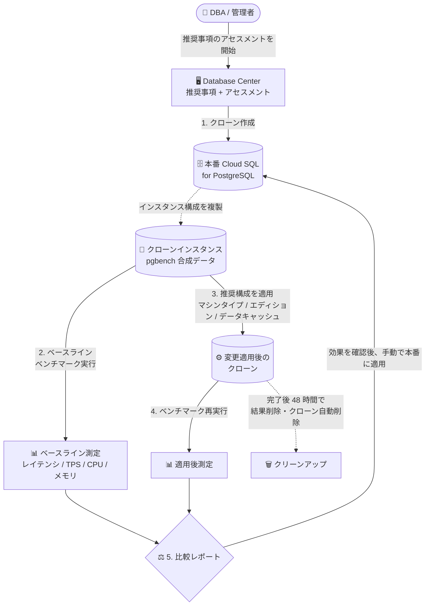

# Cloud SQL for PostgreSQL: Database Center のアセスメント機能 (Preview)

**リリース日**: 2026-08-25

**サービス**: Cloud SQL for PostgreSQL

**機能**: Database Center のアセスメント (Assessments) 機能

**ステータス**: Preview

📊 [このアップデートのインフォグラフィックを見る](https://takech9203.github.io/google-cloud-news-summary/20260825-cloud-sql-postgresql-database-center-assessments.html)

## 概要

Database Center に、データベースに対する推奨事項 (Recommendations) を本番環境へ適用する前に、そのパフォーマンス影響を事前に評価・テストできる **アセスメント (Assessments)** 機能が Preview として追加されました。対象は Cloud SQL for PostgreSQL インスタンスです。

アセスメントのワークフローは、(1) 対象のデータベースインスタンスをクローンし、(2) クローン上でベンチマークシミュレーションテストを実行し、(3) 推奨された構成変更の適用前 (ベースライン) と適用後のパフォーマンスを比較する、という 3 ステップで構成されます。クローンには実データではなく pgbench による合成データ (pgbench テーブル) が使用され、DML ステートメントでトラフィックをシミュレートするため、本番データやワークロードに影響を与えることなく検証が行えます。

マシンタイプの変更、Enterprise Plus エディションへのアップグレード、データキャッシュの有効化といった推奨事項を「適用して本当に効果があるのか」をデータに基づいて判断したい DBA や SRE、コスト最適化の意思決定を行うインフラ管理者に有用なアップデートです。

**アップデート前の課題**

- 推奨事項 (マシンタイプ変更、エディションアップグレード、データキャッシュ有効化など) の効果を確認するには、本番インスタンスに直接適用するか、手動でクローンを作成して独自にベンチマーク環境を構築する必要があった
- 推奨事項を適用した場合のレイテンシやスループットへの影響を、適用前に定量的に把握する標準的な手段がなかった
- 手動での検証はクローン作成、ベンチマーク実行、メトリクス比較、リソース削除まで一連の作業をすべて自分で行う必要があり、運用負荷が高かった

**アップデート後の改善**

- Database Center 上から推奨事項に対するアセスメントを実行するだけで、クローン作成からベンチマーク、適用前後のパフォーマンス比較までが自動化された
- 平均レイテンシ、トランザクション数のスコアカードと、CPU 使用率・メモリ使用量のチャートにより、推奨事項の効果を定量的に確認してから本番適用を判断できるようになった
- ワークフロー完了時にクローンが自動削除されるため、検証環境の後片付けが不要になった (正常完了時)

## アーキテクチャ図



アセスメントは本番インスタンスのクローンを作成し、pgbench ベースのベンチマークを推奨構成の適用前後で実行して比較レポートを生成します。効果を確認した後の本番への適用はユーザー自身が手動で行います。

## サービスアップデートの詳細

### 主要機能

1. **推奨事項の事前アセスメント (Preview)**
   - Database Center に表示される推奨事項について、本番適用前にパフォーマンス影響をテストできる
   - アセスメントを開始すると、ステップバイステップのテストプラン (クローン → ベンチマーク → 変更適用 → 再ベンチマーク → 比較) が自動生成・実行される

2. **対象となる推奨事項タイプ**
   - **マシンタイプ**: ワークロードに合わせたスケールアップの効果測定
   - **エディションタイプ**: Enterprise から Enterprise Plus エディションへのアップグレードの効果測定
   - **データキャッシュ**: Enterprise Plus インスタンスでのデータキャッシュ有効化による読み取り高速化の効果測定

3. **pgbench ベースのベンチマークシミュレーション**
   - クローンには実データではなく pgbench の合成テーブルを使用し、DML ステートメントでトラフィックをシミュレート
   - ベンチマークパラメータの例: クライアント接続数 10、クライアントあたり 1,000 トランザクション、シンプルクエリモード

4. **適用前後のパフォーマンス比較レポート**
   - スコアカード / 表形式: 平均レイテンシ、トランザクション数
   - チャート: CPU 使用率、メモリ使用量
   - 結果に納得できた場合、本番インスタンスへの変更適用はユーザーが手動で実施する

## 技術仕様

### アセスメントワークフローの仕様

| 項目 | 詳細 |
|------|------|
| 対象サービス | Cloud SQL for PostgreSQL のみ (MySQL、SQL Server は対象外) |
| 実行場所 | Database Center |
| テストデータ | pgbench による合成データ (実データは使用しない) |
| 対象の推奨事項 | マシンタイプ変更、Enterprise Plus へのエディションアップグレード、データキャッシュ有効化 |
| 測定メトリクス | 平均レイテンシ、トランザクション数、CPU 使用率、メモリ使用量 |
| 構成変更の所要時間 | クローンへの構成変更 (パッチ操作) は 45 分以上かかる場合がある |
| 結果の保持期間 | アセスメントプランと結果は 48 時間後に削除 |
| クローンの削除 | ワークフロー正常完了時は自動削除。キャンセル・中断時は手動削除が必要 |
| ステータス | Preview (Pre-GA Offerings Terms が適用) |

## 設定方法

### 前提条件

1. Cloud SQL for PostgreSQL インスタンスが稼働しており、Database Center で対象インスタンスの推奨事項 (マシンタイプ / エディション / データキャッシュ) が表示されていること
2. クローンインスタンスの作成に伴う一時的なリソース費用を許容できること

### 手順

#### ステップ 1: Database Center で推奨事項を確認する

Google Cloud コンソールで Database Center を開き、フリート全体の健全性の問題と推奨事項を確認します。アセスメント対象となる推奨事項 (マシンタイプ変更、Enterprise Plus アップグレード、データキャッシュ有効化) を選択します。

#### ステップ 2: アセスメントを作成・実行する

推奨事項に対してアセスメントを作成すると、テストプランが生成され、クローン作成 → ベースラインベンチマーク → 推奨構成の適用 → 再ベンチマーク → 比較が自動で実行されます。クローンへの構成変更には 45 分以上かかる場合があります。

#### ステップ 3: 結果を確認し、本番適用を判断する

平均レイテンシ・トランザクション数のスコアカードと CPU / メモリのチャートで適用前後を比較します。効果が確認できたら、本番インスタンスへの変更はユーザー自身が手動で適用します。結果は 48 時間後に削除されるため、必要に応じて記録を残してください。

## メリット

### ビジネス面

- **変更リスクの低減**: 本番データベースに影響を与えることなく構成変更の効果を検証できるため、適用の意思決定に伴うリスクが下がる
- **コスト最適化の裏付け**: マシンタイプ変更や Enterprise Plus アップグレードといった費用が増える変更について、性能向上の根拠を得てから投資判断ができる

### 技術面

- **検証作業の自動化**: クローン作成、ベンチマーク実行、メトリクス比較、完了後のクリーンアップまでが自動化され、手動での検証環境構築が不要になる
- **定量的な比較**: レイテンシ、トランザクション数、CPU、メモリという共通のメトリクスで適用前後を客観的に比較できる
- **本番データ非依存**: pgbench の合成データを使用するため、本番データのコピーに伴うセキュリティ・プライバシー上の懸念を回避しやすい

## デメリット・制約事項

### 制限事項

- Preview 段階の機能であり、Pre-GA Offerings Terms が適用される (サポートが限定される場合がある)
- 対象は Cloud SQL for PostgreSQL のみ。Cloud SQL for MySQL / SQL Server では利用できない
- アセスメントプランと結果は 48 時間で削除される
- アセスメントがキャンセル・中断・失敗した場合、クローンは自動削除されず手動での削除が必要

### 考慮すべき点

- ベンチマークは pgbench の合成データ・シミュレートされたトラフィックに基づくため、実際のアプリケーションワークロードとは特性が異なる可能性がある。結果はあくまで参考指標として扱う
- クローンインスタンスは削除されるまで課金が発生する。特にキャンセル・中断時は手動削除を忘れると費用が発生し続ける
- クローンへの構成変更には 45 分以上かかる場合があり、アセスメント全体の完了までに時間を要する
- 比較結果を確認した後の本番への適用は自動化されておらず、ユーザーの手動操作が必要

## ユースケース

### ユースケース 1: Enterprise Plus アップグレードの費用対効果の事前検証

**シナリオ**: Database Center で本番の Cloud SQL for PostgreSQL インスタンスに「Enterprise Plus エディションへアップグレードしてデータキャッシュを有効化する」推奨が表示されている。エディションアップグレードはコスト増を伴うため、読み取り性能がどの程度向上するか根拠が欲しい。

**実装例**:
```text
1. Database Center で対象インスタンスの推奨事項を選択
2. アセスメントを作成 (クローン作成 → ベースライン測定 → Enterprise Plus + データキャッシュ適用 → 再測定)
3. 平均レイテンシとトランザクション数の改善幅、CPU / メモリの変化を比較レポートで確認
4. 効果が費用増に見合うと判断できたら、本番インスタンスを手動でアップグレード
```

**効果**: コスト増を伴うアップグレードの判断を、推測ではなくベンチマーク結果に基づいて行える。

### ユースケース 2: マシンタイプのスケールアップ判断

**シナリオ**: ピーク時に CPU 使用率が高止まりしているインスタンスに対して、マシンタイプのスケールアップが推奨されている。スケールアップでレイテンシがどの程度改善するかを本番に触れずに確認したい。

**効果**: 本番ワークロードへの影響ゼロでスケールアップ後の性能特性 (レイテンシ、TPS、CPU / メモリ使用率) を把握し、適切なマシンタイプ選定とメンテナンス計画につなげられる。

## 料金

アセスメント機能自体の個別料金は公式ドキュメントに明記されていませんが、以下の点に注意が必要です。

- アセスメントが作成するクローンインスタンスは、削除されるまで通常の Cloud SQL 料金で課金される
- ワークフローが正常完了すればクローンは自動削除されるが、キャンセル・中断・失敗時は手動で削除しない限り課金が継続する

詳細は [Cloud SQL の料金ページ](https://cloud.google.com/sql/pricing) を参照してください。

## 利用可能リージョン

公式ドキュメントにリージョンごとの提供状況の記載はありません。最新情報は [Assessments in Database Center のドキュメント](https://docs.cloud.google.com/sql/docs/postgres/assessments-overview) を参照してください。

## 関連サービス・機能

- **Database Center**: データベースフリート全体の健全性を一元的に可視化する AI 支援ダッシュボード。今回のアセスメント機能はこの Database Center 上で提供され、可用性・データ保護・セキュリティ・コンプライアンスの問題検出や Gemini チャットによる推奨事項の提示と組み合わせて利用する
- **Active Assist / Recommender**: マシンタイプ変更、Enterprise Plus アップグレード、データキャッシュ有効化などの推奨事項を生成する仕組み。アセスメントはこれらの推奨事項の効果を事前検証する位置づけ
- **Cloud SQL Enterprise Plus エディション / データキャッシュ**: アセスメントで効果測定できる代表的なアップグレード対象。データキャッシュにより読み取り性能の向上と near-zero downtime メンテナンスが期待できる
- **Query Insights**: クエリ単位の性能分析ツール。アセスメントがインスタンス構成の変更効果を測るのに対し、Query Insights は個別クエリのチューニングに用いる補完的な機能

## 参考リンク

- 📊 [インフォグラフィック](https://takech9203.github.io/google-cloud-news-summary/20260825-cloud-sql-postgresql-database-center-assessments.html)
- [公式リリースノート](https://docs.cloud.google.com/release-notes#August_25_2026)
- [Assessments in Database Center (ドキュメント)](https://docs.cloud.google.com/sql/docs/postgres/assessments-overview)
- [Database Center の概要](https://docs.cloud.google.com/database-center/docs/overview)
- [Cloud SQL 料金ページ](https://cloud.google.com/sql/pricing)

## まとめ

Database Center のアセスメント機能により、Cloud SQL for PostgreSQL の推奨事項を本番適用する前に、クローン上でのベンチマークによって効果を定量的に検証できるようになりました。マシンタイプ変更や Enterprise Plus アップグレードなどコストに関わる判断の裏付けとして有効です。Preview 段階のため、まずは非クリティカルなインスタンスで試し、キャンセル時のクローン手動削除や 48 時間の結果保持期限といった運用上の注意点を押さえた上で活用を検討してください。

---

**タグ**: `Cloud SQL` `PostgreSQL` `Database Center` `Assessments` `Preview` `パフォーマンス` `ベンチマーク` `Active Assist` `データベース運用`
