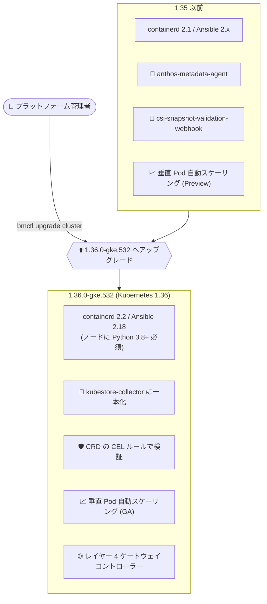

# Google Distributed Cloud (software only) for bare metal: 1.36.0-gke.532 リリース

**リリース日**: 2026-08-25

**サービス**: Google Distributed Cloud (software only) for bare metal

**機能**: バージョン 1.36.0-gke.532 リリース (Kubernetes 1.36 / containerd 2.2 / 垂直 Pod 自動スケーリング GA など)

**ステータス**: Announcement / Feature / Fixed

📊 [このアップデートのインフォグラフィックを見る](https://takech9203.github.io/google-cloud-news-summary/20260825-gdc-bare-metal-1-36-0.html)

## 概要

Google Distributed Cloud (software only) for bare metal のバージョン 1.36.0-gke.532 がダウンロード可能になりました。本リリースは Kubernetes v1.36.0-gke.2800 上で動作します。リリース後、GKE On-Prem API クライアント (Google Cloud コンソール、gcloud CLI、Terraform) からインストール・アップグレードで利用可能になるまで約 7〜14 日かかります。

本リリースでは、Kubernetes 1.36 へのアップデートに加え、Ansible 2.18 へのアップグレード、containerd 2.1 から 2.2 へのアップグレード、レイヤー 4 ゲートウェイコントローラーのサポート追加、垂直 Pod 自動スケーリング (Vertical Pod Autoscaling) の GA 化など、ランタイムとクラスタライフサイクル管理の両面で重要な更新が含まれています。また、非推奨コンポーネント (anthos-metadata-agent、csi-snapshot-validation-webhook) の削除、レジストリミラー/プライベートレジストリの更新動作のクラスタタイプ間での統一も行われました。

修正面では、脆弱性修正に加えて、名前空間をまたいで同名の CA 証明書 Secret が存在する場合にクラスタアップグレードが停止する問題や、自己管理クラスタ (admin / hybrid / standalone) の CA ローテーション失敗、ノードプールのロールバック失敗など、運用上重要な多数の不具合が修正されています。オンプレミスのベアメタル環境で Kubernetes クラスタを運用するプラットフォーム管理者は、前提条件 (Python バージョン、/tmp の空き容量など) を確認のうえアップグレードを計画してください。

**アップデート前の課題**

- 垂直 Pod 自動スケーリングは Preview 段階であり、本番利用には制約があった
- CA 証明書 Secret が異なる名前空間で同一名を持つ場合、クラスタアップグレードが停止することがあった
- 自己管理クラスタ (admin / hybrid / standalone) の CA ローテーションが最終フェーズで失敗し、クラスタが管理不能な状態になることがあった
- レジストリミラー / プライベートレジストリの更新動作がクラスタタイプによって異なっていた
- 非推奨の anthos-metadata-agent や csi-snapshot-validation-webhook といったレガシーコンポーネントが残存していた
- Bundled Ingress 使用時に Ingress リソースのステータスが更新されない問題や、古い CAPI ブートストラップ Secret に起因するノードプールロールバック失敗などの不具合があった

**アップデート後の改善**

- 垂直 Pod 自動スケーリングが GA となり、コンテナの CPU / メモリのリソース要求・上限の自動調整を本番環境で利用可能になった
- CA 証明書 Secret 名に転送先の名前空間プレフィックスが自動付与されるようになり、名前重複によるアップグレード停止が解消された
- レイヤー 4 ゲートウェイコントローラーのサポートが追加された
- containerd 2.2 と Kubernetes 1.36 により、ランタイムが最新化された (containerd は新規クラスタインストールと Node Agent モードへの移行で必須)
- CSI スナップショットのバリデーションが Webhook から CRD 内の CEL (Common Expression Language) ルールによるネイティブ検証に移行し、コンポーネントが削減された
- レジストリミラー / プライベートレジストリの更新動作が全クラスタタイプで統一され、既存構成は維持される

## アーキテクチャ図



1.36.0-gke.532 へのアップグレードによるコンポーネント構成の変化を示しています。ランタイム (containerd / Ansible) の更新、非推奨コンポーネントの削除と後継機能への移行、垂直 Pod 自動スケーリングの GA 化、レイヤー 4 ゲートウェイコントローラーの追加が主な変更点です。

## サービスアップデートの詳細

### 主要機能

1. **Kubernetes 1.36 / containerd 2.2 へのアップデート**
   - クラスタは Kubernetes v1.36.0-gke.2800 上で動作
   - containerd を 2.1 から 2.2 にアップグレード
   - containerd は新規クラスタインストールおよび Node Agent モードへのクラスタ移行で必須

2. **Ansible 2.18 へのアップグレード**
   - ターゲットノードに Python 3.8 以上が必要
   - RHEL 8 はデフォルトが Python 3.6 のため、RHEL 8.10 を使用するノードには Python 3.9 のインストールが必要
   - RHEL 8.8 はサポート対象外になった

3. **レイヤー 4 ゲートウェイコントローラーのサポート追加**
   - レイヤー 4 ゲートウェイコントローラーがサポート対象に追加された

4. **垂直 Pod 自動スケーリング (Vertical Pod Autoscaling) の GA**
   - コンテナの CPU / メモリのリソース要求・上限を、過去および現在の使用状況の分析に基づいて推奨・自動適用する機能が一般提供 (GA) になった
   - リソース割り当ての適正化により、安定性とコスト効率が向上する

5. **非推奨コンポーネントの削除**
   - `anthos-metadata-agent` を削除 (後継は `kubestore-collector`)
   - `csi-snapshot-validation-webhook` を削除 (アップストリーム Kubernetes の検証は、デプロイされた CRD 内の CEL ルールでネイティブに処理される)

6. **レジストリミラー / プライベートレジストリの更新動作の統一**
   - 全クラスタタイプで更新動作を統一し、既存の構成は維持される

7. **Node Agent モードでの bmctl backup cluster の要件**
   - 管理ワークステーションと全ターゲットノードの `/tmp` に、バックアップアーカイブのバッファ用として 12 GB 以上の空き容量が必要
   - `TMPDIR` 環境変数でカスタム一時ディレクトリを設定可能

### 主な修正 (Fixed)

- 脆弱性修正 (詳細は Vulnerability fixes を参照)
- 異なる名前空間に同一名の CA 証明書 Secret が存在する場合にクラスタアップグレードが停止する問題を修正 (転送時に対象名前空間のプレフィックスを Secret 名に自動付与し、一意性を担保)
- 自己管理クラスタ (admin / hybrid / standalone) で CA ローテーションが最終フェーズで失敗し、クラスタが管理不能になる問題を修正 (CA ローテーション前にクラスタをバージョン 1.33.1000-gke.59 以上にアップグレードする必要あり)
- Bundled Ingress 使用時に Ingress リソースのステータスが更新されない問題を修正
- 古い CAPI ブートストラップ Secret が非推奨の kubelet フラグを保持していることに起因するノードプールのロールバック失敗を修正
- cluster-proportional-autoscaler をセキュリティ脆弱性対応のため更新
- learner 昇格失敗後のデータディレクトリの不完全なクリーンアップにより、etcd-events のインストールが無限リトライループに入る問題を修正
- NodePool コントローラーが部分的な調整失敗時に Status.ManagedFields を早期更新し、削除済みの taint やラベルがノードに残留する問題を修正
- 過去に使用したクラスタ名でユーザークラスタを再作成すると、k8s-health-check サービスアカウントの欠如により PROVISIONING 状態で無期限に停止する問題を修正
- etcd 暗号化更新中の kube-apiserver 再起動でコンテナが強制終了され、古いサービスエンドポイントや一時的な接続障害が発生する問題を修正
- 証明書ローテーションや etcd 暗号化更新の際、kube-apiserver コンテナ終了チェックの誤りによりコントロールプレーンノードごとに 3 分間インストーラーが停止する問題を修正

## 技術仕様

### バージョン情報

| 項目 | 詳細 |
|------|------|
| リリースバージョン | 1.36.0-gke.532 |
| Kubernetes バージョン | v1.36.0-gke.2800 |
| containerd | 2.2 (2.1 からアップグレード) |
| Ansible | 2.18 (ターゲットノードに Python 3.8+ が必要) |
| RHEL 8.10 | Python 3.9 のインストールが必要 |
| RHEL 8.8 | サポート終了 |
| GKE On-Prem API クライアントでの利用 | リリース後、約 7〜14 日で利用可能 |
| bmctl backup cluster (Node Agent モード) | `/tmp` に 12 GB 以上の空き容量が必要 (`TMPDIR` で変更可能) |

### 垂直 Pod 自動スケーリングの設定例

クラスタ仕様で `verticalPodAutoscaling` を有効化し、ワークロードごとに `VerticalPodAutoscaler` カスタムリソースを定義します。

```yaml
apiVersion: "autoscaling.k8s.io/v1"
kind: VerticalPodAutoscaler
metadata:
  name: hamster-vpa
spec:
  targetRef:
    apiVersion: "apps/v1"
    kind: Deployment
    name: hamster
  resourcePolicy:
    containerPolicies:
      - containerName: '*'
        minAllowed:
          cpu: 100m
          memory: 50Mi
        maxAllowed:
          cpu: 1
          memory: 500Mi
        controlledResources: ["cpu", "memory"]
```

## 設定方法

### 前提条件

1. アップグレードは admin クラスタから行い、その後に関連するユーザークラスタをアップグレードする
2. ターゲットノードに Python 3.8 以上がインストールされていること (RHEL 8.10 の場合は Python 3.9)
3. Node Agent モードで `bmctl backup cluster` を使う場合、管理ワークステーションと全ターゲットノードの `/tmp` に 12 GB 以上の空き容量があること
4. CA ローテーションを行う場合は、事前にクラスタをバージョン 1.33.1000-gke.59 以上にアップグレードしておくこと
5. サードパーティのストレージベンダーを使用している場合は、認定済みストレージパートナーの一覧を確認すること

### 手順

#### ステップ 1: 新しい bmctl のダウンロードと認証設定

```bash
# Application Default Credentials (ADC) の設定
gcloud auth application-default login
```

最新の bmctl を [Google Distributed Cloud downloads](https://docs.cloud.google.com/kubernetes-engine/distributed-cloud/bare-metal/docs/downloads) の手順でダウンロードします。

#### ステップ 2: クラスタ構成ファイルの更新

```yaml
apiVersion: baremetal.cluster.gke.io/v1
kind: Cluster
metadata:
  name: cluster1
  namespace: cluster-cluster1
spec:
  type: admin
  # アップグレード先のバージョン (ダウンロードした bmctl のバージョンと一致させる)
  anthosBareMetalVersion: 1.36.0-gke.532
```

`anthosBareMetalVersion` をアップグレード先のバージョンに更新します。

#### ステップ 3: アップグレードの実行

```bash
bmctl upgrade cluster -c CLUSTER_NAME --kubeconfig ADMIN_KUBECONFIG
```

アップグレード操作はプリフライトチェックでクラスタの状態とノードの健全性を検証し、全コンポーネントのアップグレード後にヘルスチェックが実施されます。

## メリット

### ビジネス面

- **運用リスクの低減**: CA ローテーション失敗やアップグレード停止など、クラスタが管理不能・停止状態に陥る不具合が多数修正され、オンプレミス運用の信頼性が向上
- **コスト効率の向上**: 垂直 Pod 自動スケーリングの GA により、リソース割り当ての適正化 (right-sizing) を本番環境で活用でき、ハードウェアリソースの有効活用につながる

### 技術面

- **ランタイムの最新化**: Kubernetes 1.36 と containerd 2.2 により、アップストリームの最新機能・修正を利用可能
- **コンポーネントの簡素化**: csi-snapshot-validation-webhook を CRD 内の CEL ルールに置き換えることで、運用対象コンポーネントが削減される
- **一貫した挙動**: レジストリミラー / プライベートレジストリの更新動作が全クラスタタイプで統一され、構成管理が単純化される

## デメリット・制約事項

### 制限事項

- GKE On-Prem API クライアント (Google Cloud コンソール、gcloud CLI、Terraform) での利用開始まで約 7〜14 日を要する
- RHEL 8.8 はサポート対象外になった
- RHEL 8.10 のノードには Python 3.9 のインストールが必要 (Ansible 2.18 の要件。RHEL 8 のデフォルトは Python 3.6)
- containerd は新規クラスタインストールおよび Node Agent モードへの移行で必須

### 考慮すべき点

- Node Agent モードで `bmctl backup cluster` を実行する場合、管理ノードと全ターゲットノードの `/tmp` に 12 GB 以上の空き容量が必要 (不足時は `TMPDIR` でカスタム一時ディレクトリを設定)
- `anthos-metadata-agent` に依存する構成がある場合は `kubestore-collector` への移行を確認する
- CA ローテーションを予定している場合は、先にクラスタを 1.33.1000-gke.59 以上へアップグレードする必要がある
- サードパーティストレージを使用している場合は、認定済みストレージパートナーの一覧を確認する

## 関連サービス・機能

- **GKE On-Prem API (Google Cloud コンソール / gcloud CLI / Terraform)**: クラスタのインストール・アップグレードに使用するクライアント。本バージョンは約 7〜14 日後に利用可能
- **GKE Enterprise / フリート管理**: GDC (software only) for bare metal クラスタは Connect 経由で Google Cloud に登録され、フリートとして管理できる
- **Artifact Registry / レジストリミラー**: クラスタコンポーネントの取得元。本リリースでレジストリミラー / プライベートレジストリの更新動作が全クラスタタイプで統一された
- **Kubernetes Vertical Pod Autoscaler**: 本リリースで GA となった垂直 Pod 自動スケーリングの基盤となる仕組み

## 参考リンク

- 📊 [インフォグラフィック](https://takech9203.github.io/google-cloud-news-summary/20260825-gdc-bare-metal-1-36-0.html)
- [公式リリースノート](https://docs.cloud.google.com/release-notes#August_25_2026)
- [クラスタのアップグレード](https://docs.cloud.google.com/kubernetes-engine/distributed-cloud/bare-metal/docs/how-to/upgrade)
- [垂直 Pod 自動スケーリングの構成](https://docs.cloud.google.com/kubernetes-engine/distributed-cloud/bare-metal/docs/how-to/verticalpodautoscale)
- [Google Distributed Cloud downloads](https://docs.cloud.google.com/kubernetes-engine/distributed-cloud/bare-metal/docs/downloads)

## まとめ

Google Distributed Cloud (software only) for bare metal 1.36.0-gke.532 は、Kubernetes 1.36 / containerd 2.2 / Ansible 2.18 へのランタイム更新、垂直 Pod 自動スケーリングの GA、レイヤー 4 ゲートウェイコントローラーの追加に加え、アップグレード停止や CA ローテーション失敗といった運用上重要な不具合修正を含むメジャーリリースです。RHEL 8.8 のサポート終了や Python バージョン要件、`/tmp` の空き容量要件など前提条件の変更があるため、既存環境の管理者はこれらを確認したうえで、admin クラスタからの計画的なアップグレードを推奨します。

---

**タグ**: Google Distributed Cloud, GDC, bare metal, Kubernetes 1.36, containerd, Ansible, Vertical Pod Autoscaling, アップグレード, オンプレミス, GKE Enterprise
