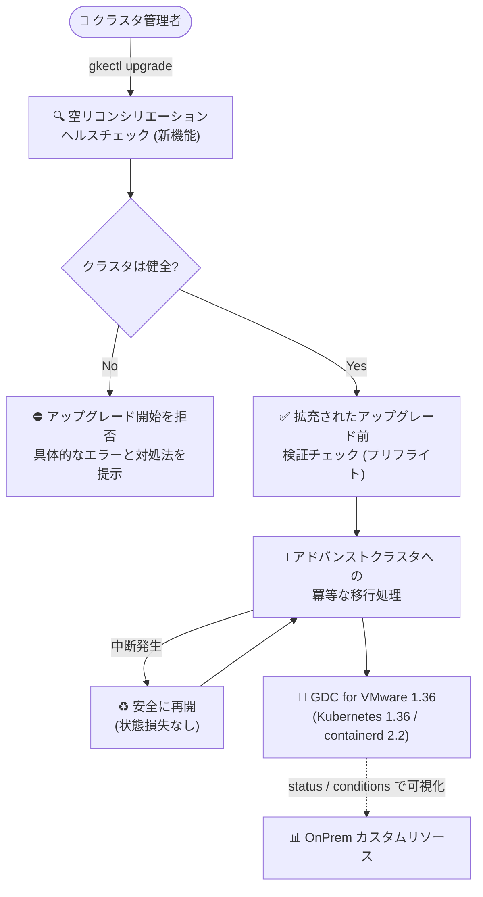

# Google Distributed Cloud (software only) for VMware: バージョン 1.36.0-gke.532 リリース

**リリース日**: 2026-08-25

**サービス**: Google Distributed Cloud (software only) for VMware

**機能**: バージョン 1.36.0-gke.532 (Kubernetes 1.36 対応、アップグレード耐性強化、vSphere 9.0/9.1 サポート)

**ステータス**: Announcement / Feature / Fixed

📊 [このアップデートのインフォグラフィックを見る](https://takech9203.github.io/google-cloud-news-summary/20260825-gdc-vmware-1-36-0.html)

## 概要

Google Distributed Cloud (software only) for VMware のマイナーバージョン 1.36.0-gke.532 がダウンロード可能になりました。本バージョンは Kubernetes v1.36.0-gke.2800 上で動作し、containerd の 2.1 から 2.2 へのアップグレード、vSphere 9.0 / 9.1 のサポート追加 (vSphere 7.0 サポートは削除) など、プラットフォーム基盤の刷新が含まれます。リリース後、GKE On-Prem API クライアント (Google Cloud コンソール、gcloud CLI、Terraform) で利用可能になるまで約 7〜14 日かかります。

本リリースの大きな特徴は、クラスタライフサイクル運用の信頼性強化です。`gkectl update` / `gkectl upgrade` 実行前の空リコンシリエーション (empty reconciliation) ヘルスチェック、アップグレード前検証チェックの拡充、OnPrem カスタムリソースの status / conditions フィールドの改善、`gkectl` のエラーメッセージの具体化が導入されました。さらに、アドバンストクラスタへの移行が「中断されても安全に再開できる」冪等 (idempotent) な処理となり、アップグレード中断時のクラスタ劣化や状態損失のリスクが解消されました。

対象ユーザーは、オンプレミスの vSphere 環境で GKE クラスタを運用する管理者・プラットフォームエンジニアです。特にレガシー (非アドバンスト) クラスタからアドバンストクラスタへの移行を控えている組織にとって、移行の安全性を大きく高めるリリースです。

**アップデート前の課題**

- クラスタが不健全な状態でも `gkectl update` / `gkectl upgrade` を開始できてしまい、ライフサイクル操作が途中で失敗するリスクがあった
- アドバンストクラスタへのアップグレードが中断した場合、再実行 (例: 既存のブートストラップクラスタでの再実行) により `generated-key-kms-plugin-config` シークレットの暗号鍵が消失し、etcd 内の Kubernetes Secret を復号できなくなる問題があった (既知の問題としてドキュメントに記載)
- 管理クラスタのアップグレード後、レガシーユーザークラスタが残っていると、レガシー API (`cluster.k8s.io/v1alpha1`) のディスカバリ欠落によりコントローラのリコンシリエーションが停止し、ユーザークラスタが Reconciling 状態のままスタックした
- Anthos Network Gateway (ANG) 有効なユーザークラスタのアドバンストクラスタへのアップグレードが、イミュータブルな `spec.selector` フィールドの変更試行により停止・失敗した
- `gkectl` のエラーメッセージが具体性に欠け、障害時のトラブルシューティングに時間がかかった

**アップデート後の改善**

- `gkectl update` / `gkectl upgrade` の実行前に空リコンシリエーションヘルスチェックが行われ、不健全なクラスタに対するライフサイクル操作の開始を未然に防止
- アドバンストクラスタへの移行が耐障害性のある冪等な処理となり、中断されたアップグレードをクラスタ劣化や状態損失なしに安全に再開可能
- 管理クラスタのコントローラが、レガシーユーザークラスタが存在する限りレガシーコンポーネントを保持し、全ユーザークラスタのアドバンストクラスタ移行完了後にのみ削除するよう修正
- OnPrem カスタムリソースの status / conditions フィールドが改善され、リコンシリエーションのフェーズと状態遷移の可視性が向上
- `gkectl` がより具体的なエラーメッセージと実行可能なトラブルシューティング推奨事項を提示
- アップグレード前検証チェックが拡充され、構成やクラスタ健全性の問題を事前に検出

## アーキテクチャ図



1.36 におけるクラスタアップグレードのフローです。実行前ヘルスチェックと拡充されたプリフライト検証で不健全な状態でのアップグレード開始を防ぎ、アドバンストクラスタへの移行は中断しても安全に再開できる冪等な処理になりました。

## サービスアップデートの詳細

### 主要機能

1. **Kubernetes 1.36 / containerd 2.2 へのアップデート**
   - クラスタは Kubernetes v1.36.0-gke.2800 上で動作
   - コンテナランタイム containerd を 2.1 から 2.2 にアップグレード

2. **vSphere サポートバージョンの変更**
   - vSphere 9.0 および 9.1 のサポートを追加
   - vSphere 7.0 のサポートを削除 (7.0 環境では 1.36 へのアップグレード前に vSphere の更新が必要)

3. **アップグレード前ヘルスチェックと検証の強化**
   - `gkectl update` / `gkectl upgrade` 実行前に空リコンシリエーションヘルスチェックを実施し、不健全なクラスタでのライフサイクル更新開始を防止
   - アップグレード前検証チェックを拡充し、構成やクラスタ健全性のブロッカーを事前に特定

4. **アドバンストクラスタへの耐障害性・冪等な移行**
   - 中断されたアップグレードを、クラスタ劣化や状態損失のリスクなしに安全に再開可能
   - プリフライトヘルスチェックの導入、`gkectl` エラー診断の改善に加え、ワークロードスケジューリング、プロキシ解析、ロギングにおける動作の不整合を解消

5. **運用性・可観測性の改善**
   - OnPrem カスタムリソースの status / conditions フィールドを改善し、リコンシリエーションフェーズと状態遷移の可視性を向上
   - `gkectl` の失敗時により具体的なエラーメッセージと実行可能なトラブルシューティング推奨を提供

### 主な修正 (Fixed)

- [Vulnerability fixes](https://docs.cloud.google.com/kubernetes-engine/distributed-cloud/vmware/docs/vulnerabilities) に記載の脆弱性を修正
- 管理クラスタのアップグレード後にユーザークラスタが Reconciling 状態でスタックする問題を修正 (レガシー API `cluster.k8s.io/v1alpha1` のディスカバリ欠落が原因。コントローラはレガシーユーザークラスタが存在する限りレガシーコンポーネントを保持し、全クラスタの移行完了後にのみ削除)
- `gkectl prepare` がプライベートレジストリの CA 証明書読み取り時に permission denied で失敗する問題を修正 (証明書ファイル権限を 644 に設定)
- アドバンストクラスタへのアップグレード失敗後の再実行時に `generated-key-kms-plugin-config` シークレットの暗号鍵が消失し、etcd 内の Secret を復号できなくなる問題を修正
- Anthos Network Gateway (ANG) 有効なユーザークラスタのアドバンストクラスタへのアップグレードが停止・失敗する問題を修正 (既存の label selector をリコンシリエーション時に保持)
- cluster-proportional-autoscaler をセキュリティ脆弱性対応のため更新
- 以前使用した名前でユーザークラスタを再作成すると `k8s-health-check` サービスアカウント欠落により PROVISIONING 状態でスタックする問題を修正
- アドバンスト管理クラスタ配下の非アドバンストユーザークラスタで `gkectl diagnose` が実行できない問題を修正
- vSAN データストアのルートへのクラスタ作成がデータディスク作成時に失敗する問題を修正
- コントロールプレーンのクォーラム復旧が IP アドレス衝突で停止・失敗する問題を修正 (`gkectl restore quorum` が VSphereMachine リソースの欠落した IPAddress オブジェクトを再作成)
- Day 2 クラスタ更新時の生成鍵シークレット暗号化 (KMSv1) 有効化が失敗または無限リコンシリエーションループに陥る問題を修正
- `stackdriver.disableVsphereResourceMetrics: true` 設定時に `vsphere-ca-certificate` ConfigMap が削除されてインストール・アップグレードが停止する問題を修正

## 技術仕様

### バージョン情報

| 項目 | 詳細 |
|------|------|
| GDC for VMware バージョン | 1.36.0-gke.532 |
| Kubernetes バージョン | v1.36.0-gke.2800 |
| containerd | 2.2 (2.1 からアップグレード) |
| サポートされる vSphere | 9.0 / 9.1 (新規追加)。vSphere 7.0 はサポート削除 |
| GKE On-Prem API クライアント対応 | リリース後約 7〜14 日でコンソール / gcloud CLI / Terraform から利用可能 |
| サードパーティストレージ | [認定済みストレージパートナー](https://docs.cloud.google.com/kubernetes-engine/enterprise/docs/resources/partner-storage) の一覧を要確認 |

## 設定方法

### 前提条件

1. 既存の GDC (software only) for VMware クラスタが稼働していること
2. vSphere 環境が本バージョンのサポート対象であること (vSphere 7.0 のサポートは削除されたため、7.0 環境は事前に vSphere のアップグレードが必要)
3. サードパーティストレージベンダー利用時は、認定済みストレージパートナーの一覧で本リリースの認定状況を確認すること

### 手順

#### ステップ 1: アップグレードの実行

```bash
# アップグレード前の検証 (プリフライトチェック)
gkectl upgrade cluster --config USER_CLUSTER_CONFIG --kubeconfig ADMIN_CLUSTER_KUBECONFIG
```

1.36 では、`gkectl update` / `gkectl upgrade` の実行前に空リコンシリエーションヘルスチェックが自動で行われ、クラスタが不健全な場合はライフサイクル更新の開始がブロックされます。詳細な手順は公式ドキュメントの [Upgrade clusters](https://docs.cloud.google.com/kubernetes-engine/distributed-cloud/vmware/docs/how-to/upgrading) を参照してください。

#### ステップ 2: アップグレードが中断した場合

本リリースからアドバンストクラスタへの移行は冪等な処理となったため、中断されたアップグレードはクラスタ劣化や状態損失のリスクなしに安全に再開できます。従来のように再実行によって KMS プラグインの暗号鍵が失われる問題も修正されています。

## メリット

### ビジネス面

- **計画停止リスクの低減**: アップグレード前のヘルスチェックと検証拡充により、メンテナンスウィンドウ内でのアップグレード失敗・切り戻しのリスクが減少
- **移行プロジェクトの安全性向上**: レガシークラスタからアドバンストクラスタへの移行が中断可能・再開可能になり、大規模環境の段階的移行を安心して計画できる

### 技術面

- **冪等なアップグレード処理**: 中断・再実行しても状態損失や暗号鍵消失が発生しない
- **可観測性の向上**: OnPrem カスタムリソースの status / conditions によりリコンシリエーションの進行状況を把握しやすい
- **トラブルシューティングの効率化**: `gkectl` の具体的なエラーメッセージと対処推奨により障害解析が迅速化
- **最新プラットフォーム対応**: Kubernetes 1.36、containerd 2.2、vSphere 9.0/9.1 に対応

## デメリット・制約事項

### 制限事項

- vSphere 7.0 のサポートが削除されたため、vSphere 7.0 環境では本バージョンへアップグレードできない (vSphere 側の先行アップグレードが必要)
- GKE On-Prem API クライアント (コンソール、gcloud CLI、Terraform) から本バージョンが利用可能になるまで、リリース後約 7〜14 日かかる

### 考慮すべき点

- サードパーティストレージベンダーを使用している場合は、本リリースでの認定状況を事前に確認する必要がある
- containerd のメジャーコンポーネント更新 (2.1 → 2.2) を含むため、事前に検証環境での動作確認が推奨される

## ユースケース

### ユースケース 1: レガシークラスタからアドバンストクラスタへの安全な移行

**シナリオ**: 多数のレガシー (非アドバンスト) ユーザークラスタを運用しており、アドバンストクラスタへの移行中にネットワーク断やメンテナンスによる中断が懸念される環境。

**効果**: 移行処理が冪等になったため、中断が発生しても状態損失なしに再開できます。また、管理クラスタのコントローラがレガシーユーザークラスタの存在中はレガシーコンポーネントを保持するため、移行期間中の混在環境でもユーザークラスタが Reconciling 状態でスタックしません。

### ユースケース 2: アップグレード失敗の未然防止

**シナリオ**: 限られたメンテナンスウィンドウ内で複数クラスタのアップグレードを実施する必要があり、途中失敗によるウィンドウ超過を避けたい。

**効果**: `gkectl upgrade` 実行前の空リコンシリエーションヘルスチェックと拡充されたアップグレード前検証により、不健全なクラスタや構成上のブロッカーを事前に検出し、失敗する可能性の高いアップグレードの開始そのものを防止できます。

### ユースケース 3: vSphere 9 世代への基盤刷新

**シナリオ**: vSphere 基盤を 9.0 / 9.1 に更新する計画があり、その上で GKE クラスタを継続運用したい。

**効果**: 1.36 で vSphere 9.0 / 9.1 が正式にサポートされたため、仮想化基盤の更新と Kubernetes プラットフォームの最新化を合わせて計画できます。

## 関連サービス・機能

- **GKE On-Prem API (コンソール / gcloud CLI / Terraform)**: クラスタのライフサイクル管理をクラウド側から実行するクライアント。本バージョンはリリース後約 7〜14 日で利用可能
- **アドバンストクラスタ**: 柔軟性とスケーラビリティを高めた新アーキテクチャ。1.33 以降のアップグレードで自動的に変換され、本リリースで移行の冪等性が強化された
- **Cloud Logging / Cloud Monitoring (Stackdriver)**: クラスタのログ・メトリクス収集。本リリースで `stackdriver.disableVsphereResourceMetrics` 設定に関する不具合が修正された
- **Google Distributed Cloud (software only) for bare metal**: 同日に同バージョン 1.36.0-gke.532 がリリースされたベアメタル版

## 参考リンク

- 📊 [インフォグラフィック](https://takech9203.github.io/google-cloud-news-summary/20260825-gdc-vmware-1-36-0.html)
- [公式リリースノート](https://docs.cloud.google.com/release-notes#August_25_2026)
- [GDC for VMware リリースノート](https://docs.cloud.google.com/kubernetes-engine/distributed-cloud/vmware/docs/release-notes)
- [クラスタのアップグレード](https://docs.cloud.google.com/kubernetes-engine/distributed-cloud/vmware/docs/how-to/upgrading)
- [アドバンストクラスタの概要](https://docs.cloud.google.com/kubernetes-engine/distributed-cloud/vmware/docs/concepts/advanced-clusters)
- [vSphere 要件](https://docs.cloud.google.com/kubernetes-engine/distributed-cloud/vmware/docs/how-to/vsphere-requirements)
- [脆弱性修正一覧](https://docs.cloud.google.com/kubernetes-engine/distributed-cloud/vmware/docs/vulnerabilities)

## まとめ

GDC (software only) for VMware 1.36.0-gke.532 は、Kubernetes 1.36 / containerd 2.2 / vSphere 9.x 対応というプラットフォーム刷新に加え、アップグレードとアドバンストクラスタ移行の信頼性を大幅に強化したリリースです。特に中断されたアップグレードを安全に再開できる冪等な移行処理と実行前ヘルスチェックは、オンプレミス環境の運用リスクを直接低減します。vSphere 7.0 のサポート削除が含まれるため、7.0 環境の利用者はまず vSphere 基盤の更新計画を立てた上で、検証環境でのアップグレード確認を推奨します。

---

**タグ**: #GoogleDistributedCloud #GDC #VMware #Kubernetes #GKEOnPrem #vSphere #AdvancedClusters #ハイブリッドクラウド
