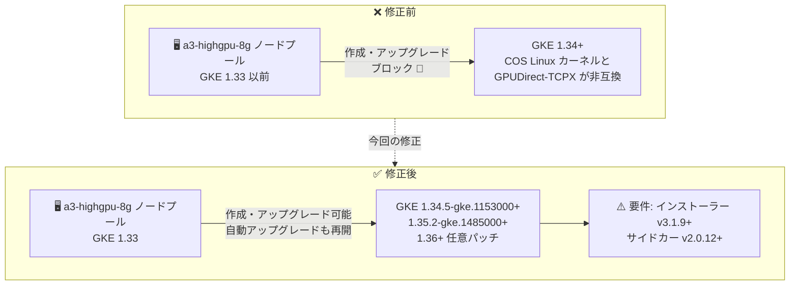

# Google Kubernetes Engine (GKE): GPUDirect-TCPX (a3-highgpu-8g) の GKE 1.34+ 非互換問題を修正

**リリース日**: 2026-08-25

**サービス**: Google Kubernetes Engine (GKE)

**機能**: GPUDirect-TCPX と Container-Optimized OS (GKE 1.34 以降) の互換性修正

**ステータス**: Fixed (修正)

📊 [このアップデートのインフォグラフィックを見る](https://takech9203.github.io/google-cloud-news-summary/20260825-gke-gpudirect-tcpx-a3-highgpu-8g-fix.html)

## 概要

a3-highgpu-8g マシンタイプ (NVIDIA H100 GPU 搭載の A3 High) 向けの GPUDirect-TCPX が、GKE 1.34 以降の Container-Optimized OS (COS) で使用される Linux カーネルと非互換だった問題が修正されました。この問題により、GKE はこれまで a3-highgpu-8g マシンタイプを使用するノードプールの GKE 1.34 以降での作成・アップグレードをブロックしていました。

今回の修正により、以下の GKE パッチバージョンで a3-highgpu-8g ノードプールの作成とアップグレードが可能になりました。

- GKE 1.34: `1.34.5-gke.1153000` 以降
- GKE 1.35: `1.35.2-gke.1485000` 以降
- GKE 1.36 以降: 任意のパッチバージョン

また、GKE 1.33 から 1.34 以降への自動アップグレードもブロックされなくなりました。GPUDirect-TCPX を利用して分散 AI/ML トレーニングを実行しているユーザーは、GKE 1.34 以降へのアップグレード前に、GPUDirect-TCPX インストーラーとサイドカーのバージョン要件 (後述) を必ず確認する必要があります。

**アップデート前の課題**

- GPUDirect-TCPX が GKE 1.34 以降の COS の Linux カーネルと非互換であり、a3-highgpu-8g ノードプールを GKE 1.34 以降で作成・アップグレードできなかった (GKE がブロック)
- GKE 1.33 から 1.34 以降への自動アップグレードもブロックされており、a3-highgpu-8g を使用するクラスタは最新のマイナーバージョンに追随できなかった

**アップデート後の改善**

- `1.34.5-gke.1153000` 以降、`1.35.2-gke.1485000` 以降、および 1.36 以降の任意のパッチバージョンで、a3-highgpu-8g ノードプールの作成・アップグレードが可能になった
- GKE 1.33 から 1.34 以降への自動アップグレードのブロックが解除された
- GKE 1.34 以降での動作要件として、GPUDirect-TCPX インストーラー v3.1.9 以降・サイドカー v2.0.12 以降が明確化された

## アーキテクチャ図



GKE 1.34 以降でブロックされていた a3-highgpu-8g ノードプールのバージョンアップ経路が、修正済みパッチバージョンで解除された様子を示しています。ただし GKE 1.34 以降では GPUDirect-TCPX コンポーネントのバージョン要件を満たす必要があります。

## サービスアップデートの詳細

### 主要機能

1. **a3-highgpu-8g ノードプールの GKE 1.34+ 対応**
   - GPUDirect-TCPX と COS の Linux カーネルの非互換問題が修正され、以下のパッチバージョンでノードプールの作成・アップグレードが可能になった
   - GKE 1.34: `1.34.5-gke.1153000` 以降 / GKE 1.35: `1.35.2-gke.1485000` 以降 / GKE 1.36 以降: 任意のパッチバージョン

2. **自動アップグレードのブロック解除**
   - GKE 1.33 から 1.34 以降のバージョンへの自動アップグレードがブロックされなくなった
   - リリースチャンネルを利用しているクラスタも通常のアップグレードサイクルに復帰できる

3. **GKE 1.34+ での GPUDirect-TCPX コンポーネントのバージョン要件**
   - GKE 1.34 以降では、GPUDirect-TCPX インストーラー v3.1.9 以降、サイドカー v2.0.12 以降の使用が必須
   - インストーラーとサイドカーのバージョンは 1 対 1 で対応しており、一致させる必要がある (例: インストーラー v3.1.12 ↔ サイドカー v2.0.15)
   - バージョンはアップストリームの [gpudirect-tcpx GitHub リポジトリ](https://github.com/GoogleCloudPlatform/container-engine-accelerators/tree/master/gpudirect-tcpx) に対応する

## 技術仕様

### GPUDirect-TCPX のサポートバージョン (今回の修正反映後)

| GKE マイナーバージョン | 必要なパッチバージョン |
|------|------|
| 1.30 〜 1.33 | 任意のパッチバージョン |
| 1.34 | `1.34.5-gke.1153000` 以降 |
| 1.35 | `1.35.2-gke.1485000` 以降 |
| 1.36 以降 | 任意のパッチバージョン |

### GPUDirect-TCPX の主な前提条件 (公式ドキュメントより)

| 項目 | 詳細 |
|------|------|
| マシンタイプ | a3-highgpu-8g (NVIDIA H100 x 8) |
| ノードイメージ | Container-Optimized OS (COS) のみ。Ubuntu / Windows は非サポート |
| NVIDIA ドライバー | バージョン 535 以降 |
| データプレーン | GKE Dataplane V2 が必須 |
| GKE 1.34+ のコンポーネント要件 | インストーラー v3.1.9 以降、サイドカー v2.0.12 以降 (バージョンは 1 対 1 対応) |
| マルチノードプール構成 | 全ノードプールが同一の Compute Engine ゾーン・同一のネットワークセット (VPC、サブネット) を使用する必要あり |

## 設定方法

### 前提条件

1. a3-highgpu-8g ノードプールで GPUDirect-TCPX を使用していること
2. GKE 1.34 以降へアップグレードする場合、対象パッチバージョン (`1.34.5-gke.1153000` 以降など) を使用すること

### 手順

#### ステップ 1: 現在の GPUDirect-TCPX コンポーネントのバージョン確認

GPUDirect-TCPX インストーラー (DaemonSet) が動作していることと、そのイメージバージョンを確認します。

```bash
kubectl get pods -n kube-system -l name=nccl-tcpx-installer
kubectl get daemonset -n kube-system -o wide | grep tcpx
```

GKE 1.34 以降へノードプールがアップグレードされる前に、インストーラーが v3.1.9 以降、ワークロードのサイドカーが v2.0.12 以降であることを確認します。古いバージョンのままアップグレードすると、パフォーマンス低下やワークロード障害が発生する可能性があります。

#### ステップ 2: インストーラー DaemonSet の更新

公式の DaemonSet マニフェストを再適用して、最新のインストーラーをデプロイします。

```bash
kubectl apply -f https://raw.githubusercontent.com/GoogleCloudPlatform/container-engine-accelerators/master/gpudirect-tcpx/nccl-tcpx-installer.yaml
```

ワークロード側のサイドカー (tcpx-daemon) のイメージバージョンも、インストーラーと 1 対 1 で対応するバージョンへ更新します。バージョンの対応関係は [GPUDirect-TCPX Release Notes (GitHub)](https://github.com/GoogleCloudPlatform/container-engine-accelerators/tree/master/gpudirect-tcpx) を参照してください。

#### ステップ 3: ノードプールのアップグレード

コンポーネントの更新後、修正済みパッチバージョンへノードプールをアップグレードします。

```bash
gcloud container clusters upgrade CLUSTER_NAME \
  --node-pool=NODE_POOL_NAME \
  --cluster-version=1.34.5-gke.1153000 \
  --location=LOCATION
```

## メリット

### ビジネス面

- **最新バージョンへの追随**: a3-highgpu-8g を使用する AI/ML 基盤が GKE 1.34 以降の新機能・セキュリティ修正を利用できるようになった
- **運用の正常化**: 自動アップグレードのブロックが解除され、リリースチャンネル運用による計画的なバージョン管理に復帰できる

### 技術面

- **互換性問題の根本解決**: COS の Linux カーネルとの非互換が修正され、GPUDirect-TCPX による高帯域 GPU 間通信を新バージョンでも継続利用できる
- **要件の明確化**: GKE 1.34+ で必要なインストーラー/サイドカーの最小バージョンと 1 対 1 対応が公式に明文化された

## デメリット・制約事項

### 制限事項

- GKE 1.34 は `1.34.5-gke.1153000` 以降、GKE 1.35 は `1.35.2-gke.1485000` 以降のパッチバージョンでのみ利用可能 (それより前のパッチは引き続き非対応)
- GPUDirect-TCPX は a3-highgpu-8g マシンタイプと COS ノードイメージが必須 (Ubuntu / Windows は非サポート)
- マルチインスタンス GPU、GPU タイムシェアリング、NVIDIA MPS、NCCL FastSocket とは併用不可

### 考慮すべき点

- **重要**: 過去に GPUDirect-TCPX コンポーネントをインストールしたユーザーは、ノードプールが GKE 1.34 以降にアップグレードされる前に、インストーラーが v3.1.9 以降・サイドカーが v2.0.12 以降であることを確認する必要がある。満たさない場合、パフォーマンス低下やワークロード障害が発生する可能性がある
- インストーラーとサイドカーのバージョンは 1 対 1 で対応しているため、片方のみの更新では不十分
- 自動アップグレードのブロックが解除されたため、リリースチャンネル利用クラスタでは意図せず 1.34+ へ自動アップグレードされる前にコンポーネント更新を済ませておくことが重要

## ユースケース

### ユースケース 1: 自動アップグレード再開前のコンポーネント事前更新

**シナリオ**: リリースチャンネルに登録された GKE クラスタで、a3-highgpu-8g ノードプール上の分散トレーニングに GPUDirect-TCPX を使用している。これまで 1.33 で足止めされていたが、ブロック解除により自動アップグレードが再開される。

**実装例**:
```bash
# 1. インストーラー DaemonSet を最新化 (v3.1.9+)
kubectl apply -f https://raw.githubusercontent.com/GoogleCloudPlatform/container-engine-accelerators/master/gpudirect-tcpx/nccl-tcpx-installer.yaml

# 2. トレーニングワークロードのサイドカーを対応バージョン (v2.0.12+) に更新してから
#    ノードプールのアップグレードを許可する
```

**効果**: 自動アップグレードで 1.34+ に移行しても、パフォーマンス低下やワークロード障害を回避できる。

### ユースケース 2: 新規 a3-highgpu-8g ノードプールを最新 GKE バージョンで構築

**シナリオ**: H100 ベースの分散 AI トレーニング基盤を新規構築する際、これまでは GKE 1.33 以前を選択せざるを得なかったが、修正済みパッチバージョンで最新のマイナーバージョンを選択できる。

**効果**: 最新の GKE 機能・セキュリティパッチを取り込みつつ、GPUDirect-TCPX による最大帯域の GPU 間通信を利用できる。

## 関連サービス・機能

- **Compute Engine (A3 マシンシリーズ)**: a3-highgpu-8g は NVIDIA H100 GPU を 8 基搭載した A3 High マシンタイプ。A3 Mega (a3-megagpu-8g) では GPUDirect-TCPXO を使用する
- **Container-Optimized OS (COS)**: GPUDirect-TCPX が動作する唯一のサポート対象ノードイメージ。今回の非互換問題は COS の Linux カーネルとの間で発生していた
- **GKE Dataplane V2**: GPUDirect-TCPX の利用に必須のデータプレーン
- **gVNIC / マルチネットワーキング**: GPUDirect-TCPX の帯域を最大化するために必要な機能 (セカンダリ NIC ごとに個別の VPC/サブネットを構成)
- **NCCL (NVIDIA Collective Communications Library)**: GPUDirect-TCPX はインストーラー DaemonSet 経由で NCCL ライブラリとともにノードにインストールされる

## 参考リンク

- 📊 [インフォグラフィック](https://takech9203.github.io/google-cloud-news-summary/20260825-gke-gpudirect-tcpx-a3-highgpu-8g-fix.html)
- [公式リリースノート](https://docs.cloud.google.com/release-notes#August_25_2026)
- [ドキュメント: GPUDirect-TCPX による GPU ネットワーク帯域の最大化 (GKE Standard)](https://docs.cloud.google.com/kubernetes-engine/docs/how-to/gpu-bandwidth-gpudirect-tcpx)
- [GPUDirect-TCPX Release Notes (GitHub)](https://github.com/GoogleCloudPlatform/container-engine-accelerators/tree/master/gpudirect-tcpx)

## まとめ

a3-highgpu-8g で GPUDirect-TCPX を使用するクラスタが GKE 1.34 以降へ移行できるようになり、バージョン追随の停滞が解消されました。既に GPUDirect-TCPX を導入済みの場合は、ノードプールが 1.34+ にアップグレードされる前に、インストーラー v3.1.9 以降・サイドカー v2.0.12 以降 (1 対 1 対応) への更新を必ず実施してください。自動アップグレードのブロックも解除されたため、リリースチャンネル利用クラスタでは早めのコンポーネント確認を推奨します。

---

**タグ**: #GKE #GPUDirect-TCPX #A3 #H100 #GPU #AI-ML #Fixed
