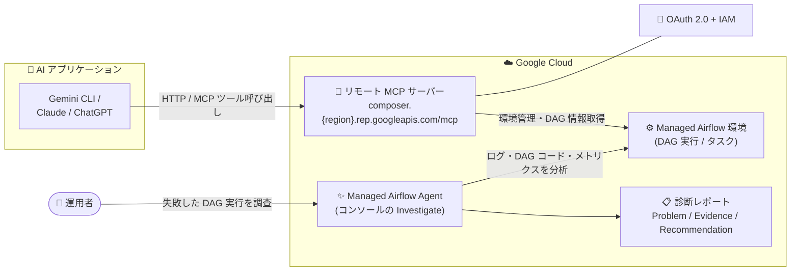

# Managed Service for Apache Airflow: リモート MCP サーバーの GA と Managed Airflow Agent の提供開始

**リリース日**: 2026-08-25

**サービス**: Managed Service for Apache Airflow (旧 Cloud Composer)

**機能**: リモート Model Context Protocol (MCP) サーバー / Managed Airflow Agent

**ステータス**: MCP サーバー: 一般提供 (GA) / Managed Airflow Agent: Google Cloud コンソールで利用可能

📊 [このアップデートのインフォグラフィックを見る](https://takech9203.github.io/google-cloud-news-summary/20260825-managed-airflow-mcp-server-agent-ga.html)

## 概要

Managed Service for Apache Airflow (旧 Cloud Composer) に関する 2 つの AI 関連アップデートが発表されました。1 つ目は、**Managed Airflow リモート MCP サーバーの一般提供 (GA)** です。Model Context Protocol (MCP) は、LLM や AI アプリケーション・エージェントが外部データソースに接続する方法を標準化するプロトコルであり、このリモート MCP サーバーを使用すると、Gemini CLI、ChatGPT、Claude などの AI アプリケーションや自社開発の AI アプリケーションから Managed Airflow 環境の管理、実行済み DAG 実行や Airflow タスクの詳細取得を行えます。

2 つ目は、**Managed Airflow Agent の Google Cloud コンソールでの提供開始**です。このエージェントは、失敗した Airflow タスクや DAG 実行の問題の理解・診断・解決を支援するほか、環境のパフォーマンス最適化、既存または潜在的な問題・ボトルネック・最適化余地の特定にも役立ちます。コンソールの DAG 実行履歴から「Investigate」をクリックするだけで、根本原因 (Problem)、証拠 (Evidence)、推奨対応 (Recommendation) で構成される診断レポートが自動生成されます。

データパイプラインの運用者にとって、「AI アプリケーションから Airflow を操作する」「AI エージェントに障害調査を任せる」という 2 つの方向から Airflow 運用の AI 活用が本格化するアップデートです。

**アップデート前の課題**

- 失敗した Airflow タスクや DAG 実行の原因調査では、Airflow ログの確認、Monitoring ダッシュボードの確認、Cloud Monitoring のレビュー、DAG ソースコードの確認など、複数のステップを手動で行う必要があった
- ログが出力されずに終了したタスク (ゾンビタスクなど) の調査は、スケジューラログまで遡って確認する必要があり、原因特定に時間がかかった
- AI アプリケーションから Airflow 環境を操作するための標準化されたマネージドなインターフェースが GA として提供されていなかった

**アップデート後の改善**

- リモート MCP サーバーが GA となり、Gemini CLI、ChatGPT、Claude などの AI アプリケーションから、環境管理や DAG 実行・タスクの詳細取得を本番利用できるようになった
- MCP サーバーはマネージドな HTTP エンドポイントとして提供され、OAuth 2.0 + IAM によるきめ細かい認可、Model Armor によるプロンプト/レスポンス保護 (オプション)、集中監査ログに対応
- コンソール上の「Investigate」ボタンから Managed Airflow Agent が起動し、タスク実行ログ・DAG ソースコード・環境メトリクスを分析して、根本原因と推奨対応を含む診断レポートを自動生成できるようになった

## アーキテクチャ図



上段は AI アプリケーションがリモート MCP サーバー経由で Managed Airflow 環境を操作するフロー、下段は運用者がコンソールから Managed Airflow Agent を起動して障害を診断するフローを示しています。

## サービスアップデートの詳細

### 主要機能

1. **リモート MCP サーバー (GA)**
   - Google Cloud のインフラ上で動作するリモート MCP サーバーで、AI アプリケーションに HTTP エンドポイント (`composer.{region}.rep.googleapis.com/mcp`) を提供
   - Managed Airflow 環境の管理 (環境の一覧取得・作成、PyPI パッケージ管理など) と、実行済み DAG 実行・Airflow タスクの詳細取得が可能
   - 読み取り専用ツールには MCP 属性 `mcp.tool.isReadOnly` が `true` として設定され、組織ポリシーで読み取り専用ツールのみを許可する運用が可能
   - `tools/list` メソッドは認証不要で、利用可能なツールの一覧を取得できる

2. **Google / Google Cloud リモート MCP サーバー共通の特長**
   - シンプルで一元化されたディスカバリ
   - マネージドなグローバル/リージョナル HTTP エンドポイント
   - きめ細かい認可 (OAuth 2.0 + IAM)
   - Model Armor によるプロンプトとレスポンスの保護 (オプション)
   - 集中監査ログ

3. **Managed Airflow Agent (Google Cloud コンソール)**
   - 失敗した Airflow タスク・DAG 実行の理解・診断・解決を支援
   - 環境のパフォーマンス最適化、既存または潜在的な問題・ボトルネック・最適化余地の特定を支援
   - タスク実行ログ、DAG ソースコード、環境メトリクスを分析し、「Problem (根本原因)」「Evidence (証拠となるアーティファクト)」「Recommendation (具体的な対応手順)」の 3 セクションからなる診断レポートを生成
   - 例: ログを出力せずに失敗したタスクについて、スケジューラログからゾンビタスクとして終了された証拠を発見し、ワーカーの OOM が原因と特定した上で、コード修正 (チャンク処理化) やワーカーメモリのスケールアップを提案

## 技術仕様

### リモート MCP サーバーの接続情報

| 項目 | 詳細 |
|------|------|
| サーバー名 | Managed Service for Apache Airflow MCP server |
| エンドポイント | `composer.{region}.rep.googleapis.com/mcp` |
| トランスポート | HTTP |
| 認証・認可 | OAuth 2.0 + IAM (すべての Google Cloud ID をサポート) |
| 読み取り専用スコープ | `https://www.googleapis.com/auth/cloudcomposer.readonly` |
| 読み書きスコープ | `https://www.googleapis.com/auth/cloudcomposer` |

### 必要な IAM ロール

| ロール | 用途 |
|------|------|
| Service Usage Admin (`roles/serviceusage.serviceUsageAdmin`) | MCP サーバーの有効化 |
| MCP Tool User (`roles/mcp.toolUser`) | MCP ツール呼び出しの実行 |

### 主な MCP ツール (ドキュメントのユースケースで確認できたもの)

| ツール | 説明 |
|------|------|
| `list_environments` | 指定リージョンの環境一覧と最終更新時刻などの取得 |
| `create_environment` | 指定した構成パラメータでの新規環境の作成 |
| `manage_pypi_packages` | カスタム PyPI パッケージのインストール |
| `find_last_failed_dag_runs` | 失敗した DAG 実行の一覧取得 |
| `list_failed_task_instances` | 失敗状態のタスクインスタンスの一覧取得 |
| `get_task_instance` | 失敗タスクの詳細 (ログ取得に必要なデータを含む) の取得 |
| `get_dag_source_code` | DAG ソースコードの取得・分析 |

ツールの全一覧と説明は [Managed Service for Apache Airflow MCP リファレンス](https://docs.cloud.google.com/composer/docs/reference/mcp) を参照してください。

## 設定方法

### 前提条件

1. MCP サーバーの有効化に Service Usage Admin ロール、ツール呼び出しに MCP Tool User ロールが必要
2. エージェント用に個別の ID (アイデンティティ) を作成し、リソースへのアクセスを制御・監視することが推奨されている

### 手順

#### ステップ 1: MCP クライアントの設定

AI アプリケーション側でリモート MCP サーバーの追加設定を行い、以下の情報を入力します。

```text
Server name : Managed Service for Apache Airflow MCP server
Endpoint    : composer.{region}.rep.googleapis.com/mcp
Transport   : HTTP
認証情報     : Google Cloud 認証情報 / OAuth クライアント ID とシークレット / エージェント ID と認証情報
OAuth スコープ: cloudcomposer.readonly (読み取り専用) または cloudcomposer (読み書き)
```

アプリケーション別の設定手順は [Configure MCP in an AI application](https://docs.cloud.google.com/mcp/configure-mcp-ai-application) を参照してください。

#### ステップ 2: 利用可能なツールの確認

`tools/list` リクエストを MCP サーバーに直接送信するか、MCP インスペクタを使用してツールを一覧表示します (`tools/list` は認証不要)。

```http
POST /mcp HTTP/1.1
Host: composer.{region}.rep.googleapis.com/mcp
Content-Type: application/json

{
  "jsonrpc": "2.0",
  "method": "tools/list"
}
```

#### ステップ 3: Managed Airflow Agent での障害調査 (コンソール)

1. Google Cloud コンソールで「Environments」ページに移動し、環境を選択
2. 「DAGs」タブで対象の DAG 名をクリックし、「Run history」タブへ移動
3. 失敗した DAG 実行の横の「Investigate」をクリック (特定タスクを調査する場合は、失敗した DAG 実行内のタスクの State 列で「Investigate」をクリック)
4. 「Ask agent」パネルが開き、エージェントが分析を実行。完了後に「Problem / Evidence / Recommendation」の診断レポートを確認

## メリット

### ビジネス面

- **障害対応時間の短縮**: ログ・メトリクス・ソースコードを横断した原因調査をエージェントが自動化し、根本原因と具体的な対応手順まで提示するため、パイプライン障害からの復旧を迅速化できる
- **AI 活用の本番導入**: MCP サーバーが GA となったことで、AI アプリケーションからの Airflow 運用を本番ワークロードで採用しやすくなった

### 技術面

- **標準プロトコルによる統合**: MCP という標準プロトコルにより、Gemini CLI、ChatGPT、Claude など複数の AI アプリケーションから同じインターフェースで Airflow を操作できる
- **セキュリティ制御の組み込み**: OAuth 2.0 + IAM によるきめ細かい認可、読み取り専用スコープ、`mcp.tool.isReadOnly` 属性と組織ポリシーの組み合わせ、Model Armor によるプロンプト/レスポンス検査、集中監査ログなど、ガバナンス機構が最初から用意されている
- **ログなし障害の診断**: タスクがログを残さず失敗した場合でも、エージェントがスケジューラログなど他のアーティファクトから証拠を収集して原因を特定できる

## デメリット・制約事項

### 制限事項

- Managed Airflow Agent を実行する Conversational Analytics API には独自のデータ所在地 (データレジデンシー) ポリシーがあり、会話が環境のロケーションとは異なるリージョンで処理される可能性がある
- Model Armor は特定のリージョンでのみ利用可能であり、Model Armor がサポートしないジュリスディクションで MCP サーバーを使用すると、呼び出しのルーティング動作が変わり、処理中・転送中データのデータレジデンシー要件を満たせなくなる可能性がある

### 考慮すべき点

- MCP ツールは多様なアクションを実行できるため、新たなセキュリティリスクへの考慮が必要。読み取り専用スコープの利用、エージェント専用 ID の作成、組織ポリシーによるツール制限などの対策が推奨されている
- Model Armor でロギングを有効にするとペイロード全体がログに記録されるため、ログに機密情報が含まれる可能性がある
- 書き込み可能スコープ (`cloudcomposer`) を付与する場合は、環境の作成や変更が AI アプリケーション経由で行えるようになるため、権限設計を慎重に行う必要がある

## ユースケース

### ユースケース 1: 自然言語での障害トラブルシューティング

**シナリオ**: `example_dag` が失敗しており、原因と失敗したタスクを特定したい。過去 24 時間に失敗した他の DAG も確認したい。

**実装例**:
```text
プロンプト例:
「us-central1 の example-environment-name 環境を確認して。
example_dag が失敗しているので、原因とどのタスクで失敗したかを教えて。
過去 24 時間にこの環境で失敗した他の DAG についても教えて。」

エージェントの動作:
1. find_last_failed_dag_runs で失敗した DAG 実行の一覧を取得
2. list_failed_task_instances で失敗状態のタスクインスタンスを特定
3. get_task_instance で失敗タスクの詳細とログ取得に必要な情報を取得
4. get_dag_source_code で DAG ソースコードのエラーを分析
```

**効果**: 複数のコンソール画面やログを行き来することなく、対話形式で障害の原因調査が完結する

### ユースケース 2: AI アプリケーションからの環境プロビジョニング

**シナリオ**: 新しい Managed Airflow (Gen 3) 環境を作成し、カスタム PyPI パッケージをインストールしたい。

**実装例**:
```text
プロンプト例:
「プロジェクトに Airflow 2 の Managed Airflow (Gen 3) 環境を新規作成して。
その後 nltk[machine_learning] パッケージをインストールして。
環境には example-account@example-project.iam.gserviceaccount.com
サービスアカウントを使用して。」

エージェントの動作:
1. create_environment で指定パラメータの環境を作成
   (Airflow UI へのアクセスを許可する IP アドレスなど追加パラメータを確認)
2. manage_pypi_packages で指定した PyPI パッケージをインストール
```

**効果**: 環境構築とパッケージ管理を自然言語の指示で完了でき、セットアップ作業を効率化できる

### ユースケース 3: コンソールからのワンクリック障害診断

**シナリオ**: Monitoring ダッシュボードで DAG 実行の失敗を検知したが、タスクがログを出力せずに終了しており原因が不明。

**効果**: 「Investigate」をクリックするだけで、エージェントがスケジューラログからゾンビタスク検出の証拠を発見し、ワーカーの OOM が根本原因であることと、チャンク処理によるコード修正やワーカーメモリ増強といった具体的な対策を提示する

## 料金

今回の Release Notes およびドキュメントでは、リモート MCP サーバーと Managed Airflow Agent に固有の料金情報は確認できませんでした。Managed Service for Apache Airflow の料金の詳細は [料金ページ](https://cloud.google.com/composer/pricing) を参照してください。

## 利用可能リージョン

MCP サーバーのエンドポイントはリージョナル形式 (`composer.{region}.rep.googleapis.com/mcp`) で提供されます。対応リージョンの詳細は [公式ドキュメント](https://docs.cloud.google.com/composer/docs/composer-3/use-composer-mcp) を参照してください。なお、Managed Airflow Agent の会話は Conversational Analytics API のデータレジデンシーポリシーに従い、環境のロケーションとは異なるリージョンで処理される場合があります。

## 関連サービス・機能

- **Model Armor**: MCP ツール呼び出しとレスポンスを検査・ブロックする Google Cloud のセキュリティサービス。フロア設定 (`GOOGLE_MCP_SERVER` 統合) によりプロジェクト全体の MCP トラフィックに一貫したフィルタを適用できる
- **Identity and Access Management (IAM)**: MCP サーバーの認証・認可を担い、OAuth 2.0 スコープと組み合わせてアクセスを制御する
- **Conversational Analytics API**: Managed Airflow Agent の実行基盤。独自のデータレジデンシーポリシーを持つ
- **Gemini CLI / その他 AI アプリケーション**: MCP クライアントとしてリモート MCP サーバーに接続し、Airflow を操作できる
- **Cloud Monitoring / Cloud Logging**: エージェントが分析対象とする環境メトリクスやタスク実行ログの基盤

## 参考リンク

- 📊 [インフォグラフィック](https://takech9203.github.io/google-cloud-news-summary/20260825-managed-airflow-mcp-server-agent-ga.html)
- [公式リリースノート](https://docs.cloud.google.com/release-notes#August_25_2026)
- [ドキュメント: Use the Managed Service for Apache Airflow remote MCP server](https://docs.cloud.google.com/composer/docs/composer-3/use-composer-mcp)
- [ドキュメント: Troubleshoot Airflow tasks and DAG runs with Managed Airflow Agent](https://docs.cloud.google.com/composer/docs/composer-3/troubleshoot-tasks-and-dag-runs-with-agent)
- [Managed Service for Apache Airflow MCP リファレンス](https://docs.cloud.google.com/composer/docs/reference/mcp)
- [Google Cloud MCP servers overview](https://docs.cloud.google.com/mcp/overview)
- [料金ページ](https://cloud.google.com/composer/pricing)

## まとめ

Managed Service for Apache Airflow のリモート MCP サーバー GA と Managed Airflow Agent の提供開始により、AI アプリケーションからの Airflow 操作と、AI エージェントによる障害診断・環境最適化の両方が実用段階に入りました。Airflow 環境を運用しているチームは、まずコンソールの「Investigate」ボタンによる障害診断から試し、あわせて MCP サーバーの読み取り専用スコープでの接続を評価することを推奨します。書き込み権限を付与する場合は、エージェント専用 ID、組織ポリシー、Model Armor などのガバナンス設計を先に整備してください。

---

**タグ**: #ManagedServiceForApacheAirflow #CloudComposer #MCP #ModelContextProtocol #AIAgent #GA #Airflow #DataEngineering
