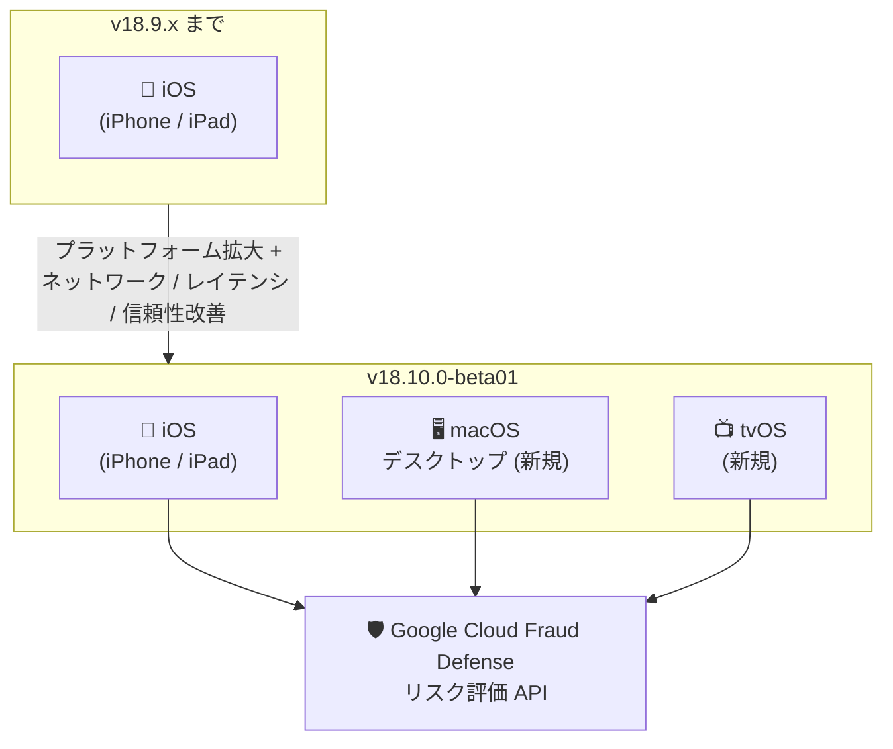

# reCAPTCHA: Fraud Defense Mobile SDK v18.10.0-beta01 (iOS) リリース

**リリース日**: 2026-08-25

**サービス**: reCAPTCHA (Google Cloud Fraud Defense)

**機能**: Fraud Defense Mobile SDK v18.10.0-beta01 for iOS

**ステータス**: Beta

📊 [このアップデートのインフォグラフィックを見る](https://takech9203.github.io/google-cloud-news-summary/20260825-recaptcha-fraud-defense-mobile-sdk-v18-10-0.html)

## 概要

Google Cloud Fraud Defense (旧 reCAPTCHA Enterprise) の Mobile SDK v18.10.0-beta01 が iOS 向けにリリースされました。本バージョンでは、従来の iOS (iPhone / iPad) に加えて macOS デスクトップと tvOS のサポートが追加され、Apple プラットフォーム全体でのボット対策・不正検知のカバレッジが拡大しました。

また、ネットワーク消費量の改善、およびレイテンシと信頼性の改善が含まれており、SDK を組み込んだアプリのパフォーマンスとユーザー体験の向上が期待できます。iOS アプリに Fraud Defense を組み込んでいる開発者、および macOS / tvOS アプリへの不正対策導入を検討している開発者が対象です。

**アップデート前の課題**

- Fraud Defense Mobile SDK の Apple プラットフォーム対応は iOS (iPhone / iPad) に限られ、macOS デスクトップアプリや tvOS アプリでは利用できなかった
- SDK のネットワーク通信量やレイテンシに改善の余地があった

**アップデート後の改善**

- macOS デスクトップと tvOS がサポート対象に追加され、Apple エコシステムのより広い範囲でリスク評価を利用可能になった
- ネットワーク消費量が改善され、モバイル環境での通信コストが軽減された
- レイテンシと信頼性が改善され、リスク評価 (トークン取得) の応答性が向上した

## アーキテクチャ図

v18.10.0-beta01 により SDK の対応プラットフォームが iOS から macOS デスクトップ・tvOS へと拡大し、いずれも Fraud Defense のリスク評価 API と連携します。

## サービスアップデートの詳細

### 主要機能

1. **macOS デスクトップ / tvOS サポートの追加**
   - 従来の iOS (iPhone / iPad) に加え、macOS デスクトップアプリと tvOS アプリで SDK を利用可能に
   - Apple プラットフォーム全体で一貫したボット対策・不正検知を実装できる

2. **ネットワーク消費量の改善**
   - SDK の通信量が最適化され、モバイル回線利用時のデータ消費を軽減

3. **レイテンシと信頼性の改善**
   - リスク評価トークン取得の応答時間と安定性が向上
   - v18.9.0-beta01 以降継続しているレイテンシ・信頼性改善の流れを踏襲

## 技術仕様

| 項目 | 詳細 |
|------|------|
| バージョン | v18.10.0-beta01 |
| 対応プラットフォーム | iOS (iPhone / iPad)、macOS デスクトップ (新規)、tvOS (新規) |
| 最小 iOS バージョン | iOS 15 (Xcode 16 の互換性ガイドラインに準拠) |
| 配布方法 | CocoaPods、Swift Package Manager、xcframework 直接ダウンロード |
| リリース段階 | Beta (beta01) |

なお、iOS 27 Beta 上でのクラッシュ問題があるため、v18.9.0 より前のバージョンを利用中の場合はアップグレードが推奨されています (公式ドキュメントの警告より)。

## メリット

### ビジネス面

- **保護範囲の拡大**: macOS / tvOS アプリにも不正検知を展開でき、Apple エコシステム全体で一貫した不正対策が可能
- **ユーザー体験の維持**: レイテンシ改善により、リスク評価がアプリの操作感に与える影響を最小化

### 技術面

- **通信量の削減**: ネットワーク消費の改善により、モバイル環境でのデータ使用量とバッテリー消費に好影響
- **信頼性の向上**: トークン取得の安定性が向上し、リトライやエラーハンドリングの負担が軽減

## デメリット・制約事項

- Beta 版 (beta01) のため、本番環境への適用は安定版のリリースを待つか、十分な検証のうえで行うことが推奨される
- iOS では画面サイズや UI の制約から、チェックボックス型のビジュアル reCAPTCHA チャレンジ ("I'm not a robot") は利用できない (スコアベースの評価と独自の段階的な対応策の実装が必要)
- SDK には非推奨化・廃止ポリシーがあるため、定期的なアップグレード計画が必要

## ユースケース

### ユースケース 1: macOS デスクトップアプリへの不正対策導入

**シナリオ**: iOS アプリで Fraud Defense を利用している事業者が、同一サービスの macOS デスクトップアプリにもログイン・登録フローの不正検知を展開したい。

**効果**: 同じ SDK ファミリーでプラットフォームを横断した実装が可能になり、バックエンドのリスク評価ロジックを共通化できる。

### ユースケース 2: tvOS アプリのアカウント保護

**シナリオ**: 動画配信サービスの tvOS アプリで、アカウント乗っ取りや不正なログイン試行を検知したい。

**効果**: これまで対策が難しかった TV プラットフォームでもリスクスコアに基づく防御が可能になる。

## 料金

SDK 自体は無償で利用でき、料金は Fraud Defense (reCAPTCHA) の評価 (Assessment) 数に基づいて課金されます。詳細は[料金ページ](https://cloud.google.com/recaptcha/pricing)を参照してください。

## 関連サービス・機能

- **Google Cloud Fraud Defense (reCAPTCHA)**: 本 SDK が連携するリスク評価基盤。スコアベースの評価やアカウント防御機能を提供
- **Firebase**: RecaptchaInterop による Firebase クライアント向け統合アーキテクチャを提供
- **reCAPTCHA Mobile SDK for Android**: Android 向けの同等 SDK。プラットフォーム横断で同じバックエンド評価を利用可能

## 参考リンク

- 📊 [インフォグラフィック](https://takech9203.github.io/google-cloud-news-summary/20260825-recaptcha-fraud-defense-mobile-sdk-v18-10-0.html)
- [公式リリースノート](https://docs.cloud.google.com/release-notes#August_25_2026)
- [iOS アプリへの Fraud Defense 統合ガイド](https://docs.cloud.google.com/recaptcha/docs/instrument-ios-apps)
- [Mobile SDK の非推奨化ポリシー](https://docs.cloud.google.com/recaptcha/docs/deprecation-policy-mobile)
- [料金ページ](https://cloud.google.com/recaptcha/pricing)

## まとめ

Fraud Defense Mobile SDK v18.10.0-beta01 は、macOS デスクトップと tvOS への対応拡大により、Apple プラットフォーム全体での不正対策を可能にする重要な一歩です。iOS アプリで SDK を利用中の開発者は、ネットワーク・レイテンシ・信頼性の改善を検証環境で評価し、macOS / tvOS アプリを持つ場合は新プラットフォーム対応の検討を開始することを推奨します。

---

**タグ**: reCAPTCHA, Fraud Defense, Mobile SDK, iOS, macOS, tvOS, セキュリティ, Beta
