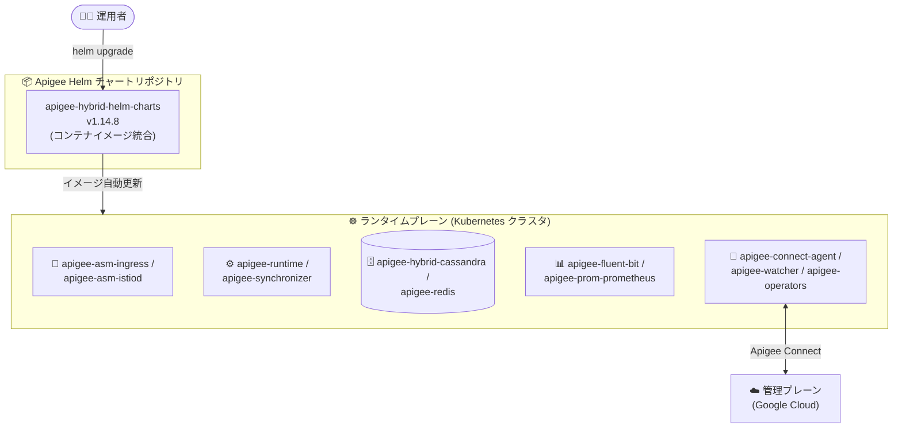

# Apigee hybrid: v1.14.8 セキュリティパッチリリース

**リリース日**: 2026-08-26

**サービス**: Apigee hybrid

**機能**: v1.14.8 パッチリリース (セキュリティ修正)

**ステータス**: Announcement / Security (リリース済み)

📊 [このアップデートのインフォグラフィックを見る](https://takech9203.github.io/google-cloud-news-summary/20260826-apigee-hybrid-v1-14-8-security.html)

## 概要

2026 年 8 月 26 日、Apigee hybrid ソフトウェアの更新版 v1.14.8 がリリースされました。本リリースはパッチリリースであり、`apigee-asm-ingress`、`apigee-connect-agent`、`apigee-fluent-bit`、`apigee-hybrid-cassandra`、`apigee-runtime`、`apigee-synchronizer` など、ランタイムプレーンを構成する多数のコンポーネントに対するセキュリティ修正が含まれています。特に `apigee-fluent-bit` では 40 件以上、Java 系コンポーネント (`apigee-runtime`、`apigee-synchronizer`、`apigee-mart-server`、`apigee-mint-task-scheduler`) では各 15 件の脆弱性 (CVE / GHSA) に対処しています。

パッチリリースで使用されるコンテナイメージは Apigee hybrid の Helm チャートに統合されているため、Helm チャート経由でパッチにアップグレードするとイメージが自動的に更新されます。通常、手動でのイメージ変更は不要です。

Apigee hybrid v1.14 系を Kubernetes クラスタ上で運用しているすべての組織が対象であり、セキュリティ脆弱性への対処として速やかなアップグレードが推奨されます。

**アップデート前の課題**

- v1.14.7 以前のコンテナイメージには、今回修正された脆弱性 (Istio 関連の CVE-2026-39822 / CVE-2026-42505、fluent-bit 関連の 40 件超の CVE、Java 系コンポーネントの CVE 群など) が残存していた
- ホットフィックスリリースの場合は、`overrides.yaml` でコンテナイメージのタグを手動で指定して更新する作業が必要だった

**アップデート後の改善**

- ランタイムプレーンの広範なコンポーネント (計 15 コンポーネント) の既知の脆弱性が修正された
- パッチリリースのコンテナイメージは Helm チャートに統合されており、Helm チャートのアップグレードのみでイメージが自動更新される (手動でのイメージタグ変更は原則不要)

## アーキテクチャ図



v1.14.8 の Helm チャートにはセキュリティ修正済みのコンテナイメージが統合されており、`helm upgrade` を実行するだけでランタイムプレーン上の各コンポーネントのイメージが自動的に更新されます。

## サービスアップデートの詳細

### 主要なポイント

1. **パッチリリース方式によるイメージ更新の自動化**
   - パッチリリースのコンテナイメージは Apigee hybrid の Helm チャートに統合されている
   - Helm チャート経由でアップグレードすると、イメージが自動的に更新される (手動のイメージ変更は通常不要)
   - ホットフィックスリリース (イメージタグを手動更新する方式) とは異なる運用モデル

2. **広範なコンポーネントへのセキュリティ修正**
   - Istio ベースの Ingress (`apigee-asm-ingress` / `apigee-asm-istiod`) から、ログ収集 (`apigee-fluent-bit`)、データストア (`apigee-hybrid-cassandra`)、API ランタイム (`apigee-runtime`) まで、計 15 コンポーネントを修正

### コンポーネント別のセキュリティ修正一覧

| コンポーネント | 対処された脆弱性 |
|------|------|
| apigee-asm-ingress | CVE-2026-39822, CVE-2026-42505 |
| apigee-asm-istiod | CVE-2026-39822, CVE-2026-42505 |
| apigee-connect-agent | CVE-2026-33818, CVE-2026-39821, CVE-2026-46600, CVE-2026-56853, CVE-2026-56858, CVE-2026-56859, CVE-2026-56860, CVE-2026-56862, CVE-2026-56864, CVE-2026-56865, GHSA-hrxh-6v49-42gf |
| apigee-fluent-bit | CVE-2025-13151, CVE-2025-14524, CVE-2025-14819, CVE-2026-14662, CVE-2026-14663, CVE-2026-14664, CVE-2026-14666, CVE-2026-14668, CVE-2026-14669, CVE-2026-14670, CVE-2026-14671, CVE-2026-14672, CVE-2026-14673, CVE-2026-14677, CVE-2026-14678, CVE-2026-14679, CVE-2026-14680, CVE-2026-14681, CVE-2026-15741, CVE-2026-15742, CVE-2026-16239, CVE-2026-16241, CVE-2026-18024, CVE-2026-18408, CVE-2026-19385, CVE-2026-1965, CVE-2026-34743, CVE-2026-3783, CVE-2026-3784, CVE-2026-3805, CVE-2026-4873, CVE-2026-5545, CVE-2026-5773, CVE-2026-6253, CVE-2026-6276, CVE-2026-6429, CVE-2026-6464, CVE-2026-6469, CVE-2026-6470, CVE-2026-6471, CVE-2026-6473, CVE-2026-7168 (計 42 件) |
| apigee-hybrid-cassandra | CVE-2026-33818, CVE-2026-39821, CVE-2026-56853, CVE-2026-56858, CVE-2026-56859, CVE-2026-56860, CVE-2026-56862, CVE-2026-56864, CVE-2026-56865 |
| apigee-hybrid-cassandra-client | 上記 9 件 + GHSA-hrxh-6v49-42gf |
| apigee-mart-server | CVE-2026-54515, CVE-2026-55831, CVE-2026-55833, CVE-2026-56745, CVE-2026-56746, CVE-2026-56819, CVE-2026-59889, CVE-2026-59898, CVE-2026-59899, CVE-2026-59900, CVE-2026-59901, CVE-2026-59903, CVE-2026-59921, CVE-2026-73508, GHSA-mhm7-754m-9p8w |
| apigee-mint-task-scheduler | apigee-mart-server と同一の 15 件 |
| apigee-operators | CVE-2026-33818, CVE-2026-39821, CVE-2026-56853 系 7 件, GHSA-hrxh-6v49-42gf (計 10 件) |
| apigee-prom-prometheus | GHSA-hrxh-6v49-42gf |
| apigee-prometheus-adapter | CVE-2026-33818, CVE-2026-39821, CVE-2026-46600, CVE-2026-56853 系 7 件, GHSA-hrxh-6v49-42gf (計 11 件) |
| apigee-redis | CVE-2026-33818, CVE-2026-39821, CVE-2026-56853 系 7 件 (計 9 件) |
| apigee-runtime | apigee-mart-server と同一の 15 件 |
| apigee-synchronizer | apigee-mart-server と同一の 15 件 |
| apigee-watcher | CVE-2026-33818, CVE-2026-39821, CVE-2026-56853 系 7 件, GHSA-hrxh-6v49-42gf (計 10 件) |

※ 「CVE-2026-56853 系 7 件」は CVE-2026-56853 / 56858 / 56859 / 56860 / 56862 / 56864 / 56865 を指します。

## 技術仕様

### リリース情報

| 項目 | 詳細 |
|------|------|
| バージョン | v1.14.8 |
| リリース種別 | パッチリリース (セキュリティ修正) |
| リリース日 | 2026 年 8 月 26 日 |
| イメージ更新方式 | Helm チャートに統合済み (Helm アップグレードで自動更新) |
| 修正対象コンポーネント数 | 15 |
| 対処された脆弱性 | CVE 多数 + GHSA 2 件 (GHSA-hrxh-6v49-42gf, GHSA-mhm7-754m-9p8w) |

## 設定方法

### 前提条件

1. Apigee hybrid v1.14 系を Helm チャートで管理していること
2. アップグレード手順の詳細は [Upgrading Apigee hybrid to version v1.14.8](https://docs.cloud.google.com/apigee/docs/hybrid/v1.14/upgrade) を必ず参照すること

### 手順 (概要)

#### ステップ 1: v1.14.8 の Helm チャートを取得

```bash
export CHART_REPO=oci://us-docker.pkg.dev/apigee-release/apigee-hybrid-helm-charts
export CHART_VERSION=1.14.8

# 例: 各チャートを pull (公式アップグレードガイドの手順に従うこと)
helm pull $CHART_REPO/apigee-operator --version $CHART_VERSION --untar
helm pull $CHART_REPO/apigee-datastore --version $CHART_VERSION --untar
# ... その他のチャートも同様
```

#### ステップ 2: helm upgrade でチャートを適用

```bash
# 例: dry run で確認してから適用 (チャートごとに実施)
helm upgrade datastore apigee-datastore/ \
  --namespace APIGEE_NAMESPACE \
  --atomic \
  -f OVERRIDES_FILE \
  --dry-run=server

helm upgrade datastore apigee-datastore/ \
  --namespace APIGEE_NAMESPACE \
  --atomic \
  -f OVERRIDES_FILE
```

パッチリリースのため、チャートのアップグレードによりコンテナイメージが自動的に更新されます。手動でのイメージタグ変更は通常不要です。適用順序や全チャートの詳細な手順は公式アップグレードガイドに従ってください。

#### ステップ 3: 動作確認

```bash
# Pod の状態を確認
kubectl -n APIGEE_NAMESPACE get pods
```

## メリット

### ビジネス面

- **セキュリティリスクの低減**: API 基盤の広範なコンポーネントに存在した既知の脆弱性が解消され、コンプライアンス要件や脆弱性管理ポリシーへの対応が容易になる
- **運用コストの削減**: Helm チャートへのイメージ統合により、パッチ適用が単一のアップグレード作業で完結する

### 技術面

- **イメージ更新の自動化**: `helm upgrade` の実行だけで全コンポーネントのイメージが修正済みバージョンに更新される
- **一貫性のあるバージョン管理**: チャートバージョンとイメージバージョンが揃うため、環境間のバージョン差異を防ぎやすい

## デメリット・制約事項

### 考慮すべき点

- アップグレード作業自体はユーザー管理の Kubernetes クラスタ上で実施する必要がある (Apigee hybrid の運用モデル上、ランタイムプレーンの更新はユーザーの責任範囲)
- 本番環境への適用前に、`--dry-run=server` や検証環境での動作確認を行うことが望ましい
- v1.14 系より古いバージョンを利用中の場合は、まず v1.14 へのアップグレードパスをアップグレードガイドで確認する必要がある

## ユースケース

### ユースケース 1: 定期的な脆弱性対応としてのパッチ適用

**シナリオ**: 社内の脆弱性管理ポリシーにより、コンテナイメージに含まれる既知 CVE への対応期限が定められている企業が、Apigee hybrid v1.14 系を運用している。

**効果**: v1.14.8 への Helm チャートアップグレードのみで、fluent-bit の 42 件をはじめとする多数の CVE / GHSA に一括対応でき、コンポーネントごとの個別イメージ更新作業が不要になる。

### ユースケース 2: マルチクラスタ環境での一括パッチ展開

**シナリオ**: 複数の Kubernetes クラスタで Apigee hybrid ランタイムプレーンを運用しており、クラスタごとにパッチ適用状況を揃えたい。

**効果**: チャートバージョン (1.14.8) を指定した `helm upgrade` を各クラスタで実行するだけで、全クラスタのイメージバージョンを統一できる。

## 関連サービス・機能

- **Google Kubernetes Engine (GKE) / サポート対象 Kubernetes プラットフォーム**: Apigee hybrid ランタイムプレーンの稼働基盤。アップグレードはこのクラスタ上で実施する
- **Apigee Connect (apigee-connect-agent)**: ランタイムプレーンと Google Cloud 管理プレーンを接続するコンポーネント。今回のセキュリティ修正対象に含まれる
- **Cloud Logging / Cloud Monitoring**: `apigee-fluent-bit` や `apigee-prom-prometheus` などの修正対象コンポーネントが、ログ・メトリクスの収集と送信を担う
- **Anthos Service Mesh (Istio)**: `apigee-asm-ingress` / `apigee-asm-istiod` は Istio ベースの Ingress コンポーネントで、今回 CVE-2026-39822 / CVE-2026-42505 が修正された

## 参考リンク

- 📊 [インフォグラフィック](https://takech9203.github.io/google-cloud-news-summary/20260826-apigee-hybrid-v1-14-8-security.html)
- [公式リリースノート](https://docs.cloud.google.com/release-notes#August_26_2026)
- [Upgrading Apigee hybrid to version v1.14.8 (アップグレードガイド)](https://docs.cloud.google.com/apigee/docs/hybrid/v1.14/upgrade)
- [The big picture (新規インストール / アーキテクチャ概要)](https://docs.cloud.google.com/apigee/docs/hybrid/v1.14/big-picture)
- [Apigee release process (コンテナイメージのサポートポリシー)](https://docs.cloud.google.com/apigee/docs/release/apigee-release-process#apigee-hybrid-container-images)
- [料金ページ (Apigee)](https://cloud.google.com/apigee/pricing)

## まとめ

Apigee hybrid v1.14.8 は、ランタイムプレーンの 15 コンポーネントにわたる多数の脆弱性 (CVE / GHSA) を修正するセキュリティパッチリリースです。パッチリリースのコンテナイメージは Helm チャートに統合されているため、公式アップグレードガイドに従って `helm upgrade` を実行するだけで適用できます。v1.14 系を運用中の組織は、検証環境で確認のうえ速やかに v1.14.8 へアップグレードすることを推奨します。

---

**タグ**: #ApigeeHybrid #Security #CVE #PatchRelease #Helm #Kubernetes #APIManagement
