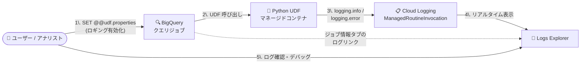

# BigQuery: Python UDF のリアルタイムログを Cloud Logging で表示可能に (GA)

**リリース日**: 2026-08-26

**サービス**: BigQuery

**機能**: Python UDF のリアルタイムログ表示 (Cloud Logging 連携)

**ステータス**: GA (一般提供)

📊 [このアップデートのインフォグラフィックを見る](https://takech9203.github.io/google-cloud-news-summary/20260826-bigquery-python-udf-realtime-logging.html)

## 概要

BigQuery の Python UDF (ユーザー定義関数) が生成するログを、Cloud Logging でリアルタイムに表示できる機能が一般提供 (GA) になりました。ロギングを有効化すると、Python の標準 `logging` ライブラリ (`logging.info`、`logging.error` など) を使って UDF 内部から出力したログが Cloud Logging に書き込まれ、コードの問題の特定と解決に活用できます。

Python UDF は、SQL クエリの中で Python のスカラー関数を実行できる機能で、PyPI のサードパーティライブラリのインストールや、Cloud リソース接続経由での外部サービスアクセスに対応しています。UDF は BigQuery マネージドリソース上のコンテナで実行されるため、これまで内部の実行状況を把握しづらいという課題がありました。今回の GA により、データエンジニアやアナリティクスエンジニアは、本番クエリを失敗させずに不正データの特定やエラーのデバッグを行えるようになります。

なお、意図しないデータ持ち出し (data exfiltration) を防ぐため、Python UDF のロギングはデフォルトで無効になっており、セッション単位で明示的に有効化する設計になっています。

**アップデート前の課題**

- Python UDF は BigQuery マネージドリソース上のコンテナで実行されるため、関数内部の実行時情報を確認する手段が限られ、問題の特定・解決が難しかった
- UDF 内で未処理の例外が発生するとクエリ全体が失敗するが、どの入力データが原因かを特定する仕組みがなかった
- Cloud Monitoring のメトリクス (CPU / メモリ使用率など) ではリソース状況は把握できても、コードレベルのデバッグ情報は得られなかった

**アップデート後の改善**

- Python の標準 `logging` ライブラリで出力したログを Cloud Logging でリアルタイムに確認できるようになった
- ログには `query_job_id` や `routine_id` などのラベルが付与され、特定のクエリジョブ・特定の UDF に絞り込んだフィルタリングが可能になった
- BigQuery コンソールのジョブ情報タブからワンクリックで Logs Explorer を開き、該当 UDF 呼び出しのログをそのまま参照できるようになった
- GA として一般提供され、本番環境のデバッグワークフローに組み込めるようになった

## アーキテクチャ図



セッションでロギングを有効化してクエリを実行すると、Python UDF 内の `logging` 呼び出しが Cloud Logging の `bigquery.googleapis.com/ManagedRoutineInvocation` リソースに書き込まれ、Logs Explorer でリアルタイムに確認できます。

## サービスアップデートの詳細

### 主要機能

1. **リアルタイムログの Cloud Logging への出力 (GA)**
   - ロギングを有効化すると、Python UDF が生成するログを Cloud Logging でリアルタイムに表示できる
   - Python 標準の `logging` ライブラリ (`logging.info`、`logging.error` など) を使用する。`print()` 関数はサポートされない

2. **セッション単位のオプトイン方式**
   - 意図しないデータ持ち出しを防ぐため、ロギングはデフォルトで無効
   - クエリ実行前に `SET @@udf.properties = JSON '{"enableDebugOutput": true}';` を実行して有効化する

3. **ラベルによる柔軟なフィルタリング**
   - ログは `bigquery.googleapis.com/ManagedRoutineInvocation` リソースに書き込まれ、プロジェクト、ロケーション、クエリジョブ ID、ルーティン ID などのラベルで絞り込める

4. **BigQuery コンソールからのシームレスな遷移**
   - クエリ結果ペインの「ジョブ情報」タブのログリンクから、該当 Python UDF 呼び出しのログを表示するクエリが事前入力された状態で Logs Explorer が開く

## 技術仕様

### ロギングリソースとラベル

| 項目 | 詳細 |
|------|------|
| ログリソースタイプ | `bigquery.googleapis.com/ManagedRoutineInvocation` |
| `resource_container` | クエリジョブが実行されたプロジェクトの ID |
| `location` | クエリジョブが実行されたロケーション |
| `query_job_id` | Python UDF を呼び出したクエリジョブの ID |
| `routine_project_id` | 呼び出されたルーティンが保存されているプロジェクト ID |
| `routine_dataset_id` | 呼び出されたルーティンが保存されているデータセット ID |
| `routine_id` | 呼び出されたルーティンの ID |

### ロギングの有効化

```sql
SET @@udf.properties = JSON '{"enableDebugOutput": true}';
```

クエリを実行する前に上記のステートメントをセッションで実行します。

## 設定方法

### 前提条件

1. Python UDF が作成済みであること (ランタイムは `python-3.11` のみサポート)
2. UDF 作成者には `roles/bigquery.dataEditor` (データセット)、`roles/bigquery.jobUser` (プロジェクト) などの IAM ロールが必要
3. ログの参照には Cloud Logging のログ閲覧権限が必要

### 手順

#### ステップ 1: ロギングを組み込んだ Python UDF を作成する

```sql
CREATE OR REPLACE FUNCTION `PROJECT_ID.DATASET_ID`.extract_user_email(payload STRING)
RETURNS STRING
LANGUAGE python
OPTIONS (entry_point='parse_email', runtime_version='python-3.11')
AS r"""
import json
import logging

def parse_email(payload):
  try:
    data = json.loads(payload)
    return data.get('email')
  except Exception as e:
    # 問題のあるデータとエラーを Cloud Logging に記録
    logging.info(f"Failed to parse payload: '{payload}'. Error: {e}")
    # None (BigQuery では NULL) を返してクエリの失敗を防ぐ
    return None
""";
```

UDF 内で例外を捕捉して `logging` で記録することで、クエリを失敗させずに不正な入力データを特定できます。

#### ステップ 2: ロギングを有効化してクエリを実行する

```sql
SET @@udf.properties = JSON '{"enableDebugOutput": true}';

SELECT `PROJECT_ID.DATASET_ID`.extract_user_email(raw_data) AS email
FROM UNNEST([
  '{"email": "cloudysanfrancisco@gmail.com", "event": "click"}',
  'corrupted_payload_string',
  '{"email": "baklavainthebalkans@gmail.com", "event": "view"}'
]) AS raw_data;
```

不正な行に対しては NULL が返され、クエリは正常に完了します。不正データの内容はログとして Cloud Logging に送信されます。

#### ステップ 3: Logs Explorer でログを確認する

1. クエリ結果ペインで「ジョブ情報」タブをクリックする
2. 「ログ」フィールドのリンクをクリックする
3. Python UDF 呼び出しのログを表示するクエリが事前入力された状態で Logs Explorer が開く

## メリット

### ビジネス面

- **データ品質問題の迅速な解決**: パースに失敗した不正データをログから特定できるため、上流データソースの品質改善サイクルを短縮できる
- **本番パイプラインの安定運用**: 例外処理とロギングを組み合わせることで、クエリを失敗させずに問題を記録・監視でき、パイプラインの信頼性が向上する

### 技術面

- **標準的なデバッグ体験**: Python 標準の `logging` ライブラリをそのまま使えるため、既存の Python 開発の知見を活かせる
- **ジョブ・ルーティン単位のトレーサビリティ**: `query_job_id` や `routine_id` ラベルにより、特定のクエリ実行に紐づくログだけを正確に抽出できる
- **観測性の統合**: Cloud Monitoring のメトリクス (CPU / メモリ使用率、同時リクエスト数) と Cloud Logging のログを組み合わせた総合的なトラブルシューティングが可能

## デメリット・制約事項

### 制限事項

- ロギングはデフォルトで無効。セッションごとに `SET @@udf.properties` で有効化する必要がある
- `print()` 関数はサポートされない (`logging` ライブラリの関数を使用する)
- Python UDF 自体の制限が適用される: サポートされるランタイムは `python-3.11` のみ、一時 UDF の作成不可、マテリアライズドビューでの使用不可、`JSON` / `RANGE` / `INTERVAL` / `GEOGRAPHY` 型は非サポートなど

### 考慮すべき点

- **機密データのロギングに注意**: ログの閲覧権限を持つユーザーは、BigQuery の元データへのアクセス権がなくてもログに記録されたデータをすべて閲覧できる。機密情報の出力は避ける
- **コスト管理**: ログは Cloud Logging に保存され、Google Cloud Observability の料金が適用される。ベストプラクティスとして、ロギングは例外・データ異常・特定のデバッグ期間に限定することが推奨されている

## ユースケース

### ユースケース 1: 不正データの特定とクエリ失敗の防止

**シナリオ**: JSON 文字列のカラムから特定フィールドを抽出する Python UDF を大規模テーブルに適用しているが、一部の行に破損したデータが含まれており、クエリ全体が失敗してしまう。

**実装例**: UDF 内で例外を捕捉して `logging.info` で問題のペイロードを記録し、`None` を返す (上記「設定方法」のコード例を参照)。

**効果**: クエリは NULL を返しつつ正常に完了し、破損データの内容は Cloud Logging から特定できる。パイプラインを止めずにデータ品質の問題を追跡できる。

### ユースケース 2: 外部 API 連携 UDF のデバッグ

**シナリオ**: Cloud リソース接続を使って外部サービスにアクセスする Python UDF で、断続的なエラーが発生している。どのリクエストで問題が起きているかを特定したい。

**効果**: `logging.error` でエラー詳細を記録し、`query_job_id` ラベルで該当ジョブのログのみを抽出することで、リソースメトリクスだけでは分からないコードレベルの原因を特定できる。

## 料金

Python UDF から Cloud Logging に記録されたログデータには [Google Cloud Observability の料金](https://cloud.google.com/products/observability/pricing) が適用されます。

| 項目 | 料金 | 無料枠 (月あたり) |
|------|------|-------------------|
| Logging ストレージ (取り込み) | $0.50/GiB (30 日間の保存を含む) | プロジェクトあたり 50 GiB |
| Logging 保持 (30 日超) | $0.01/GiB/月 | デフォルト保持期間内は無料 |

ロギングを例外や特定のデバッグ期間に限定することで、コストを抑制できます。

## 関連サービス・機能

- **Cloud Logging / Logs Explorer**: 本機能のログ出力先。ラベルフィルタリングとリアルタイム表示に対応
- **Cloud Monitoring**: Python UDF は `ManagedRoutineInvocation` リソースにメトリクス (CPU 使用率、メモリ使用率、最大同時リクエスト数) をエクスポートしており、ログと組み合わせた観測が可能。「BigQuery Managed Routine Query Monitoring」ダッシュボードも利用できる
- **BigQuery Cloud リソース接続**: Python UDF から外部サービスにアクセスする際に使用。外部連携 UDF のデバッグに本機能が有効
- **BigQuery SQL / JavaScript UDF**: Python UDF の代替となる UDF 実装方式

## 参考リンク

- 📊 [インフォグラフィック](https://takech9203.github.io/google-cloud-news-summary/20260826-bigquery-python-udf-realtime-logging.html)
- [公式リリースノート](https://docs.cloud.google.com/release-notes#August_26_2026)
- [ドキュメント: Python でユーザー定義関数を操作する](https://docs.cloud.google.com/bigquery/docs/user-defined-functions-python)
- [料金ページ (Google Cloud Observability)](https://cloud.google.com/products/observability/pricing)

## まとめ

BigQuery Python UDF のリアルタイムロギングが GA となり、これまでブラックボックスになりがちだった UDF 内部の挙動を Cloud Logging で直接確認できるようになりました。例外処理とロギングを組み合わせることで、クエリを失敗させずに不正データを特定する堅牢なパイプライン設計が可能になります。Python UDF を本番運用しているチームは、機密データをログに出力しないよう注意しつつ、デバッグワークフローへの組み込みを検討することをおすすめします。

---

**タグ**: BigQuery, Python UDF, Cloud Logging, デバッグ, オブザーバビリティ, GA
