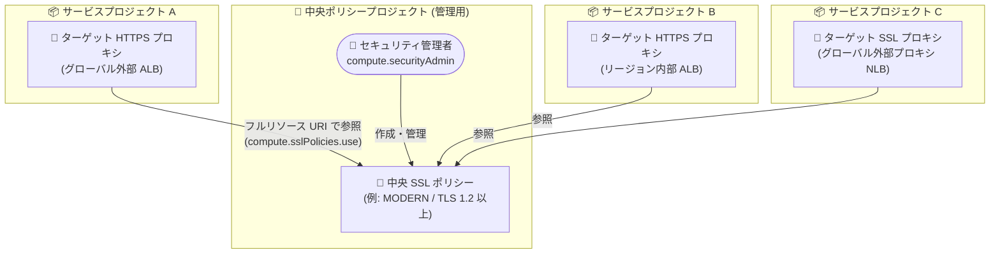

# Cloud Load Balancing: SSL ポリシーのクロスプロジェクト参照 (Preview)

**リリース日**: 2026-08-26

**サービス**: Cloud Load Balancing

**機能**: SSL ポリシーのクロスプロジェクト参照

**ステータス**: Preview

📊 [このアップデートのインフォグラフィックを見る](https://takech9203.github.io/google-cloud-news-summary/20260826-cloud-load-balancing-cross-project-ssl-policy.html)

## 概要

Application Load Balancer およびプロキシ Network Load Balancer で、SSL ポリシーのクロスプロジェクト参照 (cross-project referencing) が Preview として利用可能になりました。管理用プロジェクト (中央ポリシープロジェクト) で SSL ポリシーを一元的に定義・管理し、別のプロジェクト (サービスプロジェクト) のターゲット HTTPS プロキシやターゲット SSL プロキシからそのポリシーを参照できます。

この機能は、グローバル SSL ポリシーとリージョン SSL ポリシーの両方に対応しています。組織全体で標準化されたセキュリティ構成 (TLS の最小バージョンや許可する暗号スイートなど) を強制し、アプリケーションやチームごとの設定ドリフト (構成のばらつき) を排除したい組織に有用です。

対応するロードバランサーは以下のとおりです。

- グローバル外部 Application Load Balancer (グローバル SSL ポリシー)
- クロスリージョン内部 Application Load Balancer (グローバル SSL ポリシー)
- グローバル外部プロキシ Network Load Balancer (グローバル SSL ポリシー)
- リージョン外部 Application Load Balancer (リージョン SSL ポリシー)
- リージョン内部 Application Load Balancer (リージョン SSL ポリシー)

**アップデート前の課題**

- SSL ポリシーはロードバランサーのターゲットプロキシと同じプロジェクト内で定義・参照する必要があり、複数プロジェクトにまたがる環境では各プロジェクトに同等の SSL ポリシーを個別に作成・維持する必要があった
- プロジェクトごとにポリシーを複製して管理するため、TLS バージョンや暗号スイートの設定がチーム間・アプリケーション間で徐々にずれる「設定ドリフト」が発生しやすかった
- セキュリティ要件の変更 (例: TLS 最小バージョンの引き上げ) の際に、全プロジェクトのポリシーを個別に更新する運用負荷があった

**アップデート後の改善**

- 管理用プロジェクトで中央 SSL ポリシーを 1 つ定義し、複数のサービスプロジェクトのターゲット HTTPS プロキシ / ターゲット SSL プロキシから参照できるようになった
- SSL ポリシーの変更が中央の 1 か所で完結し、標準化されたセキュリティ構成を組織横断で強制できるようになった
- グローバル・リージョン両方の SSL ポリシーでクロスプロジェクト参照がサポートされ、`compute.sslPolicies.use` 権限による細かなアクセス制御 (ポリシーリソース単位での付与) が可能になった

## アーキテクチャ図



管理用プロジェクトで一元管理される SSL ポリシーを、複数のサービスプロジェクトのターゲットプロキシがフルリソース URI で参照する構成です。ポリシーの変更は中央の 1 か所で行うだけで全プロジェクトに反映されます。

## サービスアップデートの詳細

### 主要機能

1. **中央 SSL ポリシーの一元管理**
   - 管理用プロジェクト (中央ポリシープロジェクト) に SSL ポリシーを作成し、組織の標準として維持できる
   - 標準化されたセキュリティ構成を強制し、アプリケーションやチーム間の設定ドリフトを排除できる

2. **サービスプロジェクトからのクロスプロジェクト参照**
   - ターゲット HTTPS プロキシまたはターゲット SSL プロキシの作成時・更新時に、別プロジェクトの SSL ポリシーをフルリソース URI (`projects/POLICY_PROJECT_ID/global/sslPolicies/POLICY_NAME` など) で指定して参照できる
   - gcloud CLI と Terraform の両方で構成可能

3. **グローバル / リージョン SSL ポリシーの両対応**
   - グローバル SSL ポリシー: グローバル外部 ALB、クロスリージョン内部 ALB、グローバル外部プロキシ NLB でサポート
   - リージョン SSL ポリシー: リージョン外部 ALB、リージョン内部 ALB でサポート (ターゲットプロキシと SSL ポリシーは同一リージョンに配置)

## 技術仕様

### 対応ロードバランサーと SSL ポリシーのスコープ

| ロードバランサー | SSL ポリシーのスコープ |
|------|------|
| グローバル外部 Application Load Balancer | グローバル |
| クロスリージョン内部 Application Load Balancer | グローバル |
| グローバル外部プロキシ Network Load Balancer | グローバル |
| リージョン外部 Application Load Balancer | リージョン |
| リージョン内部 Application Load Balancer | リージョン |

### 必要な IAM ロールと権限

| スコープ | 必要なロール | 必要な権限 |
|------|------|------|
| 中央ポリシープロジェクト (中央 SSL ポリシーを保持) | ポリシーの作成・管理: `roles/compute.securityAdmin`、`roles/compute.networkAdmin`、または `roles/compute.loadBalancerAdmin`<br/>ポリシーのアタッチ: 上記ロールまたは `compute.sslPolicies.use` 権限を含むカスタムロール | `compute.sslPolicies.use` (特定の SSL ポリシーリソース単位で付与可能) |
| サービスプロジェクト (ロードバランサーのターゲットプロキシを保持) | `roles/compute.networkAdmin` または `roles/compute.loadBalancerAdmin` | `compute.targetHttpsProxies.create` / `update`、`compute.targetSslProxies.create` / `update` |

## 設定方法

### 前提条件

1. 中央ポリシープロジェクトに SSL ポリシーが作成されていること
2. クロスプロジェクト参照には SSL ポリシーのフルリソース URI を使用すること
3. 上記の IAM ロール・権限が中央ポリシープロジェクトとサービスプロジェクトの双方で適切に付与されていること

### 手順

#### ステップ 1: クロスプロジェクト SSL ポリシーを参照するターゲットプロキシを作成する

```bash
# グローバルターゲット HTTPS プロキシの作成
gcloud compute target-https-proxies create TARGET_HTTPS_PROXY_NAME \
    --url-map=URL_MAP_NAME \
    --ssl-certificates=SSL_CERTIFICATE_NAME \
    --ssl-policy=projects/POLICY_PROJECT_ID/global/sslPolicies/CENTRAL_SSL_POLICY_NAME \
    --project=SERVICE_PROJECT_ID

# リージョンターゲット HTTPS プロキシの作成
gcloud compute target-https-proxies create REGIONAL_TARGET_HTTPS_PROXY_NAME \
    --url-map=URL_MAP_NAME \
    --url-map-region=REGION \
    --ssl-certificates=SSL_CERTIFICATE_NAME \
    --ssl-policy=projects/POLICY_PROJECT_ID/regions/REGION/sslPolicies/CENTRAL_SSL_POLICY_NAME \
    --region=REGION \
    --project=SERVICE_PROJECT_ID
```

`--ssl-policy` に中央ポリシープロジェクトの SSL ポリシーのフルリソース URI を指定します。ターゲット SSL プロキシの場合は `gcloud compute target-ssl-proxies create` を使用します。

#### ステップ 2: 既存のターゲットプロキシに中央 SSL ポリシーをアタッチする

```bash
# グローバル HTTPS ロードバランサーの場合
gcloud compute target-https-proxies update TARGET_PROXY_NAME \
    --ssl-policy=projects/POLICY_PROJECT_ID/global/sslPolicies/CENTRAL_SSL_POLICY_NAME \
    --project=SERVICE_PROJECT_ID

# リージョン HTTPS ロードバランサーの場合
gcloud compute target-https-proxies update REGIONAL_TARGET_HTTPS_PROXY_NAME \
    --ssl-policy=projects/POLICY_PROJECT_ID/regions/REGION/sslPolicies/CENTRAL_SSL_POLICY_NAME \
    --region=REGION \
    --project=SERVICE_PROJECT_ID
```

既存のプロキシに対しては `update` コマンドでフルリソース URI を指定して中央ポリシーを参照させます。

#### ステップ 3: (オプション) Terraform で構成する

```hcl
# 中央ポリシープロジェクトの SSL ポリシー
resource "google_compute_ssl_policy" "central_policy" {
  name            = "CENTRAL_SSL_POLICY_NAME"
  project         = "POLICY_PROJECT_ID"
  profile         = "MODERN"
  min_tls_version = "TLS_1_2"
}

# サービスプロジェクトのターゲット HTTPS プロキシ
resource "google_compute_target_https_proxy" "default" {
  name             = "TARGET_HTTPS_PROXY_NAME"
  project          = "SERVICE_PROJECT_ID"
  url_map          = google_compute_url_map.default.id
  ssl_certificates = [google_compute_managed_ssl_certificate.default.id]
  ssl_policy       = google_compute_ssl_policy.central_policy.id
}
```

別チームや別の Terraform 構成で管理されている中央 SSL ポリシーを参照する場合は、`ssl_policy` フィールドにフルリソース URI の文字列を直接指定します。

## メリット

### ビジネス面

- **ガバナンスの強化**: 組織全体で標準化された TLS セキュリティ構成を強制でき、コンプライアンス要件への対応が容易になる
- **運用コストの削減**: セキュリティ要件の変更時に中央ポリシーを 1 回更新するだけで済み、プロジェクトごとの個別更新作業が不要になる

### 技術面

- **設定ドリフトの排除**: プロジェクトごとにポリシーを複製する必要がなくなり、チーム間・アプリケーション間の構成のばらつきを防止できる
- **きめ細かなアクセス制御**: `compute.sslPolicies.use` 権限を特定の SSL ポリシーリソース単位で付与でき、最小権限の原則に沿った運用が可能
- **IaC との親和性**: gcloud に加えて Terraform でもクロスプロジェクト参照を構成でき、中央ポリシーとサービスプロジェクトを別々の構成・チームで管理できる

## デメリット・制約事項

### 制限事項

- Preview 段階の機能であり、Pre-GA Offerings Terms が適用される。サポートが限定される可能性があり、本番環境での利用は慎重に判断する必要がある
- 特定の SSL バージョンや暗号スイートを無効化すると、一部の古いクライアントが HTTPS / SSL でプロキシに接続できなくなる可能性がある。CUSTOM プロファイルで広範な暗号スイートを無効化すると、どのクライアントも HTTPS をネゴシエートできなくなるおそれがある
- カスタムプロファイルは、ロードバランサーの証明書が使用するデジタル署名 (ECDSA または RSA) と互換性のある暗号スイートを有効にする必要がある (事前定義プロファイルは両方の署名タイプに対応)

### 考慮すべき点

- クロスプロジェクト参照には SSL ポリシーのフルリソース URI の指定が必須
- リージョン SSL ポリシーの場合、ターゲットプロキシと SSL ポリシーは同一リージョンである必要がある
- 中央ポリシープロジェクトとサービスプロジェクトの双方で適切な IAM ロール・権限の設計が必要

## ユースケース

### ユースケース 1: マルチプロジェクト環境での TLS セキュリティ基準の一元管理

**シナリオ**: 複数のチームがそれぞれ専用プロジェクトでアプリケーションを運用しており、セキュリティチームが組織全体の TLS 最小バージョンと暗号スイートを統一したい。

**実装例**:
```bash
# セキュリティチーム: 中央ポリシープロジェクトに標準ポリシーを作成
gcloud compute ssl-policies create org-standard-ssl-policy \
    --profile=MODERN \
    --min-tls-version=1.2 \
    --project=POLICY_PROJECT_ID

# 各アプリチーム: 自プロジェクトのプロキシから中央ポリシーを参照
gcloud compute target-https-proxies update my-app-proxy \
    --ssl-policy=projects/POLICY_PROJECT_ID/global/sslPolicies/org-standard-ssl-policy \
    --project=SERVICE_PROJECT_ID
```

**効果**: セキュリティチームが中央ポリシーを更新するだけで、全プロジェクトのロードバランサーに統一された TLS 構成が反映され、設定ドリフトを防止できる。

### ユースケース 2: コンプライアンス要件変更への迅速な対応

**シナリオ**: 新たなコンプライアンス要件により TLS 1.2 未満の無効化が必要になったが、対象のロードバランサーが多数のプロジェクトに分散している。

**効果**: 中央ポリシープロジェクトの SSL ポリシーを 1 回変更するだけで、参照しているすべてのサービスプロジェクトのターゲットプロキシに変更が適用され、プロジェクトごとの個別対応が不要になる。

## 料金

このアップデートに固有の料金情報はリリースノートおよびドキュメントに記載されていません。Cloud Load Balancing の料金の詳細は[料金ページ](https://cloud.google.com/vpc/network-pricing#lb)を参照してください。

## 関連サービス・機能

- **Compute Engine (SSL ポリシー)**: SSL ポリシーは Compute Engine のリソースであり、TLS の最小バージョンとプロファイル (COMPATIBLE / MODERN / RESTRICTED / CUSTOM) を定義する
- **Certificate Manager / SSL 証明書**: ターゲットプロキシには SSL ポリシーとあわせて SSL 証明書を構成する。証明書の署名タイプ (ECDSA / RSA) とポリシーの暗号スイートの互換性に注意が必要
- **IAM (Identity and Access Management)**: `compute.sslPolicies.use` 権限をポリシーリソース単位で付与することで、クロスプロジェクト参照のアクセス制御を実現する
- **クロスプロジェクトバックエンドサービス参照**: 共有 VPC 環境などでロードバランサーのコンポーネントをプロジェクト間で共有する類似機能。SSL ポリシーの参照とあわせてマルチプロジェクト構成の柔軟性を高める

## 参考リンク

- 📊 [インフォグラフィック](https://takech9203.github.io/google-cloud-news-summary/20260826-cloud-load-balancing-cross-project-ssl-policy.html)
- [公式リリースノート](https://docs.cloud.google.com/release-notes#August_26_2026)
- [Cross-project SSL policy referencing (概念ドキュメント)](https://docs.cloud.google.com/load-balancing/docs/ssl-policies-concepts#cross-project-referencing)
- [Configure cross-project SSL policy referencing (設定ガイド)](https://docs.cloud.google.com/load-balancing/docs/use-ssl-policies#configure-cross-project)
- [料金ページ](https://cloud.google.com/vpc/network-pricing#lb)

## まとめ

SSL ポリシーのクロスプロジェクト参照により、組織は TLS セキュリティ構成を管理用プロジェクトで一元管理し、複数プロジェクトにまたがる Application Load Balancer / プロキシ Network Load Balancer へ統一的に適用できるようになりました。マルチプロジェクト構成でロードバランサーを運用している組織は、Preview 段階であることを踏まえつつ、設定ドリフト排除とガバナンス強化の観点から検証を開始することを推奨します。

---

**タグ**: Cloud Load Balancing, SSL Policy, Application Load Balancer, Network Load Balancer, TLS, Security, Preview, Cross-Project
