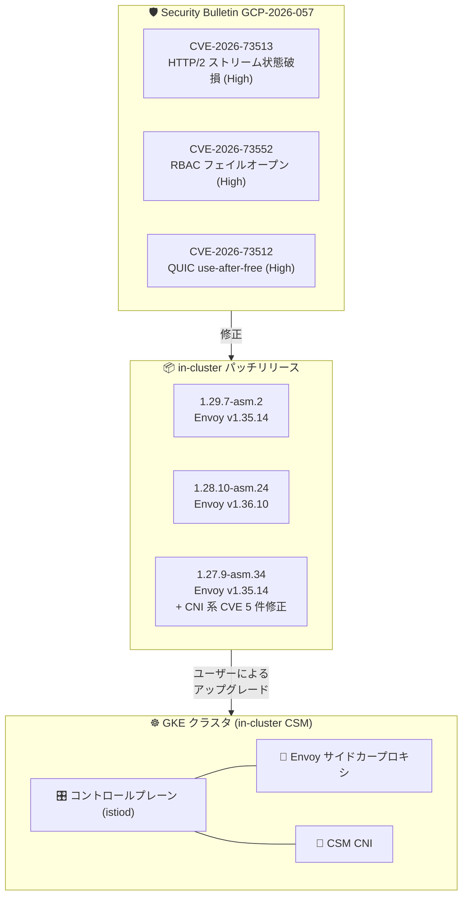

# Cloud Service Mesh: in-cluster 向けセキュリティパッチリリース (GCP-2026-057 対応) と Telemetry API トレースサンプリング設定のサポート

**リリース日**: 2026-08-26

**サービス**: Cloud Service Mesh (in-cluster)

**機能**: セキュリティパッチリリース (1.29.7-asm.2 / 1.28.10-asm.24 / 1.27.9-asm.34) および Telemetry API による `randomSamplingPercentage` 設定サポート

**ステータス**: Announcement / Fixed / Feature

📊 [このアップデートのインフォグラフィックを見る](https://takech9203.github.io/google-cloud-news-summary/20260826-cloud-service-mesh-in-cluster-security-updates.html)

## 概要

2026 年 8 月 26 日、in-cluster (クラスタ内コントロールプレーン) 版 Cloud Service Mesh に、セキュリティ情報 (Security Bulletin) **GCP-2026-057** に記載された脆弱性を解決する 3 つのパッチリリースが公開されました。対象バージョンは **1.29.7-asm.2** (Envoy v1.35.14)、**1.28.10-asm.24** (Envoy v1.36.10)、**1.27.9-asm.34** (Envoy v1.35.14) です。GCP-2026-057 では、Envoy の HTTP/2 ストリーム状態破損による異常終了 (CVE-2026-73513)、`safe_regex` マッチングにおける非 UTF-8 ヘッダー処理の不備により否定マッチングを使う RBAC ポリシーがフェイルオープンする問題 (CVE-2026-73552)、QUIC HTTP データグラムハンドラの use-after-free (CVE-2026-73512) という、いずれも重大度 High の脆弱性が修正されています。

各パッチにはプラットフォーム CVE の修正も含まれます。3 バージョン共通で CVE-2026-5704 (Proxy / Control Plane / CNI に影響、Medium 5.5) が修正され、1.27.9-asm.34 ではさらに CVE-2026-10536、CVE-2026-42151、CVE-2026-42154、CVE-2026-40179、CVE-2026-44903 の修正が含まれます。in-cluster 版はユーザー自身によるアップグレードが必要であり、v1.26 以前は EOL のため修正はバックポートされません。

また同日、`TRAFFIC_DIRECTOR` 実装を使用するクラスタ向けに、Telemetry API の `randomSamplingPercentage` フィールドによるトレースサンプリングレートの設定が **Rapid リリースチャンネル**でサポートされました。Cloud Trace のデフォルトサンプリングレート (1%) を 0.0〜100.0 の範囲で上書きできます。

**アップデート前の課題**

- Envoy に起因する 3 件の High 重大度の脆弱性 (RBAC ポリシーのフェイルオープン、HTTP/2 起因のプロセス異常終了、QUIC の use-after-free) がすべての Cloud Service Mesh バージョンに影響しており、in-cluster 版にはパッチ済みバージョンが存在しなかった
- `TRAFFIC_DIRECTOR` 実装のクラスタでは、Telemetry API による `randomSamplingPercentage` の上書きがサポートされておらず、Cloud Trace のサンプリングレートをデフォルトの 1% から変更できなかった

**アップデート後の改善**

- 1.29 / 1.28 / 1.27 の各サポートバージョンにパッチ済みリリースが提供され、クラスタをアップグレードすることで GCP-2026-057 の脆弱性を解消できるようになった
- Proxy / Control Plane / CNI コンポーネントに影響するプラットフォーム CVE (CVE-2026-5704 ほか) が修正された
- `TRAFFIC_DIRECTOR` 実装のクラスタでも、Rapid チャンネルで Telemetry API を使ったトレースサンプリングレートの調整 (0.0〜100.0%) が可能になった

## アーキテクチャ図



GCP-2026-057 で公表された Envoy 関連の脆弱性は、in-cluster Cloud Service Mesh の各サポートバージョン向けパッチリリースで修正されます。in-cluster 版はマネージド版と異なり自動更新されないため、ユーザー自身でクラスタのコントロールプレーン・プロキシ・CNI をアップグレードする必要があります。

## サービスアップデートの詳細

### 主要機能

1. **セキュリティパッチリリース (GCP-2026-057 対応)**
   - 1.29.7-asm.2 (Envoy v1.35.14)、1.28.10-asm.24 (Envoy v1.36.10)、1.27.9-asm.34 (Envoy v1.35.14) が in-cluster Cloud Service Mesh 向けに公開
   - GCP-2026-057 に記載された 3 件の High 重大度の脆弱性 (CVE-2026-73513、CVE-2026-73552、CVE-2026-73512) を解決
   - すべての Cloud Service Mesh バージョンがこれらの CVE の影響を受けるため、パッチ済みバージョンへのアップグレードが必要

2. **プラットフォーム CVE の修正**
   - 3 バージョン共通: CVE-2026-5704 (Proxy / Control Plane / CNI に影響、Medium 5.5)
   - 1.27.9-asm.34 のみ追加で 5 件: CVE-2026-10536 (Proxy / Control Plane / CNI)、CVE-2026-42151 (CNI、High 7.5)、CVE-2026-42154 (CNI、High 7.5)、CVE-2026-40179 (CNI、Medium 6.1)、CVE-2026-44903 (CNI、Medium 6.1)

3. **Telemetry API による trace サンプリングレート設定 (TRAFFIC_DIRECTOR 実装)**
   - `TRAFFIC_DIRECTOR` 実装を使用するクラスタで、Telemetry API の `randomSamplingPercentage` によるトレースサンプリングレート設定が Rapid リリースチャンネルでサポート
   - デフォルトのサンプリングレートは 1% で、0.0〜100.0 の値で上書き可能

## 技術仕様

### パッチリリース一覧

| パッチバージョン | Envoy バージョン | 修正されるプラットフォーム CVE |
|------|------|------|
| 1.29.7-asm.2 | v1.35.14 | CVE-2026-5704 |
| 1.28.10-asm.24 | v1.36.10 | CVE-2026-5704 |
| 1.27.9-asm.34 | v1.35.14 | CVE-2026-10536、CVE-2026-42151、CVE-2026-42154、CVE-2026-40179、CVE-2026-44903、CVE-2026-5704 |

### Security Bulletin GCP-2026-057 の脆弱性 (Envoy 関連)

| CVE | 内容 | 重大度 |
|------|------|------|
| CVE-2026-73513 | 信頼できないアップストリームが END_STREAM フラグなしの HTTP/2 レスポンストレーラーを oghttp2 インスタンスに送信すると、ストリーム状態が破損しプロセスが異常終了する問題 | High |
| CVE-2026-73552 | `safe_regex` マッチングが非 UTF-8 の HTTP ヘッダーバイトを通常の不一致として扱い、否定マッチングロジックを使用する RBAC ポリシーがフェイルオープンする問題 | High |
| CVE-2026-73512 | QUIC HTTP データグラムハンドラにおける use-after-free。Capsule Protocol を使用するリクエストのストリームデコーダーが、遅延した HTTP/3 データグラムから参照されている間に破棄される問題 | High |

### プラットフォーム CVE の影響コンポーネント (リリースノート記載)

| CVE | Proxy | Control Plane | Distroless | CNI | 重大度 |
|------|------|------|------|------|------|
| CVE-2026-5704 (全バージョン) | Yes | Yes | No | Yes | Medium (5.5) |
| CVE-2026-10536 (1.27.9-asm.34) | Yes | Yes | No | Yes | Low (9.8) ※リリースノート記載のまま |
| CVE-2026-42151 (1.27.9-asm.34) | No | No | No | Yes | High (7.5) |
| CVE-2026-42154 (1.27.9-asm.34) | No | No | No | Yes | High (7.5) |
| CVE-2026-40179 (1.27.9-asm.34) | No | No | No | Yes | Medium (6.1) |
| CVE-2026-44903 (1.27.9-asm.34) | No | No | No | Yes | Medium (6.1) |

### Telemetry API によるサンプリングレート設定

| 項目 | 詳細 |
|------|------|
| 対象実装 | `TRAFFIC_DIRECTOR` 実装を使用するクラスタ |
| リリースチャンネル | Rapid のみ |
| 設定フィールド | `randomSamplingPercentage` (Telemetry API) |
| 設定可能範囲 | 0.0〜100.0 |
| デフォルト値 | 1% |
| 注意事項 | マネージド Traffic Director コントロールプレーンでは、ルート名前空間の単一の Istio Telemetry API カスタムリソースによるクラスタ全体設定のみサポート。複数の Telemetry CR をデプロイした場合、最初の 1 つのみ有効 |

## 設定方法

### 前提条件

1. in-cluster Cloud Service Mesh 1.27 以降を使用していること (v1.26 以前は EOL のため修正がバックポートされず、v1.27 以降へのアップグレードが必要)
2. Telemetry API によるサンプリングレート設定を使用する場合は、`TRAFFIC_DIRECTOR` 実装かつ Rapid リリースチャンネルであること

### 手順

#### ステップ 1: パッチバージョンへのアップグレード

[Upgrade Cloud Service Mesh](https://docs.cloud.google.com/service-mesh/docs/upgrade/upgrade) の手順に従い、使用中のマイナーバージョンに対応するパッチ済みバージョン (1.29.7-asm.2 / 1.28.10-asm.24 / 1.27.9-asm.34) にクラスタをアップグレードします。

#### ステップ 2: (任意) Telemetry API でトレースサンプリングレートを設定

```bash
cat <<EOF | kubectl apply -n istio-system -f -
apiVersion: telemetry.istio.io/v1alpha1
kind: Telemetry
metadata:
  name: enable-cloud-trace
  namespace: istio-system
spec:
  tracing:
  - providers:
    - name: stackdriver
    randomSamplingPercentage: 100.0
EOF
```

上記はサンプリングレートを 100% に設定する例です (通常はデモやトラブルシューティング用途のみ)。本番環境では要件に応じた値 (0.0〜100.0) を設定します。

## メリット

### ビジネス面

- **セキュリティリスクの低減**: RBAC ポリシーのフェイルオープン (認可バイパスにつながる可能性) やプロセス異常終了 (可用性低下) といった High 重大度の脆弱性を解消し、コンプライアンス要件への対応を維持できる
- **可観測性コストの最適化**: トレースサンプリングレートを要件に合わせて調整することで、Cloud Trace の取り込み量とコストをコントロールできる

### 技術面

- **サポート中の全マイナーバージョンにパッチ提供**: 1.27 / 1.28 / 1.29 のいずれを使用していても、メジャーアップグレードなしでセキュリティ修正を適用できる
- **TRAFFIC_DIRECTOR 実装での柔軟なトレース設定**: 従来デフォルト 1% 固定だったサンプリングレートを Telemetry API で宣言的に変更でき、Istio 標準の Telemetry API と整合した運用が可能

## デメリット・制約事項

### 制限事項

- in-cluster 版はマネージド版と異なり自動更新されないため、ユーザー自身によるアップグレード作業が必要
- Cloud Service Mesh v1.26 以前は EOL であり、GCP-2026-057 の修正はバックポートされない (v1.27 以降へのアップグレードが必須)
- `randomSamplingPercentage` の上書きは、`TRAFFIC_DIRECTOR` 実装では Rapid リリースチャンネルのみのサポート

### 考慮すべき点

- マネージド Cloud Service Mesh を使用している場合は、MSA の指示に従う (全バージョンがサポート対象で、今後数週間かけて自動的に更新される)
- マネージド Traffic Director コントロールプレーンでは Telemetry API CR はクラスタ全体で 1 つのみ有効なため、既存の Telemetry CR がある場合は設定を新しい CR に統合する必要がある
- サンプリングレートを高く設定すると Cloud Trace の取り込み量 (および料金) が増加するため、本番環境では適切な値を選定する

## ユースケース

### ユースケース 1: セキュリティ運用としての計画的アップグレード

**シナリオ**: 金融系サービスで in-cluster Cloud Service Mesh 1.28 を運用しており、RBAC ポリシーの否定マッチングでアクセス制御を実装している。CVE-2026-73552 によりポリシーがフェイルオープンするリスクがある。

**効果**: 1.28.10-asm.24 へのアップグレードにより、認可バイパスの可能性を排除し、HTTP/2 起因のプロキシ異常終了リスクも解消できる。

### ユースケース 2: 障害調査時のトレースサンプリングレート引き上げ

**シナリオ**: `TRAFFIC_DIRECTOR` 実装 (Rapid チャンネル) のクラスタで、特定サービス間のレイテンシ問題を調査したいが、デフォルト 1% のサンプリングでは十分なトレースが収集できない。

**実装例**:
```yaml
apiVersion: telemetry.istio.io/v1alpha1
kind: Telemetry
metadata:
  name: enable-cloud-trace
  namespace: istio-system
spec:
  tracing:
  - providers:
    - name: stackdriver
    randomSamplingPercentage: 50.0
```

**効果**: 調査期間中のみサンプリングレートを引き上げて詳細なトレースを収集し、調査完了後に元の値へ戻すといった柔軟な運用が可能になる。

## 料金

Cloud Service Mesh は GKE Enterprise に含まれる形態と、スタンドアロンサービスとしての利用形態があります。GKE Enterprise サブスクライバーは Cloud Service Mesh に対して個別課金されません。パッチアップグレード自体に追加料金は発生しません。詳細は料金ページを参照してください。

- [Cloud Service Mesh の料金](https://cloud.google.com/service-mesh/pricing)

なお、トレースサンプリングレートを引き上げると Cloud Trace のスパン取り込み量が増加し、[Cloud Trace の料金](https://cloud.google.com/stackdriver/pricing) に影響する点に注意してください。

## 関連サービス・機能

- **Google Kubernetes Engine (GKE)**: in-cluster Cloud Service Mesh の実行基盤。パッチ適用はクラスタ単位のアップグレード作業として実施する
- **Cloud Trace**: Telemetry API の `stackdriver` プロバイダを通じて分散トレースを収集。今回のアップデートで `TRAFFIC_DIRECTOR` 実装でもサンプリングレートを調整可能になった
- **マネージド Cloud Service Mesh**: in-cluster 版と異なり、GCP-2026-057 への対応は自動更新で提供される (全バージョンがサポート対象)
- **Certificate Authority Service**: Cloud Service Mesh の mTLS 証明書発行の代替 CA として統合可能 (別課金)

## 参考リンク

- 📊 [インフォグラフィック](https://takech9203.github.io/google-cloud-news-summary/20260826-cloud-service-mesh-in-cluster-security-updates.html)
- [公式リリースノート (2026 年 8 月 26 日)](https://docs.cloud.google.com/release-notes#August_26_2026)
- [Security Bulletin (Cloud Service Mesh)](https://docs.cloud.google.com/service-mesh/docs/security-bulletins)
- [Upgrade Cloud Service Mesh](https://docs.cloud.google.com/service-mesh/docs/upgrade/upgrade)
- [Accessing Cloud Trace (Telemetry API 設定)](https://docs.cloud.google.com/service-mesh/docs/observability/accessing-traces)
- [Cloud Service Mesh の料金](https://cloud.google.com/service-mesh/pricing)

## まとめ

GCP-2026-057 には RBAC ポリシーのフェイルオープンなど認可・可用性に直結する High 重大度の脆弱性が含まれており、in-cluster Cloud Service Mesh を運用しているすべてのクラスタで、対応パッチバージョン (1.29.7-asm.2 / 1.28.10-asm.24 / 1.27.9-asm.34) への速やかなアップグレードが推奨されます。v1.26 以前は EOL のため、まず v1.27 以降への移行を計画してください。あわせて、`TRAFFIC_DIRECTOR` 実装 (Rapid チャンネル) ではトレースサンプリングレートの調整が可能になったため、可観測性要件とコストのバランスを見直す良い機会です。

---

**タグ**: #CloudServiceMesh #Security #CVE #Envoy #GKE #Istio #CloudTrace #TelemetryAPI
