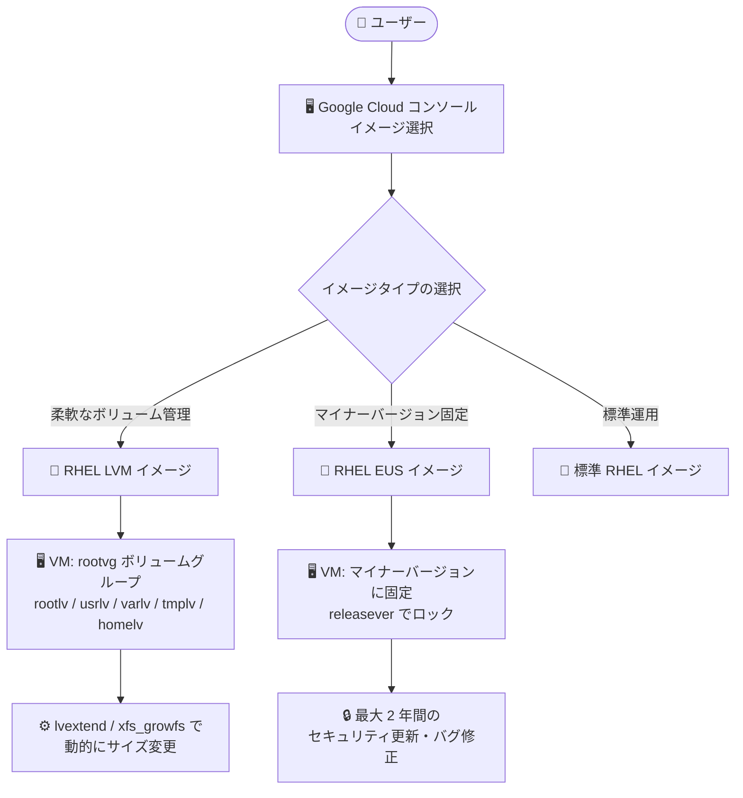

# Compute Engine: RHEL LVM パーティショニング事前構成イメージと RHEL EUS イメージが GA

**リリース日**: 2026-08-26

**サービス**: Compute Engine

**機能**: RHEL LVM 事前構成イメージ / RHEL Extended Update Support (EUS) イメージ

**ステータス**: GA (一般提供) × 2 件

📊 [このアップデートのインフォグラフィックを見る](https://takech9203.github.io/google-cloud-news-summary/20260826-compute-engine-rhel-lvm-eus-images-ga.html)

## 概要

Compute Engine で、Red Hat Enterprise Linux (RHEL) に関する 2 つのイメージ提供が一般提供 (GA) となりました。いずれも Google Cloud コンソールから直接選択して VM を作成できます。

1 つ目は、**Logical Volume Manager (LVM) パーティショニングが事前構成された RHEL イメージ**です。LVM 対応イメージを使用すると、ブートディスク上のボリュームを柔軟に管理し、パーティションのサイズを動的に変更できます。`/`、`/usr`、`/var`、`/tmp`、`/home` がそれぞれ独立した Logical Volume として構成済みで、`lvm2` パッケージもインストール済みです。

2 つ目は、**RHEL Extended Update Support (EUS) イメージ**です。EUS イメージを使用すると、VM を特定のマイナーバージョン (ポイントリリース) に固定したまま、最大 2 年間にわたり重要なセキュリティアップデートとバグ修正を受け取れます。エンタープライズ環境で求められる「OS バージョンを固定しつつセキュリティを維持する」運用を、Google が構築・提供する公式イメージで実現できます。

**アップデート前の課題**

- Compute Engine の標準 RHEL イメージは LVM を使用しないパーティション構成であり、LVM を利用したい場合はセカンダリディスクの利用、パーティションの手動リサイズ、LVM ベースのカスタムイメージのインポートや既存 VM の移行といった回避策が必要だった
- 標準の RHEL イメージは常に最新のポイントリリースのパッケージでビルドされており、VM を特定のポイントリリースに固定 (ピン留め) することができなかった
- マイナーバージョンを固定したい場合、アプリケーションの認証要件や検証済み構成の維持と、セキュリティアップデートの適用を両立させる運用負荷が高かった

**アップデート後の改善**

- LVM パーティショニングが事前構成された RHEL イメージを Google Cloud コンソールから選択するだけで、Logical Volume の動的な拡張・追加が可能なブートディスク構成の VM を作成できるようになった
- RHEL EUS イメージにより、VM を特定のマイナーバージョンにロックしたまま、最大 2 年間の重要なセキュリティアップデートとバグ修正を受け取れるようになった
- いずれも Google が Red Hat とのパートナーシップのもとで構築・サポートする公式イメージとして、PAYG (従量課金) ライセンス付きで利用できる

## アーキテクチャ図



Google Cloud コンソールでのイメージ選択から VM 構成までの流れを示しています。LVM イメージは Logical Volume による柔軟なディスク管理を、EUS イメージはマイナーバージョン固定と長期のセキュリティ更新を提供します。

## サービスアップデートの詳細

### 主要機能

1. **LVM パーティショニング事前構成イメージ (GA)**
   - EFI システムパーティション (200 MB)、`/boot` パーティション (1 GB, XFS) に加え、ディスクの大部分を単一の LVM Physical Volume として構成し、`rootvg` という Volume Group に割り当て
   - `rootvg` 内にデフォルトで 5 つの Logical Volume を作成: `rootlv` (`/`, 2.0 GB)、`usrlv` (`/usr`, 10.0 GB)、`varlv` (`/var`, 8.0 GB)、`tmplv` (`/tmp`, 2.0 GB)、`homelv` (`/home`, 1.0 GB)、いずれも XFS
   - 残りのディスク領域は未割り当てのまま残され、新しい Logical Volume の作成や既存 LV の拡張に利用可能
   - `lvm2` パッケージがデフォルトでインストール済み (`pvcreate`、`vgcreate`、`lvcreate`、`lvextend`、`xfs_growfs` など)

2. **RHEL EUS イメージ (GA)**
   - VM を特定のマイナーバージョン (例: 9.6) にロックしたまま、最大 2 年間の重要なセキュリティアップデートとバグ修正を受領可能
   - 各 EUS イメージにはベース RHEL OS のライセンスと EUS のライセンスの 2 つが含まれる
   - EUS バージョンが EOL に達する前に、次の EUS バージョンへのアップグレードが必要 (`sudo dnf -y --releasever=VERSION upgrade`)
   - RHEL 10.2 EUS には out-of-tree (OOT) の gVNIC ドライバを含む追加オファリングも提供 (RHEL 10.4 以降は標準搭載予定)

3. **Google Cloud コンソールからの利用**
   - いずれのイメージも Google Cloud コンソールのイメージ選択画面から直接選択して VM を作成可能
   - PAYG (On-demand) と BYOS (Red Hat Cloud Access によるサブスクリプション持ち込み) の両ライセンスモデルに対応

## 技術仕様

### LVM イメージのデフォルトパーティション構成

| 項目 | 詳細 |
|------|------|
| EFI システムパーティション | 200 MB (ブートローダーファイル用) |
| `/boot` パーティション | 1 GB (XFS、カーネルイメージ用) |
| LVM Physical Volume | ディスクの大部分を使用、Volume Group 名は `rootvg` |
| `rootlv` (`/`) | 2.0 GB (XFS) |
| `usrlv` (`/usr`) | 10.0 GB (XFS) |
| `varlv` (`/var`) | 8.0 GB (XFS) |
| `tmplv` (`/tmp`) | 2.0 GB (XFS) |
| `homelv` (`/home`) | 1.0 GB (XFS) |
| 未割り当て領域 | 残り全域 (LV の新規作成・拡張用) |
| 推奨最小ディスクサイズ | 50 GB |

### 標準 RHEL イメージとの主な違い (LVM イメージ)

| 項目 | 標準 RHEL イメージ | LVM イメージ |
|------|-------------------|-------------|
| ディスク自動拡張 | `gce-disk-expand` により自動拡張 | 自動拡張なし (LVM コマンドで手動拡張) |
| ファイルシステムレイアウト | 単一ルートパーティション | `/`、`/usr`、`/var` などが独立した LV |
| LVM ツール | なし | `lvm2` パッケージ標準搭載 |
| 追加ライセンス | なし | `rhel-lvm` ライセンスが付与される |

### EUS イメージのバージョン管理

```bash
# 現在の EUS バージョン (releasever) を確認
cat /etc/dnf/vars/releasever

# 特定のポイントリリースにロック (例: 9.6)
echo "9.6" | sudo tee /etc/dnf/vars/releasever

# 次の EUS バージョンへアップグレード
sudo dnf -y --releasever=9.8 upgrade
```

## 設定方法

### 前提条件

1. Google Cloud プロジェクトと Compute Engine API の有効化
2. RHEL イメージはプレミアムイメージのため、追加のライセンス料金が発生することを理解しておく (BYOS の場合は Red Hat Cloud Access サブスクリプションが必要)
3. LVM イメージを使用する場合、推奨最小ディスクサイズは 50 GB

### 手順

#### ステップ 1: Google Cloud コンソールでイメージを選択して VM を作成

Google Cloud コンソールの [VM インスタンスの作成] 画面で、ブートディスクの OS として Red Hat Enterprise Linux を選択し、バージョン一覧から LVM 対応イメージまたは EUS イメージを選択します。

#### ステップ 2 (LVM イメージ): ディスク拡張後に Logical Volume を拡張

LVM イメージには `gce-disk-expand` パッケージが含まれないため、ブートディスクをリサイズしても Logical Volume は自動的に拡張されません。標準の LVM コマンドで手動拡張します。

```bash
# 例: varlv を 20 GB 拡張し、XFS ファイルシステムも拡張
sudo lvextend -L +20G /dev/rootvg/varlv
sudo xfs_growfs /var
```

#### ステップ 3 (EUS イメージ): マイナーバージョンのロックを確認

```bash
# releasever にロックされているバージョンを確認
cat /etc/dnf/vars/releasever

# セキュリティアップデートの適用 (ロックされたバージョン内)
sudo dnf update
```

## メリット

### ビジネス面

- **運用負荷の軽減**: LVM のカスタム構成やカスタムイメージのインポートが不要になり、公式イメージの選択だけで運用を開始できる
- **コンプライアンス・安定性の確保**: EUS により、アプリケーションの認証要件や検証済み構成を維持したまま最大 2 年間セキュリティ更新を受けられる
- **柔軟なライセンスモデル**: PAYG (秒単位課金、1 分の最低課金) と BYOS の両方に対応し、既存の Red Hat サブスクリプションも活用可能

### 技術面

- **動的なボリューム管理**: Logical Volume の拡張・追加により、再起動やディスクの再作成なしにパーティションレイアウトを柔軟に変更できる
- **障害範囲の分離**: `/var` や `/tmp` が独立した LV のため、ログ肥大などによるルートファイルシステム枯渇のリスクを分離できる
- **バージョン固定と更新の両立**: `releasever` によるマイナーバージョンロックと dnf によるセキュリティ更新の仕組みが構成済み

## デメリット・制約事項

### 制限事項

- LVM イメージには `gce-disk-expand` パッケージが含まれず、ブートディスクをリサイズしても Logical Volume は自動拡張されない (LVM コマンドによる手動操作が必要)
- LVM は Google Cloud が提供する一部の RHEL イメージでのみ利用可能で、他の Linux OS イメージでは提供されない
- EUS イメージは、EUS バージョンが EOL に達する前に次の EUS バージョンへのアップグレードが必要
- RHEL EUS イメージのインポート (ディスク / 仮想アプライアンス / マシンイメージ) はサポートされない

### 考慮すべき点

- LVM イメージの推奨最小ディスクサイズは 50 GB
- EUS イメージにはベース RHEL ライセンスに加えて EUS ライセンスが付与されるため、ライセンスコストを考慮する
- RHEL のライセンス要件遵守のため、Google は課金エンティティ名、リージョン、国、SKU、合計使用時間を Red Hat に報告する

## ユースケース

### ユースケース 1: ログ領域が増減するエンタープライズワークロード

**シナリオ**: データベースやアプリケーションサーバーで `/var` のログ・データ領域が将来的に増加する見込みがあり、ダウンタイムなしでパーティションを拡張したい。

**実装例**:
```bash
# ブートディスクをリサイズ後、未割り当て領域から varlv を拡張
sudo pvresize /dev/sda3
sudo lvextend -L +50G /dev/rootvg/varlv
sudo xfs_growfs /var
```

**効果**: VM を停止せずにパーティションを動的に拡張でき、ディスクの再作成やデータ移行が不要になる。

### ユースケース 2: 認証済み構成を維持する基幹システム

**シナリオ**: ISV アプリケーションが RHEL の特定マイナーバージョンでのみ認証されており、OS のマイナーバージョンアップによる互換性リスクを避けつつ、セキュリティパッチは適用し続けたい。

**効果**: EUS イメージにより VM をマイナーバージョンに固定したまま最大 2 年間セキュリティアップデートを受領でき、アプリケーション認証と脆弱性対応を両立できる。

## 料金

RHEL イメージはプレミアムイメージであり、Compute Engine のインフラストラクチャ料金に加えて OS ライセンス料金が発生します。

- **PAYG (On-demand)**: ライセンス料金は 1 秒単位で課金され、最低課金時間は 1 分。2024 年 7 月以降の料金モデルでは、RHEL のサブスクリプションコストは vCPU 数に応じてスケールする
- **EUS イメージ**: ベース RHEL OS のライセンスと EUS のライセンスの 2 つが含まれる
- **LVM イメージ**: LVM を使用する場合、`rhel-lvm` ライセンスが追加で付与される
- **BYOS**: Red Hat Cloud Access で既存サブスクリプションを持ち込む場合、Google Cloud にはインフラストラクチャ費用のみを支払う

具体的な料金は [プレミアムイメージの料金ページ](https://docs.cloud.google.com/compute/disks-image-pricing#premiumimages) を参照してください。

## 関連サービス・機能

- **Compute Engine Persistent Disk / Hyperdisk**: ブートディスクのリサイズと組み合わせて、LVM で未割り当て領域を Logical Volume に割り当てる
- **Red Hat Cloud Access (BYOS)**: 既存の Red Hat サブスクリプションを Compute Engine に持ち込むライセンスモデル
- **RHEL for SAP イメージ**: SAP ワークロード向けに特定ポイントリリースへタグ付けされた RHEL イメージ (EUS と同様にバージョン固定の要件に対応)
- **Red Hat Knowledgebase SSO**: Google Cloud コンソールから SSO で Red Hat のナレッジベースにアクセス可能

## 参考リンク

- 📊 [インフォグラフィック](https://takech9203.github.io/google-cloud-news-summary/20260826-compute-engine-rhel-lvm-eus-images-ga.html)
- [公式リリースノート](https://docs.cloud.google.com/release-notes#August_26_2026)
- [オペレーティングシステムの詳細 (RHEL)](https://docs.cloud.google.com/compute/docs/images/os-details)
- [Red Hat Enterprise Linux FAQ](https://docs.cloud.google.com/compute/docs/images/premium/rhel-faq)
- [ディスクとイメージの料金 (プレミアムイメージ)](https://docs.cloud.google.com/compute/disks-image-pricing#premiumimages)
- [Red Hat EUS Overview (Red Hat)](https://access.redhat.com/articles/rhel-eus)

## まとめ

LVM 事前構成イメージと EUS イメージの GA により、Compute Engine 上の RHEL 運用における「柔軟なディスク管理」と「マイナーバージョン固定 + 長期セキュリティ更新」という 2 つのエンタープライズ要件が、公式イメージの選択だけで満たせるようになりました。カスタムイメージのインポートや手動 LVM 構成で対応していた場合は、これらの公式イメージへの移行を検討してください。EUS 利用時はライセンスコストと EOL 前のバージョンアップグレード計画も併せて確認することを推奨します。

---

**タグ**: #ComputeEngine #RHEL #LVM #EUS #GA #プレミアムイメージ #OSイメージ
