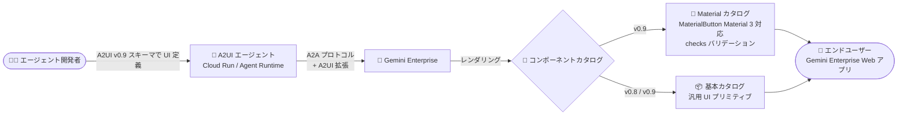

# Gemini Enterprise: A2UI v0.9 Material カタログのコンポーネントプロパティ更新

**リリース日**: 2026-08-26

**サービス**: Gemini Enterprise

**機能**: A2UI v0.9 Material カタログのコンポーネントプロパティとスキーマの更新

**ステータス**: Feature

📊 [このアップデートのインフォグラフィックを見る](https://takech9203.github.io/google-cloud-news-summary/20260826-gemini-enterprise-a2ui-v0-9-material-catalog.html)

## 概要

Gemini Enterprise の A2UI コンポーネントギャラリーリファレンスが更新され、最新の A2UI バージョン v0.9 における Material カタログのコンポーネントプロパティとスキーマが反映されました。A2UI (Agent to UI) は、エージェントがカスタム UI を Gemini Enterprise 上にレンダリングするためのプロトコルで、Material カタログは Google Material Design ガイドラインに準拠したリッチな UI コンポーネント群を提供します (v0.9 構成でサポート)。

今回の更新の中心は、`MaterialButton` への Material 3 スタイリングプロパティの追加と新しいバリアントの導入、および入力系コンポーネント全般における静的な `required` プロパティからリアクティブな `checks` バリデーションルール配列への移行です。あわせて、廃止された color プロパティおよび ARIA description プロパティの削除、`MaterialIcon` / `MaterialChips` へのプロパティ追加、レイアウトと入力タイプに関するドキュメントの拡充が行われています。

A2UI エージェントを開発し Gemini Enterprise に登録している開発者や、これから A2UI v0.9 でカスタム UI を構築する開発者にとって、UI スキーマ設計の指針となる重要な更新です。

**アップデート前の課題**

- `MaterialButton` は Material 3 の外観 (filled、tonal、elevated など) を直接指定するプロパティを持たず、アイコンボタンや FAB (フローティングアクションボタン) のバリアントも用意されていなかった
- 入力コンポーネントの必須チェックは静的な `required` ブールプロパティに依存しており、入力値に応じた動的なバリデーションを表現できなかった
- `MaterialColumn` / `MaterialRow` の `justify` に指定できる値や、`MaterialInput` で許可される入力タイプがドキュメント上で網羅されていなかった

**アップデート後の改善**

- `MaterialButton` に Material 3 スタイリングプロパティ (`appearance`、`disableRipple`、`extended`) と新バリアント (`icon`、`fab`、`mini-fab`) が追加され、Material 3 準拠の表現力の高いボタン UI を宣言的に定義できるようになった
- `MaterialCheckbox`、`MaterialDatepicker`、`MaterialInput`、`MaterialSelect`、`MaterialTimepicker` の静的な `required` プロパティが、リアクティブな `checks` バリデーションルール配列に置き換えられた
- `MaterialIcon` に `tooltip` プロパティ、`MaterialChips` に `action` プロパティが追加された
- `MaterialColumn` / `MaterialRow` でサポートされるすべての `justify` 値 (`start`、`center`、`end`、`spaceBetween`、`spaceAround`、`spaceEvenly`) と、`MaterialInput` の許可された入力タイプがドキュメント化された
- 廃止された color プロパティと ARIA description プロパティが削除され、スキーマが整理された

## アーキテクチャ図



A2UI エージェントは A2A プロトコル経由で Gemini Enterprise と通信し、v0.9 構成では今回更新された Material カタログコンポーネントを使ってカスタム UI をユーザーにレンダリングします。

## サービスアップデートの詳細

### 主要機能

1. **MaterialButton の Material 3 対応**
   - スタイリングプロパティを追加: `appearance` (`text` / `filled` / `elevated` / `outlined` / `tonal`)、`disableRipple` (クリック時のリップルエフェクト無効化)、`extended` (ラベルやアイコンスペースを拡張)
   - 新バリアントを追加: `icon`、`fab`、`mini-fab` (既存の `raised` / `flat` / `stroked` / `basic` に加えて選択可能)
   - 廃止された color プロパティと ARIA description プロパティを削除

2. **バリデーションの刷新 (`required` → `checks`)**
   - 入力系コンポーネント (`MaterialCheckbox`、`MaterialDatepicker`、`MaterialInput`、`MaterialSelect`、`MaterialTimepicker`) の静的な `required` ブールプロパティを、リアクティブな `checks` バリデーションルール配列に置き換え
   - 単純な必須指定にとどまらず、ルールベースの検証をスキーマで表現可能に

3. **MaterialIcon / MaterialChips のプロパティ追加**
   - `MaterialIcon`: ホバー / フォーカス時に表示される `tooltip` プロパティを追加
   - `MaterialChips`: `action` プロパティを追加

4. **レイアウト・入力タイプのドキュメント拡充**
   - `MaterialColumn` / `MaterialRow` でサポートされるすべての `justify` 値を明記
   - `MaterialInput` で許可される入力タイプを更新

## 技術仕様

### MaterialButton の主なプロパティ (更新後)

| プロパティ | 必須 | デフォルト | 説明 |
|------|------|------|------|
| `label` | No | - | ボタンに表示するテキストラベル |
| `variant` | No | `basic` | ボタンスタイル。`raised` / `flat` / `stroked` / `icon` / `fab` / `mini-fab` / `basic` |
| `appearance` | No | - | 視覚的な外観。`text` / `filled` / `elevated` / `outlined` / `tonal` |
| `disableRipple` | No | `false` | クリック時のリップルエフェクトを無効化するか |
| `extended` | No | `false` | ラベルやアイコンスペースを拡張するか |
| `leadingIcon` / `trailingIcon` | No | - | ラベル前後に表示する Material Icon 名 |
| `action` | No | - | クリック時にディスパッチされるアクション |
| `tooltip` | No | - | ホバー時に表示するツールチップ |
| `ariaLabel` | No | - | スクリーンリーダー向けのテキスト |

### カタログとバージョンの対応

| カタログ | 対応 A2UI バージョン | 特徴 |
|------|------|------|
| Material カタログ | v0.9 | Google Material Design 準拠のリッチな UI コンポーネント群 |
| 基本カタログ | v0.8 / v0.9 | デザインシステム非依存の汎用 UI プリミティブ (v0.8 では「標準カタログ」と呼称) |

### MaterialButton の定義例

```json
[
  {
    "id": "root",
    "component": "MaterialButton",
    "label": "Raised Button",
    "variant": "raised",
    "tooltip": "Click me!",
    "action": { "event": { "name": "click" } }
  }
]
```

## メリット

### ビジネス面

- **エージェント UI の品質向上**: Material 3 準拠のボタンスタイルや FAB を利用でき、社内エージェントの UI を Google 製品と一貫性のあるモダンなデザインに揃えられる
- **ドキュメントの信頼性向上**: `justify` 値や入力タイプが網羅的に文書化され、スキーマ設計時の試行錯誤が減る

### 技術面

- **宣言的な Material 3 スタイリング**: `appearance` / `variant` の組み合わせで、コード追加なしに多様なボタン表現を実現
- **リアクティブバリデーション**: 静的な `required` に代わる `checks` ルール配列により、入力検証をより柔軟にスキーマで表現可能
- **スキーマの整理**: 廃止プロパティ (color、ARIA description) の削除により、コンポーネント定義がシンプルに

## デメリット・制約事項

### 制限事項

- Material カタログコンポーネントは A2UI v0.9 構成でのみサポートされる (v0.8 では基本カタログのみ)
- 廃止された color プロパティと ARIA description プロパティは削除されているため、これらに依存した既存のコンポーネント定義は見直しが必要

### 考慮すべき点

- 既存の A2UI エージェントで入力コンポーネントに `required` プロパティを使用している場合、`checks` バリデーションルール配列への移行を検討する必要がある
- v0.8 で構築済みのエージェントが Material カタログを利用するには、v0.9 構成への対応が前提となる

## ユースケース

### ユースケース 1: 社内業務エージェントの入力フォーム刷新

**シナリオ**: 経費申請エージェントの入力フォームで、金額や日付の必須チェックを行っている。従来は静的な `required` のみで、詳細な検証はエージェント側のロジックで実装していた。

**効果**: `checks` バリデーションルール配列により、入力検証を UI スキーマ側で宣言的に定義でき、ユーザーへの即時フィードバックが可能になる。

### ユースケース 2: Material 3 準拠のアクション UI

**シナリオ**: ダッシュボード型エージェントで、主要アクションを目立たせたい。

**実装例**:
```json
[
  {
    "id": "create-action",
    "component": "MaterialButton",
    "variant": "fab",
    "leadingIcon": "add",
    "ariaLabel": "新規作成",
    "action": { "event": { "name": "create" } }
  }
]
```

**効果**: FAB (フローティングアクションボタン) や `tonal` / `elevated` などの Material 3 外観を用い、視認性の高いアクション UI を実現できる。

## 料金

A2UI コンポーネントギャラリー自体に個別の料金は発生しません。Gemini Enterprise はエディション (Business / Standard / Plus / Pay-as-you-go / Frontline など) ごとのサブスクリプションモデルで提供されます。エージェントのホスティングには Cloud Run や Agent Runtime などの利用料金が別途発生します。

詳細は以下を参照してください。

- [Gemini Enterprise エディション](https://docs.cloud.google.com/gemini/enterprise/docs/editions)
- [Gemini Enterprise の料金](https://cloud.google.com/gemini-enterprise/pricing)

## 関連サービス・機能

- **Agent2Agent (A2A) プロトコル**: A2UI エージェントと Gemini Enterprise 間の通信に使用される標準プロトコル。エージェント登録時に Agent Card (JSON) で A2UI 拡張を宣言する
- **Cloud Run**: A2UI エージェントのホスティング先として利用できるサーバーレスコンテナ実行環境。公式チュートリアルでもデプロイ先として使用されている
- **Agent Runtime (Gemini Enterprise Agent Platform)**: AI エージェントのデプロイとスケーリングのためのフルマネージドサービス
- **Agent Development Kit (ADK)**: A2UI 拡張と組み合わせて A2A エージェントを構築できる開発キット

## 参考リンク

- 📊 [インフォグラフィック](https://takech9203.github.io/google-cloud-news-summary/20260826-gemini-enterprise-a2ui-v0-9-material-catalog.html)
- [公式リリースノート](https://docs.cloud.google.com/release-notes#August_26_2026)
- [A2UI component gallery reference](https://docs.cloud.google.com/gemini/enterprise/docs/a2ui-agents/a2ui-component-gallery-reference)
- [Register and manage agents using A2UI and A2A](https://docs.cloud.google.com/gemini/enterprise/docs/a2ui-agents/register-and-manage-an-a2ui-agent)
- [チュートリアル: Cloud Run で A2UI エージェントをホストする](https://docs.cloud.google.com/gemini/enterprise/docs/a2ui-agents/tutorial-host-agent-cloud-run)
- [A2UI 公式サイト](https://a2ui.org/introduction/what-is-a2ui/)
- [料金ページ](https://cloud.google.com/gemini-enterprise/pricing)

## まとめ

今回の更新により、A2UI v0.9 の Material カタログは Material 3 準拠のスタイリングとリアクティブバリデーションを備えた、より表現力の高いコンポーネントセットに進化しました。2026 年 8 月 17 日に GA となった A2UI / A2A エージェント登録 (v0.9 サポート) と合わせて、Gemini Enterprise 上のカスタムエージェント UI 構築の基盤が整備されつつあります。既存の A2UI エージェントを運用している場合は、廃止プロパティの利用有無と `required` から `checks` への移行要否を確認することを推奨します。

---

**タグ**: Gemini Enterprise, A2UI, A2A, Material Design, エージェント, UI コンポーネント
