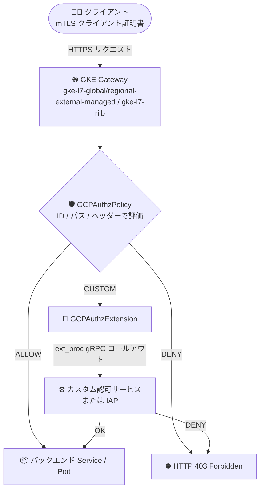

# Google Kubernetes Engine: GKE Gateway 向け GCPAuthzPolicy / GCPAuthzExtension (Preview)

**リリース日**: 2026-08-26

**サービス**: Google Kubernetes Engine (GKE)

**機能**: GKE Gateway における GCPAuthzPolicy / GCPAuthzExtension リソースによる ID ベース認可

**ステータス**: Preview

📊 [このアップデートのインフォグラフィックを見る](https://takech9203.github.io/google-cloud-news-summary/20260826-gke-gateway-gcpauthzpolicy-preview.html)

## 概要

GKE バージョン 1.36 以降で、GKE Gateway 向けの **GCPAuthzPolicy** および **GCPAuthzExtension** リソースが Preview として利用可能になりました。これらのリソースを使用すると、Gateway レイヤ (ロードバランサ) に入ってくるトラフィックに対して、ID ベースのアクセス制御とゼロトラスト認可を Kubernetes ネイティブな宣言的リソースとして適用できます。

GCPAuthzPolicy は、送信元 ID (クライアント証明書の Subject Alternative Name や Common Name など)、リクエストパス、HTTP ヘッダーに基づいて、リクエストを ALLOW / DENY するルールを定義します。さらに高度なシナリオでは、CUSTOM アクションと GCPAuthzExtension を組み合わせることで、認可の判断を外部の認可エンジン (ext_proc gRPC プロトコル対応のカスタムサービス) や Identity-Aware Proxy (IAP) に委譲できます。

対象となる GatewayClass は `gke-l7-global-external-managed`、`gke-l7-regional-external-managed`、`gke-l7-rilb` の 3 つです。アプリケーションコードに手を入れることなく、Gateway (ロードバランサ) レイヤで認可を一元的に適用したいプラットフォームチームやセキュリティチームに向けたアップデートです。

**アップデート前の課題**

- GKE Gateway (ロードバランサ) レイヤで、クライアント証明書の ID やパスに基づく細かな認可制御を Kubernetes リソースとして宣言的に定義する手段がなかった
- ID ベースのアクセス制御を実現するには、アプリケーション側 (各サービス) での実装や、サービスメッシュのサイドカーなど別レイヤでの制御が必要だった
- カスタム認可エンジンや WAF などの外部認可サービスと Gateway トラフィックを連携させるには、独自のプロキシ構成などの作り込みが必要だった

**アップデート後の改善**

- GCPAuthzPolicy を Gateway に適用するだけで、送信元 ID (mTLS クライアント証明書の SAN/CN)、パス、HTTP ヘッダーに基づく ALLOW / DENY ルールを Gateway レイヤで宣言的に適用できるようになった
- CUSTOM アクションと GCPAuthzExtension により、認可判断を ext_proc gRPC 対応の外部認可サービスやサードパーティエンジン (カスタム WAF など) に委譲できるようになった
- `googleAPIServiceName: iap.googleapis.com` を指定することで、IAP をコールアウトサービスとして利用した認可も構成できるようになった (リージョナルロードバランサのみ)
- トラフィックがバックエンドの Pod に到達する前に認可を強制でき、ゼロトラストの原則を Gateway レイヤで実現できるようになった

## アーキテクチャ図



GKE Gateway に到達したリクエストは、まず GCPAuthzPolicy のルールで評価されます。CUSTOM アクションの場合は GCPAuthzExtension を経由して外部認可サービスまたは IAP に判断が委譲され、許可されたリクエストのみがバックエンドに転送されます。

## サービスアップデートの詳細

### 主要機能

1. **GCPAuthzPolicy による ALLOW / DENY ルール**
   - Gateway を `targetRefs` で指定し、`enforcementLevel: L7` で L7 レイヤの認可を適用
   - `from.sources.principals` で送信元 ID (クライアント証明書の URI SAN など、`principal_selector: CLIENT_CERT_URI_SANS` で SPIFFE ID などを指定) に基づく制御
   - `to.operations.paths` でパス (Exact など) に基づく制御、HTTP ヘッダーによる制御にも対応
   - ALLOW ポリシーは一致するリクエストのみ許可 (それ以外は暗黙的に拒否)、DENY ポリシーは一致するリクエストを明示的に拒否

2. **GCPAuthzExtension による外部認可エンジンへの委譲 (CUSTOM アクション)**
   - `backendRef` で ext_proc gRPC プロトコル (`wireFormat: EXT_PROC_GRPC`) を実装したカスタム認可サービス (Kubernetes Service) を参照
   - `forwardHeaders` で認可サービスに転送するヘッダー (例: `Authorization`) を指定
   - `failOpen` (認可サービス障害時の挙動) と `timeout` を設定可能
   - 認可サービスが OK / DENY を返すまでプロキシは待機し、拒否時はクライアントに HTTP 403 を返却

3. **IAP をコールアウトサービスとして利用**
   - `googleAPIServiceName: iap.googleapis.com` を指定することで、IAP を認可エンジンとして利用可能
   - IAP 連携はリージョナルロードバランサでのみサポート
   - IAP を GCPAuthzExtension と併用する場合、IAM 権限は転送ルール単位では設定できず、プロジェクトレベルまたは組織レベルのみ

## 技術仕様

### 対応環境

| 項目 | 詳細 |
|------|------|
| GKE バージョン | 1.36 以降 |
| ステータス | Preview (Pre-GA Offerings Terms 適用) |
| 対応 GatewayClass | `gke-l7-global-external-managed`, `gke-l7-regional-external-managed`, `gke-l7-rilb` |
| API グループ | `networking.gke.io/v1` |
| リソース | `GCPAuthzPolicy`, `GCPAuthzExtension` |
| ポリシーアクション | `ALLOW`, `DENY`, `CUSTOM` |
| 拡張のワイヤフォーマット | ext_proc gRPC (`EXT_PROC_GRPC`) |
| Google サービス連携 | IAP (`googleAPIServiceName: iap.googleapis.com`、リージョナル LB のみ) |

### GCPAuthzPolicy の設定例 (CUSTOM アクション)

```yaml
apiVersion: networking.gke.io/v1
kind: GCPAuthzPolicy
metadata:
  name: my-gateway-authz
  namespace: default
spec:
  enforcementLevel: L7
  targetRefs:
  - group: gateway.networking.k8s.io
    kind: Gateway
    name: "GATEWAY_NAME"
  rules:
  - from:
      sources:
      - principals:
        - principal_selector: CLIENT_CERT_URI_SANS
          principal:
            exact: "spiffee://cluster.local/ns1/pod1"
  - to:
      operations:
      - paths:
        - exact: "/api/secure-endpoint"
  action: CUSTOM
  customProvider:
    authzExtension:
      extensionRefs:
      - group: networking.gke.io
        kind: GCPAuthzExtension
        name: my-authz-ext
```

## 設定方法

### 前提条件

1. GKE バージョン 1.36 以降のクラスタ
2. 対応 GatewayClass (`gke-l7-global-external-managed`、`gke-l7-regional-external-managed`、`gke-l7-rilb`) を使用した Gateway がデプロイ済みであること
3. CUSTOM アクションを使用する場合: ext_proc gRPC プロトコルを実装した認可サービス、または IAP (リージョナル LB のみ)

### 手順

#### ステップ 1: GCPAuthzExtension の定義 (CUSTOM アクションの場合)

カスタム認可サービスを参照する場合:

```yaml
apiVersion: networking.gke.io/v1
kind: GCPAuthzExtension
metadata:
  name: my-authz-ext
  namespace: default
spec:
  backendRef:
    kind: Service
    name: "authz-service"
  forwardHeaders:
  - Authorization
  failOpen: false
  timeout: "0.1s"
  wireFormat: EXT_PROC_GRPC
```

IAP をコールアウトサービスとして参照する場合:

```yaml
apiVersion: networking.gke.io/v1
kind: GCPAuthzExtension
metadata:
  name: my-authz-ext-iap
  namespace: default
spec:
  googleAPIServiceName: iap.googleapis.com
  timeout: 50ms
  failOpen: false
```

```bash
kubectl apply -f gcp-authz-extension.yaml
```

参照する認可サービス (Service) は GCPAuthzPolicy と同じ Namespace に存在する必要があります。

#### ステップ 2: GCPAuthzPolicy の適用

シンプルな ALLOW ポリシーの例 (`/home` と `/public` のみ許可、他は暗黙的に拒否):

```yaml
apiVersion: networking.gke.io/v1
kind: GCPAuthzPolicy
metadata:
  name: allow-paths
  namespace: default
spec:
  enforcementLevel: L7
  targetRefs:
  - group: gateway.networking.k8s.io
    kind: Gateway
    name: "GATEWAY_NAME"
  action: ALLOW
  rules:
  - to:
      operations:
      - paths:
        - type: Exact
          value: "/home"
        - type: Exact
          value: "/public"
```

```bash
kubectl apply -f gcp-authz-policy.yaml
```

CUSTOM アクションの場合は、`customProvider.authzExtension.extensionRefs` でステップ 1 の GCPAuthzExtension を参照します。

## メリット

### ビジネス面

- **ゼロトラストセキュリティの推進**: トラフィックがワークロードに到達する前に、Gateway レイヤで ID ベースの認可を強制でき、ゼロトラストアーキテクチャの実装を加速できる
- **既存の認可資産の活用**: 既存のカスタム認可エンジンやサードパーティ製品 (カスタム WAF など) を Gateway に組み込めるため、認可基盤の再構築が不要
- **ガバナンスの一元化**: プラットフォームチームが Gateway 単位で認可ポリシーを一元管理でき、アプリケーションチームごとの実装のばらつきを排除できる

### 技術面

- **宣言的な Kubernetes ネイティブ管理**: 認可ポリシーを CRD (YAML) として GitOps で管理でき、監査や変更管理が容易
- **アプリケーションコードの変更不要**: 認可ロジックをアプリケーションから分離し、Gateway レイヤで適用できる
- **柔軟な認可判断**: ALLOW / DENY のシンプルなルールから、ext_proc gRPC による複雑なカスタム認可、IAP 連携まで段階的に選択できる
- **障害時挙動の制御**: `failOpen` と `timeout` により、認可サービス障害時の挙動 (フェイルオープン / フェイルクローズ) を明示的に制御できる

## デメリット・制約事項

### 制限事項

- Preview 機能であり、Pre-GA Offerings Terms が適用される (サポートが限定的な場合がある)
- 1 つの Gateway に設定できる CUSTOM アクションの認可ポリシーは 1 つのみで、CUSTOM ポリシーが参照できるカスタム拡張は 1 つに限定される
- Gateway あたりのリソースレベル認可ポリシーは合計 5 つまで
- プロジェクトあたり GCPAuthzExtension は 10 個、GCPAuthzPolicy は 10 個まで
- 1 つの GCPAuthzPolicy が参照できる転送ルールは最大 100 個
- Gateway、GCPAuthzPolicy、GCPAuthzExtension は同一 Namespace に存在する必要があり、Namespace をまたぐ参照は不可
- GCPAuthzExtension はバックエンドサービスの選択に影響を与えることはできない
- GCPAuthzExtension が受け取るのはリクエストヘッダーのみで、ボディやレスポンスは参照できない
- IAP 連携はリージョナルロードバランサでのみサポートされ、IAM 権限は転送ルール単位では設定できない (プロジェクト / 組織レベルのみ)

### 考慮すべき点

- コールアウト型の認可 (CUSTOM) は処理パスに外部呼び出しが加わるため、リクエストレイテンシが増加する。認可サービスはバックエンドと同一ゾーン / リージョンへの配置が推奨される
- `failOpen: false` (フェイルクローズ) の場合、認可サービスの障害がサービス全体の可用性に直結するため、認可サービス自体の冗長化が必要
- クライアント証明書ベースの ID 制御を行う場合は、Gateway でのフロントエンド mTLS 構成が前提となる

## ユースケース

### ユースケース 1: mTLS クライアント ID に基づくゼロトラストアクセス制御

**シナリオ**: 社内の複数システムから GKE 上の API に接続する際、クライアント証明書 (SPIFFE ID) を持つ特定のワークロードのみに機密性の高いエンドポイントへのアクセスを許可したい。

**実装例**:
```yaml
rules:
- from:
    sources:
    - principals:
      - principal_selector: CLIENT_CERT_URI_SANS
        principal:
          exact: "spiffee://cluster.local/ns1/pod1"
- to:
    operations:
    - paths:
      - exact: "/api/secure-endpoint"
```

**効果**: ネットワーク境界ではなく ID に基づいたアクセス制御を Gateway レイヤで強制でき、許可されていない ID からのリクエストはバックエンドに到達する前に拒否される。

### ユースケース 2: 既存のカスタム認可エンジン / WAF との統合

**シナリオ**: 組織で運用している独自の認可エンジンやサードパーティ製 WAF による判断を、GKE Gateway のトラフィックにも適用したい。

**効果**: ext_proc gRPC 対応の認可サービスを GCPAuthzExtension として登録するだけで、Gateway のリクエスト処理パスに認可判断を組み込める。複数の認可システムの判断を組み合わせた高度な認可基盤も構築可能。

### ユースケース 3: リージョナル内部 Gateway での IAP 認可

**シナリオ**: 内部アプリケーション (gke-l7-rilb) へのアクセスに、IAP による ID ベースのアクセス制御を適用したい。

**効果**: `googleAPIServiceName: iap.googleapis.com` を指定した GCPAuthzExtension により、アプリケーション改修なしで IAP の認可判断を Gateway レイヤに組み込める (IAM 権限はプロジェクト / 組織レベルで管理)。

## 料金

この機能自体の個別料金は Release Notes およびドキュメントでは確認できませんでした。GKE Gateway は Cloud Load Balancing のリソースを使用するため、ロードバランサの料金が適用されます。詳細は以下の料金ページを参照してください。

- [Cloud Load Balancing の料金](https://cloud.google.com/vpc/network-pricing)
- [Service Extensions の料金](https://cloud.google.com/service-extensions/pricing)
- [GKE の料金](https://cloud.google.com/kubernetes-engine/pricing)

## 関連サービス・機能

- **GKE Gateway API**: 本機能の基盤。Google 管理の Gateway コントローラが Cloud Load Balancing リソースをプロビジョニングする
- **Service Extensions**: Cloud Load Balancing のデータパスにコールアウト / プラグインを挿入する仕組み。GCPAuthzExtension は Authorization 拡張 (コールアウト) の GKE ネイティブ表現
- **Identity-Aware Proxy (IAP)**: GCPAuthzExtension の `googleAPIServiceName` で参照できる Google 管理の認可サービス (リージョナル LB のみ)
- **Cloud Service Mesh**: サイドカー環境向けにも GCPAuthzPolicy / GCPAuthzExtension によるワークロード単位の認可が提供されており、メッシュ内 (East-West) と Gateway (North-South) で一貫した認可モデルを構成できる
- **Certificate Manager**: Gateway のフロントエンド mTLS 構成に使用し、クライアント証明書ベースの ID 検証の前提となる
- **GCPTrafficExtension / GCPRoutingExtension / GCPWasmPlugin**: 同じ GKE Service Extensions ファミリーのリソース。トラフィック加工やルーティング制御に使用する

## 参考リンク

- 📊 [インフォグラフィック](https://takech9203.github.io/google-cloud-news-summary/20260826-gke-gateway-gcpauthzpolicy-preview.html)
- [公式リリースノート](https://docs.cloud.google.com/release-notes#August_26_2026)
- [Configure the GCPAuthzExtension resource (GKE Service Extensions)](https://docs.cloud.google.com/kubernetes-engine/docs/how-to/configure-gke-service-extensions#configure-gcp-authz-ext)
- [Enforce access control using authorization policies (Secure Gateway)](https://docs.cloud.google.com/kubernetes-engine/docs/how-to/secure-gateway#auth-policy)
- [GatewayClass capabilities](https://docs.cloud.google.com/kubernetes-engine/docs/how-to/gatewayclass-capabilities)
- [Cloud Load Balancing extensions overview (Service Extensions)](https://docs.cloud.google.com/service-extensions/docs/lb-extensions-overview)

## まとめ

GKE 1.36 以降で GCPAuthzPolicy / GCPAuthzExtension が Preview となり、Gateway レイヤでの ID ベース認可とゼロトラスト認可を Kubernetes ネイティブに宣言できるようになりました。従来アプリケーション側やサービスメッシュで実装していた認可制御を North-South トラフィックの入口で一元的に強制できるため、GKE Gateway を利用中のチームは検証環境での試用を推奨します。Preview 段階のため、リソース数上限 (プロジェクトあたり各 10 個) や同一 Namespace 制約、CUSTOM アクション時のレイテンシ影響を確認した上で導入を計画してください。

---

**タグ**: GKE, Gateway API, GCPAuthzPolicy, GCPAuthzExtension, ゼロトラスト, 認可, Service Extensions, IAP, セキュリティ, Preview
