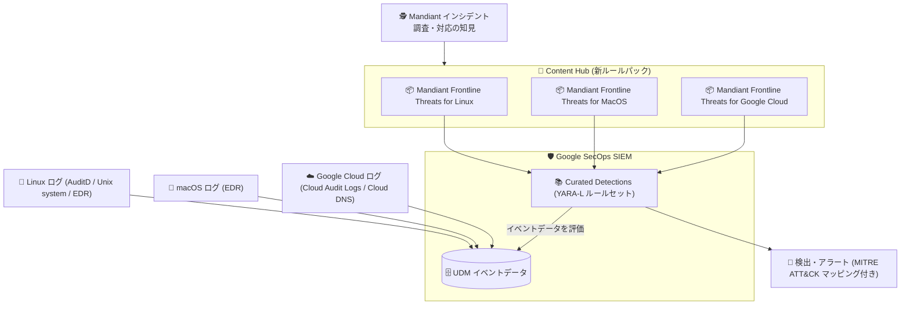

# Google SecOps: Mandiant Frontline Threats ルールパック (Linux / MacOS / Google Cloud)

**リリース日**: 2026-08-26

**サービス**: Google SecOps / Google SecOps SIEM

**機能**: Mandiant Frontline Threats ルールパック (Curated Detections の拡充)

**ステータス**: リリース済み (Spotlight Feature)

📊 [このアップデートのインフォグラフィックを見る](https://takech9203.github.io/google-cloud-news-summary/20260826-google-secops-mandiant-frontline-threats-rule-packs.html)

## 概要

Google SecOps (および Google SecOps SIEM) の Curated Detections (キュレーテッド検出) が拡充され、Linux、MacOS、Google Cloud を対象とした Mandiant Frontline Threats 検出ルールが追加されました。今回のアップデートで、以下の 3 つのルールパックが Content Hub から利用可能になっています。

- **Mandiant Frontline Threats for Linux**
- **Mandiant Frontline Threats for MacOS**
- **Mandiant Frontline Threats for Google Cloud**

Mandiant Front-Line Threats ルールセットは、Mandiant が世界中で対応している実際のインシデント調査・レスポンスから得られた知見に基づいて作成された検出ルール群です。たとえば Linux 向けルールセットでは、スクリプトインタープリタを使用した実行 (MITRE ATT&CK T1059)、C2 (コマンド & コントロール) のための Web サービスの利用 (T1102)、スケジュールされたタスクによる永続化 (T1053) など、実際の攻撃で頻繁に観測される TTP をカバーします。

Curated Detections は、Google Cloud Threat Intelligence (GCTI) チームが Google SecOps ユーザー向けに提供・管理する YARA-L ルールによる「すぐに使える脅威分析」であり、Google Cloud の Security Shared Fate モデルの一環として提供されています。今回の拡充により、Windows 中心だった Mandiant の最前線 (Front-Line) の脅威検出知見が、Linux・macOS のエンドポイント環境および Google Cloud 環境にも広がりました。SOC チームやセキュリティエンジニアは、自らルールを開発することなく、Mandiant のインシデント対応から得られた最新の検出ロジックを自環境のログデータに適用できます。

**アップデート前の課題**

- Mandiant Front-Line Threats ルールセットは Windows Threats カテゴリなど一部の環境向けに提供されており、Linux・macOS・Google Cloud 環境向けには同等のルールパックが Content Hub に用意されていなかった
- Linux / macOS / Google Cloud 環境で Mandiant のインシデント対応知見に基づく検出を行うには、公開情報をもとに自組織で YARA-L ルールを開発・保守する必要があった

**アップデート後の改善**

- Linux、MacOS、Google Cloud それぞれを対象とした Mandiant Frontline Threats ルールパックを Content Hub から導入できるようになった
- Mandiant が実際のインシデント調査・対応で観測した TTP に基づく検出ルールを、自組織でのルール開発なしに有効化できるようになった
- Curated Detections の管理画面上で、他のルールセットと同様に有効化 / 無効化、アラート設定、ルール除外 (rule exclusions) によるチューニングが可能

## アーキテクチャ図

Content Hub から導入した 3 つの Mandiant Frontline Threats ルールパックが Curated Detections に組み込まれ、Linux / macOS / Google Cloud から取り込まれた UDM イベントデータを評価して検出・アラートを生成する流れを示しています。

## サービスアップデートの詳細

### 主要機能

1. **Mandiant Frontline Threats for Linux**
   - Mandiant による世界中のアクティブなインシデント調査・対応から導出されたルールセット
   - スクリプトインタープリタによる実行 (T1059)、C2 のための Web サービス利用 (T1102)、スケジュールされたタスクによる永続化 (T1053) など、頻出 TTP をカバー
   - Linux Threats カテゴリのルールセットとして提供され、Linux Auditing System (AuditD)、Unix システムログ、CrowdStrike Falcon などのログソースに対応

2. **Mandiant Frontline Threats for MacOS**
   - macOS Threats カテゴリに追加されたルールセットで、macOS 環境における脅威を検出
   - Carbon Black (CB_EDR)、SentinelOne (SENTINEL_EDR)、CrowdStrike Falcon (CS_EDR) の EDR データソースでテスト済み・サポート対象
   - Tanium、Cybereason EDR、Lima Charlie、OSQuery、Zeek、Cylance については、テスト・最適化が進行中

3. **Mandiant Frontline Threats for Google Cloud**
   - Cloud Threats カテゴリのルールセットとして提供され、Google Cloud 環境における脅威を検出
   - Cloud Threats カテゴリのルールセットは Cloud Audit Logs の収集が推奨されており、一部ルールは Cloud DNS ロギングの有効化を必要とする

4. **Content Hub からの導入**
   - Content Hub は検出ルール、プレイブック、ダッシュボード、検索クエリなどのコンテンツを一元的に導入・管理できるページ
   - 導入したルールパックは Curated Detections ページで確認・管理でき、ルールロジックの参照も可能

## 技術仕様

### ルールセットとログソース

| ルールパック | カテゴリ | 主なログソース |
|------|------|------|
| Mandiant Frontline Threats for Linux | Linux Threats | Linux Auditing System (AUDITD)、Unix system (NIX_SYSTEM)、CrowdStrike Falcon (CS_EDR) |
| Mandiant Frontline Threats for MacOS | macOS Threats | Carbon Black (CB_EDR)、SentinelOne (SENTINEL_EDR)、CrowdStrike Falcon (CS_EDR) |
| Mandiant Frontline Threats for Google Cloud | Cloud Threats | Cloud Audit Logs (推奨)、Cloud DNS Logs (一部ルールで必要) |

### Curated Detections の管理機能

| 項目 | 詳細 |
|------|------|
| ルール種別 | Precise ルール (高い確度で悪意ある脅威を検出) / Broad ルール (より広範な疑わしい挙動を検出、誤検知が増える可能性あり) |
| 有効化 / アラート | ルールセット単位で検出の有効化・無効化、アラートのオン・オフを設定可能 |
| MITRE ATT&CK | 各ルールセットがカバーする MITRE ATT&CK の Tactics / Techniques を表示 |
| チューニング | ルール除外 (rule exclusions) により、指定した UDM フィールド条件に合致するイベントを評価対象から除外可能 |
| ルールの提供・管理 | Google Cloud Threat Intelligence (GCTI) チームが YARA-L ルールを提供・保守し、脅威の変化に応じて定期的に更新 |

## 設定方法

### 前提条件

1. Google SecOps (SIEM) を利用しており、対象環境 (Linux / macOS / Google Cloud) のログを Google SecOps に取り込んでいること
2. Linux / macOS はサポート対象のログソース (AuditD、Unix システムログ、対応 EDR など)、Google Cloud は Cloud Audit Logs (および必要に応じて Cloud DNS ロギング) が構成されていること

### 手順

#### ステップ 1: Content Hub からルールパックを確認・導入

Google SecOps のナビゲーションから Content Hub を開き、「Mandiant Frontline Threats for Linux / MacOS / Google Cloud」の各ルールパックを確認して導入します。

#### ステップ 2: Curated Detections でルールセットを有効化

メインメニューから **Rules** を選択し、**Curated Detections** を開きます。対象のルールセットについて、Precise / Broad ルールの有効化とアラート設定を行います。

#### ステップ 3: 検出結果の確認とチューニング

Curated Detections のダッシュボードで各ルールセットの検出状況 (最終検出時刻、重大度、アラート設定) を確認します。誤検知が多い場合は、ルール除外 (rule exclusions) で UDM フィールド条件を定義してチューニングします。

## メリット

### ビジネス面

- **検出エンジニアリング工数の削減**: Mandiant のインシデント対応知見に基づく検出ルールをそのまま導入でき、自組織でのルール開発・保守コストを削減できる
- **最前線の脅威への迅速な追随**: GCTI がルールセットを提供・管理し、脅威の変化に応じて更新するため、常に最新の検出ロジックを利用できる

### 技術面

- **マルチプラットフォームのカバレッジ拡大**: Linux、macOS、Google Cloud という異なる環境を、同じ Curated Detections の枠組みで一元的にカバーできる
- **MITRE ATT&CK との対応付け**: 各ルールセットがカバーする Tactics / Techniques が明示されるため、検出カバレッジの評価やギャップ分析に活用できる
- **柔軟なチューニング**: Precise / Broad の使い分けやルール除外により、環境に合わせてアラート量を制御できる

## デメリット・制約事項

### 考慮すべき点

- 検出には対象環境のログが Google SecOps に取り込まれ、UDM に正規化されていることが前提となる (デフォルトパーサーをカスタムパーサーに置き換えている場合、ルールセットの動作に影響する可能性がある)
- macOS 向けルールセットは一部の EDR データソース (Tanium、Cybereason EDR、Lima Charlie、OSQuery、Zeek、Cylance) についてテスト・最適化が進行中の段階
- Broad ルールはより広範な疑わしい挙動を対象とするため、誤検知が増える可能性があり、チューニングが必要になる場合がある

## ユースケース

### ユースケース 1: Linux サーバー群に対する攻撃検出の強化

**シナリオ**: Compute Engine やオンプレミスで多数の Linux サーバーを運用しており、AuditD / Unix システムログを Google SecOps に取り込んでいる。スクリプトインタープリタ経由の不審な実行や cron 等による永続化の検出を強化したい。

**効果**: Mandiant Frontline Threats for Linux を有効化することで、T1059 (スクリプトインタープリタによる実行)、T1102 (Web サービスを使った C2)、T1053 (スケジュールされたタスクによる永続化) といった実際のインシデントで観測された TTP に基づく検出を、ルール開発なしで即座に適用できる。

### ユースケース 2: Google Cloud 環境の脅威検出をマネージドルールで運用

**シナリオ**: Cloud Audit Logs と Cloud DNS ログを Google SecOps に集約しているが、クラウド特有の攻撃手法に対する検出ルールを自組織で継続的に開発・保守するリソースがない。

**効果**: Mandiant Frontline Threats for Google Cloud を Content Hub から導入することで、Mandiant のクラウドインシデント対応知見に基づく検出を GCTI 管理のルールとして運用でき、脅威の変化への追随を Google 側に任せられる。

## 関連サービス・機能

- **Content Hub**: 検出ルール、プレイブック、ダッシュボード、検索クエリなどのコンテンツを一元的に導入・管理する Google SecOps のハブ。今回のルールパックの配布チャネル
- **Curated Detections**: GCTI が提供・管理する YARA-L ルールセット群。Windows / Linux / macOS / Cloud Threats / Chrome Enterprise / Risk Analytics (UEBA) / Applied Threat Intelligence などのカテゴリで構成
- **Applied Threat Intelligence (ATI)**: Mandiant Threat Intelligence の IoC とイベントデータを突合し、Active Breach / High などの優先度付きアラートを生成する機能。Frontline Threats ルールセットと補完関係にある
- **Cloud Audit Logs / Cloud DNS**: Cloud Threats カテゴリのルールセットが利用する主要な Google Cloud ログソース
- **Mandiant Hunting Rules**: Mandiant Threat Defense チームと連携して開発された、クラウド・エンドポイント向けの脅威ハンティング用ルールセット

## 参考リンク

- 📊 [インフォグラフィック](https://takech9203.github.io/google-cloud-news-summary/20260826-google-secops-mandiant-frontline-threats-rule-packs.html)
- [公式リリースノート](https://docs.cloud.google.com/release-notes#August_26_2026)
- [Curated Detections の管理](https://docs.cloud.google.com/chronicle/docs/detection/curated-detections)
- [Content Hub](https://docs.cloud.google.com/chronicle/docs/secops/content_hub)
- [Linux Threats カテゴリ](https://docs.cloud.google.com/chronicle/docs/detection/linux-threats-category)
- [macOS Threats カテゴリ](https://docs.cloud.google.com/chronicle/docs/detection/macos-threats-category)
- [Cloud Threats カテゴリ](https://docs.cloud.google.com/chronicle/docs/detection/cloud-threats-category#cloud-rule-sets)

## まとめ

Mandiant の最前線のインシデント対応知見に基づく検出ルールが、Windows 中心から Linux・macOS・Google Cloud へと拡大された重要なアップデートです。対象環境のログを Google SecOps に取り込んでいる組織は、Content Hub から該当ルールパックを導入し、Curated Detections でルールセットの有効化とアラート設定を行うことで、追加のルール開発なしに検出カバレッジを強化できます。まずは検出のみを有効化して自環境でのアラート量を確認し、必要に応じてルール除外でチューニングすることを推奨します。

---

**タグ**: Google SecOps, Google SecOps SIEM, Curated Detections, Mandiant, Frontline Threats, Content Hub, 脅威検出, Linux, macOS, Google Cloud, MITRE ATT&CK
