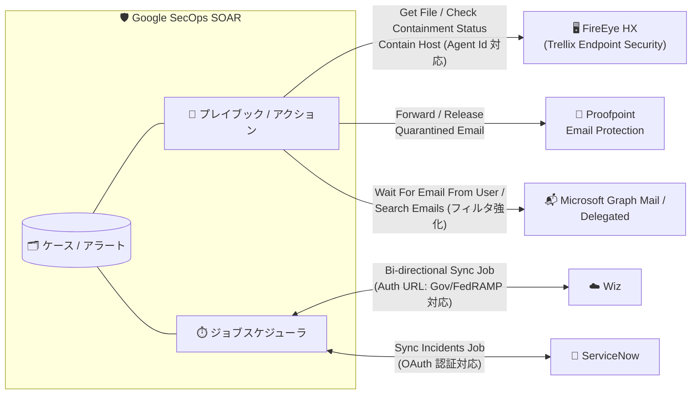

# Google SecOps Marketplace: FireEye HX / Proofpoint / Wiz / Microsoft Graph Mail / ServiceNow インテグレーション更新

**リリース日**: 2026-08-26

**サービス**: Google SecOps Marketplace

**機能**: インテグレーション更新 (FireEye HX v26.0 / Proofpoint Email Protection v11.0 / Wiz v10.0 / Microsoft Graph Mail v46.0 / Microsoft Graph Mail Delegated v23.0 / ServiceNow v71.0)

**ステータス**: Feature / Changed

📊 [このアップデートのインフォグラフィックを見る](https://takech9203.github.io/google-cloud-news-summary/20260826-google-secops-marketplace-integration-updates.html)

## 概要

Google SecOps Marketplace において、SOAR プレイブックから利用できる複数のサードパーティ製品インテグレーションが同日にアップデートされた。対象は FireEye HX (Trellix Endpoint Security)、Proofpoint Email Protection、Wiz、Microsoft Graph Mail / Microsoft Graph Mail Delegated、ServiceNow の 5 系統 6 インテグレーションである。

今回の更新の中心は、インシデント対応の自動化範囲の拡大 (FireEye HX のファイル取得・封じ込め状態確認、Proofpoint の隔離メール操作) と、外部プラットフォームとの同期・認証の強化 (Wiz の双方向同期ジョブと Gov/FedRAMP 環境対応、ServiceNow の Sync Incidents Job での OAuth 認証対応) である。SOC チームがプレイブックで実行できるレスポンスアクションが増え、より厳格な認証要件を持つ環境 (政府系・FedRAMP 準拠環境など) でも利用しやすくなった。

**アップデート前の課題**

- FireEye HX インテグレーションでは、プレイブックからファイルの取得や封じ込め状態の確認を行う専用アクションがなく、Contain Host / Cancel Host Contain はエンティティ (IP アドレス / ホスト名) ベースでの指定に限られ、エージェント ID を直接指定できなかった
- Proofpoint Email Protection では、隔離されたメールの転送・リリースをプレイブックから実行できず、Proofpoint 側のコンソールでの手動操作が必要だった
- Wiz インテグレーションは認証 URL を切り替えるパラメータがなく、Gov (FedRAMP) 環境やカスタム環境への対応が困難だった。また Wiz Threats と Google SecOps ケースの状態を継続的に同期する仕組みがなかった
- ServiceNow の Sync Incidents Job は Basic 認証 (ユーザー名 / パスワード) のみで、OAuth 2.0 認証に対応していなかった

**アップデート後の改善**

- FireEye HX v26.0: 新アクション Get File と Check Containment Status が追加され、Contain Host / Cancel Host Contain に Agent Id 入力パラメータが追加された。エージェント ID を直接指定した封じ込め操作が可能になった
- Proofpoint Email Protection v11.0: 新アクション Forward Quarantined Email と Release Quarantined Email により、隔離メールの転送・解放をプレイブックから自動化できるようになった
- Wiz v10.0: Authentication URL パラメータの追加により Gov (FedRAMP) 環境やカスタム環境をサポート。新ジョブ「Wiz and Google SecOps Bi-directional Sync Job」により、Wiz Threats と Google SecOps ケース間でステータス・コメント・重大度などを継続的に双方向同期できるようになった
- Microsoft Graph Mail v46.0 / Microsoft Graph Mail Delegated v23.0: Wait For Email From User と Search Emails アクションのパラメータとフィルタリングオプションが更新され、メール検索・待機の条件指定が改善された
- ServiceNow v71.0: Sync Incidents Job が OAuth 認証をサポートし、クライアントクレデンシャルまたはリフレッシュトークンによる認証が可能になった

## アーキテクチャ図

Google SecOps SOAR のプレイブックアクションとジョブが、5 つの外部セキュリティ / ITSM 製品と連携する構成。今回の更新でアクションの追加 (FireEye HX、Proofpoint)、双方向同期ジョブの追加 (Wiz)、認証方式の強化 (Wiz、ServiceNow) が行われた。

## サービスアップデートの詳細

### 主要機能

1. **FireEye HX v26.0: 新アクションと Agent Id パラメータ**
   - 新アクション「Get File」「Check Containment Status」が追加され、対象ホストからのファイル取得と封じ込め状態の確認をプレイブックから実行可能
   - 「Contain Host」「Cancel Host Contain」に Agent Id 入力パラメータが追加され、IP / ホスト名エンティティに加えてエージェント ID による直接指定が可能
   - なお Contain Host / Cancel Host Contain は FireEye HX 側の制約により Linux ホストには対応していない

2. **Proofpoint Email Protection v11.0: 隔離メール操作アクション**
   - 「Forward Quarantined Email」: 隔離されたメールを指定先へ転送
   - 「Release Quarantined Email」: 誤検知と判断された隔離メールを受信者へ解放
   - フィッシング対応プレイブックにおける隔離メールのハンドリングを自動化

3. **Wiz v10.0: Gov/FedRAMP 対応と双方向同期ジョブ**
   - Authentication URL パラメータが追加され、Gov (FedRAMP) 環境およびカスタム環境の認証エンドポイントを指定可能
   - 新ジョブ「Wiz and Google SecOps Bi-directional Sync Job」により、Wiz Threats と Google SecOps ケースを継続的に同期。同期対象フィールドは Status、Comments、Product Link、Severity から選択可能 (デフォルトはすべて)
   - ジョブパラメータ: Environment Name、Wiz API Root (デフォルト `https://api.us.wiz.io/graphql`)、Wiz Client ID / Client Secret、Max Hours Backwards (1〜720、デフォルト 24)、Verify SSL、Fields to sync

4. **Microsoft Graph Mail v46.0 / Microsoft Graph Mail Delegated v23.0: 検索・待機アクションの強化**
   - 「Wait For Email From User」「Search Emails」のパラメータとフィルタリングオプションが更新
   - アプリケーション権限版 (Graph Mail) と委任権限版 (Graph Mail Delegated) の両方で同様の更新が適用

5. **ServiceNow v71.0: Sync Incidents Job の OAuth 認証対応**
   - 「Sync Incidents Job」で OAuth 2.0 認証をサポート
   - クライアントクレデンシャル (Client ID / Client Secret) またはリフレッシュトークンで認証可能。両方が設定されている場合はリフレッシュトークンが優先される
   - リフレッシュトークンは 90 日で失効する点に注意

## 技術仕様

### 更新されたインテグレーションのバージョン一覧

| インテグレーション | 新バージョン | 更新タイプ | 主な変更内容 |
|------|------|------|------|
| FireEye HX | 26.0 | Feature | 新アクション 2 件、Agent Id パラメータ追加 |
| Proofpoint Email Protection | 11.0 | Feature | 隔離メールの転送 / リリースアクション追加 |
| Wiz | 10.0 | Feature | Authentication URL パラメータ、双方向同期ジョブ追加 |
| Microsoft Graph Mail | 46.0 | Change | Wait For Email From User / Search Emails のパラメータ・フィルタ更新 |
| Microsoft Graph Mail Delegated | 23.0 | Change | 同上 |
| ServiceNow | 71.0 | Change | Sync Incidents Job の OAuth 認証対応 |

### Wiz Bi-directional Sync Job の主要パラメータ

| パラメータ | 必須 | 説明 |
|------|------|------|
| Environment Name | 必須 | 同期対象の環境名 (デフォルト: Default Environment) |
| Wiz API Root | 必須 | Wiz GraphQL API エンドポイント (デフォルト: `https://api.us.wiz.io/graphql`) |
| Wiz Client ID / Client Secret | 必須 | Wiz API サービスアカウントの認証情報 |
| Max Hours Backwards | 任意 | 初回実行時に遡って取得する時間 (1〜720、デフォルト: 24) |
| Fields to sync | 必須 | 同期フィールド: Status、Comments、Product Link、Severity (デフォルトはすべて) |

### ServiceNow OAuth 認証の設定パラメータ

| パラメータ | 説明 |
|------|------|
| Use Oauth Authentication | OAuth 2.0 認証を使用する場合に有効化 (デフォルト: 無効) |
| Client ID / Client Secret | クライアントクレデンシャル方式に必要 |
| Refresh Token | リフレッシュトークン方式に必要 (90 日で失効)。クライアントクレデンシャルと両方設定した場合はこちらが優先 |

## 設定方法

### 前提条件

1. Google SecOps (SOAR 機能が有効) のインスタンスがあること
2. 各サードパーティ製品側で API 認証情報を発行済みであること
   - Wiz: サービスアカウントの Client ID / Client Secret と適切な API スコープ (例: `read:issues`、`write:issue_status` など。組織ポリシー上問題なければ `read:all` / `write:all` / `update:all` も可)
   - ServiceNow: OAuth 利用時は Client ID / Client Secret またはリフレッシュトークン。Sync Incidents Job の実行には ITIL (`itil`) ロールが必要

### 手順

#### ステップ 1: Marketplace でインテグレーションを更新

Google SecOps コンソールの Marketplace タブから対象インテグレーション (FireEye HX、Proofpoint Email Protection、Wiz、Microsoft Graph Mail、ServiceNow) を最新バージョンに更新する。

#### ステップ 2: インテグレーションパラメータを構成

各インテグレーションの構成画面で接続情報を設定する。Wiz で Gov (FedRAMP) 環境やカスタム環境を使用する場合は、新しく追加された Authentication URL パラメータに環境に応じた認証エンドポイントを指定する。

#### ステップ 3: ジョブを構成 (Wiz / ServiceNow)

ジョブスケジューラで「Wiz and Google SecOps Bi-directional Sync Job」を新規構成し、同期対象フィールド (Fields to sync) を選択する。ServiceNow の Sync Incidents Job では「Use Oauth Authentication」を有効にし、クライアントクレデンシャルまたはリフレッシュトークンを設定する。

#### ステップ 4: プレイブックに新アクションを組み込み

既存のフィッシング対応・エンドポイント封じ込めプレイブックに、新アクション (Get File、Check Containment Status、Forward/Release Quarantined Email など) を追加する。

## メリット

### ビジネス面

- **対応の迅速化**: 隔離メールのリリースやホスト封じ込め状態の確認が自動化され、SOC アナリストの手動作業と平均対応時間 (MTTR) を削減できる
- **規制対応環境での利用拡大**: Wiz の Gov (FedRAMP) 環境対応により、政府系・規制業種の顧客でも同一のプレイブック資産を活用できる
- **セキュリティガバナンスの強化**: ServiceNow 連携でパスワードベースの認証から OAuth 2.0 へ移行でき、認証情報管理のリスクを低減できる

### 技術面

- **封じ込め操作の精度向上**: Agent Id によるホスト指定で、同名ホストや IP 変動環境でも対象を一意に特定した封じ込めが可能
- **双方向同期による状態整合**: Wiz Threats と Google SecOps ケースのステータス・コメント・重大度が自動同期され、二重管理やステータス不整合を防止
- **メールトリアージの柔軟性**: Graph Mail 系アクションのフィルタリング強化により、承認フローや通知確認などメール駆動のプレイブック条件をより細かく制御可能

## デメリット・制約事項

### 制限事項

- FireEye HX の Contain Host / Cancel Host Contain アクションは Linux ホストに対応していない
- ServiceNow の OAuth リフレッシュトークンは 90 日で失効するため、ローテーション運用が必要
- Wiz Bi-directional Sync Job の Max Hours Backwards は最大 720 時間 (30 日) まで

### 考慮すべき点

- インテグレーションのバージョンアップ後は、既存プレイブックのアクションパラメータ (特に Graph Mail の Wait For Email From User / Search Emails) が変更されている可能性があるため、動作確認を推奨
- Wiz の同期ジョブは同期対象フィールド (Status、Comments、Product Link、Severity) を明示的に選択する設計のため、運用ポリシーに合わせた選定が必要
- ServiceNow でクライアントクレデンシャルとリフレッシュトークンの両方を設定した場合、リフレッシュトークンが優先される

## ユースケース

### ユースケース 1: フィッシングメールの誤検知対応の自動化

**シナリオ**: Proofpoint で隔離されたメールについて、SOC が調査の結果誤検知と判断した場合、従来は Proofpoint コンソールで手動リリースしていた。

**実装例**: Google SecOps のフィッシング対応プレイブックに「Release Quarantined Email」アクションを組み込み、アナリストの承認ステップの後に自動でメールを解放する。調査用に「Forward Quarantined Email」で検体をサンドボックス解析用メールボックスへ転送する。

**効果**: 隔離メール対応のコンソール切り替えが不要になり、対応時間を短縮。

### ユースケース 2: エンドポイント封じ込めの状態管理

**シナリオ**: マルウェア感染が疑われるホストを FireEye HX (Trellix Endpoint Security) で封じ込めた後、封じ込めの完了確認と証跡ファイルの回収が必要。

**実装例**: プレイブックで「Contain Host」(Agent Id 指定) → 「Check Containment Status」で状態をポーリング → 「Get File」で対象ファイルを取得、という一連のフローを構成する。

**効果**: 封じ込めからファイル回収までをワンフローで自動化し、対応の抜け漏れを防止。

### ユースケース 3: Wiz Threats と SecOps ケースの一元運用

**シナリオ**: クラウドセキュリティは Wiz、インシデント対応は Google SecOps で運用しており、両者のステータスを手動で揃えていた。

**実装例**: 「Wiz and Google SecOps Bi-directional Sync Job」を構成し、Fields to sync に Status、Comments、Severity を指定して定期同期する。

**効果**: どちらのプラットフォームでクローズ・コメントしても相互に反映され、状態の不整合と二重入力を解消。

## 関連サービス・機能

- **Google SecOps SIEM**: Wiz などのログを UDM 形式で取り込み可能。SOAR インテグレーションと組み合わせて検知から対応までを一気通貫で自動化できる
- **Google SecOps ジョブスケジューラ**: 今回追加された Wiz Bi-directional Sync Job や ServiceNow Sync Incidents Job の実行基盤
- **Siemplify Utilities インテグレーション**: ServiceNow 同期に必要な TICKET_ID コンテキスト値の設定 (Set Scope Context Value アクション) に使用
- **Content Hub**: 同日に Mandiant Frontline Threats ルールパック (Linux / macOS / Google Cloud) も追加されており、検知側の強化と併せて活用できる

## 参考リンク

- 📊 [インフォグラフィック](https://takech9203.github.io/google-cloud-news-summary/20260826-google-secops-marketplace-integration-updates.html)
- [公式リリースノート](https://docs.cloud.google.com/release-notes#August_26_2026)
- [FireEye HX インテグレーション ドキュメント](https://docs.cloud.google.com/chronicle/docs/soar/marketplace-integrations/fireeye-hx)
- [Wiz インテグレーション ドキュメント](https://docs.cloud.google.com/chronicle/docs/soar/marketplace-integrations/wiz)
- [ServiceNow インテグレーション ドキュメント](https://docs.cloud.google.com/chronicle/docs/soar/marketplace-integrations/servicenow)
- [インテグレーションの構成方法](https://docs.cloud.google.com/chronicle/docs/soar/respond/integrations-setup/configure-integrations)

## まとめ

Google SecOps Marketplace の主要インテグレーション 6 件が同日に更新され、エンドポイント封じ込め・隔離メール対応の自動化範囲の拡大、Wiz との双方向同期、OAuth / FedRAMP 対応といった認証面の強化が行われた。これらのインテグレーションを利用している SOC チームは、Marketplace で最新バージョンへ更新し、新アクションの既存プレイブックへの組み込みと、ServiceNow の OAuth 認証への移行を検討することを推奨する。

---

**タグ**: #GoogleSecOps #SOAR #Marketplace #FireEyeHX #Proofpoint #Wiz #MicrosoftGraphMail #ServiceNow #SecurityOperations #インシデント対応
