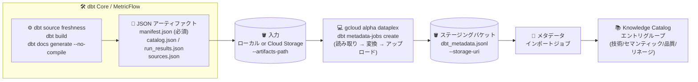

# Knowledge Catalog (Dataplex): dbt Core / MetricFlow メタデータインポート (Preview)

**リリース日**: 2026-08-26

**サービス**: Knowledge Catalog (Dataplex、旧 Dataplex Universal Catalog)

**機能**: dbt Core および MetricFlow からのメタデータインポート

**ステータス**: Preview

📊 [このアップデートのインフォグラフィックを見る](https://takech9203.github.io/google-cloud-news-summary/20260826-knowledge-catalog-dbt-core-metricflow-import.html)

## 概要

Knowledge Catalog (旧 Dataplex Universal Catalog) が、dbt Core と MetricFlow からのメタデータインポートを Preview として提供開始しました。新しい `gcloud alpha dataplex dbt metadata-jobs` コマンドを使用することで、dbt Core が生成する JSON アーティファクト (manifest.json、catalog.json、run_results.json、sources.json) から、テクニカル、セマンティック (MetricFlow)、オペレーショナル、データ品質、リネージの各メタデータを抽出し、Knowledge Catalog にインポートできます。

dbt はデータ変換パイプラインのデファクトスタンダードとして広く利用されており、モデル定義、テスト結果、リネージ、そして MetricFlow によるメトリクス定義といった豊富なメタデータを保持しています。今回のアップデートにより、これらの dbt プロジェクトの資産を Google Cloud の統合データカタログに集約し、組織全体でのデータ検索・ガバナンス・リネージ追跡に活用できるようになります。

対象ユーザーは、dbt Core でデータ変換を管理しつつ、Google Cloud 上でデータガバナンスを統合したいデータエンジニア、アナリティクスエンジニア、データガバナンス担当者です。

**アップデート前の課題**

- dbt Core プロジェクトのメタデータ (モデル、テスト結果、メトリクス定義、リネージ) を Knowledge Catalog に取り込むための公式なインポート手段がなく、カスタムコネクタの開発や手動でのメタデータ登録が必要だった
- MetricFlow で定義したセマンティックモデルやメトリクスなどのビジネス・セマンティックメタデータをカタログ上で一元的に検索・参照できなかった
- dbt のテスト結果やソースの鮮度 (freshness) といったデータ品質・運用メタデータがカタログと分断されていた

**アップデート後の改善**

- `gcloud alpha dataplex dbt metadata-jobs create` コマンド 1 つで、dbt アーティファクトの読み取り、Knowledge Catalog インポート形式 (`dbt_metadata.jsonl`) への変換、ステージングバケットへのアップロード、メタデータインポートジョブの起動までを自動実行できるようになった
- MetricFlow のセマンティックモデル、メトリクス、保存済みクエリなどのビジネス・セマンティックメタデータをカタログに取り込めるようになった
- dbt の変換グラフ (DAG)、物理リネージ、テスト結果、ソース鮮度、exposures による利用状況 (コンサンプション) メタデータまで包括的にインポートできるようになった
- `--aspects-only` フラグにより、CI/CD パイプラインからの定期的・部分的なインジェスト (dbt build や --select による部分実行後の更新) にも安全に対応できるようになった

## アーキテクチャ図



dbt コマンドで生成した JSON アーティファクトを `gcloud` コマンドが読み取り、Knowledge Catalog のインポート形式に変換してステージングバケットにアップロードし、メタデータインポートジョブがエントリグループへ取り込む流れです。

## サービスアップデートの詳細

### 主要機能

1. **5 種類のメタデータの包括的インポート**
   - **テクニカルメタデータ**: 主要リソース (sources、seeds、models) とその技術属性 (カラム名、データ型、行数)
   - **ビジネス・セマンティックメタデータ**: MetricFlow によるセマンティックモデル、メトリクス、保存済みクエリなどのビジネス定義とロジック
   - **オペレーショナル・データ品質メタデータ**: 実行時間、成功/失敗ステータス、データ鮮度、テストとテスト結果
   - **リネージ・リレーションシップメタデータ**: 変換グラフ (DAG) と dbt リソース間の依存関係、物理的な変換ブロックを追跡・リンクする物理リネージ、結合キーと動的結合、親子関係
   - **コンサンプションメタデータ**: exposures で捕捉される、dbt 外部でのデータ利用状況

2. **`gcloud alpha dataplex dbt metadata-jobs create` コマンドによるワンステップ実行**
   - `--artifacts-path` で指定した入力 (ローカルディレクトリまたは Cloud Storage URI) から dbt アーティファクトを読み取り
   - Knowledge Catalog メタデータインポート形式 (`dbt_metadata.jsonl`) に変換
   - `--storage-uri` で指定した出力ステージング用 Cloud Storage にアップロード
   - Knowledge Catalog サービスエージェントがステージングされたメタデータを読み取ってインジェストするインポートジョブを起動

3. **フル同期と部分更新 (`--aspects-only`) の使い分け**
   - デフォルトはエントリグループ内の dbt コンテンツの **フル同期**: 今回のアーティファクトに含まれない dbt エントリは削除される
   - `--aspects-only` を指定すると、今回の dbt 実行で観測されたメタデータのみを更新し、エントリの作成・削除・親子変更は行わない。`dbt build`、`dbt test`、`--select` による部分ビルド後の定期インジェストに安全に利用可能
   - 初回インジェストはフル実行が必須 (アスペクトを付与するエントリがまだ存在しないため)
   - `--validate-only` で JSONL の生成・アップロードとジョブの検証のみを行い、実際のインジェストをスキップ可能

## 技術仕様

### dbt アーティファクトファイル

| ファイル | 必須/任意 | 内容 |
|------|------|------|
| `manifest.json` | 必須 | プロジェクト構造と実行グラフ。MetricFlow のセマンティックモデル、メトリクス、保存済みクエリも含む |
| `catalog.json` | 任意 | カラム名とデータ型。ない場合、スキーマアスペクトは型なしカラムでインポートされる |
| `run_results.json` | 任意 | テスト結果と実行メタデータ |
| `sources.json` | 任意 | ソースの鮮度 (freshness) |

必須は `manifest.json` のみで、他のファイルがなくても変換は段階的に縮退 (graceful degradation) します。フルセットを生成するには `dbt source freshness` → `dbt build` → `dbt docs generate --no-compile` の順で実行します。

**注意**: `--no-compile` を付けずに `dbt docs generate` を実行すると、`run_results.json` が全ノード成功ステータスで上書きされ、直前の `dbt build` のテスト結果が失われます (カタログ上ですべてのデータ品質テストが合格と報告されてしまう)。

### コマンドフラグ

| フラグ | 必須/任意 | 説明 |
|------|------|------|
| `--storage-uri` | 必須 | 変換後の JSONL のアップロード先かつインポートジョブの読み取り元となる Cloud Storage URI プレフィックス |
| `--artifacts-path` | 任意 (デフォルト `.`) | dbt アーティファクトのパス。ローカルディレクトリまたは Cloud Storage URI。dbt プロジェクトルートを指定すると `target/` を自動検出 |
| `--entry-group` | 任意 (デフォルト `dbt-metadata-ingestion`) | dbt エントリを受け取るエントリグループの短縮 ID。事前に存在している必要がある |
| `--aspects-only` | 任意 | 今回の実行で観測されたメタデータのみ更新 (エントリの作成・削除なし) |
| `--validate-only` | 任意 | JSONL の生成・アップロードとジョブ検証のみ実行 |
| `--async` | 任意 | 処理完了を待たずに即時リターン |

### 必要な IAM ロール

| 操作 | ロール |
|------|------|
| エントリグループの作成・管理 | `roles/dataplex.catalogAdmin`、`roles/dataplex.catalogEditor`、または `roles/dataplex.entryGroupOwner` |
| gcloud コマンドの実行とインポートジョブ作成 (最小権限) | `roles/dataplex.metadataJobOwner` (プロジェクト) + `roles/dataplex.entryGroupImporter` (対象エントリグループまたはプロジェクト) |
| ステージングバケットへのアップロード (実行者) | `roles/storage.objectCreator` または `roles/storage.objectAdmin` |
| 入力バケットからの読み取り (Cloud Storage 利用時、実行者) | `roles/storage.objectViewer` または `roles/storage.objectAdmin` |
| ステージングバケットの読み取り (Knowledge Catalog サービスエージェント `service-PROJECT_NUMBER@gcp-sa-dataplex.iam.gserviceaccount.com`) | `roles/storage.objectViewer` |
| dbt メタデータの閲覧 | `roles/dataplex.catalogViewer` |

このほか、インポートジョブにはファーストパーティの dbt アスペクトタイプの使用権限 (`dataplex.aspectTypes.use`) が必要です (タイプをホストする公開システムプロジェクトでデフォルト付与済み)。

## 設定方法

### 前提条件

1. 必要な IAM ロールと権限の付与 (上記の表を参照)
2. Knowledge Catalog API の有効化
3. dbt アーティファクト (最低限 `manifest.json`) の生成
4. インポート先エントリグループの作成 (存在しない場合)
5. 入力/出力の Cloud Storage ロールの理解と設定 (入力バケットへのサービスエージェントのアクセスは不要)

### 手順

#### ステップ 1: dbt アーティファクトの生成

```bash
dbt source freshness
dbt build
dbt docs generate --no-compile
```

`--no-compile` は必須級のポイントです。省略すると `run_results.json` が上書きされ、テスト結果が失われます。

#### ステップ 2: メタデータジョブの作成

```bash
# ローカルの target/ ディレクトリから読み取る場合
gcloud alpha dataplex dbt metadata-jobs create my-dbt-import \
  --project=my-project \
  --location=us-central1 \
  --artifacts-path=. \
  --entry-group=dbt-metadata-ingestion \
  --storage-uri=gs://my-bucket/dbt-imports/
```

```bash
# dbt CI ジョブが Cloud Storage に発行したアーティファクトから読み取る場合
gcloud alpha dataplex dbt metadata-jobs create my-dbt-import \
  --project=my-project \
  --location=us-central1 \
  --artifacts-path=gs://my-bucket/dbt-artifacts/ \
  --entry-group=dbt-metadata-ingestion \
  --storage-uri=gs://my-bucket/dbt-imports/
```

`Created` ステータスを確認したら、Knowledge Catalog 上で dbt エントリを検索・参照できます。

#### ステップ 3: 定期インジェスト (再実行)

```bash
# ルーチンのインジェストにはエントリの削除を伴わない --aspects-only を使用
gcloud alpha dataplex dbt metadata-jobs create \
  --project=my-project \
  --location=us-central1 \
  --artifacts-path=. \
  --entry-group=dbt-metadata-ingestion \
  --storage-uri=gs://my-bucket/dbt-imports/ \
  --aspects-only
```

モデルの追加・リネーム・削除など dbt リソースの構成自体が変わった場合は、`--aspects-only` を外してフル実行し、エントリの作成・削除 (プルーニング) を反映させます。

## メリット

### ビジネス面

- **メタデータの一元化**: dbt プロジェクトに散在していたビジネス定義 (MetricFlow メトリクス) やデータ品質情報を Knowledge Catalog に集約し、組織全体で検索・活用できる
- **ガバナンスの強化**: dbt の変換リネージやテスト結果がカタログに統合されることで、データの信頼性評価や影響分析、監査対応がしやすくなる

### 技術面

- **運用の簡素化**: カスタムコネクタや managed connectivity パイプラインを自前で構築せずに、gcloud コマンド 1 つで抽出・変換・インポートまで完結
- **CI/CD 統合**: ローカル実行に加え Cloud Storage 上のアーティファクトを直接読めるため、dbt CI ジョブの成果物をそのまま定期インポートに利用できる
- **柔軟な同期モデル**: フル同期 (プルーニングあり) と `--aspects-only` (部分更新) を使い分けられ、複数ジョブからの繰り返し実行にも安全

## デメリット・制約事項

### 制限事項

- Preview 機能であり、Pre-GA Offerings Terms が適用される (「現状のまま」提供、サポート限定)
- `gcloud alpha` コマンドであり、予告なく変更される可能性がある
- インポート先のエントリグループは事前に作成しておく必要がある
- 初回インジェストはフル実行が必須 (`--aspects-only` は初回には使えない)

### 考慮すべき点

- **dbt プロジェクトごとに専用のエントリグループを用意すること**: フル同期では、実行時のアーティファクトに含まれない dbt エントリが削除されるため、複数の dbt プロジェクトが 1 つのエントリグループを共有すると、互いのエントリを毎回削除し合ってしまう
- `dbt docs generate` には必ず `--no-compile` を付ける (テスト結果の消失防止)
- 入力用と出力 (ステージング) 用の 2 つの Cloud Storage ロケーションは役割が異なるため混同しない。サービスエージェントに読み取り権限が必要なのは出力ステージングバケットのみ
- `catalog.json` を生成しない場合、スキーマアスペクトのカラムは型なしでインポートされる

## ユースケース

### ユースケース 1: dbt CI/CD パイプラインからの自動メタデータ同期

**シナリオ**: dbt Core を CI ランナー (Cloud Build、GitHub Actions など) で実行しており、本番実行のたびに最新のモデル定義・テスト結果・リネージを Knowledge Catalog に反映したい。

**実装例**:
```bash
# CI ジョブ内: dbt 実行後にアーティファクトを Cloud Storage へ発行し、メタデータジョブを作成
dbt source freshness && dbt build && dbt docs generate --no-compile
gsutil -m cp target/*.json gs://my-bucket/dbt-artifacts/
gcloud alpha dataplex dbt metadata-jobs create \
  --location=us-central1 \
  --artifacts-path=gs://my-bucket/dbt-artifacts/ \
  --storage-uri=gs://my-bucket/dbt-imports/ \
  --aspects-only --async
```

**効果**: カタログが常に dbt の最新状態と同期され、データ利用者は鮮度の高いメタデータ (テスト合否、ソース鮮度を含む) を参照できる。

### ユースケース 2: MetricFlow メトリクス定義の全社カタログ公開

**シナリオ**: MetricFlow でセマンティックモデルとメトリクス (KPI) を定義しているが、dbt を直接触らないビジネスユーザーやデータガバナンスチームがメトリクスの定義・ロジックを参照できない。

**効果**: セマンティックモデル、メトリクス、保存済みクエリが Knowledge Catalog のエントリとして検索可能になり、指標定義の共通理解 (シングルソースオブトゥルース) を組織全体で確立できる。

### ユースケース 3: dbt リネージを含めた影響分析

**シナリオ**: ソーステーブルのスキーマ変更が下流の dbt モデルやその先の利用先 (exposures) にどう影響するかを事前に把握したい。

**効果**: dbt の変換グラフ (DAG)、物理リネージ、exposures によるコンサンプションメタデータがカタログに取り込まれるため、Knowledge Catalog 上で依存関係を辿った影響分析・根本原因分析が可能になる。

## 料金

dbt メタデータインポート機能自体の個別料金は明示されていませんが、Knowledge Catalog の従量課金体系が適用されます。主な関連料金は以下のとおりです。

| 項目 | 料金 (USD) |
|--------|-----------------|
| メタデータストレージ (無料枠) | 月間平均 1 MiB まで無料 |
| メタデータストレージ | $2/GiB/月 から |
| API 呼び出し (無料枠) | 月間 100 万回まで無料 |
| API 呼び出し | 100 万回超は 10 万回あたり $10 から |

このほか、ステージング/入力に使用する Cloud Storage の料金が別途発生します。詳細は [Knowledge Catalog 料金ページ](https://cloud.google.com/dataplex/pricing) を参照してください。

## 関連サービス・機能

- **dbt Core / MetricFlow**: メタデータの抽出元。manifest.json などの JSON アーティファクトを生成するオープンソースのデータ変換・セマンティックレイヤーツール
- **Cloud Storage**: dbt アーティファクトの入力ロケーション、および変換済み `dbt_metadata.jsonl` のステージングロケーションとして使用
- **Knowledge Catalog コネクタ**: BigQuery Data Transfer Service を利用したプリビルトのメタデータコネクタ群。dbt Core のほか Oracle、MySQL、PostgreSQL、SQL Server に対応 (Preview)
- **Managed Connectivity パイプライン**: Workflows と Managed Service for Apache Spark を使ってカスタムコネクタでサードパーティソースのメタデータを取り込む仕組み。dbt 用コマンドはこれを自前で構築せずに済む代替手段
- **BigQuery / データリネージ (Dataplex)**: dbt が BigQuery 上で実行する変換の物理リネージと組み合わせて、エンドツーエンドのリネージ追跡が可能

## 参考リンク

- 📊 [インフォグラフィック](https://takech9203.github.io/google-cloud-news-summary/20260826-knowledge-catalog-dbt-core-metricflow-import.html)
- [公式リリースノート](https://docs.cloud.google.com/release-notes#August_26_2026)
- [Import metadata from dbt Core (公式ドキュメント)](https://docs.cloud.google.com/dataplex/docs/dbt-transfer)
- [About metadata connectors (公式ドキュメント)](https://docs.cloud.google.com/dataplex/docs/connectors)
- [gcloud alpha dataplex dbt metadata-jobs create リファレンス](https://docs.cloud.google.com/sdk/gcloud/reference/alpha/dataplex/dbt/metadata-jobs/create)
- [料金ページ](https://cloud.google.com/dataplex/pricing)

## まとめ

dbt Core / MetricFlow のメタデータを gcloud コマンド 1 つで Knowledge Catalog に取り込めるようになり、dbt を中心としたデータ変換基盤と Google Cloud のデータガバナンス基盤の統合が大幅に容易になりました。dbt を利用中のチームは、まず専用エントリグループを作成し、`--validate-only` でインポート内容を検証したうえで、CI/CD パイプラインへの `--aspects-only` による定期インジェスト組み込みを検討することをおすすめします。Preview 機能のため、本番運用では Pre-GA 提供条件と alpha コマンドの仕様変更リスクに留意してください。

---

**タグ**: #KnowledgeCatalog #Dataplex #dbt #MetricFlow #メタデータ管理 #データガバナンス #データリネージ #Preview
