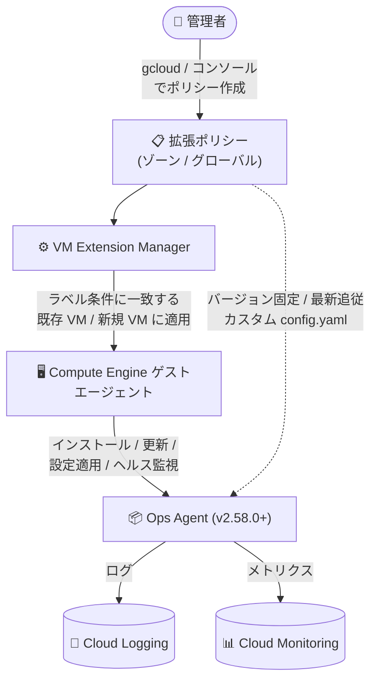

# Cloud Logging / Cloud Monitoring: VM Extension Manager による Ops Agent 拡張ポリシーが GA

**リリース日**: 2026-08-26

**サービス**: Cloud Logging / Cloud Monitoring (Google Cloud Observability)

**機能**: VM Extension Manager 拡張ポリシーによる Ops Agent の管理

**ステータス**: GA (一般提供)

📊 [このアップデートのインフォグラフィックを見る](https://takech9203.github.io/google-cloud-news-summary/20260826-ops-agent-vm-extension-manager-policies-ga.html)

## 概要

VM Extension Manager の拡張ポリシー (extension policies) による Ops Agent の管理が一般提供 (GA) になりました。拡張ポリシーを使うと、Compute Engine VM フリートに対する Ops Agent のインストール、バージョンアップグレード、設定管理を、ゾーン単位またはプロジェクト全体 (グローバル) で宣言的に実行できます。本アップデートは Cloud Logging と Cloud Monitoring の両方の Release Notes に記載されています。

VM Extension Manager は、Compute Engine ゲストエージェントのオプションプラグインである「VM 拡張機能」のライフサイクルを、各インスタンスに接続することなくフリート全体で自動化するサービスです。ポリシーで「どの拡張機能をどの VM にインストールするか」を宣言すると、条件 (ラベルなど) に一致する既存 VM および新規 VM に自動的に適用され、ポリシーを削除すると拡張機能もアンインストールされます。インストール後は拡張機能のヘルスステータスも監視されます。

多数の VM を運用する組織にとって、可観測性エージェントの導入・更新・設定の標準化は運用負荷の大きい作業でした。GA により、本番環境でのフリート全体のエージェント管理を Google のサポート対象機能として利用できます。

**アップデート前の課題**

- Ops Agent をフリート全体に導入するには、VM ごとの手動インストールや独自の自動化 (スタートアップスクリプト、構成管理ツールなど) を用意する必要があった
- エージェントのバージョンを最新に保つ、または特定バージョンに固定する運用を、個々の VM に接続して行う必要があった
- Ops Agent のカスタム設定 (config.yaml) をフリート全体へ一貫して配布・更新する標準的な仕組みが必要だった

**アップデート後の改善**

- ゾーン単位またはプロジェクト全体 (グローバル) のポリシーで、条件 (ラベル) に一致するすべての VM へ Ops Agent を自動インストールできるようになった (GA)
- ポリシーで「常に最新バージョンへ自動更新」または「特定バージョンに固定 (2.58.0 以降)」を宣言的に管理できるようになった
- ポリシーにカスタム設定 (YAML) を添付することで、対象 VM 全体へ Ops Agent の設定を一括適用・一括更新できるようになった (エージェントの手動再起動は不要)
- グローバルポリシーではロールアウトプラン (slow_rollout / fast_rollout / カスタム) により、段階的な展開を制御できるようになった

## アーキテクチャ図



管理者が定義した拡張ポリシーに基づき、VM Extension Manager がゲストエージェント経由で対象 VM フリートに Ops Agent をインストール・管理し、収集されたログとメトリクスが Cloud Logging / Cloud Monitoring に送信される流れを示しています。

## サービスアップデートの詳細

### 主要機能

1. **フリート全体へのインストール**
   - プロジェクト内の 1 つ以上のゾーンのすべての VM、またはプロジェクト内のすべての VM (グローバル) に Ops Agent をインストール
   - ラベルで識別した VM のサブセット (ゾーン内、またはゾーン横断) を対象にすることも可能
   - ポリシーは既存 VM だけでなく、条件に一致する新規作成 VM にも自動適用される

2. **バージョン管理**
   - Ops Agent を常に最新バージョンに自動更新、または特定リリースにバージョン固定 (ピン留め) が可能
   - バージョン固定は VM Extension Manager がサポートする拡張機能のうち Ops Agent のみで利用可能

3. **設定管理**
   - ポリシーにカスタム設定 (YAML) を添付し、対象のすべての VM の Ops Agent に一括適用
   - 設定は対象 VM の所定の場所 (Linux: `/etc/google-cloud-ops-agent/config.yaml`、Windows: `C:\Program Files\Google\Cloud Operations\Ops Agent\config\config.yaml`) にコピーされ、既存の config.yaml は上書きされる
   - 設定変更後のエージェント手動再起動は不要

4. **ポリシーの優先度と競合解決**
   - 各ポリシーには優先度が付与される (デフォルト 1000、数値が小さいほど高優先)
   - 1 台の VM が複数のポリシーの対象になっても、Ops Agent 拡張に対して有効になるポリシーは 1 つのみ

5. **グローバルポリシーのロールアウトプラン**
   - `slow_rollout` (推奨): ゾーンをまたいで段階的に展開
   - `fast_rollout`: すべての対象 VM へ即時展開
   - カスタムロールアウトプラン (Compute Engine API の `rolloutPlans.insert`) も利用可能

## 技術仕様

| 項目 | 詳細 |
|------|------|
| 対象エージェントバージョン | Ops Agent 2.58.0 以降 (VM Extension Manager でインストールされたもののみ管理可能) |
| 管理対象外 | 2.58.0 より前のバージョン、他の手段でインストールされた Ops Agent、レガシー Monitoring Agent / Logging Agent |
| ポリシーのスコープ | ゾーン単位 (コンソール / gcloud)、グローバル = プロジェクト全体 (gcloud のみ) |
| 対象 OS | Ops Agent がサポートする OS のうち、SUSE Linux Enterprise Server (SLES) と Ubuntu を除く |
| ポリシー更新の反映 | 通常 1 分以内に対象 VM へロールアウト |
| クォータ | 1 プロジェクトあたり 1 ゾーンにつき 100 ポリシーまで (ポリシーあたりの VM 数に制限なし) |
| 必要な API | Cloud Logging API、Cloud Monitoring API (未有効化の場合、ポリシーを作成しても拡張機能のインストールは失敗する) |
| 必要な IAM ロール (VM のサービスアカウント) | `roles/logging.logWriter` (ログ書き込み)、`roles/monitoring.metricWriter` (メトリクス書き込み) |

## 設定方法

### 前提条件

1. 対象 OS が Ops Agent と VM Extension Manager の両方でサポートされていることを確認する (SLES / Ubuntu は VM Extension Manager 非対応)
2. Cloud Logging API と Cloud Monitoring API をプロジェクトで有効化する
3. VM のサービスアカウントに `roles/logging.logWriter` と `roles/monitoring.metricWriter` を付与する
4. VM にすでにインストール済みの可観測性エージェント (既存の Ops Agent やレガシーエージェント) をアンインストールする

### 手順

#### ステップ 1: グローバルポリシーの作成 (最新バージョンを自動追従、カスタム設定付き)

```bash
gcloud compute global-vm-extension-policies create POLICY_NAME \
    --project=PROJECT_ID \
    --extensions=ops-agent \
    --rollout-predefined-plan=slow_rollout \
    --config-from-file=ops-agent="OPS_AGENT_CONFIG_PATH"
```

`OPS_AGENT_CONFIG_PATH` には Ops Agent の YAML 設定ファイルへのパスを指定します。設定はポリシーと一緒に保存されるため、パスワードなどの機密データは含めないでください。ロールアウトプランは段階展開の `slow_rollout` が推奨です。

#### ステップ 2: ゾーンポリシーのバージョン固定の更新

```bash
gcloud compute zone-vm-extension-policies update POLICY_NAME \
    --project=PROJECT_ID \
    --zone=ZONE \
    --extensions=ops-agent --version=ops-agent=VERSION
```

`VERSION` には 2.58.0 以降を指定します。`--version` を省略した場合は最新バージョンをインストールし、新バージョンのリリース時に自動更新されます。なお、gcloud によるポリシー更新は「完全置換」として動作するため、省略した省略可能フィールドは既存値を保持せずデフォルト値に戻る点に注意してください。ゾーンポリシーは Google Cloud コンソールの「Extension policies」ページからも作成・編集できます。

## メリット

### ビジネス面

- **運用コストの削減**: VM 1 台ずつへの接続作業が不要になり、大規模フリートのエージェント導入・更新の工数を大幅に削減できる
- **本番利用の安心感**: GA となったことで、本番環境のフリート管理基盤として採用しやすくなった
- **ガバナンスの強化**: プロジェクト全体でエージェントのバージョンと設定を標準化し、可観測性のカバレッジ漏れを防止できる

### 技術面

- **宣言的管理**: ポリシーで望ましい状態 (対象 VM、バージョン、設定) を宣言すれば、新規 VM を含めて自動的に収束する
- **安全なロールアウト**: グローバルポリシーの slow_rollout により、ゾーンをまたいだ段階的な展開でリスクを低減できる
- **設定変更の自動反映**: ポリシー更新は通常 1 分以内に対象 VM へロールアウトされ、エージェントの手動再起動が不要

## デメリット・制約事項

### 制限事項

- 管理できるのは「VM Extension Manager でインストールした Ops Agent 2.58.0 以降」のみ。既存手段でインストール済みのエージェントやレガシーエージェントは管理できない
- SUSE Linux Enterprise Server (SLES) と Ubuntu は VM Extension Manager 非対応
- 拡張ポリシーはプロジェクトレベルでのみ作成可能
- グローバルポリシーの作成・管理は gcloud のみ (コンソール対応はゾーンポリシーのみ)
- 1 プロジェクトあたり 1 ゾーンにつき 100 ポリシーまで

### 考慮すべき点

- 導入前に既存の可観測性エージェントのアンインストールが必要
- VM Extension Manager 管理下の Ops Agent は OS のサービス管理 (systemd / Windows Service Manager) の管理外となるため、`systemctl` や `Restart-Service` での状態確認・再起動はできない。再起動が必要な場合はポリシーの削除 (アンインストール) と再適用が必要
- カスタム設定はポリシー側に保存されるため、VM 上や手元の設定ファイルを変更してもエージェントには反映されない。変更は必ず `zone-vm-extension-policies update` / `global-vm-extension-policies update` で行う
- ポリシーに添付した設定は対象 VM の既存 config.yaml を上書きする
- gcloud でのポリシー更新は完全置換として動作するため、更新時は既存の省略可能フィールドの指定漏れに注意

## ユースケース

### ユースケース 1: プロジェクト全体への Ops Agent 標準展開

**シナリオ**: 数百台の Compute Engine VM を運用しており、すべての VM にログ・メトリクス収集を標準装備したい。新規作成される VM にも自動でエージェントを導入したい。

**実装例**:
```bash
gcloud compute global-vm-extension-policies create ops-agent-fleet-policy \
    --project=my-project \
    --extensions=ops-agent \
    --rollout-predefined-plan=slow_rollout
```

**効果**: プロジェクト内の対象 VM すべてに Ops Agent が段階的にインストールされ、以降に作成される VM にも自動適用される。エージェントは新バージョンのリリース時に自動更新される。

### ユースケース 2: ラベルベースの環境別バージョン管理

**シナリオ**: 本番環境の VM ではエージェントのバージョンを検証済みリリースに固定し、意図しない自動更新による影響を避けたい。

**効果**: ラベルで本番 VM を対象にしたポリシーでバージョンを固定 (2.58.0 以降) し、検証完了後にポリシー更新で計画的にバージョンアップできる。優先度の設定により、全体ポリシーと環境別ポリシーの競合も制御できる。

## 料金

VM Extension Manager 自体の利用に料金はかかりません。ただし、インストールされた Ops Agent がプロジェクトに送信するメトリクス、ログ、トレースに対しては Google Cloud Observability の料金が発生する場合があります。

- [Google Cloud Observability の料金](https://cloud.google.com/products/observability/pricing)

## 関連サービス・機能

- **Compute Engine (VM Extension Manager)**: 拡張ポリシーの基盤サービス。ゲストエージェントのプラグインとして拡張機能のライフサイクルを管理する
- **Cloud Logging**: Ops Agent が収集したログの送信先。Logging API の有効化と `roles/logging.logWriter` が必要
- **Cloud Monitoring**: Ops Agent が収集したメトリクスの送信先。Monitoring API の有効化と `roles/monitoring.metricWriter` が必要
- **その他の VM 拡張機能**: VM Extension Manager は Ops Agent のほか、Google Cloud's Agent for SAP (`google-cloud-sap-extension`)、Agent for Compute Workloads (`google-cloud-workload-extension`) の管理にも対応

## 参考リンク

- 📊 [インフォグラフィック](https://takech9203.github.io/google-cloud-news-summary/20260826-ops-agent-vm-extension-manager-policies-ga.html)
- [公式リリースノート](https://docs.cloud.google.com/release-notes#August_26_2026)
- [Install and manage the Ops Agent by using VM Extension Manager policies](https://docs.cloud.google.com/monitoring/agent/ops-agent/agent-vmem-policies)
- [About VM Extension Manager](https://docs.cloud.google.com/compute/docs/vm-extensions/about-vm-extension-manager)
- [料金ページ (Google Cloud Observability)](https://cloud.google.com/products/observability/pricing)

## まとめ

VM Extension Manager 拡張ポリシーによる Ops Agent 管理の GA により、Compute Engine フリート全体での可観測性エージェントの導入・バージョン管理・設定配布を宣言的かつ自動的に運用できるようになりました。多数の VM を運用しているチームは、既存エージェントの導入方法 (手動インストールや独自自動化) からの移行を検討し、まずはゾーンポリシーやラベル絞り込みでの段階的な導入から始めることを推奨します。SLES / Ubuntu が非対応である点と、Ops Agent 2.58.0 以降のみが管理対象である点には注意が必要です。

---

**タグ**: #CloudLogging #CloudMonitoring #OpsAgent #VMExtensionManager #ComputeEngine #Observability #GA
