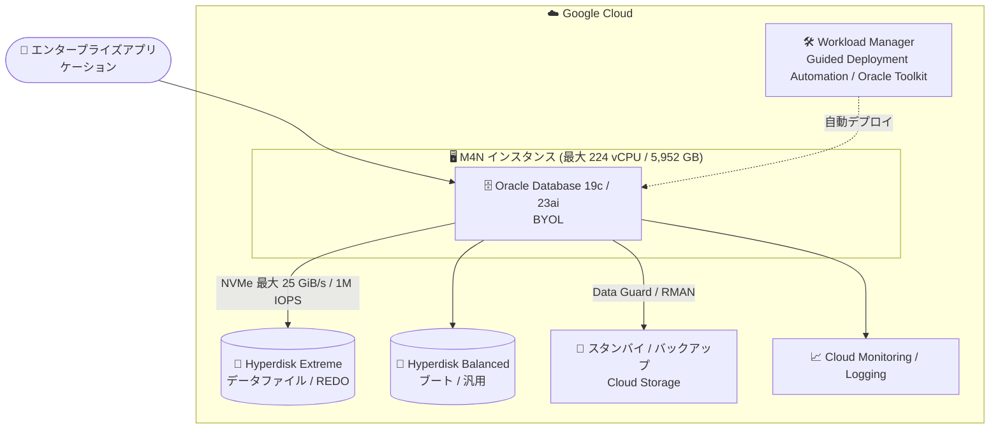

# Oracle on Google Cloud Compute: M4N マシンシリーズでの Oracle ワークロード実行をサポート (GA)

**リリース日**: 2026-08-26

**サービス**: Oracle on Google Cloud Compute

**機能**: Compute Engine M4N マシンシリーズでの Oracle ワークロード実行サポート

**ステータス**: GA (一般提供)

📊 [このアップデートのインフォグラフィックを見る](https://takech9203.github.io/google-cloud-news-summary/20260826-oracle-google-cloud-compute-m4n-ga.html)

## 概要

Oracle on Google Cloud Compute が、Compute Engine の M4N マシンシリーズ上での Oracle ワークロードの実行をサポートし、一般提供 (GA) になりました。M4N は 2026 年 8 月 21 日に GA となったネットワーク・メモリ最適化マシンシリーズで、Hyperdisk Extreme との組み合わせにより最大 25 GiB/s のブロックストレージ帯域と最大 1,000,000 IOPS という Compute Engine 最高クラスの I/O 性能を提供します。今回のアップデートにより、この性能をメモリ集約型の Oracle Database ワークロードで正式に活用できるようになりました。

公式ドキュメントによると、M4N と Hyperdisk Extreme の組み合わせは、Oracle Database ワークロードにおいてトランザクションあたりのコストを低減し、コア単位のライセンスを必要とするデータベースに対して Google Cloud の他のどのメモリ最適化インスタンスよりも優れた TCO を実現するとされています。オンプレミスから Oracle Database をリフト & シフト (Rehost) で移行するエンタープライズユーザーにとって、大規模・高負荷なデータベースの移行先の有力な選択肢が加わったアップデートです。

なお、同日の Release Notes では、Google Cloud NetApp Volumes (iSCSI ブロックストレージ) を使用して Oracle AI Database ワークロードをデプロイする方法を解説する詳細ドキュメントの公開も発表されています (こちらはドキュメント追加のアナウンスです)。

**アップデート前の課題**

- Oracle on Google Cloud Compute の計画ドキュメントで案内される Compute Engine マシンタイプは、基本的なワークロード向けの汎用マシン (N4 / C4 シリーズ) が中心で、複雑でメモリ集約的な Oracle Database ワークロード向けのメモリ最適化マシンの正式なサポートが示されていなかった
- Hyperdisk Extreme の単一 VM あたり最大性能 (25 GiB/s / 1M IOPS) を、Oracle ワークロードのサポート対象構成として利用できなかった
- コア単位ライセンスの Oracle Database では vCPU あたりの処理性能・I/O 性能がライセンスコストに直結するが、大容量メモリと極めて高い I/O を両立するサポート対象マシンの選択肢が限られていた

**アップデート後の改善**

- メモリ集約型 Oracle Database ワークロード向けに M4N シリーズ (最大 224 vCPU / 5,952 GB メモリ) が正式にサポートされ、GA として本番利用が可能になった
- Hyperdisk Extreme との組み合わせで最大 25 GiB/s・1,000,000 IOPS のブロックストレージ性能を Oracle ワークロードで利用できるようになった
- コア単位ライセンスのデータベースにおいて、他のメモリ最適化インスタンスと比較して最良の TCO (低いトランザクションあたりコスト) を実現できるようになった

## アーキテクチャ図



メモリ集約型の Oracle Database を M4N インスタンス上で稼働させ、Hyperdisk Extreme が最大 25 GiB/s・1M IOPS のブロックストレージ性能を提供する構成です。デプロイは Workload Manager または Oracle Toolkit で自動化でき、Data Guard や Cloud Monitoring と組み合わせて可用性・運用性を確保します。

## サービスアップデートの詳細

### 主要機能

1. **M4N マシンシリーズの正式サポート (GA)**
   - 複雑でメモリ集約的な Oracle Database ワークロード向けのメモリ最適化マシンタイプとして M4N シリーズをサポート
   - 16〜224 vCPU、最大 5,952 GB の DDR5 メモリを提供する事前定義マシンシェイプ (hypermem / megamem / ultramem)
   - Intel Emerald Rapids プロセッサと Titanium オフロードプロセッサを搭載し、最大構成では 2 基の Titanium Smart NIC により M4 比 2 倍のディスク I/O 性能を実現

2. **Hyperdisk Extreme によるリーディングクラスのブロックストレージ性能**
   - 最大マシンタイプで最大 25 GiB/s の Hyperdisk 帯域と最大 1,000,000 IOPS
   - Hyperdisk Extreme はサブミリ秒レイテンシ設計で、160,000 IOPS または 2,400 MiB/s を超える性能を単一ボリュームに求める高性能データベース (Oracle、SAP HANA、ハイエンド SQL Server) 向け
   - Oracle Database は定常状態 (steady state) の性能を必要とするため、ストレージ選定時には定常状態の性能上限の確認が推奨される

3. **コア単位ライセンスのデータベースで最良の TCO**
   - M4N + Hyperdisk Extreme は Oracle Database ワークロードのトランザクションあたりコストを低減
   - コア単位ライセンスを必要とするデータベースにおいて、Google Cloud の他のどのメモリ最適化インスタンスよりも優れた TCO を提供
   - リソースベース確約利用割引 (CUD) の対象で、3 年コミットにより 60% を超える割引

4. **関連: NetApp Volumes による Oracle AI Database デプロイドキュメントの公開 (同日発表)**
   - Google Cloud NetApp Volumes の iSCSI ブロックストレージを使用し、Oracle AI Database 26ai の高可用性構成 (Oracle Data Guard 使用) を Compute Engine 上にデプロイする詳細ドキュメントが公開された
   - NetApp Volumes のストレージレイヤーレプリケーション・スナップショット・クローンにより、従来の RMAN アクティブ複製と比較してスタンバイデータベースの初期化時間を大幅に短縮できる

## 技術仕様

### Oracle on Google Cloud Compute のサポート要件

| 項目 | 詳細 |
|------|------|
| Oracle バージョン | Oracle Database 19c、Oracle Database 23ai |
| Oracle エディション | Enterprise Edition、Standard Edition、Express (Free) Edition |
| OS | Oracle がサポートする任意の Linux (RHEL 7/8/9、Oracle Linux 7/8/9 など) |
| マシンタイプ (基本的なワークロード) | N4 シリーズ、C4 シリーズ (汎用) |
| マシンタイプ (メモリ集約型ワークロード) | **M4N シリーズ (今回 GA)** |
| ストレージ | Hyperdisk Balanced / Hyperdisk Extreme (IOPS・スループット要件に応じて選択) |
| ライセンス | BYOL (Bring Your Own License) |
| デプロイツール | Workload Manager (Guided Deployment Automation)、Oracle Toolkit for Google Cloud |

### M4N マシンタイプ (主要シェイプ)

| マシンタイプ | vCPU | メモリ (GB) | 物理 NIC 数 |
|------|------|------|------|
| m4n-hypermem-16 | 16 | 248 | 1 |
| m4n-hypermem-32 | 32 | 496 | 1 |
| m4n-hypermem-64 | 64 | 992 | 1 |
| m4n-megamem-28 | 28 | 372 | 1 |
| m4n-megamem-56 | 56 | 744 | 1 |
| m4n-megamem-112 | 112 | 1,488 | 1 |
| m4n-megamem-224 | 224 | 2,976 | 2 |
| m4n-ultramem-56 | 56 | 1,488 | 1 |
| m4n-ultramem-112 | 112 | 2,976 | 1 |
| m4n-ultramem-224 | 224 | 5,952 | 2 |

M4N のストレージは NVMe のみで、Hyperdisk Balanced / Balanced High Availability / Extreme / Throughput / ML をサポートします。Hyperdisk Extreme はインスタンスあたり最大 8 ボリューム、ディスク総容量はインスタンスあたり最大 512 TiB です。M4N シリーズ自体の詳細 (400 Gbps ネットワーク、マシンタイプ別の Hyperdisk 性能上限など) は [2026-08-21 の M4N GA レポート](./2026-08-21-compute-engine-m4n-machine-series-ga.md) を参照してください。

## 設定方法

### 前提条件

1. Oracle ソフトウェアのライセンスを保有していること (BYOL モデル)
2. M4N が利用可能なリージョン・ゾーンを選択すること (`gcloud compute machine-types list --filter="name~m4n"` で確認可能)
3. Oracle がサポートする Linux OS イメージ (Oracle Linux、RHEL など) を使用すること

### 手順

#### ステップ 1: M4N インスタンスの作成

```bash
gcloud compute instances create my-oracle-m4n \
    --zone=asia-southeast1-b \
    --machine-type=m4n-ultramem-56 \
    --image-family=oracle-linux-9 \
    --image-project=oracle-linux-cloud
```

M4N は事前定義マシンタイプのみ利用可能です。Oracle Database のメモリ要件 (SGA/PGA サイズ) に応じて hypermem / megamem / ultramem からシェイプを選択します。

#### ステップ 2: Hyperdisk Extreme ボリュームの作成と接続

```bash
gcloud compute disks create oracle-data-disk \
    --zone=asia-southeast1-b \
    --type=hyperdisk-extreme \
    --size=4TiB \
    --provisioned-iops=350000

gcloud compute instances attach-disk my-oracle-m4n \
    --disk=oracle-data-disk \
    --zone=asia-southeast1-b
```

単一の Hyperdisk Extreme ボリュームには最大 350,000 IOPS を指定できます (スループットは 1,000 IOPS ごとに 250 MiB/s、最大 5,000 MiB/s)。それ以上の性能が必要な場合は複数ボリュームを接続します。

#### ステップ 3: Oracle Database のデプロイ

Google Cloud コンソールの Workload Manager から「Create deployment」→「Oracle Database」を選択すると、Guided Deployment Automation ツールがインフラのプロビジョニングから Oracle ソフトウェアのインストールまでを自動化します。より柔軟なカスタマイズが必要な場合は Oracle Toolkit for Google Cloud を使用します。

## メリット

### ビジネス面

- **ライセンスコストの最適化**: コア単位ライセンスの Oracle Database において、vCPU あたりの I/O 性能が高い M4N によりトランザクションあたりコストを低減し、メモリ最適化インスタンスの中で最良の TCO を実現
- **移行先の選択肢拡大**: オンプレミスの大規模 Oracle Database をリフト & シフトで移行する際に、GA サポートされた高性能な移行先を選択できる
- **大幅な割引**: リソースベース CUD (3 年コミット) で 60% を超える割引が適用可能

### 技術面

- **最高クラスのブロックストレージ性能**: Hyperdisk Extreme との組み合わせで最大 25 GiB/s・1,000,000 IOPS を単一 VM で利用でき、I/O ボトルネックを解消
- **大容量メモリ**: 最大 5,952 GB の DDR5 メモリで大規模な SGA / インメモリ処理に対応
- **エコシステム統合**: Cloud Monitoring / Cloud Logging によるオブザーバビリティ、Workload Manager / Oracle Toolkit による自動デプロイ、Data Guard や RMAN + Cloud Storage による HA/DR 構成と組み合わせ可能

## デメリット・制約事項

### 制限事項

- M4N は事前定義マシンタイプのみで、カスタムマシンタイプは利用できない
- M4N は一部のリージョン・ゾーンでのみ利用可能
- M4N のストレージは NVMe (Hyperdisk) のみで、Persistent Disk やローカル SSD (Titanium SSD) は利用できない
- Hyperdisk Extreme はインスタンスあたり最大 8 ボリューム、単一ボリュームは最大 350,000 IOPS / 5,000 MiB/s
- Oracle ライセンスは BYOL モデルであり、ライセンスの調達・管理はユーザーの責任

### 考慮すべき点

- Oracle Database は定常状態 (steady state) のストレージ性能を必要とするため、マシンタイプ選定時は定常状態の性能上限を確認する必要がある
- Google Cloud 上の Oracle Database に対する Oracle 社のサポートポリシー (Doc ID 2688277.1) を事前に確認することが推奨される
- 最大性能 (25 GiB/s / 1M IOPS) は最大マシンタイプ (224 vCPU) に複数の Hyperdisk Extreme ボリュームを接続した場合の上限であり、シェイプごとに性能上限が異なる

## ユースケース

### ユースケース 1: 大規模ミッションクリティカル Oracle Database の移行

**シナリオ**: オンプレミスの高負荷な Oracle Database (Enterprise Edition、コア単位ライセンス) がストレージ I/O ボトルネックを抱えており、クラウド移行と同時に性能改善とライセンスコスト最適化を図りたい。

**実装例**:
```bash
# メモリ要件に応じた M4N シェイプ + Hyperdisk Extreme 複数ボリューム構成
gcloud compute instances create oracle-prod-01 \
    --zone=asia-southeast1-b \
    --machine-type=m4n-megamem-112 \
    --image-family=oracle-linux-9 \
    --image-project=oracle-linux-cloud
```

**効果**: 高い vCPU あたり I/O 性能により、少ないコア数 (= 少ないライセンス数) で必要なスループットを達成し、トランザクションあたりコストを低減できる。

### ユースケース 2: Data Guard による高可用性構成

**シナリオ**: ゾーン障害に備えた Oracle Database の高可用性構成を Google Cloud 上に構築したい。

**効果**: 異なるゾーンの M4N インスタンスにプライマリ / スタンバイを配置し、Oracle Data Guard で同期。ライブマイグレーションによるホストメンテナンスと組み合わせて計画停止を最小化できる。NetApp Volumes を利用する構成では、ストレージレイヤーのレプリケーション・スナップショット・クローンによりスタンバイ初期化時間を短縮するアプローチも公式ドキュメントで解説されている。

## 料金

Oracle on Google Cloud Compute は BYOL (Bring Your Own License) モデルで、Oracle ソフトウェアのライセンス費用はユーザー負担です。Google Cloud 側の費用は M4N インスタンス (事前定義マシンタイプ単位の課金、リソースベース CUD で 3 年コミット時 60% 超の割引) と Hyperdisk (容量 + プロビジョニングした IOPS に応じた課金) が中心です。具体的な単価はリージョンごとに異なるため、以下の公式料金ページを参照してください。

- [Compute Engine 料金 (メモリ最適化)](https://cloud.google.com/products/compute/pricing/memory-optimized)
- [Hyperdisk の料金 (ディスク料金)](https://cloud.google.com/compute/disks-image-pricing)

## 利用可能リージョン

Oracle on Google Cloud Compute は、N4 / C4 / M4N マシンタイプが利用可能なリージョンをサポートします。M4N は一部のリージョン・ゾーンでのみ提供されており、利用可能なマシン数によってリージョンリストが変動する可能性があります。最新の提供状況は [リージョンとゾーン](https://docs.cloud.google.com/compute/docs/regions-zones#available) を参照してください。

## 関連サービス・機能

- **Compute Engine M4N マシンシリーズ**: 今回サポートされたネットワーク・メモリ最適化マシンシリーズ (2026-08-21 GA)。詳細は [別レポート](./2026-08-21-compute-engine-m4n-machine-series-ga.md) を参照
- **Hyperdisk Extreme**: M4N の最大ブロックストレージ性能を引き出す高性能ブロックストレージ。SAP HANA、ハイエンド SQL Server、Oracle などの高性能データベース向け
- **Workload Manager**: Guided Deployment Automation ツールにより、ベストプラクティスに沿った Oracle Database のデプロイを自動化
- **Oracle Toolkit for Google Cloud**: Workload Manager より柔軟なカスタマイズが必要な場合の Oracle Database デプロイ・管理ツール
- **Google Cloud NetApp Volumes**: iSCSI ブロックストレージによる Oracle AI Database 26ai の高可用性デプロイに関する詳細ドキュメントが同日公開された
- **Cloud Monitoring / Cloud Logging**: Oracle ワークロードのオブザーバビリティを実現 (Oracle Enterprise Manager との使い分けも可能)

## 参考リンク

- 📊 [インフォグラフィック](https://takech9203.github.io/google-cloud-news-summary/20260826-oracle-google-cloud-compute-m4n-ga.html)
- [公式リリースノート](https://docs.cloud.google.com/release-notes#August_26_2026)
- [Oracle on Google Cloud Compute の概要](https://docs.cloud.google.com/oracle/compute/overview)
- [Oracle on Compute の計画 (サポートマシンタイプ)](https://docs.cloud.google.com/oracle/compute/plan-for-oracle-on-compute)
- [M4N マシンシリーズ](https://docs.cloud.google.com/compute/docs/network-optimized-machines#m4n_series)
- [Hyperdisk Extreme](https://docs.cloud.google.com/compute/docs/disks/hd-types/hyperdisk-extreme)
- [NetApp Volumes を使用した Oracle Database デプロイの概要](https://docs.cloud.google.com/oracle/compute/gcnv-oracle-deployment)
- [料金ページ (Compute Engine メモリ最適化)](https://cloud.google.com/products/compute/pricing/memory-optimized)

## まとめ

Oracle on Google Cloud Compute での M4N サポート GA により、Compute Engine 最高クラスのブロックストレージ性能 (Hyperdisk Extreme で最大 25 GiB/s・1M IOPS) をメモリ集約型 Oracle Database ワークロードで正式に利用できるようになりました。コア単位ライセンスの Oracle Database を運用しているチームは、vCPU あたりの I/O 性能が高い M4N によるライセンスコスト最適化の効果を試算し、N4 / C4 や既存のメモリ最適化シリーズとの性能・TCO 比較を行うことを推奨します。

---

**タグ**: #OracleOnGoogleCloud #ComputeEngine #M4N #GA #HyperdiskExtreme #OracleDatabase #BYOL #メモリ最適化 #WorkloadManager #NetAppVolumes
