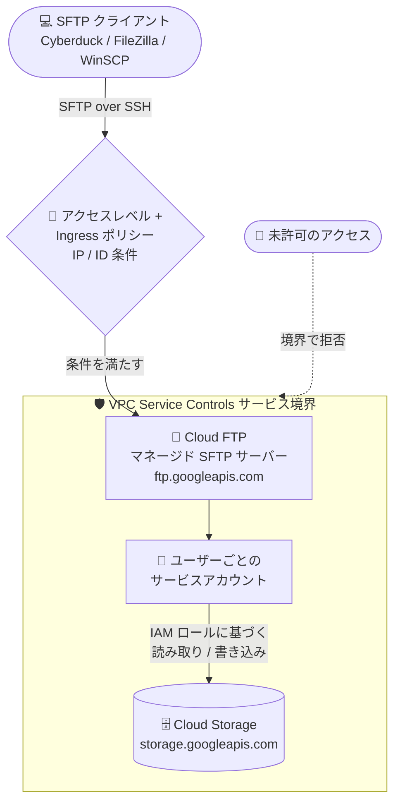

# VPC Service Controls: Cloud FTP 統合サポート (Preview)

**リリース日**: 2026-08-26

**サービス**: VPC Service Controls

**機能**: Cloud FTP 統合サポート

**ステータス**: Preview

📊 [このアップデートのインフォグラフィックを見る](https://takech9203.github.io/google-cloud-news-summary/20260826-vpc-service-controls-cloud-ftp-preview.html)

## 概要

VPC Service Controls が Cloud FTP (`ftp.googleapis.com`) との統合を Preview としてサポートしました。これにより、Cloud FTP をサービス境界 (Service Perimeter) で保護できるようになり、マネージド SFTP サーバー経由のファイル転送に対してもデータ漏洩 (Data Exfiltration) 対策を適用できます。

Cloud FTP は、SSH File Transfer Protocol (SFTP) を使用して Cloud Storage との間で安全にデータを移動するためのマネージドサービスです。Cyberduck、FileZilla、WinSCP などの標準 SFTP クライアントから Cloud Storage バケットのデータをアップロード・ダウンロードできます。金融、ヘルスケア、メディア、小売など、外部パートナーとのファイル交換にマネージドファイル転送を利用する業界では、機密データの転送経路にも境界防御を求められるケースが多く、今回の統合はそうした規制要件の厳しい組織にとって重要なアップデートです。

Google は、Cloud FTP プロジェクトを Cloud Storage リソースと同じサービス境界内に配置することを推奨しています。これにより、転送処理と Cloud Storage リソースの両方を保護できます。Cloud FTP プロジェクトと Cloud Storage バケットが異なる境界にある構成も、Ingress ポリシーを使用してサポートされます。

**アップデート前の課題**

- Cloud FTP は VPC Service Controls の対応プロダクトではなく、サービス境界で `ftp.googleapis.com` を保護できなかった
- VPC Service Controls で Cloud Storage を保護している組織は、Cloud FTP によるデータ転送を境界の保護対象に組み込む公式な手段がなかった
- SFTP 経由のファイル転送経路に対して、境界ベースのデータ漏洩対策を適用できなかった

**アップデート後の改善**

- Cloud FTP API (`ftp.googleapis.com`) をサービス境界の制限対象サービスに追加し、境界で保護できるようになった (Preview)
- アクセスレベル (SFTP クライアントの IP 範囲) と Ingress ポリシーを組み合わせて、境界内の Cloud Storage データへの SFTP 転送を制御下で許可できるようになった
- Cloud FTP プロジェクトと Cloud Storage バケットが別々の境界にある場合も、Ingress ポリシーや境界ブリッジで連携できるようになった

## アーキテクチャ図



Cloud FTP API と Cloud Storage API の両方をサービス境界の制限対象に含め、アクセスレベルと Ingress ポリシーで許可した SFTP クライアントのみが境界内の Cloud Storage データを転送できる構成です。

## サービスアップデートの詳細

### 主要機能

1. **サービス境界による Cloud FTP の保護**
   - `ftp.googleapis.com` をサービス境界の制限対象サービスとして構成可能に
   - Cloud FTP を使用するには、Cloud FTP API と Cloud Storage API (`storage.googleapis.com`) の両方を境界に追加する必要がある

2. **アクセスレベルと Ingress ポリシーによるアクセス制御**
   - SFTP クライアントの IP アドレス / CIDR 範囲をアクセスレベルの条件として指定
   - Ingress ポリシーの ID 条件で、SFTP サーバーの全ユーザー (Any identity) または特定ユーザーのサービスアカウントに限定可能

3. **柔軟な境界構成**
   - 推奨構成: Cloud FTP プロジェクトを Cloud Storage リソースと同じ境界内に配置
   - Cloud FTP と Cloud Storage が別プロジェクト・別境界の場合は、Ingress ポリシーまたは境界ブリッジ (Perimeter Bridge) で連携

## 技術仕様

### 統合の概要

| 項目 | 詳細 |
|------|------|
| ステータス | Preview (本番環境での完全サポート対象外) |
| サービス名 | `ftp.googleapis.com` |
| 境界での保護 | 可能 |
| 必須の制限対象サービス | `ftp.googleapis.com` と `storage.googleapis.com` の両方 |
| 推奨構成 | Cloud FTP プロジェクトと Cloud Storage リソースを同一境界内に配置 |
| 別境界構成 | Ingress ポリシーまたは境界ブリッジで対応 |

### Cloud FTP のセキュリティモデル

| 要素 | 内容 |
|------|------|
| サーバータイプ | 外部サーバー (インターネット経由、IP 範囲で制限) / 内部サーバー (Private Service Connect 経由で VPC 内のみ) |
| 転送経路 | SSH による暗号化チャネル |
| ユーザー認証 | 公開鍵認証。各ユーザーはサービスアカウントにマッピングされ、IAM ロール (`roles/storage.objectViewer` / `roles/storage.objectAdmin`) で Cloud Storage へのアクセスを制御 |
| トークン生成 | Cloud FTP Service Agent がユーザーのサービスアカウント用トークンを生成 |

## 設定方法

### 前提条件

1. 組織に対する Access Context Manager Admin (`roles/accesscontextmanager.policyAdmin`) IAM ロール
2. Cloud FTP の SFTP サーバーと、保護対象の Cloud Storage バケットを含むプロジェクト

### 手順

#### ステップ 1: サービス境界の作成

[サービス境界の作成手順](https://docs.cloud.google.com/vpc-service-controls/docs/create-service-perimeters)に従い、以下を指定します。

- **境界タイプ**: Regular
- **保護対象リソース**: 保護したい Cloud Storage バケットを含むプロジェクトと、SFTP サーバーを含むプロジェクト
- **制限対象サービス**: Cloud FTP API (`ftp.googleapis.com`) と Cloud Storage API (`storage.googleapis.com`)
- **VPC アクセス可能サービス**: All restricted services

#### ステップ 2: アクセスレベルの作成

SFTP クライアントが接続する IP アドレスまたは CIDR 範囲を条件とするアクセスレベルを作成します。

- **When condition is met, return**: True
- **Public IP** を選択し、**IP subnetworks** に SFTP クライアントの IP 範囲を指定

#### ステップ 3: Ingress ポリシーの構成

- **From (送信元)**:
  - Identities: 全ユーザーを許可する場合は Any identity、特定ユーザーに限定する場合はユーザーのサービスアカウントのメールアドレス
  - Sources: ステップ 2 で作成したアクセスレベル
- **To (宛先)**:
  - Resources: 保護対象の Cloud Storage バケットを含むプロジェクト
  - Operations: `ftp.googleapis.com` を対象とする Ingress ルールを追加
  - Cloud Storage がデバイスポスチャーベースのアクセスレベル (Chrome Enterprise Premium など) で保護されている場合は、`storage.googleapis.com` に対して Cloud FTP の長時間実行オペレーション (`ftp.googleapis.com/operations.*`) にメソッドを制限した Ingress ルールも追加

## メリット

### ビジネス面

- **コンプライアンス対応の強化**: 外部パートナーとの SFTP ファイル交換を、規制要件で求められる境界防御の枠組みに組み込める
- **データ漏洩リスクの低減**: 悪意ある内部者、設定ミス、侵害されたサービスアカウントによる境界外へのデータ持ち出しを防止できる

### 技術面

- **一貫したセキュリティポリシー**: Cloud Storage や BigQuery など他のサービスと同じサービス境界の仕組みで Cloud FTP を管理できる
- **柔軟な境界設計**: 同一境界配置、Ingress ポリシーによる別境界連携、境界ブリッジなど、既存の境界設計に合わせて構成できる
- **追加コストなし**: VPC Service Controls 自体に別途料金は発生しない

## デメリット・制約事項

### 制限事項

- Preview のため、本番環境での利用は完全にはサポートされない (Pre-GA Offerings Terms が適用)
- Cloud FTP API と Cloud Storage API の両方をサービス境界に追加する必要がある
- **内部サーバー**では、境界の適用はサーバー作成時にのみ検証される。サーバー作成後に境界を変更 (境界メンバーシップ、Ingress ポリシー、ネットワーク関連付けなど) しても既存の内部サーバーには検出・適用されず、更新後の境界制御を適用するにはサーバーの再作成が必要
- SFTP / SSH セッションはデバイスポスチャーメタデータ (Chrome Enterprise Premium のデバイス属性や Endpoint Verification 証明書など) を伝送しないため、Ingress ルールで適用できる条件は IP アドレスと ID のみ

### 考慮すべき点

- 外部サーバーでは、`ftp.googleapis.com` が制限対象サービスに含まれている限り境界の適用が動的に反映される (内部サーバーとの動作差異に注意)
- Cloud Storage をデバイスポスチャーで保護している場合は、追加のメソッドレベル Ingress ルールが必要
- Cloud FTP リソースは Cloud Asset Inventory にインデックスされない

## ユースケース

### ユースケース 1: 外部パートナーとの機密ファイル交換の境界保護

**シナリオ**: 金融機関が外部パートナーと SFTP でファイルを交換している。受け渡し先の Cloud Storage バケットは VPC Service Controls で保護されており、SFTP 転送経路も同じ境界防御に組み込みたい。

**実装例**:
```
1. Cloud FTP プロジェクトと Cloud Storage プロジェクトを同一のサービス境界に追加
2. 制限対象サービスに ftp.googleapis.com と storage.googleapis.com を追加
3. パートナーの固定 IP 範囲をアクセスレベルとして定義
4. パートナー専用ユーザーのサービスアカウントを Identities に指定した Ingress ポリシーを構成
```

**効果**: 許可された IP と ID の組み合わせからのみ SFTP 転送が可能になり、境界外へのデータ持ち出しリスクを低減できる。

### ユースケース 2: 分析基盤への機密データアップロードの保護

**シナリオ**: 社内の関係者が、データ処理・分析・機械学習用の機密データを SFTP で Cloud Storage にアップロードする。分析基盤全体がサービス境界で保護されている。

**効果**: IAM や gcloud CLI の知識がないユーザーでも標準 SFTP クライアントで安全にデータを投入でき、かつ転送経路全体が境界の保護対象となる。

## 料金

VPC Service Controls の利用に追加料金は発生しません。

Cloud FTP 自体の料金は、[Cloud FTP 料金ページ](https://cloud.google.com/products/cloud-ftp/pricing)を参照してください。なお、サーバーの稼働時間に応じたコストを抑えるため、データ転送が発生しない期間はサーバーを停止することが推奨されています。

## 関連サービス・機能

- **Cloud Storage**: Cloud FTP の転送先/転送元。VPC Service Controls 利用時は `storage.googleapis.com` も境界に追加する必要がある
- **Access Context Manager**: サービス境界とアクセスレベルを定義・管理するサービス。境界作成には `roles/accesscontextmanager.policyAdmin` が必要
- **Private Service Connect**: Cloud FTP の内部サーバーへの VPC 内からのアクセスに使用
- **Storage Transfer Service**: 同じく Cloud Storage との転送を境界内で保護できるデータ転送サービス (こちらは GA)。大規模なバッチ転送では代替・補完となる
- **Cloud Audit Logs**: SFTP ファイル転送時の Cloud Storage API 操作のログ取得に使用
- **IAM**: SFTP ユーザーごとのサービスアカウントに `roles/storage.objectViewer` / `roles/storage.objectAdmin` を付与してアクセスを制御

## 参考リンク

- 📊 [インフォグラフィック](https://takech9203.github.io/google-cloud-news-summary/20260826-vpc-service-controls-cloud-ftp-preview.html)
- [公式リリースノート](https://docs.cloud.google.com/release-notes#August_26_2026)
- [VPC Service Controls 対応プロダクト](https://docs.cloud.google.com/vpc-service-controls/docs/supported-products)
- [Configure VPC Service Controls for Cloud FTP](https://docs.cloud.google.com/cloud-ftp/configure-vpc-service-controls)
- [Cloud FTP ドキュメント](https://docs.cloud.google.com/cloud-ftp)
- [Ingress / Egress ルール](https://docs.cloud.google.com/vpc-service-controls/docs/ingress-egress-rules)
- [Cloud FTP 料金ページ](https://cloud.google.com/products/cloud-ftp/pricing)

## まとめ

VPC Service Controls が Cloud FTP を Preview でサポートしたことで、マネージド SFTP によるファイル転送もサービス境界によるデータ漏洩対策の対象に組み込めるようになりました。VPC Service Controls で Cloud Storage を保護しつつ外部パートナーとのファイル交換に Cloud FTP を検討している組織は、推奨構成 (同一境界への配置) と内部サーバーの境界適用タイミングに関する制限を確認したうえで、非本番環境での検証を始めることを推奨します。

---

**タグ**: #VPCServiceControls #CloudFTP #SFTP #CloudStorage #セキュリティ #DataExfiltration #Preview
