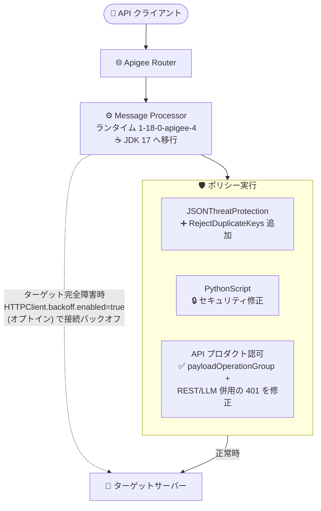

# Apigee X: ランタイムバージョン 1-18-0-apigee-4 リリース (JDK 17 移行・接続バックオフ・セキュリティ修正)

**リリース日**: 2026-08-27

**サービス**: Apigee X

**機能**: ランタイムバージョン 1-18-0-apigee-4 (バグ修正・セキュリティ修正)

**ステータス**: リリース済み (Announcement / Fixed / Security)

📊 [このアップデートのインフォグラフィックを見る](https://takech9203.github.io/google-cloud-news-summary/20260827-apigee-x-1-18-0-apigee-4.html)

## 概要

2026 年 8 月 27 日、Apigee の更新バージョン **1-18-0-apigee-4** がリリースされました。ロールアウトは同日から開始され、すべての Google Cloud ゾーンに展開が完了するまでに 4 営業日以上かかる場合があります。ロールアウトが完了するまで、インスタンスによっては本リリースの機能や修正が反映されていない可能性があります。

本リリースは、ランタイム基盤の近代化 (JDK 17 への移行)、ターゲット障害時の CPU 過剰消費を防ぐ接続バックオフ機構の追加 (オプトイン)、API プロダクトのオペレーショングループ組み合わせに関するバグ修正、JSONThreatProtection ポリシーの新要素追加、そして PythonScript ポリシーおよび Apigee インフラストラクチャのセキュリティ修正を含む、運用品質とセキュリティに焦点を当てたメンテナンスリリースです。API 基盤として Apigee X / Apigee hybrid を運用するすべてのチームに関係するアップデートです。

**アップデート前の課題**

- Apigee ランタイムは JDK 11 ベースで動作しており、より新しい Java LTS ランタイムの性能・セキュリティ改善を享受できていなかった
- ターゲットサーバーが完全に利用不可の状態になると、Message Processor が接続再試行によって過剰な CPU を消費する可能性があった
- API プロダクトで `payloadOperationGroup` (MCP などペイロードベースの操作制御) と REST の operationGroup や `llmOperationGroup` を組み合わせると、REST/LLM トラフィックが 401 で誤って拒否されるバグがあった
- JSONThreatProtection ポリシーには、同一オブジェクト内の重複 JSON キーを検出・拒否する手段がなかった (従来の制御は配列要素数、ネスト深さ、文字列長などのみ)
- PythonScript ポリシーおよび Apigee インフラストラクチャに未修正のセキュリティ問題が存在した

**アップデート後の改善**

- ランタイムが JDK 17 上で動作するようになった (JDK 11 との後方互換性は維持)
- CWC (code with config) プロパティ `HTTPClient.backoff.enabled` (デフォルト: false) によるオプトインで、ターゲット完全障害時の接続失敗バックオフが有効化でき、Message Processor の CPU 過剰消費を防止できるようになった
- `payloadOperationGroup` と REST / `llmOperationGroup` を同一 API プロダクトで併用しても、REST/LLM トラフィックが正しく認可されるようになった
- JSONThreatProtection ポリシーに新しいオプション子要素 `<RejectDuplicateKeys>` が追加され、同一オブジェクト内に重複 JSON キーを含むリクエストボディを拒否できるようになった (デフォルト: false で既存動作を維持)
- PythonScript ポリシーと Apigee インフラストラクチャのセキュリティ問題が修正された

## アーキテクチャ図



1-18-0-apigee-4 で更新される Apigee ランタイムの主要コンポーネントと修正ポイントを示しています。Message Processor は JDK 17 で動作し、オプトインの接続バックオフによりターゲット完全障害時の CPU 過剰消費を防ぎます。

## サービスアップデートの詳細

### 主要機能

1. **Apigee ランタイムの JDK 17 移行 (Bug ID: 507878328)**
   - Apigee ランタイムが JDK 17 上で動作するようにアップグレードされた
   - JDK 11 との後方互換性は維持されており、既存の API プロキシへの影響を抑えた移行となっている

2. **Message Processor の接続失敗バックオフ (Bug ID: 530965355)**
   - ターゲットが完全に利用不可の場合に、Message Processor が過剰な CPU を消費することを防ぐ接続失敗バックオフ機構を追加
   - CWC プロパティ `HTTPClient.backoff.enabled` で制御するオプトイン機能 (デフォルト: false)

3. **API プロダクトのオペレーショングループ併用バグ修正 (Bug ID: 532793298)**
   - `payloadOperationGroup` (MCP など、リクエストボディに操作が埋め込まれるプロトコルの認可・クォータ制御) と REST の operationGroup または `llmOperationGroup` を組み合わせた場合に、REST/LLM トラフィックが 401 で拒否されるバグを修正
   - MCP ツールアクセス制御と従来の REST API / LLM トークンクォータ制御を単一の API プロダクトで安全に併用可能になった

4. **JSONThreatProtection ポリシーの `<RejectDuplicateKeys>` 要素追加 (Bug ID: 534420582)**
   - 同一 JSON オブジェクト内に重複キーを含むリクエストボディを拒否する新しいオプション子要素
   - デフォルトは false で、既存の動作を維持 (明示的に有効化した場合のみ拒否)

5. **セキュリティ修正 (Bug ID: 544570126 ほか)**
   - PythonScript ポリシーのセキュリティ問題を修正
   - Apigee インフラストラクチャのセキュリティ修正、およびインフラストラクチャ・ライブラリの更新

## 技術仕様

### リリース情報

| 項目 | 詳細 |
|------|------|
| バージョン | 1-18-0-apigee-4 |
| リリース開始日 | 2026 年 8 月 27 日 |
| ロールアウト期間 | 全 Google Cloud ゾーンへの展開完了まで 4 営業日以上かかる場合あり |
| ランタイム基盤 | JDK 17 (JDK 11 と後方互換) |
| バックオフ制御プロパティ | `HTTPClient.backoff.enabled` (CWC プロパティ、デフォルト: false、オプトイン) |

### JSONThreatProtection ポリシーの構成例

`<RejectDuplicateKeys>` は既存の制限要素 (配列要素数、ネスト深さ、文字列長など) と組み合わせて使用できます。

```xml
<JSONThreatProtection async="false" continueOnError="false" enabled="true" name="JSON-Threat-Protection-1">
  <DisplayName>JSONThreatProtection 1</DisplayName>
  <ArrayElementCount>20</ArrayElementCount>
  <ContainerDepth>10</ContainerDepth>
  <ObjectEntryCount>15</ObjectEntryCount>
  <ObjectEntryNameLength>50</ObjectEntryNameLength>
  <StringValueLength>500</StringValueLength>
  <Source>request</Source>
  <!-- 1-18-0-apigee-4 で追加: 重複 JSON キーを含むボディを拒否 (デフォルト: false) -->
  <RejectDuplicateKeys>true</RejectDuplicateKeys>
</JSONThreatProtection>
```

- JSONThreatProtection ポリシーは、リクエスト/レスポンスヘッダーの Content-Type が `application/json` の場合にのみ実行されます
- JSONThreatProtection および PythonScript は Extensible (拡張可能) ポリシーに分類され、Apigee のライセンス/料金プランによっては利用可否やコストへの影響があります

## メリット

### ビジネス面

- **安定性の向上**: ターゲット完全障害時の CPU 過剰消費を防ぐことで、障害の連鎖 (リソース枯渇による他プロキシへの影響) リスクを低減できる
- **セキュリティリスクの低減**: PythonScript ポリシーとインフラのセキュリティ修正が自動ロールアウトで適用され、運用チームの対応負荷なくリスクが解消される
- **AI/MCP ワークロードの本番適用を促進**: MCP 向けのペイロード操作制御と既存 REST/LLM 制御を同一 API プロダクトで併用できるようになり、AI ゲートウェイ用途での設計自由度が向上する

### 技術面

- **ランタイム近代化**: JDK 17 への移行により、最新 LTS の JVM を基盤とした運用となる。JDK 11 後方互換のため既存プロキシの改修は不要
- **JSON ペイロード防御の強化**: 重複キーを悪用したパーサー差異攻撃 (パーサーごとに解釈が異なる重複キーの悪用) への対策を、ポリシー設定 1 行で追加できる
- **既存動作の維持**: 新機能 (`RejectDuplicateKeys`、接続バックオフ) はいずれもデフォルト無効のオプトイン設計であり、アップグレードによる意図しない挙動変化がない

## デメリット・制約事項

### 制限事項

- ロールアウトには 4 営業日以上かかる場合があり、完了までインスタンスに機能・修正が反映されない可能性がある
- 接続バックオフはオプトイン (`HTTPClient.backoff.enabled` デフォルト false) のため、有効化しない限り従来の動作のまま
- `<RejectDuplicateKeys>` もデフォルト false のため、明示的に設定しない限り重複キーは拒否されない

### 考慮すべき点

- `<RejectDuplicateKeys>` を有効化する場合、重複キーを含む JSON を送信している既存クライアントがないか事前に確認する (有効化後は該当リクエストが拒否される)
- JDK 17 移行は後方互換とされているが、PythonScript / JavaScript などスクリプト系ポリシーを多用しているプロキシはロールアウト後に動作確認を行うことが望ましい
- 自身のインスタンスへの適用状況は、ロールアウト完了を待って確認する必要がある

## ユースケース

### ユースケース 1: 不安定なバックエンドを抱える API 基盤の保護

**シナリオ**: 外部 SaaS やレガシーシステムをターゲットとする API プロキシで、ターゲット側の完全停止が発生すると、Message Processor が接続再試行で CPU を消費し、同一環境の他のプロキシの性能にも影響していた。

**実装例**: CWC プロパティ `HTTPClient.backoff.enabled` を有効化し、接続失敗時のバックオフを適用する (オプトイン)。

**効果**: ターゲット完全障害時も Message Processor の CPU 消費が抑制され、同居する他 API への性能影響を回避できる。

### ユースケース 2: MCP サーバーと REST API を単一 API プロダクトで統制

**シナリオ**: AI エージェント向けに MCP サーバー (`tools/call` などのペイロード操作) と従来の REST API、LLM トークンクォータを 1 つの API プロダクトで管理したいが、従来は `payloadOperationGroup` と REST / `llmOperationGroup` の併用で REST/LLM トラフィックが 401 になるバグがあり、プロダクトを分割して運用していた。

**効果**: バグ修正により単一 API プロダクトでの併用が可能になり、アプリ承認・クォータ管理を一元化できる。

### ユースケース 3: JSON 重複キーを悪用した攻撃への防御

**シナリオ**: バックエンドの JSON パーサーと WAF/ゲートウェイのパーサーで重複キーの解釈が異なることを悪用した認可バイパスやインジェクションを防ぎたい。

**実装例**: JSONThreatProtection ポリシーに `<RejectDuplicateKeys>true</RejectDuplicateKeys>` を追加し、重複キーを含むリクエストボディをゲートウェイ層で拒否する。

**効果**: バックエンドに到達する前に不正な JSON ペイロードを遮断し、コンテンツレベル攻撃への防御を強化できる。

## 料金

本リリース (ランタイムバージョンの更新) 自体に追加料金は発生しません。Apigee の料金はサブスクリプションまたは Pay-as-you-go モデルに基づきます。

なお、本リリースで言及された JSONThreatProtection および PythonScript は **Extensible (拡張可能) ポリシー** に分類され、Pay-as-you-go では Extensible API プロキシとして Standard より高い単価が適用されます。

| 項目 (Pay-as-you-go) | 料金 (概算) |
|--------|-----------------|
| Standard API プロキシ呼び出し (100 万コールあたり) | $20 (5,000 万コールまで) |
| Extensible API プロキシ呼び出し (100 万コールあたり) | $100 (5,000 万コールまで) |
| 環境使用料 (1 時間・リージョンあたり) | Base $0.5 / Intermediate $2.0 / Comprehensive $4.7 |

詳細は [Apigee 料金ページ](https://cloud.google.com/apigee/pricing/) を参照してください。

## 利用可能リージョン

ロールアウトは 2026 年 8 月 27 日に開始され、すべての Google Cloud ゾーンへの展開完了までに 4 営業日以上かかる場合があります。ロールアウト完了まで、インスタンスに本リリースの機能・修正が反映されていない可能性があります。

## 関連サービス・機能

- **Apigee API プロダクト (payloadOperationGroup / llmOperationGroup)**: MCP などペイロードベースのプロトコルの操作単位認可・クォータと、LLM トークンクォータを制御する仕組み。本リリースで併用時の 401 バグが修正された
- **ParsePayload ポリシー**: ペイロード操作 (payloadOperationGroup) を使用するプロキシで、リクエストボディから操作名 (例: `tools/call/get_weather`) を抽出するために必要なポリシー
- **Advanced API Security**: JSONThreatProtection などの脅威保護ポリシーと組み合わせて API のセキュリティ態勢を強化するアドオン
- **Cloud Monitoring / Apigee API Monitoring**: ポリシーのフォールトコード (例: `steps.jsonthreatprotection.ExecutionFailed`) の監視・アラートに使用

## 参考リンク

- 📊 [インフォグラフィック](https://takech9203.github.io/google-cloud-news-summary/20260827-apigee-x-1-18-0-apigee-4.html)
- [公式リリースノート](https://docs.cloud.google.com/release-notes#August_27_2026)
- [JSONThreatProtection ポリシー](https://docs.cloud.google.com/apigee/docs/api-platform/reference/policies/json-threat-protection-policy)
- [PythonScript ポリシー](https://docs.cloud.google.com/apigee/docs/api-platform/reference/policies/python-script-policy)
- [API プロダクトの作成 (Payload Operations)](https://docs.cloud.google.com/apigee/docs/api-platform/publish/create-api-products)
- [API Products REST リファレンス (payloadOperationGroup / llmOperationGroup)](https://docs.cloud.google.com/apigee/docs/reference/apis/apigee/rest/v1/organizations.apiproducts)
- [料金ページ](https://cloud.google.com/apigee/pricing/)

## まとめ

Apigee 1-18-0-apigee-4 は、JDK 17 への基盤移行、ターゲット障害時の CPU 保護 (オプトインのバックオフ)、MCP/LLM と REST の API プロダクト併用バグ修正、JSON 重複キー拒否機能、セキュリティ修正を含むメンテナンスリリースです。セキュリティ修正は自動適用されますが、`<RejectDuplicateKeys>` や `HTTPClient.backoff.enabled` はオプトインのため、自組織のワークロードに応じて有効化を検討してください。特に MCP ゲートウェイとして Apigee を利用しているチームは、API プロダクト設計の見直し (プロダクト統合) の好機です。

---

**タグ**: Apigee X, API Management, JDK 17, Message Processor, JSONThreatProtection, PythonScript, MCP, セキュリティ修正, ランタイムアップデート
