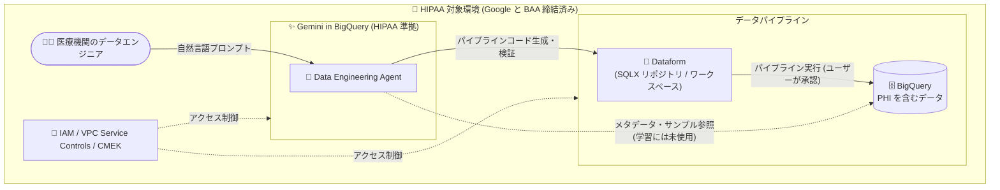

# BigQuery: Data Engineering Agent が HIPAA 準拠に

**リリース日**: 2026-08-27

**サービス**: BigQuery

**機能**: Data Engineering Agent の HIPAA 準拠

**ステータス**: 一般提供 (GA)

📊 [このアップデートのインフォグラフィックを見る](https://takech9203.github.io/google-cloud-news-summary/20260827-bigquery-data-engineering-agent-hipaa.html)

## 概要

BigQuery の Data Engineering Agent が HIPAA (Health Insurance Portability and Accountability Act) に準拠しました。Data Engineering Agent は、自然言語プロンプトを使用して BigQuery 上のデータパイプラインを構築・変更・トラブルシューティングできる Gemini in BigQuery のエージェント機能です。

HIPAA は米国の医療情報保護に関する法律で、保護対象保健情報 (PHI: Protected Health Information) を扱う組織 (医療機関、保険会社、およびそのビジネスアソシエイト) に厳格なセキュリティ・プライバシー要件を課しています。今回の準拠により、Google と BAA (Business Associate Agreement) を締結した組織は、PHI を含むワークロードに関連するプロジェクトでも Data Engineering Agent を利用できるようになります。

医療・ヘルスケア・保険業界など、HIPAA 対応が必須の業界のデータエンジニアリングチームにとって、AI エージェントによるパイプライン開発の生産性向上をコンプライアンス要件を維持したまま享受できる重要なアップデートです。

**アップデート前の課題**

- Data Engineering Agent は HIPAA 準拠の対象外だったため、PHI を扱う HIPAA 対象ワークロードのプロジェクトでは利用できなかった
- 医療・ヘルスケア業界の組織は、コンプライアンス上の理由から Data Engineering Agent の利用を制限し、パイプライン開発を手動で行う必要があった
- Gemini in BigQuery のドキュメントでは、サポートされていないコンプライアンス要件を持つプロジェクトでは Gemini 機能を有効化しないことが推奨されている

**アップデート後の改善**

- Data Engineering Agent が Google Cloud の HIPAA コンプライアンスプログラムの対象となり、BAA を締結した組織が HIPAA 対象ワークロードで利用可能になった
- 医療データ (PHI) を含む BigQuery プロジェクトでも、自然言語によるパイプライン生成・修正・トラブルシューティングが可能になった
- SOC 1/2/3、ISO/IEC 27001 などの既存の認証に加えて HIPAA がカバーされ、規制業界での採用ハードルが下がった

## アーキテクチャ図



BAA を締結した HIPAA 対象環境内で、データエンジニアが Data Engineering Agent に自然言語で指示し、Dataform 上にパイプラインコードを生成して PHI を含む BigQuery データを処理する構成です。エージェントはパイプラインを直接実行せず、ユーザーのレビューと承認を経て実行されます。

## サービスアップデートの詳細

### 主要機能

1. **HIPAA コンプライアンスの対象化**
   - Data Engineering Agent が [HIPAA compliance on Google Cloud](https://cloud.google.com/security/compliance/hipaa) の対象に追加された
   - HIPAA 対応は Google と顧客の共有責任モデルであり、PHI を扱う場合は Google の BAA (Business Associate Agreement) の確認・締結が必要

2. **Data Engineering Agent の機能 (対象となるエージェント)**
   - 自然言語プロンプトによるデータパイプラインの構築・変更・トラブルシューティング
   - Dataform 統合: リポジトリ / ワークスペース内に直接パイプラインコードを生成・整理
   - プラン生成とパイプライン制御: 実行前にエージェントの計画をレビュー・カスタマイズ可能
   - コード検証: 生成コードのコンパイルエラーを自動検証・修正
   - Knowledge Catalog 統合による外部コンテキストの利用とメタデータ自動生成
   - BigQuery pipelines インターフェース、Dataform、VS Code 拡張 (Data Agent Kit)、Data Engineering Agent API (A2A プロトコル) から利用可能

3. **Gemini in BigQuery のセキュリティ・プライバシー統制**
   - プロンプト・レスポンス・スキーマ情報は、明示的なオプトインなしにモデルの学習に使用されない
   - エージェントは応答品質向上のために BigQuery のサンプル行や Knowledge Catalog のデータスキャンプロファイルを参照するが、コンテキストとしてのみ使用され学習には使われない
   - IAM によるアクセス制御、転送時・保存時の暗号化、VPC Service Controls によるセキュリティ境界の構築に対応

## 技術仕様

### コンプライアンスと統制の概要

| 項目 | 詳細 |
|------|------|
| 準拠規格 | HIPAA (今回追加)、SOC 1/2/3、ISO/IEC 27001 など Gemini for Google Cloud の GA 機能向け認証 |
| BAA | PHI を扱う場合は Google の Business Associate Agreement の確認・締結が必要 |
| データ利用 | プロンプト・応答・スキーマ情報は明示的な許可なくモデル学習に使用されない |
| データ処理ロケーション | Gemini in BigQuery は US / EU の管轄区域内で処理を指定可能。それ以外の地域のデータはグローバルに処理される |
| 監査ログ | Gemini in BigQuery のユーザープロンプトとレスポンスは Cloud Logging 監査ログの対象外 |
| Assured Workloads | Gemini in BigQuery は Assured Workloads のサポート対象パッケージに含まれない |
| 暗号化 | 保存時・転送時に暗号化。データセット / プロジェクトレベルの CMEK、Dataform のデフォルト CMEK 設定に対応 |
| ネットワーク境界 | VPC Service Controls で Dataform、BigQuery、Conversational Analytics API を境界内に構成可能 |

### 必要な API と IAM ロール

```bash
# 必要な API の有効化
gcloud services enable geminidataanalytics.googleapis.com --project=PROJECT_ID
gcloud services enable cloudaicompanion.googleapis.com --project=PROJECT_ID
gcloud services enable bigquery.googleapis.com --project=PROJECT_ID
```

| ロール | 用途 |
|--------|------|
| `roles/dataform.codeEditor` | Dataform リポジトリ / ワークスペースでのコード編集 |
| `roles/bigquery.jobUser` | BigQuery ジョブの実行 |
| `roles/geminidataanalytics.dataAgentStatelessUser` | Data Engineering Agent の利用 (`geminidataanalytics.locations.useDataEngineeringAgent` 権限を含む) |
| `roles/dataplex.catalogEditor` | Knowledge Catalog 統合を利用する場合 |

## 設定方法

### 前提条件

1. Google と BAA (Business Associate Agreement) を確認・締結する (PHI を扱う場合は必須)
2. プロジェクトで Gemini in BigQuery を有効化する ([Set up Gemini in BigQuery](https://docs.cloud.google.com/bigquery/docs/gemini-set-up))
3. 上記の必要な API を有効化し、IAM ロールを付与する

### 手順

#### ステップ 1: BigQuery pipelines または Dataform からエージェントを起動

BigQuery Studio でクエリエディタから **Create new > Pipeline** を選択するか、Dataform のワークスペースで **Ask Agent** をクリックします。

#### ステップ 2: 自然言語でパイプラインを生成

```text
Create dimension tables for a taxi trips star schema from
new_york_taxi_trips.tlc_green_trips_2022. Generate surrogate keys
and all the descriptive attributes.
```

エージェントが生成したパイプラインのドラフトをノードごとにレビューし、SQLX クエリとデータプレビューを確認した上で **Apply** を選択して適用します。エージェントはパイプラインを直接実行しないため、実行やスケジュールはユーザー自身が行います。

## メリット

### ビジネス面

- **規制業界での AI エージェント活用**: 医療・ヘルスケア・保険など HIPAA 対応が必須の業界で、PHI を含むデータ基盤の開発に Data Engineering Agent を利用できるようになる
- **コンプライアンス評価コストの削減**: Google Cloud の HIPAA コンプライアンスプログラム (BAA、第三者監査レポート) の枠組みで評価できるため、個別のリスク評価負担が軽減される
- **開発生産性の向上**: 自然言語によるパイプライン生成・修正・トラブルシューティングにより、データエンジニアリングのリードタイムを短縮できる

### 技術面

- **既存のセキュリティ統制との統合**: IAM、VPC Service Controls、CMEK などの既存の BigQuery / Dataform セキュリティ統制と組み合わせて利用できる
- **データが学習に使われない設計**: プロンプトや参照データはコンテキストとしてのみ使用され、明示的な許可なくモデル学習に使用されない
- **人間によるレビューを前提としたワークフロー**: エージェントはプラン提示とコード生成のみを行い、実行はユーザーの承認を経るため、PHI を扱う環境でも統制を維持しやすい

## デメリット・制約事項

### 制限事項

- HIPAA 準拠は共有責任モデルであり、最終的な HIPAA 準拠の評価責任は顧客側にある。PHI を扱う前に BAA の締結が必要
- Gemini in BigQuery はロケーション単位のデータレジデンシーを提供しない。処理は US / EU 管轄区域の指定が可能で、それ以外の地域のデータはグローバルに処理される
- Gemini in BigQuery のユーザープロンプトとレスポンスは Cloud Logging 監査ログに記録されない
- Gemini in BigQuery は Assured Workloads のサポート対象パッケージに含まれない
- Data Engineering Agent はノートブックとデータ準備ファイルの自然言語コマンドに対応せず、パイプラインの実行自体も行えない (ユーザーによるレビューと実行が必要)

### 考慮すべき点

- Gemini は生成 AI であるため、もっともらしいが誤った出力を生成する可能性がある。生成されたコードや分析は必ず人間がレビュー・検証する
- 自然言語プロンプトに機密情報や個人情報を不必要に含めないよう、利用ガイドラインを整備する
- HIPAA 以外に必要なコンプライアンス認証が Gemini for Google Cloud でサポートされているかを [Certifications and security for Gemini for Google Cloud](https://docs.cloud.google.com/gemini/docs/discover/certifications) で確認し、要件を満たさないプロジェクトでは Gemini in BigQuery を無効化する

## ユースケース

### ユースケース 1: 医療機関の診療データパイプライン構築

**シナリオ**: 病院グループが電子カルテ由来の診療データ (PHI) を BigQuery に集約し、分析用のスタースキーマを構築したい。従来は HIPAA 要件のため AI エージェントを使えず、Dataform の SQLX を手動で開発していた。

**実装例**:
```text
プロンプト例 (Data Engineering Agent):
「patient_encounters テーブルから診療科別・月別の集計テーブルを作成する
パイプラインを構築して。サロゲートキーを生成し、ディメンションテーブルを
正規化して。」
```

**効果**: BAA 締結済みの環境で、PHI を含むデータのパイプライン開発をエージェントに委譲でき、開発工数を削減しながら HIPAA 要件を維持できる。

### ユースケース 2: ヘルスケア保険会社のパイプライン障害対応

**シナリオ**: 保険金請求データのパイプラインが失敗した際、Data Engineering Agent のトラブルシューティング機能で実行ログから根本原因分析と修正提案を取得し、修正をエージェントに指示する。

**効果**: HIPAA 対象環境でも AI によるパイプライン障害の原因分析・修復が利用でき、復旧時間を短縮できる。

## 料金

今回のアップデートはコンプライアンス対象の拡大であり、料金体系の変更はありません。Data Engineering Agent を含む Gemini in BigQuery の料金は以下を参照してください。

- [Gemini for Google Cloud の料金](https://cloud.google.com/products/gemini/pricing)

## 利用可能リージョン

Gemini in BigQuery (Data Engineering Agent を含む) のデータ処理ロケーションは、US および EU の管轄区域内での処理指定に対応し、それ以外の地域のデータはグローバルに処理されます。詳細は [Where Gemini in BigQuery processes your data](https://docs.cloud.google.com/bigquery/docs/gemini-locations) を参照してください。

## 関連サービス・機能

- **Dataform**: Data Engineering Agent はパイプラインコードを Dataform リポジトリ / ワークスペース内に生成する。Dataform のデフォルト CMEK でパイプラインコードを暗号化可能
- **Knowledge Catalog (Dataplex)**: エージェントの外部コンテキストとして統合され、テーブル構成からのメタデータ自動生成にも対応
- **VPC Service Controls**: Dataform、BigQuery、Conversational Analytics API を境界内に構成し、セキュリティ境界を強化できる
- **Cloud KMS (CMEK)**: データセット / プロジェクトレベルでの顧客管理暗号鍵によるデータ暗号化
- **IAM**: 最小権限の原則に基づくエージェント利用の制御 (`roles/geminidataanalytics.dataAgentStatelessUser` など)

## 参考リンク

- 📊 [インフォグラフィック](https://takech9203.github.io/google-cloud-news-summary/20260827-bigquery-data-engineering-agent-hipaa.html)
- [公式リリースノート](https://docs.cloud.google.com/release-notes#August_27_2026)
- [HIPAA compliance on Google Cloud](https://cloud.google.com/security/compliance/hipaa)
- [Security, privacy, and compliance for Gemini in BigQuery](https://docs.cloud.google.com/bigquery/docs/gemini-security-privacy-compliance)
- [Data Engineering Agent overview](https://docs.cloud.google.com/gemini/data-agents/data-engineering-agent/agent-overview)
- [Use the Data Engineering Agent to build and modify data pipelines](https://docs.cloud.google.com/bigquery/docs/data-engineering-agent-pipelines)
- [Certifications and security for Gemini for Google Cloud](https://docs.cloud.google.com/gemini/docs/discover/certifications)
- [料金ページ (Gemini for Google Cloud)](https://cloud.google.com/products/gemini/pricing)

## まとめ

Data Engineering Agent の HIPAA 準拠により、医療・ヘルスケア業界など PHI を扱う組織でも AI エージェントによるデータパイプライン開発が可能になりました。HIPAA 対応は共有責任モデルであるため、利用にあたっては BAA の締結、監査ログ非対応やデータレジデンシーなどの制約の確認、生成コードの人間によるレビュー体制の整備を推奨します。

---

**タグ**: BigQuery, Data Engineering Agent, Gemini in BigQuery, HIPAA, コンプライアンス, セキュリティ, Dataform, 生成 AI
