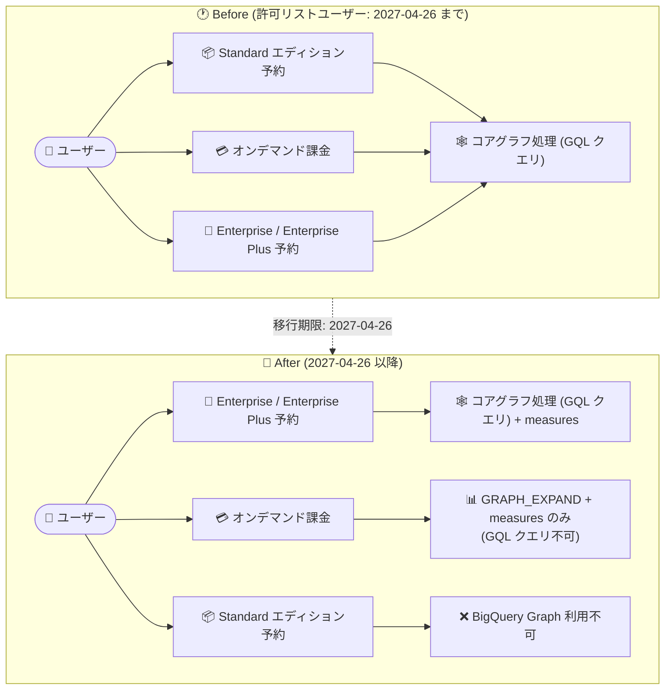

# BigQuery: BigQuery Graph のコアグラフ処理が Enterprise / Enterprise Plus エディション予約必須に

**リリース日**: 2026-08-27

**サービス**: BigQuery

**機能**: BigQuery Graph コアグラフ処理のエディション要件変更

**ステータス**: Announcement

📊 [このアップデートのインフォグラフィックを見る](https://takech9203.github.io/google-cloud-news-summary/20260827-bigquery-graph-enterprise-edition-requirement.html)

## 概要

BigQuery Graph のコアグラフ処理 (GQL クエリの実行) に、**Enterprise または Enterprise Plus エディションの予約 (reservation) が必須**となることが発表されました。既存の許可リスト (allowlist) 登録ユーザーは、**2027 年 4 月 26 日まで** Standard エディションまたはオンデマンド課金を引き続き利用できますが、それ以降はこれらの課金モデルでのコアグラフ処理はサポートされなくなります。

BigQuery Graph は、ノードとエッジでデータをグラフとしてモデル化し、ISO GQL 標準に準拠した Graph Query Language (GQL) で複雑な関係性を分析できる機能 (Preview) です。不正検知、レコメンデーション、ナレッジグラフ、サプライチェーン分析などのユースケースで利用されています。今回の発表は、この機能の課金・エディション要件を明確化するものであり、8 月 20 日の Release Notes で告知された非推奨化 (Deprecated) の詳細・施行日を補足するアナウンスです。

なお、グラフのプロパティに集計を定義する **Graph measures** (グラフメジャー) は、Enterprise / Enterprise Plus エディションに加えて**オンデマンド課金でも引き続き利用可能**です。ただし、measures は Standard エディションでは利用できません。BigQuery Graph を Standard エディションやオンデマンド課金で利用している組織は、移行期限までに課金モデルの見直しが必要です。

**アップデート前の課題**

これまで許可リスト登録ユーザーに認められていた柔軟な課金モデルが、今後は制限されます。

- 許可リスト登録ユーザーは、Standard エディションの予約やオンデマンド課金でもコアグラフ処理 (GQL クエリ) を実行できた
- 課金モデルごとに利用可能なグラフ機能の範囲が分かりにくく、GA に向けたエディション要件が明確でなかった

**アップデート後の改善 (変更点)**

今回の発表により、BigQuery Graph の課金モデルとエディション要件が明確化されました。

- コアグラフ処理 (GQL クエリ) の実行には Enterprise または Enterprise Plus エディションの予約が必須と明確化された
- 既存の許可リスト登録ユーザーには 2027 年 4 月 26 日までの移行猶予期間が設定された
- Graph measures は Enterprise / Enterprise Plus エディションとオンデマンド課金で引き続き利用可能であることが明示された (Standard エディションでは利用不可)
- オンデマンド課金では GQL クエリは実行できないが、グラフの作成、`GRAPH_EXPAND` 関数の呼び出し、measures の利用は可能

## アーキテクチャ図



移行期限 (2027 年 4 月 26 日) 以降、GQL クエリによるコアグラフ処理は Enterprise / Enterprise Plus エディションの予約でのみ実行可能になります。オンデマンド課金では `GRAPH_EXPAND` 関数と measures による SQL ベースのグラフ分析のみが利用できます。

## サービスアップデートの詳細

### 主要な変更点

1. **コアグラフ処理のエディション要件**
   - GQL クエリの実行 (コアグラフ処理) には Enterprise または Enterprise Plus エディションの予約が必須
   - Standard エディションでは BigQuery Graph 自体が利用不可

2. **既存許可リストユーザーへの移行猶予**
   - 既存の許可リスト登録ユーザーは、2027 年 4 月 26 日まで Standard エディションまたはオンデマンド課金でコアグラフ処理を継続利用可能
   - 期限以降、これらの課金モデルでのコアグラフ処理はサポート終了

3. **Graph measures の扱い**
   - measures は Enterprise / Enterprise Plus エディションと、オンデマンド課金のクエリで引き続き利用可能
   - measures は Standard エディションでは利用不可
   - measures はノード/エッジテーブルの `PROPERTIES` 句内で `MEASURE()` キーワードと集計関数 (SUM、AVG、COUNT、COUNT(DISTINCT)、MIN、MAX) を使って定義する集計プロパティで、結合によって行が重複しても KEY を基準に正しく集計される

4. **オンデマンド課金で利用可能な機能**
   - グラフの作成、`GRAPH_EXPAND` テーブル値関数 (TVF) の呼び出し、measures の利用 (`AGG()` 関数による集計) が可能
   - GQL クエリの実行はサポートされない

## 技術仕様

### 課金モデル別の BigQuery Graph 機能サポート

| 課金モデル | コアグラフ処理 (GQL クエリ) | GRAPH_EXPAND / measures |
|-----------|---------------------------|------------------------|
| Enterprise / Enterprise Plus エディション | 利用可能 | 利用可能 |
| オンデマンド課金 | 2027-04-26 まで (許可リストユーザーのみ)、以降は不可 | 利用可能 |
| Standard エディション | 2027-04-26 まで (許可リストユーザーのみ)、以降は不可 | 利用不可 (measures 非対応) |

### 移行スケジュール

| 日付 | イベント |
|------|---------|
| 2026-08-20 | Standard エディションとオンデマンド課金でのコアグラフ処理の非推奨化を Release Notes で告知 |
| 2026-08-27 | エディション要件と移行期限の詳細をアナウンス (本アップデート) |
| 2027-04-26 | Standard エディション / オンデマンド課金でのコアグラフ処理のサポート終了 |

### BigQuery エディションの主な違い (関連項目)

| 項目 | Standard | Enterprise | Enterprise Plus |
|------|----------|-----------|-----------------|
| BigQuery Graph | 利用不可 | 利用可能 | 利用可能 |
| 課金モデル | スロット時間 | スロット時間 | スロット時間 |
| 月間 SLO | 99.9% 以上 | 99.99% 以上 | 99.99% 以上 |
| コミットメントプラン | なし | 1 年 (20% 割引) / 3 年 (40% 割引) | 1 年 (20% 割引) / 3 年 (40% 割引) |
| 最大予約サイズ | 1,600 スロット | クォータに準拠 | クォータに準拠 |
| きめ細かなセキュリティ制御 (列/行レベル、データマスキング) | なし | あり | あり |
| Assured Workloads コンプライアンス制御 | なし | なし | あり |

## 設定方法

### 前提条件

1. BigQuery Reservations を管理する管理プロジェクトへのアクセス権 (`bigquery.resourceAdmin` など)
2. BigQuery Graph を利用するプロジェクトの特定

### 手順

#### ステップ 1: Enterprise エディションの予約を作成

```bash
bq mk \
    --project_id=ADMIN_PROJECT_ID \
    --location=LOCATION \
    --reservation \
    --edition=ENTERPRISE \
    --autoscale_max_slots=100 \
    graph_reservation
```

Enterprise エディション (または `ENTERPRISE_PLUS`) の予約を作成します。オートスケーリングにより、使用したスロット時間のみが課金されます。

#### ステップ 2: グラフ処理を行うプロジェクトに予約を割り当て

```bash
bq mk \
    --project_id=ADMIN_PROJECT_ID \
    --location=LOCATION \
    --reservation_assignment \
    --reservation_id=ADMIN_PROJECT_ID:LOCATION.graph_reservation \
    --assignee_type=PROJECT \
    --assignee_id=GRAPH_PROJECT_ID \
    --job_type=QUERY
```

BigQuery Graph の GQL クエリを実行するプロジェクトを予約に割り当てます。割り当てはプロジェクト、フォルダ、組織のいずれの単位でも可能です。

## メリット

### ビジネス面

- **移行猶予期間の確保**: 既存の許可リストユーザーには 2027 年 4 月 26 日までの約 8 か月の猶予があり、計画的な移行が可能
- **コミットメント割引の活用**: Enterprise / Enterprise Plus エディションでは 1 年 (20% 割引) または 3 年 (40% 割引) のコミットメントプランを利用でき、継続的なグラフ分析ワークロードのコストを最適化できる

### 技術面

- **要件の明確化**: 課金モデルごとに利用可能なグラフ機能 (GQL、GRAPH_EXPAND、measures) が明確になり、アーキテクチャ設計時の判断がしやすくなった
- **オンデマンドでの部分的な継続利用**: GQL クエリは不可となるが、`GRAPH_EXPAND` と measures による SQL ベースのグラフ分析はオンデマンド課金でも継続できる

## デメリット・制約事項

### 制限事項

- 2027 年 4 月 26 日以降、Standard エディションおよびオンデマンド課金ではコアグラフ処理 (GQL クエリ) を実行できない
- Graph measures は Standard エディションでは利用できない
- オンデマンド課金では GQL クエリを実行できない (`GRAPH_EXPAND` 経由の SQL クエリのみ)
- BigQuery Graph は引き続き Preview 段階の機能である

### 考慮すべき点

- Standard エディションやオンデマンド課金で GQL クエリを利用中の組織は、期限までに Enterprise / Enterprise Plus エディションの予約への移行計画が必要
- Enterprise エディションへの移行に伴い、スロットベースの課金となるためコスト構造が変わる (オートスケーリングの最大スロット数設定などでコスト管理を行う)
- GQL クエリが必須でないワークロードは、`GRAPH_EXPAND` + `AGG()` による SQL ベースの分析への書き換えでオンデマンド課金を継続する選択肢もある

## ユースケース

### ユースケース 1: オンデマンド課金で GQL クエリを利用中の組織の移行

**シナリオ**: 許可リストに登録され、オンデマンド課金で不正検知のための GQL クエリを日次実行している組織が、2027 年 4 月 26 日の期限に向けて移行を計画する。

**実装例**:
```bash
# Enterprise エディションの予約を作成し、対象プロジェクトに割り当てる
bq mk --project_id=admin-proj --location=US --reservation \
    --edition=ENTERPRISE --autoscale_max_slots=200 fraud_graph_reservation

bq mk --project_id=admin-proj --location=US --reservation_assignment \
    --reservation_id=admin-proj:US.fraud_graph_reservation \
    --assignee_type=PROJECT --assignee_id=fraud-detection-proj --job_type=QUERY
```

**効果**: 期限後も GQL クエリによるグラフパターンマッチングを継続でき、オートスケーリングにより使用分のみの課金でコストを管理できる。

### ユースケース 2: measures を活用した SQL ベースのグラフ集計をオンデマンドで継続

**シナリオ**: グラフに定義した measures (例: 部門予算の SUM) を BI レポートで集計利用しており、GQL のパターンマッチングは不要な組織。

**実装例**:
```sql
SELECT
  College_college_name,
  AGG(Department_total_budget) AS college_budget
FROM GRAPH_EXPAND("university.SchoolGraph")
GROUP BY College_college_name;
```

**効果**: GQL クエリを使わず `GRAPH_EXPAND` + `AGG()` で正確な集計 (結合による行重複時も KEY 単位で 1 回のみ集計) を行えるため、オンデマンド課金のまま利用を継続できる。

## 料金

BigQuery Graph は BigQuery の容量ベース (capacity-based) の料金モデルを使用します。GQL クエリの実行には Enterprise または Enterprise Plus エディションの予約が必要で、グラフクエリはスロット単位の容量コンピューティング料金で課金されます。ストレージは、グラフの基盤となるテーブルに対して標準の BigQuery ストレージ料金が 1 回のみ課金され、同じテーブル上に複数のグラフモデルを作成しても追加のストレージ費用は発生しません。

### 料金の概要 (公式料金ページより)

| 課金モデル | 料金 (USD) |
|-----------|-----------|
| エディション (Standard / Enterprise / Enterprise Plus) | $0.04 / スロット時間から |
| オンデマンド | $6.25 / TiB スキャンから (毎月最初の 1 TiB は無料) |
| 論理ストレージ | $0.01 / GiB から (毎月最初の 10 GiB は無料) |
| 物理ストレージ | $0.02 / GiB から (毎月最初の 10 GiB は無料) |

Enterprise / Enterprise Plus エディションでは、1 年コミットメント (20% 割引) または 3 年コミットメント (40% 割引) が利用できます。エディションごとの詳細な料金は [BigQuery 料金ページ](https://cloud.google.com/bigquery/pricing) を参照してください。

## 関連サービス・機能

- **BigQuery Reservations**: Enterprise / Enterprise Plus エディションの予約とプロジェクトへの割り当てを管理する。今回の要件変更への対応で中心となる機能
- **Spanner Graph**: BigQuery Graph と同じグラフスキーマ・クエリ言語 (GQL) を共有。運用系グラフワークロードは Spanner、分析系は BigQuery という使い分けが可能
- **BigQuery 検索・ベクトル検索**: グラフ分析と統合されたフルテキスト検索・ベクトル検索により、セマンティックな意味やキーワードをグラフ分析に活用できる
- **会話型分析 (Conversational Analytics)**: 自然言語でグラフに質問でき、エージェントが SQL / GQL クエリを生成する。measures を定義しておくと回答品質が向上する

## 参考リンク

- 📊 [インフォグラフィック](https://takech9203.github.io/google-cloud-news-summary/20260827-bigquery-graph-enterprise-edition-requirement.html)
- [公式リリースノート](https://docs.cloud.google.com/release-notes#August_27_2026)
- [BigQuery Graph の概要](https://docs.cloud.google.com/bigquery/docs/graph-overview)
- [Graph measures のドキュメント](https://docs.cloud.google.com/bigquery/docs/graph-measures)
- [BigQuery エディションの概要](https://docs.cloud.google.com/bigquery/docs/editions-intro)
- [BigQuery Reservations によるワークロード管理](https://docs.cloud.google.com/bigquery/docs/reservations-workload-management)
- [料金ページ](https://cloud.google.com/bigquery/pricing)

## まとめ

BigQuery Graph のコアグラフ処理 (GQL クエリ) が Enterprise / Enterprise Plus エディションの予約必須となり、Standard エディションとオンデマンド課金は 2027 年 4 月 26 日でサポート終了となります。許可リストに登録されて Standard エディションやオンデマンド課金で GQL クエリを利用している組織は、Enterprise エディション予約への移行、または `GRAPH_EXPAND` + measures による SQL ベース分析への切り替えを期限までに計画してください。

---

**タグ**: BigQuery, BigQuery Graph, GQL, BigQuery Editions, Enterprise Edition, Reservations, 課金モデル, Deprecation
