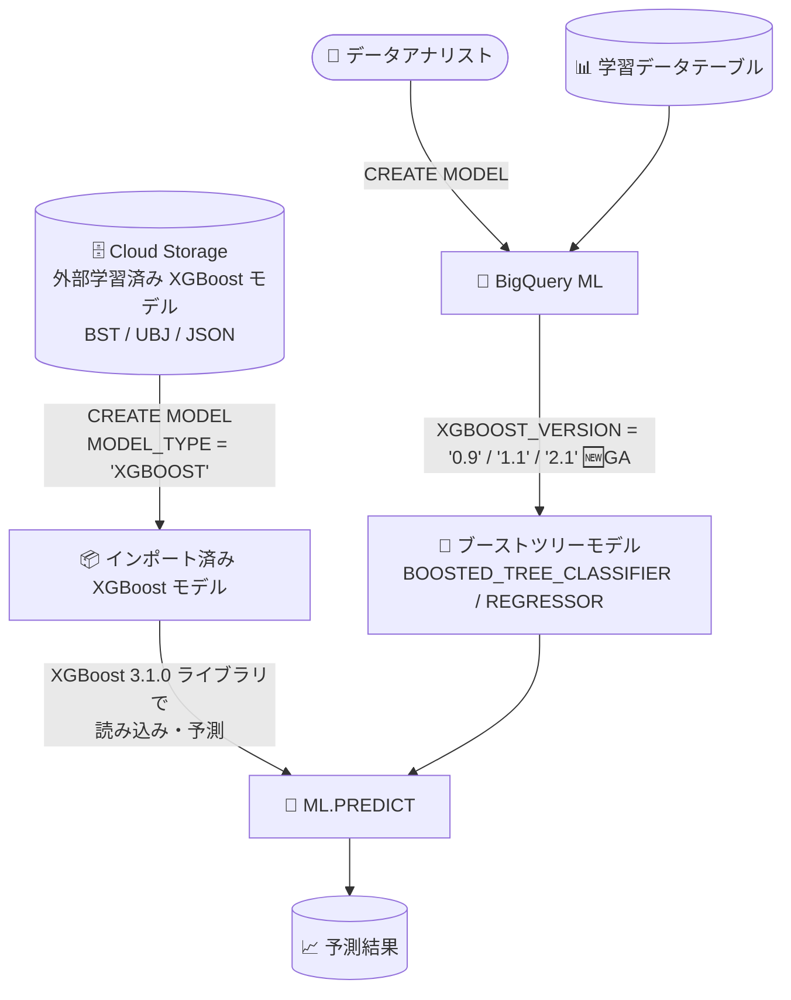

# BigQuery: BigQuery ML で XGBoost 2.1 によるモデルトレーニングが GA

**リリース日**: 2026-08-27

**サービス**: BigQuery (BigQuery ML)

**機能**: XGBOOST_VERSION オプションによる XGBoost 2.1 でのモデルトレーニング

**ステータス**: 一般提供 (GA)

📊 [このアップデートのインフォグラフィックを見る](https://takech9203.github.io/google-cloud-news-summary/20260827-bigquery-ml-xgboost-2-1-training.html)

## 概要

BigQuery ML のブーストツリーモデル (`BOOSTED_TREE_CLASSIFIER` / `BOOSTED_TREE_REGRESSOR`) のトレーニングで、`CREATE MODEL` ステートメントの `XGBOOST_VERSION` オプションに `'2.1'` を指定して XGBoost バージョン 2.1 を使用できるようになりました。本機能は一般提供 (GA) です。

あわせて、BigQuery はインポートされた XGBoost モデルの読み込みと予測に XGBoost 3.1.0 ライブラリを使用するようになりました。これにより、より新しいバージョンの XGBoost で保存されたモデルを BigQuery に取り込んで `ML.PREDICT` で推論できます (XGBoost 3.2.0 以降で保存されたモデルの前方互換性は保証されません)。

SQL だけで機械学習モデルの学習・推論を完結させたいデータアナリストやデータエンジニア、および外部で学習した XGBoost モデルを BigQuery 上でバッチ推論に利用しているチームが対象のアップデートです。

**アップデート前の課題**

- `XGBOOST_VERSION` オプションで指定できるのは `'0.9'` (デフォルト) と `'1.1'` のみで、より新しい XGBoost 2.x 系のライブラリでブーストツリーモデルをトレーニングできなかった
- BigQuery 外部の最新の XGBoost で開発したワークフローと、BigQuery ML 内のトレーニングバージョンに差分が生じやすかった

**アップデート後の改善**

- `XGBOOST_VERSION = '2.1'` を指定するだけで、XGBoost 2.1 によるブーストツリーモデルのトレーニングが GA として利用可能になった
- インポートした XGBoost モデルの読み込み・予測に XGBoost 3.1.0 ライブラリが使用されるようになり、新しいバージョンで保存されたモデルの取り込みに対応した

## アーキテクチャ図



BigQuery ML 内でのトレーニングは `XGBOOST_VERSION` オプションで XGBoost 2.1 を選択でき、Cloud Storage からインポートした外部学習済み XGBoost モデルは XGBoost 3.1.0 ライブラリで読み込み・予測されます。

## サービスアップデートの詳細

### 主要機能

1. **XGBoost 2.1 によるトレーニング (GA)**
   - `CREATE MODEL` の `XGBOOST_VERSION` オプションに `'2.1'` を指定可能になった
   - 対象モデルタイプは `BOOSTED_TREE_CLASSIFIER` と `BOOSTED_TREE_REGRESSOR`
   - 指定可能な値は `'0.9'` (デフォルト)、`'1.1'`、`'2.1'` の 3 つ

2. **インポート済み XGBoost モデルの XGBoost 3.1.0 対応**
   - BigQuery はインポートされた XGBoost モデルの読み込みと予測に XGBoost 3.1.0 ライブラリを使用する
   - XGBoost 3.2.0 以降で保存されたモデルの前方互換性は保証されない
   - インポートしたモデルは `ML.PREDICT` と `ML.FEATURE_IMPORTANCE` 関数で使用できる

3. **既存のブーストツリー機能との組み合わせ**
   - `BOOSTER_TYPE` (`GBTREE` / `DART`)、`TREE_METHOD`、`SUBSAMPLE` などの既存のトレーニングオプションと併用できる
   - `NUM_TRIALS` などによるハイパーパラメータチューニング (Vertex AI Vizier ベース) にも対応

## 技術仕様

### XGBOOST_VERSION オプション

| 項目 | 詳細 |
|------|------|
| 構文 | `XGBOOST_VERSION = { '0.9' \| '1.1' \| '2.1' }` |
| デフォルト値 | `'0.9'` |
| 対象モデルタイプ | `BOOSTED_TREE_CLASSIFIER`, `BOOSTED_TREE_REGRESSOR` |
| ステータス | 一般提供 (GA) |

### インポート済み XGBoost モデルの主な制限事項

| 項目 | 詳細 |
|------|------|
| モデル形式 | BST、UBJ、JSON 形式 (Cloud Storage に保存されていること) |
| モデルサイズ | 最大 250 MB |
| メモリ上限 | モデルの読み込み・実行に 840 MB |
| 予測ライブラリ | XGBoost 3.1.0 (3.2.0 以降で保存されたモデルの前方互換性は保証されない) |
| 入出力データ型 | 入力は数値型のみ、出力は FLOAT64 |
| 利用可能な関数 | `ML.PREDICT`, `ML.FEATURE_IMPORTANCE` |

## 設定方法

### 前提条件

1. BigQuery API が有効化されたプロジェクトがあること
2. モデル作成に必要な IAM 権限 (`bigquery.jobs.create`, `bigquery.models.create`, `bigquery.models.getData`, `bigquery.models.updateData`) があること

### 手順

#### ステップ 1: XGBoost 2.1 を指定してブーストツリーモデルをトレーニング

```sql
CREATE MODEL `project_id.mydataset.mymodel`
OPTIONS(
  MODEL_TYPE = 'BOOSTED_TREE_CLASSIFIER',
  BOOSTER_TYPE = 'GBTREE',
  XGBOOST_VERSION = '2.1',
  INPUT_LABEL_COLS = ['mylabel']
) AS
SELECT * FROM `project_id.mydataset.mytable`;
```

`XGBOOST_VERSION = '2.1'` を追加するだけで、XGBoost 2.1 でのトレーニングに切り替わります。省略した場合はデフォルトの `'0.9'` が使用されます。

#### ステップ 2: 学習したモデルで予測を実行

```sql
SELECT *
FROM ML.PREDICT(
  MODEL `project_id.mydataset.mymodel`,
  (SELECT * FROM `project_id.mydataset.new_data`)
);
```

既存の BigQuery ML ワークフローと同じく、`ML.PREDICT` 関数で推論を実行できます。

## メリット

### ビジネス面

- **GA による本番利用**: 一般提供のため、SLA の対象として本番ワークロードで XGBoost 2.1 トレーニングを利用できる
- **移行コストの低減**: `CREATE MODEL` にオプションを 1 つ追加するだけで新しいライブラリバージョンを利用でき、既存 SQL パイプラインの変更が最小限で済む

### 技術面

- **ライブラリバージョンの選択肢拡大**: `'0.9'` / `'1.1'` / `'2.1'` からトレーニングバージョンを明示的に選択でき、再現性を保ちながら段階的にアップグレードできる
- **新しい XGBoost モデルの取り込み**: 予測時に XGBoost 3.1.0 ライブラリが使用されるため、外部で新しいバージョンの XGBoost により保存したモデルを BigQuery のバッチ推論に活用しやすくなった

## デメリット・制約事項

### 制限事項

- デフォルトは引き続き `'0.9'` のため、XGBoost 2.1 を使うには明示的な指定が必要
- インポートする XGBoost モデルは Cloud Storage 上の BST / UBJ / JSON 形式で、サイズ上限 250 MB、読み込み・実行メモリ上限 840 MB の制約がある
- XGBoost 3.2.0 以降で保存されたモデルの前方互換性は保証されない
- `BOOSTED_TREE_CLASSIFIER` のラベル列で扱えるクラス数は最大 1,000
- ブーストツリーモデルのトレーニングはすべての BigQuery ML リージョンでサポートされているわけではない

### 考慮すべき点

- XGBoost のバージョンによりトレーニング結果 (モデルの挙動や精度) が変わる可能性があるため、既存モデルをバージョン変更して再学習する場合は `ML.EVALUATE` による評価比較を推奨
- インポート済み XGBoost モデルの入力は数値型のみ、出力は FLOAT64 のみサポートされる点に注意

## ユースケース

### ユースケース 1: 既存ブーストツリーモデルの XGBoost 2.1 への移行

**シナリオ**: BigQuery ML でデフォルト (XGBoost 0.9) のままトレーニングしている分類モデルを、新しいライブラリバージョンに揃えて管理したい。

**実装例**:
```sql
CREATE OR REPLACE MODEL `project_id.mydataset.churn_model`
OPTIONS(
  MODEL_TYPE = 'BOOSTED_TREE_CLASSIFIER',
  XGBOOST_VERSION = '2.1',
  INPUT_LABEL_COLS = ['churned']
) AS
SELECT * FROM `project_id.mydataset.training_data`;

-- 既存モデルと精度を比較
SELECT * FROM ML.EVALUATE(MODEL `project_id.mydataset.churn_model`);
```

**効果**: オプション 1 つの追加でライブラリバージョンを更新でき、評価関数で移行前後の精度を確認しながら安全に切り替えられる。

### ユースケース 2: 外部で学習した新しい XGBoost モデルの BigQuery バッチ推論

**シナリオ**: データサイエンスチームが新しいバージョンの XGBoost で学習したモデルを、データウェアハウス内の大量データに対するバッチ推論に使いたい。

**効果**: 予測時に XGBoost 3.1.0 ライブラリが使用されるため、Cloud Storage に保存したモデルを `CREATE MODEL (MODEL_TYPE = 'XGBOOST')` でインポートし、データを外部に移動させずに `ML.PREDICT` でスケーラブルに推論できる。

## 料金

`XGBOOST_VERSION` オプション自体に追加料金はなく、ブーストツリーモデルのトレーニング (`CREATE MODEL`) と推論 (`ML.PREDICT`) は通常の BigQuery / BigQuery ML の料金体系 (オンデマンドまたは Editions のコンピューティング容量) に従って課金されます。最新の料金詳細は [BigQuery ML の料金ページ](https://cloud.google.com/bigquery/pricing#bqml)を参照してください。

なお、オブジェクトテーブルに対してインポート済み XGBoost モデルを使用する場合は、予約による容量ベースの料金のみサポートされ、オンデマンド料金は利用できません。

## 利用可能リージョン

ブーストツリーモデルのトレーニングはすべての BigQuery ML リージョンでサポートされているわけではありません。サポート対象のリージョン・マルチリージョンの一覧は [BigQuery ML のロケーション](https://docs.cloud.google.com/bigquery/docs/locations#bqml-loc)を参照してください。

## 関連サービス・機能

- **Cloud Storage**: 外部で学習した XGBoost モデル (BST / UBJ / JSON) の保存先。`CREATE MODEL (MODEL_TYPE = 'XGBOOST')` で BigQuery にインポートする
- **Vertex AI Vizier**: ブーストツリーモデルのハイパーパラメータチューニング (`NUM_TRIALS`、`HPARAM_TUNING_ALGORITHM = 'VIZIER_DEFAULT'`) の基盤
- **BigQuery ML モデルエクスポート**: `EXPORT MODEL` でブーストツリーモデルを Cloud Storage にエクスポートし、オンライン予測などに利用可能

## 参考リンク

- 📊 [インフォグラフィック](https://takech9203.github.io/google-cloud-news-summary/20260827-bigquery-ml-xgboost-2-1-training.html)
- [公式リリースノート](https://docs.cloud.google.com/release-notes#August_27_2026)
- [CREATE MODEL ステートメント (ブーストツリーモデル)](https://docs.cloud.google.com/bigquery/docs/reference/standard-sql/bigqueryml-syntax-create-boosted-tree)
- [CREATE MODEL ステートメント (XGBoost モデルのインポート)](https://docs.cloud.google.com/bigquery/docs/reference/standard-sql/bigqueryml-syntax-create-xgboost)
- [料金ページ](https://cloud.google.com/bigquery/pricing#bqml)

## まとめ

BigQuery ML のブーストツリーモデルで XGBoost 2.1 によるトレーニングが GA となり、あわせて予測時のライブラリが XGBoost 3.1.0 に更新されました。既存の `CREATE MODEL` に `XGBOOST_VERSION = '2.1'` を追加し、`ML.EVALUATE` で従来バージョンとの精度を比較したうえで、段階的な移行を検討することを推奨します。

---

**タグ**: BigQuery, BigQuery ML, XGBoost, 機械学習, ブーストツリー, GA
