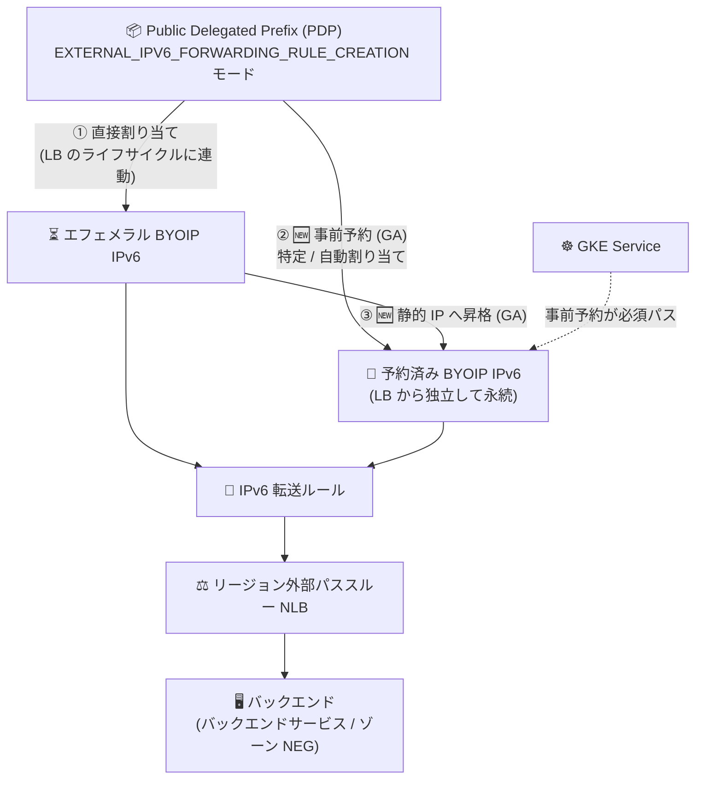

# Cloud Load Balancing: リージョン外部パススルー NLB での BYOIP IPv6 アドレスの事前予約と静的昇格が GA

**リリース日**: 2026-08-27

**サービス**: Cloud Load Balancing

**機能**: リージョン外部パススルー Network Load Balancer での BYOIP IPv6 アドレスの事前予約およびエフェメラルアドレスの静的 IP への昇格

**ステータス**: 一般提供 (GA)

📊 [このアップデートのインフォグラフィックを見る](https://takech9203.github.io/google-cloud-news-summary/20260827-cloud-load-balancing-byoip-ipv6-regional-nlb.html)

## 概要

Google Cloud は、リージョン外部パススルー Network Load Balancer (NLB) において、Bring Your Own IP (BYOIP) の IPv6 アドレスをロードバランサー作成前に予約する機能 (特定アドレスの指定または自動割り当て) と、ロードバランサーで使用中のエフェメラル BYOIP IPv6 アドレスを予約済み静的 IP アドレスに昇格 (promote) する機能を一般提供 (GA) にしました。

これにより、リージョン外部パススルー NLB で Public Delegated Prefix (PDP) の IPv6 アドレスを使用するデプロイ方法は、(1) PDP からの直接割り当て (エフェメラル)、(2) 事前予約したアドレスの割り当て、(3) 使用中エフェメラルアドレスの静的昇格、の 3 つのワークフローから選択できるようになりました。予約済みアドレスはロードバランサーのライフサイクルから独立して永続し、転送ルールを削除してもアドレスが解放されません。特に Google Kubernetes Engine (GKE) では、GKE API が PDP から直接パススルー NLB を作成することをサポートしていないため、事前予約が必須のパスとなります。

対象ユーザーは、自社保有の IPv6 アドレスブロックを Google Cloud に持ち込んで L4 ロードバランシングを行う企業 (通信事業者、大規模 SaaS 事業者、GKE で IPv6 サービスを公開する組織など) です。バックエンドサービス構成、複数 IP プロトコル構成、ゾーン NEG 構成の各セットアップガイドが更新されています。なお、同日に VPC 側でも BYOIP サブプレフィックスからの静的外部 IPv6 アドレス予約が GA になっています (関連レポート: `2026-08-27-vpc-byoip-ipv6-static-reservation-ga.md`)。

**アップデート前の課題**

- リージョン外部パススルー NLB で BYOIP IPv6 アドレスを使う場合、転送ルール作成時に PDP を直接参照するエフェメラル割り当てが基本であり、アドレスはロードバランサーのライフサイクルに紐付いていた
- ロードバランサーを削除するとエフェメラル IP は PDP のプールに解放され、同じアドレスを確実に維持する手段がなかった
- GKE API は PDP から直接パススルー NLB を作成できないため、GKE で BYOIP IPv6 アドレスを利用する GA サポートされた経路がなかった

**アップデート後の改善**

- ロードバランサー作成前に、PDP から特定または自動割り当てのリージョン BYOIP IPv6 アドレスを予約できるようになり、アドレスがロードバランサーのライフサイクルから独立して永続するようになった
- 稼働中のロードバランサーが使用しているエフェメラル BYOIP IPv6 アドレスを予約済みアドレスに昇格でき、ロードバランサーを削除してもアドレスが維持されるようになった
- GKE ユーザーは事前予約した BYOIP IPv6 アドレスを利用してパススルー NLB を構成できるようになった (GKE では事前予約が必須パス)

## アーキテクチャ図



リージョン外部パススルー NLB で BYOIP IPv6 アドレスを使う 3 つのワークフローを示しています。今回 GA になったのは「② 事前予約」と「③ エフェメラルアドレスの静的昇格」の 2 つのパス (🆕) で、GKE では②が必須の経路となります。

## サービスアップデートの詳細

### 主要機能

1. **BYOIP IPv6 アドレスの事前予約 (ロードバランサー作成前)**
   - `EXTERNAL_IPV6_FORWARDING_RULE_CREATION` モードの PDP (サブプレフィックス) から、リージョン BYOIP IPv6 アドレスを予約できる
   - 特定の IPv6 アドレス範囲を指定する方法と、Google Cloud に範囲を自動割り当てさせる方法の 2 つを選択可能
   - 予約には `gcloud compute addresses create` に `--ip-collection=PDP_NAME` と `--endpoint-type=NETLB` を指定する
   - 予約済みアドレスはロードバランサーのライフサイクルから独立して永続する

2. **予約済みアドレスによる転送ルールの作成**
   - 転送ルール作成時に、予約済みアドレスリソースの名前、または IPv6 CIDR 範囲そのものを `--address` で参照できる
   - バックエンドサービス構成、複数 IP プロトコル (`L3_DEFAULT`) 構成、ゾーン NEG 構成の各デプロイで利用可能

3. **エフェメラル BYOIP IPv6 アドレスの静的 IP への昇格**
   - PDP から直接割り当てたエフェメラル BYOIP IPv6 アドレスで稼働中のロードバランサーについて、そのアドレスを予約済みアドレスに昇格できる
   - 昇格後はロードバランサーを削除してもアドレスが解放されない
   - Google Cloud コンソール (「静的 IP アドレスに昇格」メニュー) または gcloud CLI で操作可能

4. **GKE での BYOIP IPv6 利用パス**
   - GKE API は PDP から直接パススルー NLB を作成することをサポートしていないため、GKE ユーザーにとって事前予約が必須のパスとなる

## 技術仕様

### 3 つのデプロイワークフローの比較

| ワークフロー | アドレスのライフサイクル | 主な用途 |
|------|------|------|
| ① PDP からの直接割り当て | ロードバランサーに連動 (削除時に PDP プールへ解放) | アドレスの固定が不要な一時環境 |
| ② 事前予約 (🆕 GA) | ロードバランサーから独立して永続 | 本番環境、GKE (必須パス)、IaC 管理 |
| ③ エフェメラルの静的昇格 (🆕 GA) | 昇格後はロードバランサーから独立して永続 | 稼働中 LB のアドレス固定化 |

### 制限事項・前提

| 項目 | 詳細 |
|------|------|
| 対象ロードバランサー | リージョン外部パススルー Network Load Balancer |
| 対象サブプレフィックスモード | `EXTERNAL_IPV6_FORWARDING_RULE_CREATION` |
| エンドポイントタイプ | `NETLB` (`--endpoint-type=NETLB`) |
| プレフィックス長 | 転送ルールの IPv6 アドレスのプレフィックス長は、サブプレフィックスの割り当て可能プレフィックス長と一致する必要がある。/48、/56、/64、/72、/80、/88、/96 のいずれか |
| リージョン制約 | IPv6 アドレスは PDP と同じリージョンに存在する必要がある |
| BYOIP の前提作業 | Public Advertised Prefix の作成 → Public Delegated Prefix の作成 → IPv6 サブプレフィックスの作成 → プレフィックスの広報 (BGP announce) |

## 設定方法

### 前提条件

1. BYOIP の Public Advertised Prefix (PAP)、Public Delegated Prefix (PDP)、IPv6 サブプレフィックス (`EXTERNAL_IPV6_FORWARDING_RULE_CREATION` モード) が作成済みで、プレフィックスが広報されていること
2. リージョン外部パススルー NLB のバックエンド (バックエンドサービスまたはゾーン NEG) が構成済みであること

### 手順

#### ステップ 1: BYOIP IPv6 アドレスを事前予約する

```bash
# 特定の IPv6 アドレス範囲を予約する場合
gcloud compute addresses create ADDRESS_NAME \
    --ip-collection=PDP_NAME \
    --addresses=IPV6_ADDRESS \
    --region=REGION_A \
    --endpoint-type=NETLB \
    --prefix-length=PREFIX_LENGTH

# Google Cloud に範囲を自動割り当てさせる場合 (--addresses を省略)
gcloud compute addresses create ADDRESS_NAME \
    --ip-collection=PDP_NAME \
    --region=REGION_A \
    --endpoint-type=NETLB \
    --prefix-length=PREFIX_LENGTH
```

`PDP_NAME` は `EXTERNAL_IPV6_FORWARDING_RULE_CREATION` モードのサブプレフィックスである必要があります。`PREFIX_LENGTH` は PDP の割り当て可能プレフィックス長 (例: 56) と一致させます。

#### ステップ 2: 予約済みアドレスで転送ルールを作成する

```bash
# 予約済みアドレスリソースの名前で参照する場合
gcloud compute forwarding-rules create FWD_RULE_NAME \
    --load-balancing-scheme=EXTERNAL \
    --ip-protocol=PROTOCOL \
    --ports=ALL \
    --ip-version=IPV6 \
    --region=REGION_A \
    --address=ADDRESS_NAME \
    --backend-service=BACKEND_SERVICE
```

`--address` には予約済みアドレスの名前のほか、IPv6 CIDR 範囲を直接指定することもできます。

#### ステップ 3 (代替パス): 使用中のエフェメラルアドレスを静的 IP に昇格する

```bash
# エフェメラル範囲の先頭 IPv6 アドレスを指定して昇格
gcloud compute addresses create ADDRESS_NAME \
    --addresses=IPV6_ADDRESS \
    --region=REGION \
    --endpoint-type=NETLB
```

コンソールの場合は、「IP アドレス」ページ →「外部 IP アドレス」タブで、対象の NLB に関連付けられたエフェメラル BYOIP IPv6 アドレスのメニューから「静的 IP アドレスに昇格」を選択し、名前を入力して予約します。

## メリット

### ビジネス面

- **アドレス資産の永続性確保**: DNS の AAAA レコードや取引先の許可リストに登録済みの自社 IPv6 アドレスを、ロードバランサーの削除・再構築を跨いで維持できる
- **計画的なデプロイ**: ロードバランサー構築前にアドレスを確定できるため、DNS 切り替えや許可リスト申請などの事前準備を進められる

### 技術面

- **ライフサイクルの分離**: アドレスリソースとロードバランサーのライフサイクルを分離でき、Terraform などの IaC でそれぞれ独立に管理できる
- **GKE での BYOIP IPv6 対応**: GKE API の制約 (PDP 直接参照の非サポート) を事前予約パスで回避でき、GKE Service のパススルー NLB で BYOIP IPv6 アドレスを利用できる
- **無停止での固定化**: 稼働中のエフェメラルアドレスをそのまま昇格でき、既存トラフィックに影響を与えずにアドレスを固定できる

## デメリット・制約事項

### 制限事項

- 転送ルールの IPv6 アドレスのプレフィックス長は、割り当て元サブプレフィックスの割り当て可能プレフィックス長 (/48〜/96 のいずれか) と一致する必要がある
- IPv6 アドレスは PDP と同じリージョンに存在する必要がある (IPv6 BYOIP はリージョンアドレスのみサポート)
- BYOIP アドレスはプロジェクト間で移動できない

### 考慮すべき点

- BYOIP のプロビジョニング自体には数週間を要し、短縮できないため、利用計画は早めに立てる必要がある
- 直接割り当て (エフェメラル) のままロードバランサーを削除するとアドレスは PDP プールに解放されるため、アドレスの固定が必要な本番環境では事前予約または昇格を行っておくことが重要

## ユースケース

### ユースケース 1: GKE Service での BYOIP IPv6 パススルー NLB の構成

**シナリオ**: GKE 上のワークロードを自社保有の IPv6 アドレスで公開したい。GKE API は PDP からの直接作成をサポートしていないため、事前予約パスを利用する。

**実装例**:
```bash
# 1. BYOIP IPv6 アドレスを事前予約
gcloud compute addresses create gke-nlb-v6-addr \
    --ip-collection=byoip-v6-subprefix \
    --region=asia-northeast1 \
    --endpoint-type=NETLB \
    --prefix-length=96

# 2. 予約したアドレスを GKE Service (type: LoadBalancer) から参照して
#    パススルー NLB を構成する
```

**効果**: GKE で BYOIP IPv6 アドレスを利用したサービス公開が GA サポートの構成で実現できる。

### ユースケース 2: 稼働中 NLB のエフェメラル BYOIP IPv6 アドレスの固定化

**シナリオ**: PDP からの直接割り当てで構築した BYOIP IPv6 の NLB が本番稼働しており、ロードバランサーの再構築時にアドレスが PDP プールへ解放されるリスクを解消したい。

**効果**: 使用中のアドレスを無停止で予約済み静的 IP に昇格でき、ロードバランサーを削除・再作成してもアドレスが維持される。

## 料金

BYOIP アドレスはユーザー自身が持ち込むアドレスであり、Google 提供の静的外部 IP アドレスとは課金体系が異なります。リージョン外部パススルー Network Load Balancer の転送ルールおよびデータ処理には、通常の Cloud Load Balancing / ネットワーク料金が適用されます。詳細は料金ページを参照してください。

- [Cloud Load Balancing の料金](https://cloud.google.com/vpc/network-pricing#lb)
- [VPC ネットワーク料金 (外部 IP アドレス)](https://cloud.google.com/vpc/network-pricing#ipaddress)

## 利用可能リージョン

IPv6 BYOIP プレフィックスはリージョンアドレスのみをサポートし、予約するアドレスのリージョンは PDP のリージョンと一致している必要があります。詳細は [BYOIP のドキュメント](https://docs.cloud.google.com/vpc/docs/bring-your-own-ip) を参照してください。

## 関連サービス・機能

- **Virtual Private Cloud (VPC) / BYOIP**: 今回の機能の基盤。PAP / PDP / サブプレフィックスの階層で自社 IPv6 アドレスを持ち込む。同日に VPC 側でも BYOIP サブプレフィックスからの静的外部 IPv6 アドレス予約が GA になっている
- **Google Kubernetes Engine (GKE)**: GKE Service のパススルー NLB で BYOIP IPv6 を使う場合、事前予約が必須パス
- **外部プロトコル転送 (External Protocol Forwarding)**: ターゲットインスタンス向けの転送ルールでも BYOIP IPv6 アドレスを利用可能
- **Cloud DNS**: 予約した静的 IPv6 アドレスの AAAA レコード登録と組み合わせて利用

## 参考リンク

- 📊 [インフォグラフィック](https://takech9203.github.io/google-cloud-news-summary/20260827-cloud-load-balancing-byoip-ipv6-regional-nlb.html)
- [公式リリースノート (2026 年 8 月 27 日)](https://docs.cloud.google.com/release-notes#August_27_2026)
- [バックエンドサービスを使用するリージョン外部パススルー NLB の設定 (BYOIP IPv6 転送ルール)](https://docs.cloud.google.com/load-balancing/docs/network/setting-up-network-backend-service)
- [複数 IP プロトコル対応のリージョン外部パススルー NLB の設定](https://docs.cloud.google.com/load-balancing/docs/network/setting-up-networklb-multiple-protocols)
- [ゾーン NEG を使用するリージョン外部パススルー NLB の設定](https://docs.cloud.google.com/load-balancing/docs/network/setting-up-network-zonal-neg)
- [Bring your own IP addresses の概要](https://docs.cloud.google.com/vpc/docs/bring-your-own-ip)
- [IPv6 サブプレフィックスの作成と使用](https://docs.cloud.google.com/vpc/docs/create-ipv6-sub-prefixes)
- [料金ページ (VPC ネットワーク料金)](https://cloud.google.com/vpc/network-pricing)

## まとめ

リージョン外部パススルー Network Load Balancer で BYOIP IPv6 アドレスの事前予約と静的昇格が GA となり、直接割り当て (エフェメラル) を含む 3 つのワークフローから要件に応じたアドレス管理を選択できるようになりました。特に GKE で BYOIP IPv6 を利用する場合は事前予約が必須パスとなるため、GKE で IPv6 サービスを公開する組織には重要なアップデートです。BYOIP IPv6 の NLB を稼働中の環境では、エフェメラルアドレスを予約済みアドレスに昇格させ、意図しないアドレス解放のリスクを解消することを推奨します。

---

**タグ**: #CloudLoadBalancing #NetworkLoadBalancer #BYOIP #IPv6 #GKE #GA #ネットワーキング
