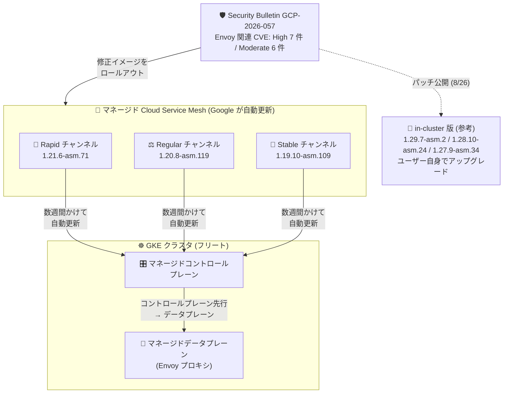

# Cloud Service Mesh (managed): GCP-2026-057 対応のセキュリティパッチが全リリースチャンネルにロールアウト開始

**リリース日**: 2026-08-27

**サービス**: Cloud Service Mesh (マネージド)

**機能**: セキュリティパッチイメージのロールアウト (1.21.6-asm.71 / 1.20.8-asm.119 / 1.19.10-asm.109)

**ステータス**: Security

📊 [このアップデートのインフォグラフィックを見る](https://takech9203.github.io/google-cloud-news-summary/20260827-cloud-service-mesh-managed-gcp-2026-057.html)

## 概要

2026 年 8 月 27 日、マネージド Cloud Service Mesh 向けに、セキュリティ情報 (Security Bulletin) **GCP-2026-057** に記載された脆弱性を解決する新しいイメージのロールアウトが開始されました。**1.21.6-asm.71** が Rapid リリースチャンネルに、**1.20.8-asm.119** が Regular リリースチャンネルに、**1.19.10-asm.109** が Stable リリースチャンネルに、それぞれ展開されます。

GCP-2026-057 (公開日: 2026-08-26) には、Envoy に起因する多数の脆弱性が含まれます。重大度 High のものだけでも、HTTP/2 レスポンストレーラーによるストリーム状態破損とプロセス異常終了 (CVE-2026-73513)、`safe_regex` マッチングの非 UTF-8 ヘッダー処理不備により否定マッチングを使う RBAC ポリシーがフェイルオープンする問題 (CVE-2026-73552)、QUIC HTTP データグラムハンドラの use-after-free (CVE-2026-73512)、`ignore_path_parameters_in_path_matching` 有効時の認可バイパス (CVE-2026-73553) など 7 件があり、認可制御と可用性の両面に影響します。すべての Cloud Service Mesh バージョンがこれらの CVE の影響を受けます。

マネージド Cloud Service Mesh では、in-cluster (クラスタ内コントロールプレーン) 版と異なりユーザーによるアップグレード作業は不要で、Google がコントロールプレーンとデータプレーンを自動的に更新します。セキュリティ情報にも「全バージョンがサポート対象であり、今後数週間かけてシステムは自動的に更新される」と明記されています。なお、in-cluster 版向けのパッチリリース (1.29.7-asm.2 / 1.28.10-asm.24 / 1.27.9-asm.34) は前日 8 月 26 日に公開済みで、そちらはユーザー自身によるアップグレードが必要です。

**アップデート前の課題**

- GCP-2026-057 に記載された Envoy 関連の脆弱性 (High 7 件、Moderate 6 件) はすべての Cloud Service Mesh バージョンに影響しており、マネージド版にはまだ修正済みイメージが展開されていなかった
- RBAC ポリシーのフェイルオープン (CVE-2026-73552) やパスマッチングの認可バイパス (CVE-2026-73553、CVE-2026-73551) など、認可制御の信頼性に関わる問題が未修正のまま残っていた
- HTTP/2 / HTTP/3 (QUIC) 起因のプロセス異常終了やメモリ枯渇 (CVE-2026-73513、CVE-2026-73512、CVE-2026-73550 など) により、プロキシの可用性が低下するリスクがあった

**アップデート後の改善**

- Rapid / Regular / Stable の全リリースチャンネルに修正済みイメージ (1.21.6-asm.71 / 1.20.8-asm.119 / 1.19.10-asm.109) のロールアウトが開始され、GCP-2026-057 の脆弱性が解消される
- マネージド版の利用者はアップグレード作業が不要で、今後数週間かけて自動的に更新される
- Stable チャンネルを含む全チャンネルへ同時にロールアウトが開始されており、重要なセキュリティパッチが全チャンネルに配信されるというマネージド版の運用モデルどおりに保護が行き渡る

## アーキテクチャ図

GCP-2026-057 の修正イメージは、マネージド Cloud Service Mesh の 3 つのリリースチャンネルすべてに同時にロールアウトが開始されます。マネージド版ではコントロールプレーンが先に更新され、続いてデータプレーンが更新されるため、ユーザーの作業は不要です。

## サービスアップデートの詳細

### 主要機能

1. **全リリースチャンネルへの修正イメージのロールアウト**
   - Rapid: 1.21.6-asm.71、Regular: 1.20.8-asm.119、Stable: 1.19.10-asm.109
   - GCP-2026-057 に記載されたセキュリティ脆弱性を解決
   - 重要なセキュリティパッチは全リリースチャンネルに配信されるというマネージド版のポリシーに沿った対応

2. **ユーザー作業不要の自動更新**
   - マネージド Cloud Service Mesh では Google がバージョンとアップグレードのタイミングを管理
   - セキュリティ情報の記載どおり、全バージョンがサポート対象で、今後数週間かけて自動的に更新される
   - パッチはコントロールプレーンが先に更新され、その後データプレーンが更新される

3. **GCP-2026-057 で修正される脆弱性**
   - Envoy に起因する 13 件の CVE (High 7 件、Moderate 6 件) を修正
   - 認可制御 (RBAC フェイルオープン、パスマッチングの認可バイパス) と可用性 (プロセス異常終了、メモリ枯渇、use-after-free) の両面に関わる修正を含む

## 技術仕様

### ロールアウトされるイメージ

| リリースチャンネル | イメージバージョン |
|------|------|
| Rapid | 1.21.6-asm.71 |
| Regular | 1.20.8-asm.119 |
| Stable | 1.19.10-asm.109 |

### GCP-2026-057 で修正される脆弱性 (重大度 High)

| CVE | 内容 |
|------|------|
| CVE-2026-73513 | 信頼できないアップストリームが END_STREAM フラグなしの HTTP/2 レスポンストレーラーを oghttp2 インスタンスに送信すると、ストリーム状態が破損しプロセスが異常終了する問題 |
| CVE-2026-73552 | `safe_regex` マッチングが非 UTF-8 の HTTP ヘッダーバイトを通常の不一致として扱い、否定マッチングロジックを使用する RBAC ポリシーがフェイルオープンする問題 |
| CVE-2026-73512 | QUIC HTTP データグラムハンドラの use-after-free。Capsule Protocol を使用するリクエストのストリームデコーダーが、遅延した HTTP/3 データグラムから参照されている間に破棄される問題 |
| CVE-2026-73547 | `:path` 疑似ヘッダーのない CONNECT リクエスト処理時に ext_authz フィルタでプロセスが異常終了する問題 |
| CVE-2026-73548 | 汎用の (非 WebSocket) HTTP アップグレードにおけるクロスユーザーレスポンスポイズニング。アップグレード受理までペイロードを保留することで修正 |
| CVE-2026-73550 | 破棄された重複 Host ヘッダーがリクエストヘッダー制限にカウントされず、HTTP/2 でメモリ枯渇によるプロキシ停止につながる問題 |
| CVE-2026-73553 | `ignore_path_parameters_in_path_matching` 有効時に、RBAC のパスマッチャーがルーティングと同じパスパラメータ処理を適用せず認可バイパスが発生する問題 |

### GCP-2026-057 で修正される脆弱性 (重大度 Moderate)

| CVE | 内容 |
|------|------|
| CVE-2026-73549 | HTTP/3 リクエストに対する original DST クラスタのスコープ付き IPv6 アドレス処理中のプロセス異常終了 |
| CVE-2026-50572 | ローカル拒否応答で認可リクエストを完了する際の ext_authz raw HTTP クライアントの use-after-free |
| CVE-2026-73546 | HTML 統計インターフェース (`/stats?format=html`) の格納型クロスサイトスクリプティング |
| CVE-2026-48521 | ALPN ベースの HTTP/3 コネクションプール選択時に null のトランスポートソケットオプションを参照してプロセスが異常終了する問題 |
| CVE-2026-73551 | パラメータを含む dot / dot-dot パスセグメントの URL 正規化不備により、パスベースの認可ポリシーバイパスが可能になる問題 |
| CVE-2026-73511 | セグメント単位のマトリックスパラメータを含むパスのマッチングで、パラメータ除去が全セグメントに一貫して適用されない問題 |

### マネージド版のリリースチャンネルと更新モデル

| 項目 | 詳細 |
|------|------|
| チャンネルの決定 | マネージド Cloud Service Mesh のプロビジョニング時の GKE クラスタのリリースチャンネルで決まる (Rapid → Rapid、Regular → Regular、Stable → Stable、チャンネルなし → Regular) |
| セキュリティパッチ | 重要なセキュリティパッチは全リリースチャンネルに配信される |
| 更新順序 | コントロールプレーンが先に更新され、その後データプレーンが更新される |
| 更新方式 | Google がバージョンとアップグレードのタイミングを自動管理 (段階的ロールアウト) |
| 今回の対応 | ユーザーの作業は不要。今後数週間かけて自動更新される |

## メリット

### ビジネス面

- **運用負荷ゼロでの脆弱性対応**: in-cluster 版と異なりアップグレード計画・作業が不要で、Google による自動ロールアウトだけで GCP-2026-057 への対応が完了する
- **コンプライアンス維持**: RBAC フェイルオープンや認可バイパスといった認可制御に関わる High 重大度の脆弱性が解消され、セキュリティ要件への準拠を維持できる

### 技術面

- **全チャンネル同時のロールアウト開始**: Rapid / Regular / Stable のいずれのチャンネルを使用していても修正イメージが配信される
- **安全な更新順序**: コントロールプレーン → データプレーンの順に段階的に更新されるため、メッシュ全体への影響を抑えながらパッチが適用される

## デメリット・制約事項

### 考慮すべき点

- ロールアウトは「今後数週間かけて」段階的に行われるため、修正が自分のクラスタに適用されるまでにタイムラグがある
- 更新のタイミングは Google が管理しており、ユーザー側で適用時期を細かく制御することはできない
- 同じフリート内に in-cluster 版の Cloud Service Mesh クラスタがある場合、そちらは自動更新されないため、別途パッチバージョン (1.29.7-asm.2 / 1.28.10-asm.24 / 1.27.9-asm.34) への手動アップグレードが必要 (v1.26 以前は EOL のため修正はバックポートされない)

## ユースケース

### ユースケース 1: マネージド版利用クラスタでの対応状況の確認

**シナリオ**: 本番環境の GKE クラスタでマネージド Cloud Service Mesh (Stable チャンネル) を利用しており、GCP-2026-057 への対応状況をセキュリティチームに報告する必要がある。

**効果**: Stable チャンネルには 1.19.10-asm.109 のロールアウトが開始済みであり、ユーザー作業なしで数週間以内に自動更新される旨を報告できる。Cloud Service Mesh リリースノートの RSS フィードを購読しておくことで、以後のパッチ配信も追跡できる。

### ユースケース 2: マネージド版と in-cluster 版が混在する環境での対応計画

**シナリオ**: フリート内にマネージド版のクラスタと in-cluster 版 (1.28 系) のクラスタが混在している。

**効果**: マネージド版のクラスタは自動更新に任せる一方、in-cluster 版のクラスタは 1.28.10-asm.24 への手動アップグレードを計画するというように、対応が必要な対象を明確に切り分けられる。

## 料金

Cloud Service Mesh は GKE Enterprise に含まれる形態と、スタンドアロンサービスとしての利用形態があります。GKE Enterprise サブスクライバーは Cloud Service Mesh に対して個別課金されません。今回のセキュリティパッチのロールアウトによる追加料金は発生しません。詳細は料金ページを参照してください。

- [Cloud Service Mesh の料金](https://cloud.google.com/service-mesh/pricing)

## 関連サービス・機能

- **Google Kubernetes Engine (GKE)**: マネージド Cloud Service Mesh の実行基盤。Cloud Service Mesh のリリースチャンネルは、プロビジョニング時の GKE クラスタのリリースチャンネルによって決まる
- **in-cluster Cloud Service Mesh**: 同じ GCP-2026-057 への対応として、8 月 26 日にパッチリリース (1.29.7-asm.2 / 1.28.10-asm.24 / 1.27.9-asm.34) が公開済み。マネージド版と異なりユーザー自身によるアップグレードが必要
- **フリート (Fleet)**: マネージド Cloud Service Mesh はフリート API を通じて構成され、Google がコントロールプレーン・データプレーンの更新を管理する

## 参考リンク

- 📊 [インフォグラフィック](https://takech9203.github.io/google-cloud-news-summary/20260827-cloud-service-mesh-managed-gcp-2026-057.html)
- [公式リリースノート (2026 年 8 月 27 日)](https://docs.cloud.google.com/release-notes#August_27_2026)
- [Security Bulletin (Cloud Service Mesh) - GCP-2026-057](https://docs.cloud.google.com/service-mesh/docs/security-bulletins)
- [マネージド Cloud Service Mesh のリリースチャンネル](https://docs.cloud.google.com/service-mesh/docs/managed/select-a-release-channel)
- [マネージド Cloud Service Mesh クラスタのアップグレード戦略](https://docs.cloud.google.com/service-mesh/docs/managed/upgrade-clusters)
- [Cloud Service Mesh の料金](https://cloud.google.com/service-mesh/pricing)

## まとめ

GCP-2026-057 には RBAC ポリシーのフェイルオープンや認可バイパスなど、サービスメッシュの認可制御の根幹に関わる High 重大度の脆弱性が含まれますが、マネージド Cloud Service Mesh の利用者は今回のロールアウト (Rapid: 1.21.6-asm.71 / Regular: 1.20.8-asm.119 / Stable: 1.19.10-asm.109) により、作業不要で自動的に保護されます。ロールアウトは数週間かけて段階的に行われるため、リリースノートの RSS フィード等で更新状況を追跡しつつ、in-cluster 版のクラスタが混在する環境ではそちらの手動アップグレードを忘れずに計画してください。

---

**タグ**: #CloudServiceMesh #Security #CVE #Envoy #GKE #ManagedServiceMesh #ReleaseChannel
