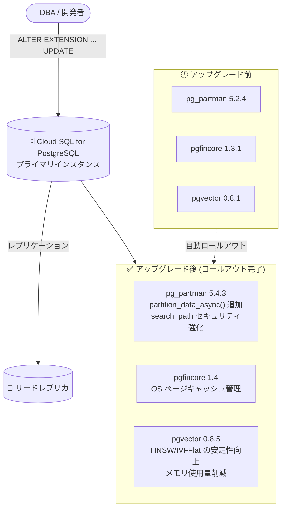

# Cloud SQL for PostgreSQL: 拡張機能アップグレード (pg_partman 5.4.3 / pgfincore 1.4 / pgvector 0.8.5)

**リリース日**: 2026-08-27

**サービス**: Cloud SQL for PostgreSQL

**機能**: PostgreSQL 拡張機能のバージョンアップグレード

**ステータス**: Changed (ロールアウト完了)

📊 [このアップデートのインフォグラフィックを見る](https://takech9203.github.io/google-cloud-news-summary/20260827-cloud-sql-postgresql-extension-upgrades.html)

## 概要

Cloud SQL for PostgreSQL において、以下 3 つの拡張機能のバージョンアップグレードのロールアウトが完了しました。

- **pg_partman**: 5.2.4 → **5.4.3** (テーブルパーティション管理)
- **pgfincore**: 1.3.1 → **1.4** (OS ディスクキャッシュのページ管理)
- **pgvector**: 0.8.1 → **0.8.5** (ベクトル埋め込みの保存・検索)

pg_partman は時系列・シリアルベースのテーブルパーティションセットの作成・管理を支援する拡張機能、pgfincore は PostgreSQL から OS のディスクキャッシュメモリ内のページを管理する関数を提供する拡張機能、pgvector はベクトル埋め込みの保存と類似検索を実現するオープンソース拡張機能です。特に pgvector は RAG (検索拡張生成) やセマンティック検索など生成 AI ワークロードで広く利用されており、今回のアップグレードには HNSW / IVFFlat インデックスに関する重要なバグ修正が含まれます。

ロールアウトは完了しており、対象の Cloud SQL for PostgreSQL インスタンスで新バージョンが利用可能です。既存データベースで新バージョンの機能を利用するには、標準の `ALTER EXTENSION ... UPDATE` の実行が必要です。

**アップデート前の課題**

- pgvector 0.8.1 には、upstream で修正済みの既知の問題 (並列 HNSW インデックスビルド時のバッファオーバーフロー、HNSW の VACUUM 処理に伴うインデックス破損の可能性、IVFFlat インデックスビルドが `maintenance_work_mem` を超過するメモリ使用など) が残っていた
- pg_partman 5.2.4 では、デフォルトパーティションからのデータ移動を小さなトランザクション単位でバッチ処理する `partition_data_async()` などの新しい関数が利用できなかった
- pg_partman の関数に search_path 未設定によるユーザーオブジェクト上書きのセキュリティ懸念があった (upstream 5.4.1 で修正)

**アップデート後の改善**

- pgvector 0.8.5 により、HNSW の VACUUM 関連のインデックス破損修正、`hnsw graph not repaired` エラーの修正、IVFFlat インデックスビルドのメモリ使用量削減など、安定性とメモリ効率が向上した
- pg_partman 5.4.3 により、`partition_data_async()` (時間ベースパーティション対象)、`create_partition()` / `create_sub_partition()` といった新関数が利用可能になり、テンプレートテーブルからの TOAST テーブルリレーションオプションの継承にも対応した
- pg_partman の全関数に search_path が設定され、セキュリティが強化された
- pgfincore 1.4 により、OS ページキャッシュ管理機能が最新化された

## アーキテクチャ図



Cloud SQL for PostgreSQL インスタンスに新バージョンの拡張機能がロールアウトされ、既存データベースでは `ALTER EXTENSION ... UPDATE` で新バージョンへ更新できます。拡張機能はプライマリインスタンスにのみインストールでき、リードレプリカへはレプリケーションで反映されます。

## サービスアップデートの詳細

### 主要機能

1. **pg_partman 5.2.4 → 5.4.3**
   - 時系列・シリアルベースのテーブルパーティションセットの作成・管理を支援する拡張機能
   - upstream 5.3.0 で追加された `partition_data_async()` により、デフォルトパーティションからのデータ移動をトランザクションごとの小さなバッチで実行可能 (現時点では時間ベースパーティションのみ対応)
   - upstream 5.4.0 で `create_parent()` / `create_sub_parent()` の後継として、`undo_partition()` と対になる一貫した命名の `create_partition()` / `create_sub_partition()` が追加 (旧関数も後方互換のため存続)
   - upstream 5.4.1 で全関数への search_path 設定によるセキュリティ修正、5.4.3 でテンプレートテーブルからの TOAST テーブルリレーションオプション継承に対応
   - Cloud SQL では自動パーティションメンテナンス用のバックグラウンドワーカーは含まれないため、pg_cron や Cloud Scheduler でメンテナンス関数を定期実行する

2. **pgfincore 1.3.1 → 1.4**
   - PostgreSQL から OS のディスクキャッシュメモリ内のページを管理する関数を提供する拡張機能
   - キャッシュ状態の確認やウォームアップなど、低レベルのキャッシュ制御に利用

3. **pgvector 0.8.1 → 0.8.5**
   - ベクトル埋め込みの保存・類似検索を行うオープンソース拡張機能
   - upstream 0.8.2〜0.8.5 の修正が反映: 並列 HNSW インデックスビルド時のバッファオーバーフロー修正、HNSW の VACUUM に伴うインデックス破損の可能性の修正、`hnsw graph not repaired` エラーの修正、HNSW の VACUUM 中の INSERT で発生し得るエラーの修正、IVFFlat インデックスビルドが `maintenance_work_mem` を超過する問題の修正、小規模テーブルでの IVFFlat インデックスビルドのメモリ使用量削減

## 技術仕様

### PostgreSQL バージョンごとの対応拡張機能バージョン

| 拡張機能 | 対応バージョン (Cloud SQL ドキュメントより) |
|------|------|
| pg_partman | PostgreSQL 14 以降: 5.4.3 / PostgreSQL 14 未満: 最大 4.7.4 |
| pgvector | PostgreSQL 13 以降: 0.8.5 / PostgreSQL 12: 最大 0.7.4 / PostgreSQL 11: 最大 0.5.1 |
| pgfincore | 1.4 |

### 拡張機能の利用要件

| 項目 | 詳細 |
|------|------|
| インストール権限 | `cloudsqlsuperuser` ロールを持つユーザーのみ (デフォルトの `postgres` ユーザーが該当) |
| インストール先 | プライマリインスタンスのみ (リードレプリカへはレプリケーションで反映) |
| pg_partman の制約 | 自動パーティションメンテナンスのバックグラウンドワーカーは非搭載。pg_cron や Cloud Scheduler でメンテナンス関数を定期呼び出し |
| pgvector の推奨設定 | PostgreSQL 13 以降での推奨 TOAST ストレージモードは `external` |

## 設定方法

### 前提条件

1. Cloud SQL for PostgreSQL インスタンス (pg_partman 5.4.3 は PostgreSQL 14 以降、pgvector 0.8.5 は PostgreSQL 13 以降)
2. `cloudsqlsuperuser` ロールを持つデータベースユーザー

### 手順

#### ステップ 1: 現在の拡張機能バージョンを確認

```sql
SELECT extname, extversion FROM pg_extension
WHERE extname IN ('pg_partman', 'pgfincore', 'vector');
```

インストール済み拡張機能の現行バージョンを確認します。

#### ステップ 2: 既存の拡張機能を新バージョンへ更新

```sql
ALTER EXTENSION pg_partman UPDATE;
ALTER EXTENSION pgfincore UPDATE;
ALTER EXTENSION vector UPDATE;
```

新規にインストールする場合は `CREATE EXTENSION` を実行します。

```sql
CREATE EXTENSION IF NOT EXISTS vector;
```

## メリット

### ビジネス面

- **生成 AI ワークロードの信頼性向上**: pgvector のインデックス破損やメモリ超過の修正により、RAG やセマンティック検索を担う本番データベースの安定運用に寄与
- **運用負荷の軽減**: マネージドサービス側で拡張機能が最新化されるため、ユーザーによるビルド・パッチ適用作業が不要

### 技術面

- **pgvector の安定性・メモリ効率向上**: HNSW の VACUUM 関連修正、IVFFlat ビルドの `maintenance_work_mem` 遵守とメモリ削減
- **pg_partman の運用性・セキュリティ向上**: `partition_data_async()` による小さなバッチでのデータ移動、全関数への search_path 設定

## デメリット・制約事項

### 制限事項

- pg_partman 5.4.3 は PostgreSQL 14 以降のみ対応 (14 未満は最大 4.7.4)
- pgvector 0.8.5 は PostgreSQL 13 以降のみ対応 (PostgreSQL 12 は最大 0.7.4、11 は最大 0.5.1)
- Cloud SQL の pg_partman はバックグラウンドワーカーを含まないため、メンテナンスの定期実行には pg_cron または Cloud Scheduler が必要
- 拡張機能はプライマリインスタンスにのみインストール可能

### 考慮すべき点

- 既存データベースの拡張機能はロールアウトだけでは更新されず、`ALTER EXTENSION ... UPDATE` の実行が必要
- pg_partman では `create_parent()` / `create_sub_parent()` の後継関数が導入されているため、新規実装では `create_partition()` / `create_sub_partition()` の利用を検討

## ユースケース

### ユースケース 1: RAG アプリケーションのベクトル検索基盤の安定化

**シナリオ**: Cloud SQL for PostgreSQL 上で pgvector の HNSW インデックスを使ったセマンティック検索を運用しており、VACUUM 実行時のインデックス破損リスクを懸念している。

**実装例**:
```sql
ALTER EXTENSION vector UPDATE;
-- HNSW インデックスによる類似検索
CREATE INDEX ON items USING hnsw (embedding vector_cosine_ops);
SELECT id FROM items ORDER BY embedding <=> '[0.1, 0.2, ...]' LIMIT 10;
```

**効果**: 0.8.3/0.8.4 で修正された HNSW の VACUUM 関連の破損・エラーが解消され、本番運用の信頼性が向上する。

### ユースケース 2: 大規模時系列テーブルのパーティション運用改善

**シナリオ**: デフォルトパーティションに蓄積されたデータを正しいパーティションへ移動する際、長時間のトランザクションによるロック影響を抑えたい。

**実装例**:
```sql
ALTER EXTENSION pg_partman UPDATE;
-- 小さなバッチ単位でデフォルトパーティションからデータを移動 (時間ベースパーティション)
CALL partman.partition_data_proc('public.events');
```

**効果**: pg_partman 5.3.0 で追加された `partition_data_async()` などにより、トランザクションごとの小さなバッチでのデータ移動が可能になり、運用中のロック影響を軽減できる。

## 料金

拡張機能のバージョンアップグレード自体に伴う追加料金の発表はありません。Cloud SQL の料金はインスタンスの vCPU、メモリ、ストレージ、ネットワークに基づきます。詳細は [Cloud SQL の料金ページ](https://cloud.google.com/sql/pricing) を参照してください。

## 利用可能リージョン

リリースノートによると、拡張機能アップグレードのロールアウトは完了しています。リージョン別の提供状況は [Cloud SQL のドキュメント](https://docs.cloud.google.com/sql/docs/postgres) を参照してください。

## 関連サービス・機能

- **pg_cron / Cloud Scheduler**: Cloud SQL の pg_partman はバックグラウンドワーカーを含まないため、メンテナンス関数の定期実行に利用する
- **AlloyDB for PostgreSQL**: pgvector を含む PostgreSQL 互換のマネージドデータベース。より高性能なベクトル検索が必要な場合の選択肢
- **Vertex AI**: 埋め込みモデル (Embeddings API) で生成したベクトルを pgvector に保存し、類似検索に活用する構成が一般的

## 参考リンク

- 📊 [インフォグラフィック](https://takech9203.github.io/google-cloud-news-summary/20260827-cloud-sql-postgresql-extension-upgrades.html)
- [公式リリースノート](https://docs.cloud.google.com/release-notes#August_27_2026)
- [Configure PostgreSQL extensions (公式ドキュメント)](https://docs.cloud.google.com/sql/docs/postgres/extensions)
- [pg_partman (GitHub)](https://github.com/pgpartman/pg_partman/)
- [pgfincore (GitHub)](https://github.com/klando/pgfincore)
- [pgvector (GitHub)](https://github.com/pgvector/pgvector)
- [料金ページ](https://cloud.google.com/sql/pricing)

## まとめ

Cloud SQL for PostgreSQL の pg_partman、pgfincore、pgvector が最新バージョンへアップグレードされ、特に pgvector では HNSW / IVFFlat インデックスの安定性とメモリ効率に関わる重要な修正が反映されました。pgvector や pg_partman を利用中のインスタンスでは、`ALTER EXTENSION ... UPDATE` を実行して新バージョンの修正・機能を取り込むことを推奨します。

---

**タグ**: Cloud SQL, PostgreSQL, pg_partman, pgfincore, pgvector, ベクトル検索, パーティショニング, 拡張機能
