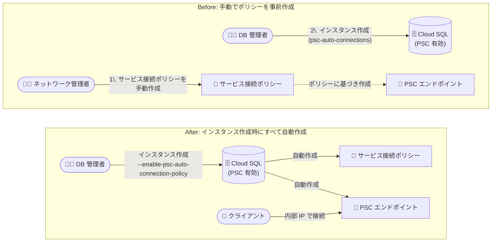

# Cloud SQL: Private Service Connect の自動構成 (サービス接続ポリシーとエンドポイントの自動作成)

**リリース日**: 2026-08-27

**サービス**: Cloud SQL for MySQL / Cloud SQL for PostgreSQL / Cloud SQL for SQL Server

**機能**: Private Service Connect のサービス接続ポリシーとエンドポイントの自動作成

**ステータス**: Feature

📊 [このアップデートのインフォグラフィックを見る](https://takech9203.github.io/google-cloud-news-summary/20260827-cloud-sql-private-service-connect-auto-config.html)

## 概要

Cloud SQL (MySQL / PostgreSQL / SQL Server) で、Private Service Connect (PSC) の構成が大幅に簡素化されました。PSC を有効にしてインスタンスを作成する際に、PSC で使用したい VPC ネットワーク内に「サービス接続ポリシー (service connection policy)」と「PSC エンドポイント」を自動的に作成するオプションを選択できるようになりました。

これまでも Cloud SQL では PSC エンドポイントの自動作成 (`psc-auto-connections`) がサポートされていましたが、その前提として、コンシューマ側 VPC ネットワークにサービス接続ポリシーをあらかじめ手動で作成しておく必要がありました。今回のアップデートにより、インスタンス作成時にサービス接続ポリシーの作成・更新まで Google Cloud に任せられるようになり、データベース管理者とネットワーク管理者にまたがっていた事前準備の手間が削減されます。

このアップデートは、複数の VPC ネットワーク・プロジェクト・チームから Cloud SQL インスタンスへプライベート接続する構成を採用する組織や、Terraform / gcloud / API によるインフラ自動化を行っているユーザーにとって、プロビジョニングのステップ削減と構成ミスの防止につながります。

**アップデート前の課題**

- PSC エンドポイントを自動作成するには、事前にコンシューマ VPC ネットワーク側でサービス接続ポリシー (サービスクラス `google-cloud-sql`、対象ネットワーク・リージョン・サブネットの指定など) を手動で作成しておく必要があった
- サービス接続ポリシーの作成には `compute.networkAdmin` などのネットワーク管理者権限が必要であり、データベース管理者とネットワーク管理者の間で作業の分担・調整が必要だった
- インスタンス作成とポリシー作成が別々の手順であるため、ポリシーの作成漏れや設定不備によりエンドポイントが作成されない構成ミスが起こり得た

**アップデート後の改善**

- PSC 対応のインスタンス作成時に、サービス接続ポリシーとエンドポイントの両方を自動作成するオプションを選択できるようになった
- gcloud では `--enable-psc-auto-connection-policy` パラメータ、API では `pscAutoConnectionPolicyEnabled` フィールド、Terraform では `psc_auto_connection_policy_enabled` フィールドで、ポリシーの自動作成・更新を有効化できるようになった
- Google Cloud コンソールから作成する場合は、必要なロールのチェックと構成が自動的に行われるようになった

## アーキテクチャ図



従来はネットワーク管理者がコンシューマ VPC にサービス接続ポリシーを事前作成する必要がありましたが、今回のアップデートにより、インスタンス作成の 1 ステップでポリシーとエンドポイントの両方を自動作成できるようになりました。

## サービスアップデートの詳細

### 主要機能

1. **サービス接続ポリシーの自動作成・更新**
   - インスタンス作成時に、指定した VPC ネットワークに対するサービス接続ポリシーを Google Cloud が自動的に作成・更新する
   - gcloud CLI では `--enable-psc-auto-connection-policy`、Cloud SQL Admin API では `pscAutoConnectionPolicyEnabled: true`、Terraform では `psc_auto_connection_policy_enabled` で有効化する
   - この機能の利用には追加の管理権限の構成が必要 (後述)

2. **PSC エンドポイントの自動作成**
   - `--psc-auto-connections=network=CONSUMER_NETWORK,project=CONSUMER_PROJECT` で指定した VPC ネットワークに、インスタンス作成後にエンドポイントが自動作成される
   - 自動接続のパラメータで指定したプロジェクトは、許可済みプロジェクト (`allowed-psc-projects`) に自動的に追加される
   - 作成されたエンドポイントを取得し、内部 IP アドレス経由でインスタンスに接続できる

3. **Google Cloud コンソールでの自動ロール構成**
   - コンソールから PSC 有効のインスタンスを作成する場合、必要なロールのチェックと構成が自動的に行われる
   - プロジェクトで Network Connectivity API が有効になっていない場合は、有効化が必要になることがある

## 技術仕様

### 自動構成に関連する設定項目

| 項目 | 詳細 |
|------|------|
| ポリシー自動作成 (gcloud) | `--enable-psc-auto-connection-policy` |
| ポリシー自動作成 (API) | `pscAutoConnectionPolicyEnabled: true` |
| ポリシー自動作成 (Terraform) | `psc_auto_connection_policy_enabled` |
| エンドポイント自動作成 | `--psc-auto-connections=network=...,project=...` / `pscAutoConnections` |
| サービスクラス | `google-cloud-sql` |
| DNS 自動化 (任意) | `--enable-psc-auto-dns` (`psc_auto_dns_enabled`) |
| 書き込みエンドポイント DNS (任意) | `--enable-psc-write-endpoint-dns` (Enterprise Plus + DNS 自動化が前提) |

### Cloud SQL サービスエージェントに必要なロール (gcloud / API 利用時)

gcloud CLI または Cloud SQL Admin API でポリシーの自動作成を使う場合、インスタンス作成前に Cloud SQL サービスエージェント (`service-INSTANCE_PROJECT_NUMBER@gcp-sa-cloudsql.iam.gserviceaccount.com`) に以下のロールをコンシューマプロジェクトで付与する必要があります。

| ロール | 説明 |
|------|------|
| `roles/networkconnectivity.consumerNetworkAdmin` | Service Automation Consumer Network Admin |
| `roles/compute.networkViewer` | Compute Network Viewer |

### API での設定例

```json
{
  "settings": {
    "ipConfiguration": {
      "ipv4Enabled": false,
      "pscConfig": {
        "pscEnabled": true,
        "pscAutoConnectionPolicyEnabled": true,
        "pscAutoConnections": [
          {
            "consumerProject": "CONSUMER_PROJECT",
            "consumerNetwork": "projects/PARENT_PROJECT/global/networks/CONSUMER_NETWORK"
          }
        ],
        "allowedConsumerProjects": ["ALLOWED_PROJECTS"]
      }
    }
  }
}
```

## 設定方法

### 前提条件

1. プロジェクトで Network Connectivity API が有効になっていること (コンソール利用時に有効化を求められる場合がある)
2. gcloud / API でポリシーの自動作成を使う場合は、Cloud SQL サービスエージェントに追加ロールを付与できること

### 手順

#### ステップ 1: Cloud SQL サービスエージェントの作成とロール付与 (gcloud / API 利用時のみ)

```bash
# プロジェクト固有の Cloud SQL サービスエージェントが存在しない場合は作成
gcloud beta services identity create \
  --service=sqladmin.googleapis.com \
  --project=INSTANCE_PROJECT

# サービスエージェントに必要なロールを付与
gcloud projects add-iam-policy-binding CONSUMER_PROJECT \
  --member='serviceAccount:CLOUD_SQL_SERVICE_AGENT' \
  --role='roles/networkconnectivity.consumerNetworkAdmin'

gcloud projects add-iam-policy-binding CONSUMER_PROJECT \
  --member='serviceAccount:CLOUD_SQL_SERVICE_AGENT' \
  --role='roles/compute.networkViewer'
```

コンソールから作成する場合、必要なロールのチェックと構成は自動的に行われるため、このステップは不要です。

#### ステップ 2: ポリシーとエンドポイントの自動作成を有効にしてインスタンスを作成

```bash
gcloud sql instances create INSTANCE_NAME \
  --project=PROJECT_ID \
  --region=REGION_NAME \
  --cpu=NUMBER_OF_vCPUs \
  --memory=MEMORY_SIZE \
  --database-version=DATABASE_VERSION \
  --no-assign-ip \
  --enable-private-service-connect \
  --allowed-psc-projects=ALLOWED_PROJECTS \
  --psc-auto-connections=network=CONSUMER_NETWORK,project=CONSUMER_PROJECT \
  --enable-psc-auto-connection-policy
```

`--enable-psc-auto-connection-policy` を追加すると、インスタンス作成時にサービス接続ポリシーが自動的に作成・更新されます。作成後、指定した VPC ネットワークに PSC エンドポイントが自動作成されます。

#### ステップ 3: エンドポイントの取得と接続

インスタンス作成後、自動作成されたエンドポイントを取得し、その内部 IP アドレス (または DNS 名) を使用してインスタンスに接続します。

## メリット

### ビジネス面

- **プロビジョニングの迅速化**: ネットワーク管理者による事前のポリシー作成を待たずにデータベースを展開でき、リードタイムを短縮できる
- **運用負荷の削減**: データベースチームとネットワークチーム間の調整作業が減り、セルフサービスでのデータベース展開が容易になる

### 技術面

- **構成ミスの防止**: ポリシーの作成漏れや設定不備によってエンドポイントが作成されない、といった問題を減らせる
- **IaC との親和性**: Terraform の `psc_auto_connection_policy_enabled` により、ポリシー・インスタンス・エンドポイントを一括でコード管理できる
- **3 エンジンで一貫**: MySQL / PostgreSQL / SQL Server のすべてで同じ方式が利用できる

## デメリット・制約事項

### 制限事項

- ポリシーの自動作成には追加の管理権限が必要 (gcloud / API 利用時は Cloud SQL サービスエージェントへの `roles/networkconnectivity.consumerNetworkAdmin` と `roles/compute.networkViewer` の付与)
- サービス接続ポリシーと Cloud SQL インスタンスが異なるプロジェクトにある場合は、ポリシーにカスタムサービスインスタンススコープ (インスタンスが属するプロジェクト / フォルダ / 組織の ID) の構成が必要
- 指定したネットワークが存在しない、有効なサービス接続ポリシーがない、利用可能な IP アドレスがない、などの理由でエンドポイントが自動作成されない場合がある (その場合は手動作成が可能)

### 考慮すべき点

- Cloud SQL サービスエージェントにネットワーク関連のロールを付与するため、組織のセキュリティポリシーとの整合性を事前に確認する
- ネットワーク構成を厳密に統制したい組織では、従来どおりネットワーク管理者がポリシーを手動作成する運用を継続する選択肢もある
- 書き込みエンドポイントの DNS 自動化 (`--enable-psc-write-endpoint-dns`) は Enterprise Plus エディションのインスタンスでのみサポートされる

## ユースケース

### ユースケース 1: Terraform による PSC 対応 Cloud SQL のワンショット構築

**シナリオ**: IaC で Cloud SQL インスタンスと PSC 接続をまとめてプロビジョニングしたいが、これまではサービス接続ポリシーを別リソースとして事前に用意する必要があった。

**実装例**:
```hcl
resource "google_sql_database_instance" "instance" {
  name             = "my-instance"
  database_version = "POSTGRES_16"
  settings {
    tier = "db-custom-4-16384"
    ip_configuration {
      ipv4_enabled = false
      psc_config {
        psc_enabled                        = true
        psc_auto_connection_policy_enabled = true
        allowed_consumer_projects          = ["consumer-project"]
        psc_auto_connections {
          consumer_network            = "projects/consumer-project/global/networks/default"
          consumer_service_project_id = "consumer-project"
        }
      }
    }
  }
}
```

**効果**: ポリシー・インスタンス・エンドポイントを 1 つの構成で完結でき、環境構築の自動化とレビューが簡素化される。

### ユースケース 2: マルチチーム環境でのセルフサービスなデータベース展開

**シナリオ**: 複数のチームがそれぞれの VPC ネットワークから共有の Cloud SQL インスタンスに接続する構成で、チームごとにネットワーク管理者へポリシー作成を依頼するフローがボトルネックになっている。

**効果**: 必要なロールを Cloud SQL サービスエージェントに付与しておけば、インスタンス作成時の指定だけで各コンシューマ VPC にポリシーとエンドポイントが自動作成され、チーム間の依頼・待ち時間が削減される。

## 料金

この自動構成機能自体に関する追加料金は Release Notes には記載されていません。Private Service Connect のエンドポイント (転送ルール) と処理データには VPC の料金が適用されます。詳細は以下の料金ページを参照してください。

- [VPC の料金 (Private Service Connect)](https://cloud.google.com/vpc/pricing#psc-forwarding-rules)
- [Cloud SQL の料金](https://cloud.google.com/sql/pricing)

## 関連サービス・機能

- **Private Service Connect (VPC)**: 本機能の基盤。サービス接続ポリシーとエンドポイント (転送ルール) により、コンシューマ VPC からマネージドサービスへのプライベート接続を提供する
- **Network Connectivity API**: サービス接続ポリシーの管理に使用される API。コンソールからの構成時に有効化が必要になる場合がある
- **Cloud DNS**: PSC の DNS 自動化 (`--enable-psc-auto-dns`) により、PSC 自動接続を構成したネットワーク全体に DNS レコードが自動プロビジョニングされる
- **Shared VPC**: コンシューマプロジェクトとしてホストプロジェクト・サービスプロジェクトのどちらも指定可能
- **Cloud SQL 読み取りレプリカ / 高度な DR**: PSC 経由でプライマリとレプリカの両方に接続でき、書き込みエンドポイント DNS (Enterprise Plus) によりフェイルオーバー時も接続文字列の変更が不要

## 参考リンク

- 📊 [インフォグラフィック](https://takech9203.github.io/google-cloud-news-summary/20260827-cloud-sql-private-service-connect-auto-config.html)
- [公式リリースノート](https://docs.cloud.google.com/release-notes#August_27_2026)
- [Configure Private Service Connect (MySQL)](https://docs.cloud.google.com/sql/docs/mysql/configure-private-service-connect)
- [Configure Private Service Connect (PostgreSQL)](https://docs.cloud.google.com/sql/docs/postgres/configure-private-service-connect)
- [Configure Private Service Connect (SQL Server)](https://docs.cloud.google.com/sql/docs/sqlserver/configure-private-service-connect)
- [Private Service Connect の概要 (Cloud SQL)](https://docs.cloud.google.com/sql/docs/mysql/about-private-service-connect)
- [料金ページ (VPC / Private Service Connect)](https://cloud.google.com/vpc/pricing)

## まとめ

Cloud SQL の Private Service Connect 構成が、インスタンス作成時のサービス接続ポリシーとエンドポイントの自動作成により大幅に簡素化されました。PSC を採用している、または採用を検討している場合は、Cloud SQL サービスエージェントへの必要ロールの付与を確認したうえで、`--enable-psc-auto-connection-policy` と `--psc-auto-connections` を用いたプロビジョニングフローへの移行を検討することを推奨します。

---

**タグ**: Cloud SQL, MySQL, PostgreSQL, SQL Server, Private Service Connect, ネットワーキング, VPC, セキュリティ
