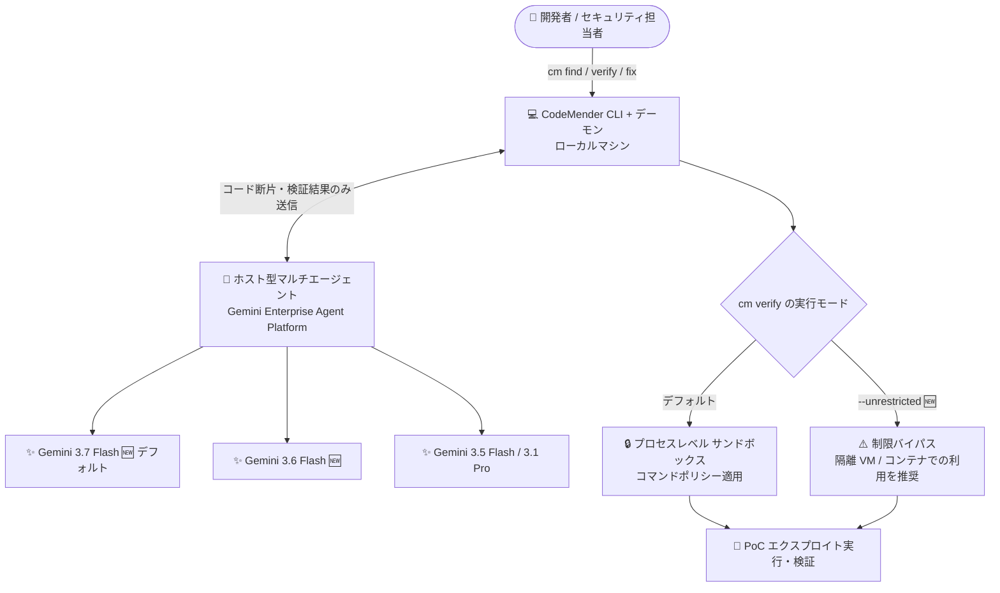

# Gemini Enterprise Agent Platform: CodeMender アップデート (Gemini 3.6/3.7 Flash 対応と --unrestricted フラグ)

**リリース日**: 2026-08-27

**サービス**: Gemini Enterprise Agent Platform

**機能**: CodeMender アップデート (モデルサポート拡充、無制限検証フラグ、バグ修正)

**ステータス**: Feature (CodeMender は Preview)

📊 [このアップデートのインフォグラフィックを見る](https://takech9203.github.io/google-cloud-news-summary/20260827-gemini-enterprise-agent-platform-codemender-updates.html)

## 概要

Gemini Enterprise Agent Platform 上のコードセキュリティエージェント CodeMender に複数のアップデートがリリースされた。CodeMender は Google DeepMind が開発したセキュリティ特化のハーネスを備えた自律型 AI エージェントで、コードベースの脆弱性を発見 (`cm find`)、実際に PoC エクスプロイトを実行して悪用可能性を検証 (`cm verify`)、検証済みパッチを生成 (`cm fix`) する。

今回のリリースでは、(1) Gemini 3.6 Flash (`gemini-3.6-flash`) と Gemini 3.7 Flash (`gemini-3.7-flash`、デフォルト) のモデルサポート追加、(2) 隔離環境でのエクスプロイト検証時にコマンドポリシー制限をバイパスする `--unrestricted` フラグの `cm verify` への追加、(3) 長時間セッションの信頼性向上をはじめとする複数のバグ修正が含まれる。

CodeMender を利用してコードセキュリティの自動化を進めている開発チーム・セキュリティチームにとって、最新の高効率モデルによる性能向上と、CI/CD や隔離 VM 環境での検証ワークフローの柔軟性向上が主な価値となる。

**アップデート前の課題**

- CodeMender で Gemini 3 ファミリーの最新 Flash モデル (3.6 / 3.7) を利用できなかった (従来のデフォルトは `gemini-3.5-flash`)
- `cm verify` の実行時にサンドボックスのコマンドポリシー制限が常に適用され、隔離環境で複雑なエクスプロイト検証を行う際に制約となるケースがあった
- 長時間セッションの信頼性、実行環境ごとのシェル解決、権限拒否時のエラーメッセージ、相対パス起因のサンドボックス初期化失敗などの問題があった

**アップデート後の改善**

- Gemini 3.6 Flash と Gemini 3.7 Flash が利用可能になり、`gemini-3.7-flash` がデフォルトモデルになった。Gemini 3.7 Flash はコード生成・ターミナル実行に強いエージェント向けモデルで、Terminal-bench 2.1 で 85.1% (3.6 Flash は 73.0%)、DeepSWE で 63.7% (同 49.0%) と大幅な性能向上を示している
- `cm verify --unrestricted` により、隔離環境でファイルシステム境界や OS レベルのコンテナ分離を一時的にバイパスしてエクスプロイト検証を実行できるようになった
- 長時間セッションの信頼性が向上し、OS 環境をまたぐシェル解決が改善され、権限拒否エラーメッセージが明確になり、相対パスによるサンドボックス初期化失敗が修正された

## アーキテクチャ図



CodeMender はローカルの CLI/デーモンとクラウド側のホスト型エージェントで構成され、ソースコードリポジトリ全体はアップロードされない。今回のアップデートで推論に使うモデルの選択肢が拡大し、`cm verify` にサンドボックス制限をバイパスする `--unrestricted` フラグが追加された。

## サービスアップデートの詳細

### 主要機能

1. **モデルサポート: Gemini 3.6 Flash / 3.7 Flash**
   - `gemini-3.6-flash` と `gemini-3.7-flash` をサポートし、`gemini-3.7-flash` が新しいデフォルトモデルになった
   - CodeMender がサポートするモデルは Gemini 3.7 Flash、Gemini 3.6 Flash、Gemini 3.5 Flash、Gemini 3.1 Pro (Preview) となり、コスト・速度・深いコーディング性能のトレードオフに応じて選択できる
   - Gemini 3.7 Flash は Gemini 3 ファミリーの「エージェント向けワークホース」と位置づけられ、3.6 Flash と同一の価格帯を維持しながらコード生成・ターミナル実行性能が大幅に向上している (GA、リリース日 2026-08-13)

2. **無制限検証: `cm verify --unrestricted`**
   - エクスプロイト検証時にコマンドポリシー制限をバイパスするフラグ
   - ファイルシステム境界と OS レベルのコンテナ分離を当該実行に限り無効化する
   - 隔離環境 (使い捨ての VM やコンテナ) での利用が前提。ホストシステムを保護するため、通常の開発環境ではデフォルトのサンドボックスを維持することが強く推奨されている

3. **バグ修正**
   - 長時間セッションの信頼性向上
   - 実行環境 (OS) をまたぐシェル解決の改善
   - 権限拒否 (permission denied) エラーメッセージの明確化
   - 相対パスに起因して CodeMender サンドボックスの初期化が失敗する問題の修正

## 技術仕様

### CodeMender の構成要素

| 項目 | 詳細 |
|------|------|
| Agent | コアのビジネスロジックと推論を実行するホスト型マルチエージェントシステム |
| Client | ローカルマシン上で動作する CLI 兼デーモン。プロセスレベルのサンドボックス内でビルド・テスト・脆弱性検証を実行 |
| 対応言語 | C/C++、Go、Java、Python、TypeScript/JavaScript、Rust、Ruby |
| 対応フレームワーク | HTML/CSS、Django、Flask、React、Spring Boot、Express など |
| サポートモデル | Gemini 3.7 Flash (デフォルト 🆕)、Gemini 3.6 Flash 🆕、Gemini 3.5 Flash、Gemini 3.1 Pro (Preview) |
| 利用可能リージョン | グローバル |
| データ保持 | セッションデータは最大 7 日間 (暗号化保存)、`DeleteInteraction` で即時削除可能。モデル学習には不使用 |

### `cm verify` の主なフラグ

| フラグ | 説明 |
|--------|------|
| `-c` / `--context` | エージェントへの追加コンテキスト・指示を渡す |
| `--skip-exploit-verification` | PoC エクスプロイトを実行せず静的検証のみ行う |
| `--sandbox` | サンドボックスの有効/無効を明示的に制御 (例: `--sandbox=false`) |
| `--unrestricted` 🆕 | サンドボックス保護 (ファイルシステム境界、OS レベルのコンテナ分離) を当該実行に限りバイパス |
| `-y` / `--yes` | ツール実行と PoC エクスプロイト実行の確認プロンプトを自動承認 (CI/CD 向け) |

### Gemini 3.7 Flash と 3.6 Flash の比較 (モデルドキュメントより)

| 項目 | Gemini 3.7 Flash | Gemini 3.6 Flash |
|------|------------------|------------------|
| モデル ID | `gemini-3.7-flash` | `gemini-3.6-flash` |
| ステージ | GA | GA |
| コンテキストウィンドウ | 1,048,576 トークン | 1,048,576 トークン |
| 最大出力トークン | 65,536 | 65,536 |
| Thinking レベル | LOW / MEDIUM (デフォルト) / HIGH | MINIMAL / LOW / MEDIUM (デフォルト) / HIGH |
| Terminal-bench 2.1 | 85.1% | 73.0% |
| DeepSWE | 63.7% | 49.0% |

## 設定方法

### 前提条件

1. CodeMender CLI がインストール・構成済みであること ([Install and configure the CLI](https://docs.cloud.google.com/gemini-enterprise-agent-platform/codemender/set-up-environment))
2. `--unrestricted` を使う場合は、隔離された VM またはコンテナ環境で CLI を実行すること (公式推奨)

### 手順

#### ステップ 1: 脆弱性のスキャンと検証対象の特定

```bash
# 対象ディレクトリをスキャン (10〜50 ファイル単位を推奨)
cm find ./src/auth/

# レポートから finding-id を確認
cm report
```

#### ステップ 2: 隔離環境で無制限検証を実行

```bash
# デフォルト (サンドボックス内での検証)
cm verify FINDING_ID

# 隔離環境でコマンドポリシー制限をバイパスして検証 (新機能)
cm verify FINDING_ID --unrestricted

# CI/CD パイプラインでの自動承認と組み合わせる場合
cm verify FINDING_ID --unrestricted -y
```

#### ステップ 3: モデルの指定

```bash
# デフォルトは gemini-3.7-flash。コマンド実行時にモデルを指定可能
# 詳細: https://docs.cloud.google.com/gemini-enterprise-agent-platform/codemender#specifying-the-model
```

## メリット

### ビジネス面

- **修復スループットの向上**: デフォルトモデルが Gemini 3.7 Flash になり、3.6 Flash と同一価格帯でコード生成・ターミナル実行性能が大幅に向上。同じトークンコストでより高品質な検証・修復が期待できる
- **アラート疲れの軽減を加速**: エクスプロイト実行による検証がより柔軟になり、実際に悪用可能な脆弱性へ開発リソースを集中しやすくなる

### 技術面

- **モデル選択の柔軟性**: 3.5 Flash / 3.6 Flash / 3.7 Flash / 3.1 Pro からコスト・速度・推論の深さに応じて選択できる
- **複雑なエクスプロイト検証への対応**: `--unrestricted` により、サンドボックスのコマンドポリシーが妨げになる検証シナリオを隔離環境で実行できる
- **運用品質の向上**: 長時間セッションの信頼性、シェル解決、エラーメッセージ、サンドボックス初期化のバグ修正により日常運用の安定性が改善

## デメリット・制約事項

### 制限事項

- CodeMender は Preview 段階であり、Pre-GA Offerings Terms が適用される (サポートが限定される場合がある)
- Gemini 3.7 Flash では `thinking_level="MINIMAL"` が利用できない (API バリデーションエラーになる)

### 考慮すべき点

- `--unrestricted` はファイルシステム境界と OS レベルのコンテナ分離を無効化するため、ホストシステム保護の観点から必ず隔離された VM / コンテナ内で実行すること (公式ドキュメントの警告)
- ローカル開発ではサンドボックス有効 (`sandbox.enabled: true`) と human confirmation を維持し、保護の無効化は使い捨て環境や CI/CD パイプラインに限定することが推奨される
- CodeMender はホストシステム上でコマンドを実行し、ファイルを直接変更する可能性がある点に留意する

## ユースケース

### ユースケース 1: CI/CD パイプラインでの自動脆弱性検証

**シナリオ**: セキュリティチームが、使い捨てのコンテナ環境で動く CI パイプラインに CodeMender の検証ステップを組み込み、静的スキャナの検出結果 (Wiz などからのインポートを含む) の悪用可能性を自動で検証したい。サンドボックスのコマンドポリシーが特定のエクスプロイト PoC の実行を妨げていた。

**実装例**:
```bash
# 使い捨てコンテナ内で、制限をバイパスしつつ自動承認で検証
cm verify FINDING_ID --unrestricted -y
```

**効果**: 隔離環境の CI 上で検証が完結し、悪用可能と確認された脆弱性のみを開発者にエスカレーションできる。誤検知のトリアージ工数を削減できる。

### ユースケース 2: デフォルトモデル更新による検証・修復品質の底上げ

**シナリオ**: これまで `gemini-3.5-flash` で CodeMender を運用していたチームが、追加コストを抑えつつ修復パッチの品質とターミナル操作の成功率を高めたい。

**効果**: デフォルトが `gemini-3.7-flash` となり、設定変更なしで最新モデルの性能 (Terminal-bench 2.1: 85.1%、DeepSWE: 63.7%) の恩恵を受けられる。深い推論が必要な複雑ケースのみ Gemini 3.1 Pro に切り替える運用も可能。

## 料金

CodeMender の利用はトークン消費に基づいて課金される。CLI はセッション中のトークン消費 (入力/出力/合計) をステータスラインと終了時サマリーに表示し、プロジェクト全体の課金済みトークン使用量は Cloud Billing のレポートで確認できる。Gemini モデルのトークン単価は Gemini Enterprise Agent Platform の料金ページを参照 (Gemini 3.7 Flash は 3.6 Flash と同一の価格帯とドキュメントに記載)。

- [Gemini Enterprise Agent Platform 料金ページ](https://cloud.google.com/gemini-enterprise-agent-platform/generative-ai/pricing)
- [Cloud Billing レポートの確認方法](https://docs.cloud.google.com/billing/docs/how-to/reports)

## 利用可能リージョン

CodeMender はグローバルに利用可能。Gemini 3.7 Flash / 3.6 Flash は Global および Multi-region (`us`、`eu`) で提供される。

## 関連サービス・機能

- **Gemini Enterprise Agent Platform**: CodeMender のホスト基盤。Agent Runtime、ガバナンスポリシー、Zero Data Retention などのエンタープライズ統制を提供
- **VPC Service Controls (VPC-SC)**: エージェント通信の周囲にネットワーク境界を設定し、データ漏洩リスクを軽減
- **Cloud Billing**: CodeMender のトークン使用量とコストトレンドの確認
- **Wiz などのクラウドセキュリティツール**: 検出結果を CodeMender にインポートして検証・修復ワークフローに接続 ([Import third-party security findings](https://docs.cloud.google.com/gemini-enterprise-agent-platform/codemender/import-findings))
- **Google AI Threat Defense**: CodeMender をコードセキュリティエージェントとして組み込む、Google の自律型セキュリティプラットフォーム

## 参考リンク

- 📊 [インフォグラフィック](https://takech9203.github.io/google-cloud-news-summary/20260827-gemini-enterprise-agent-platform-codemender-updates.html)
- [公式リリースノート](https://docs.cloud.google.com/release-notes#August_27_2026)
- [Google Cloud Blog: Find and fix software vulnerabilities with CodeMender](https://cloud.google.com/blog/products/identity-security/find-and-fix-software-vulnerabilities-with-codemender)
- [CodeMender ドキュメント](https://docs.cloud.google.com/gemini-enterprise-agent-platform/codemender)
- [Scan and verify code vulnerabilities](https://docs.cloud.google.com/gemini-enterprise-agent-platform/codemender/scan-and-verify)
- [Gemini 3.7 Flash モデルページ](https://docs.cloud.google.com/gemini-enterprise-agent-platform/models/gemini/3-7-flash)
- [Gemini 3.6 Flash モデルページ](https://docs.cloud.google.com/gemini-enterprise-agent-platform/models/gemini/3-6-flash)
- [料金ページ](https://cloud.google.com/gemini-enterprise-agent-platform/generative-ai/pricing)

## まとめ

CodeMender のデフォルトモデルが Gemini 3.7 Flash に更新され、同一価格帯のままエージェント性能が大幅に向上したことは、既存ユーザーにとって設定変更なしで得られる実質的なアップグレードである。`cm verify --unrestricted` は隔離環境や CI/CD での検証自動化の幅を広げるが、サンドボックス保護を無効化するため、必ず使い捨ての VM / コンテナ内で利用すること。CodeMender を評価中のチームは、最新のバグ修正で運用安定性も向上しているため、このリリースを機に PoC を進める価値がある。

---

**タグ**: Gemini Enterprise Agent Platform, CodeMender, セキュリティ, AI エージェント, Gemini 3.7 Flash, Gemini 3.6 Flash, 脆弱性管理, DevSecOps
