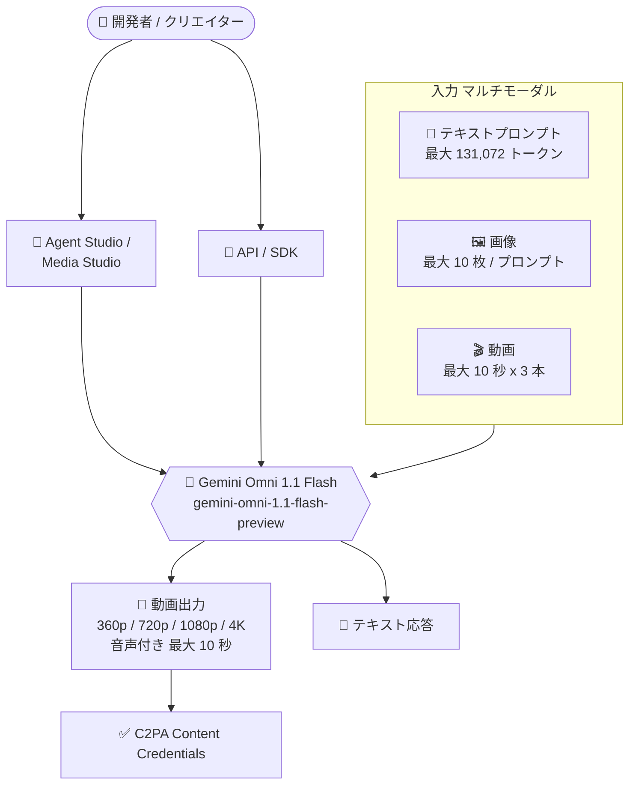

# Gemini Enterprise Agent Platform: Gemini Omni 1.1 Flash が Public Preview で利用可能に

**リリース日**: 2026-08-27

**サービス**: Gemini Enterprise Agent Platform

**機能**: Gemini Omni 1.1 Flash (gemini-omni-1.1-flash-preview)

**ステータス**: Public Preview

📊 [このアップデートのインフォグラフィックを見る](https://takech9203.github.io/google-cloud-news-summary/20260827-gemini-omni-1-1-flash-preview.html)

## 概要

Gemini Enterprise Agent Platform において、Gemini Omni 1.1 Flash (`gemini-omni-1.1-flash-preview`) が Public Preview として利用可能になりました。Gemini Omni 1.1 Flash は動画・画像・テキストのタスク向けに設計されたマルチモーダルモデルで、高速な動画生成に最適化されており、音声 (スピーチ・音楽・効果音) の生成と動画編集をサポートします。単一のモデルでテキスト応答と動画出力の両方を提供できる点が特徴です。

従来の動画生成モデルと異なり、Gemini Omni はテキスト・画像・動画をネイティブに同時処理するマルチモーダル設計を採用しており、物理法則の理解と Gemini の持つ世界知識 (歴史・科学・文化的コンテキスト) を組み合わせた、一貫性と制御性の高い動画出力を実現します。マーケティング素材の制作、プロトタイピング、コンテンツ制作パイプラインの自動化など、動画を扱うエンタープライズユースケースを検討している開発者・アーキテクトが対象です。

本モデルは Generative AI Preview オファリングであり、Pre-GA Offerings Terms の下で提供されますが、本番・商用目的での利用や生成出力の第三者への開示が可能と明記されています。

**アップデート前の課題**

従来の Preview 版 Gemini Omni Flash (`gemini-omni-flash-preview`) には以下の制限がありました。

- 画像を起点とした動画生成 (image-to-video) に対応していなかった
- 参照画像を使った動画生成 (references to video) や、最初と最後のフレームを指定した補間生成に対応していなかった
- 生成済み動画の延長 (extend videos) に対応していなかった
- 対応解像度が 720p のみだった

**アップデート後の改善**

Gemini Omni 1.1 Flash では以下が可能になりました。

- テキストからの動画生成に加え、画像からの動画生成、参照画像を使った動画生成、最初と最後のフレームからの補間生成に対応した
- 生成済み動画の延長 (extend videos) に対応した
- 出力解像度が 360p / 720p / 1080p / 4K に拡大した
- スピーチ・音楽・効果音の音声生成と動画編集を単一モデルでサポートし、C2PA コンテンツ認証情報 (Content Credentials) にも対応した

## アーキテクチャ図



テキスト・画像・動画のマルチモーダル入力を単一モデルが処理し、音声付き動画とテキスト応答を同時に出力します。生成動画には C2PA コンテンツ認証情報が付与されます。

## サービスアップデートの詳細

### 主要機能

1. **高速動画生成 (音声付き)**
   - テキストプロンプトから最大 10 秒の動画を生成
   - スピーチ・音楽・効果音の音声生成をサポート
   - 出力解像度は 360p / 720p / 1080p / 4K、アスペクト比は 16:9 / 9:16 に対応

2. **多様な動画生成モード**
   - Text to video: テキストからの動画生成
   - Image to video: 画像を起点とした動画生成 (1.1 で新規対応)
   - References to video: 参照画像でスタイルや被写体を指定した動画生成 (1.1 で新規対応)
   - First and last frames: 最初と最後のフレーム画像間を補間する動画生成 (1.1 で新規対応)

3. **動画編集と延長**
   - 生成済み動画の編集 (video editing) をサポート
   - 動画の延長 (extend videos) に対応 (1.1 で新規対応)
   - Thinking (思考プロセス) をサポートし、複雑な指示にも対応

4. **コンテンツの信頼性**
   - C2PA Content Credentials に対応し、AI 生成コンテンツであることを検証可能

## 技術仕様

### モデル仕様

| 項目 | 詳細 |
|------|------|
| モデル ID | `gemini-omni-1.1-flash-preview` |
| モダリティ (入力) | テキスト、画像、動画 (音声入力は非対応) |
| モダリティ (出力) | テキスト、動画 (音声付き) |
| 最大入力トークン | 131,072 |
| 最大出力トークン | 57,920 |
| 動画出力長 | 最大 10 秒 (音声あり / なし共通) |
| 動画入力 | 最大 3 本 / プロンプト |
| 画像入力 | 最大 10 枚 / プロンプト (インライン 20 MB、Cloud Storage 30 MB / ファイル) |
| 解像度 | 360p / 720p / 1080p / 4K |
| アスペクト比 | 16:9、9:16 |
| Temperature | 0.0-2.0 (デフォルト 1.0) |
| 利用可能リージョン | Global (`global`) |

### サポートされる機能と制限

| 機能 | 対応状況 |
|------|----------|
| Thinking | 対応 |
| Count Tokens | 対応 |
| Sound generation (スピーチ / 音楽 / 効果音) | 対応 |
| Video editing / Extend videos | 対応 |
| C2PA Content Credentials | 対応 |
| System instructions | 非対応 |
| Structured output / Context caching | 非対応 |
| Function calling / Grounding / Code execution | 非対応 |
| RAG Engine / Tuning / Batch inference | 非対応 |
| Provisioned Throughput | 非対応 (消費オプションは Fixed quota のみ) |

## 設定方法

### 前提条件

1. 課金が有効な Google Cloud プロジェクト
2. Agent Platform API の有効化

### 手順

#### ステップ 1: Agent Studio で試す

Google Cloud コンソールの Agent Studio (マルチモーダル) からモデルを選択して動作を確認できます。

```
https://console.cloud.google.com/agent-platform/studio/multimodal?model=gemini-omni-1.1-flash-preview
```

Model Garden のモデルカードからも詳細を確認できます。

#### ステップ 2: API から動画を生成する (Interactions API の例)

Gemini API の Interactions API を使用した画像からの動画生成の例 (公式ドキュメントより):

```python
import base64
from google import genai

client = genai.Client()

interaction = client.interactions.create(
    model="gemini-omni-1.1-flash",
    input=[
        {"type": "image", "data": base64_image, "mime_type": "image/jpeg"},
        {"type": "text", "text": "turn this into realistic footage, using the drawing only as a guide for movement"}
    ],
)

with open("output.mp4", "wb") as f:
    f.write(base64.b64decode(interaction.output_video.data))
```

Agent Platform での動画生成のサンプルノートブック「Gemini Omni Flash Video Generation」も公開されており、Colab / Colab Enterprise / Agent Platform Workbench で実行できます。

## メリット

### ビジネス面

- **コンテンツ制作の高速化**: テキストや画像から音声付き動画を高速に生成でき、マーケティング素材やプロトタイプの制作リードタイムを短縮できる
- **商用利用可能な Preview**: Generative AI Preview オファリングとして、Pre-GA 段階でも本番・商用目的での利用と生成出力の第三者への開示が認められている
- **コンテンツの透明性**: C2PA Content Credentials により AI 生成コンテンツであることを証明でき、ブランドの信頼性を維持できる

### 技術面

- **単一モデルによるマルチモーダル処理**: テキスト・画像・動画を 1 つのモデルで処理し、動画出力とテキスト応答を同時に得られるため、複数モデルの組み合わせが不要
- **柔軟な動画生成モード**: text-to-video に加え、image-to-video、参照画像、フレーム補間、動画延長まで単一モデルでカバー
- **最大 4K 出力**: 従来の Preview 版 (720p のみ) から大幅に解像度が向上し、高品質な出力が求められる用途にも対応

## デメリット・制約事項

### 制限事項

- 動画出力は最大 10 秒 (延長機能で継ぎ足しは可能)
- 音声入力は非対応 (音声はあくまで動画出力に付随する生成のみ)
- System instructions、Structured output、Function calling、Grounding、Context caching は非対応
- 消費オプションは Fixed quota のみで、Provisioned Throughput、Batch inference、Pay-as-you-go は非対応
- 利用可能なロケーションは Global エンドポイントのみ

### 考慮すべき点

- Preview 段階のモデルであり、Pre-GA Offerings Terms が適用される (SLA なし、仕様変更の可能性あり)
- 動画生成はトークン消費が大きいため、大量生成時のコスト管理に注意が必要
- 責任ある AI の観点から、動画生成モデルの利用ガイドライン (Responsible AI for Veo) の確認が推奨される

## ユースケース

### ユースケース 1: 商品画像からのプロモーション動画生成

**シナリオ**: EC サイトの商品写真やイラストを元に、SNS 向けのショート動画 (9:16) を大量に自動生成したい。

**実装例**:
```python
interaction = client.interactions.create(
    model="gemini-omni-1.1-flash",
    input=[
        {"type": "image", "data": product_image_b64, "mime_type": "image/png"},
        {"type": "text", "text": "この商品を回転させながらスタジオ照明で見せる、効果音付きの10秒のプロモーション動画を生成"}
    ],
)
```

**効果**: 撮影・編集の外注なしに音声付きプロモーション動画を高速に量産でき、制作コストとリードタイムを大幅に削減できる。

### ユースケース 2: フレーム補間によるシーントランジション制作

**シナリオ**: 映像制作で、2 枚のキービジュアル (最初と最後のフレーム) の間を滑らかにつなぐトランジション映像が必要。

**効果**: 最初と最後のフレーム画像を指定するだけでシネマティックな補間動画を生成でき、絵コンテからの映像化を迅速にプロトタイピングできる。

## 料金

Gemini Enterprise Agent Platform での料金は公式の生成 AI 料金ページを参照してください。参考として、Gemini API の料金ドキュメントでは Gemini Omni Flash ファミリー (Standard, Paid Tier) の料金が以下のように公開されています。

### 料金例 (Gemini API / Standard、Paid Tier)

| 項目 | 料金 (USD、100 万トークンあたり) |
|--------|-----------------|
| 入力 (テキスト / 画像 / 動画 / 音声) | $1.50 |
| 出力 (テキスト) | $9.00 |
| 出力 (動画) | $17.50 |

動画出力の課金は 720p 動画 1 秒あたり 5,792 トークンとして計算され、Standard 料金では実効約 $0.10 / 秒に相当します。

- [Gemini Enterprise Agent Platform 生成 AI 料金ページ](https://cloud.google.com/gemini-enterprise-agent-platform/generative-ai/pricing)

## 利用可能リージョン

- Global (`global`) エンドポイントのみ

詳細は [Model availability](https://docs.cloud.google.com/gemini-enterprise-agent-platform/resources/locations) を参照してください。

## 関連サービス・機能

- **Veo**: 同じく Agent Platform で利用できる動画生成モデル。Gemini Omni Flash と併せて Media Studio や API から利用でき、ユースケースに応じて使い分けが可能
- **Agent Studio / Media Studio**: コンソール上でモデルを試行し、動画生成をノーコードで実行できる環境
- **Model Garden**: モデルカードの確認とデプロイの起点となるモデルカタログ
- **Cloud Storage**: 画像・テキスト入力ファイルのインポート元として利用 (画像は 1 ファイル最大 30 MB)

## 参考リンク

- 📊 [インフォグラフィック](https://takech9203.github.io/google-cloud-news-summary/20260827-gemini-omni-1-1-flash-preview.html)
- [公式リリースノート](https://docs.cloud.google.com/release-notes#August_27_2026)
- [Gemini Omni 1.1 Flash モデルドキュメント](https://docs.cloud.google.com/gemini-enterprise-agent-platform/models/gemini/omni-1-1-flash)
- [動画生成の概要 (Agent Platform)](https://docs.cloud.google.com/gemini-enterprise-agent-platform/models/video/overview)
- [Gemini Omni ドキュメント (Gemini API)](https://ai.google.dev/gemini-api/docs/omni)
- [料金ページ](https://cloud.google.com/gemini-enterprise-agent-platform/generative-ai/pricing)

## まとめ

Gemini Omni 1.1 Flash の Public Preview 提供により、テキスト・画像・動画を単一モデルで処理し、音声付き動画の生成・編集・延長までを最大 4K 解像度で実行できるようになりました。従来の Preview 版から image-to-video、参照画像、フレーム補間、動画延長が追加され、動画生成ワークフローの適用範囲が大きく広がっています。動画コンテンツの自動生成を検討しているチームは、Agent Studio またはサンプルノートブックでの検証から始めることを推奨します。

---

**タグ**: #GeminiEnterpriseAgentPlatform #GeminiOmni #動画生成 #マルチモーダル #生成AI #Preview
