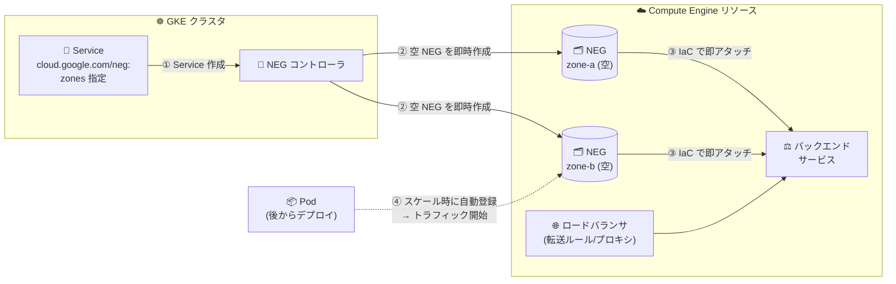

# Google Kubernetes Engine: Network Endpoint Group (NEG) の事前プロビジョニング (Preview)

**リリース日**: 2026-08-27

**サービス**: Google Kubernetes Engine (GKE)

**機能**: Network Endpoint Group (NEG) Pre-provisioning

**ステータス**: Preview

📊 [このアップデートのインフォグラフィックを見る](https://takech9203.github.io/google-cloud-news-summary/20260827-gke-neg-pre-provisioning.html)

## 概要

GKE で Network Endpoint Group (NEG) の事前プロビジョニング (Pre-provisioning) が Preview として利用可能になりました。この機能により、クラスタが対象ゾーンにノードを持っているかどうかに関係なく、Kubernetes Service の作成時に指定したゾーン (またはリージョン内の全ゾーン) に空のゾーン NEG (GCE_VM_IP_PORT タイプ) を強制的に作成できます。

設定は `cloud.google.com/neg` Service アノテーションを拡張して、新しい `zones` パラメータを追加するだけです。これにより、ワークロードのデプロイやノードのスケールアウトを待つことなく、NEG のバックエンドサービスへのアタッチなどのインフラストラクチャデプロイをシームレスに自動化できます。

主な対象ユーザーは、スタンドアロン NEG を使ってロードバランサを Terraform などの IaC で構成しているユーザーや、Cloud Service Mesh・カスタム Ingress コントローラなど GKE Ingress 以外の方法でロードバランサを管理しているユーザーです。

**アップデート前の課題**

- 従来、GKE の NEG コントローラはクラスタにノードが存在するゾーンにのみスタンドアロン NEG を作成していた
- クラスタがスケールアップして新しいゾーンにノードが追加された時点で初めて対応する NEG が作成されるため、Service 作成直後には全ゾーンの NEG が揃わなかった
- ロードバランサのバックエンドサービスへ NEG をアタッチする自動化 (IaC など) は、ワークロードがデプロイされ NEG が作成されるのを待つ必要があり、デプロイフローが直列化されていた

**アップデート後の改善**

- Service 作成時に、ノードの有無に関係なく指定ゾーンに空の NEG を即座に作成できるようになった
- Kubernetes Service のセットアップ直後に空の NEG をバックエンドサービスへアタッチでき、ワークロードのデプロイを待たずにインフラ構築を完了できる
- ワークロードが後からそれらのゾーンにスケールインした際、トラフィックルーティングが自動的に開始されるため、ロードバランサ構成がシンプルになった

## アーキテクチャ図



Service 作成と同時に指定ゾーンへ空の NEG が作成され (①②)、ワークロードのデプロイを待たずにバックエンドサービスへアタッチできます (③)。後からワークロードが該当ゾーンにスケールすると、エンドポイントが NEG に登録されトラフィックが自動的に流れ始めます (④)。

## サービスアップデートの詳細

### 主要機能

1. **`zones` パラメータによる空 NEG の事前作成**
   - `cloud.google.com/neg` アノテーションにオプションの `zones` フィールドを追加することで有効化
   - 例: `cloud.google.com/neg: '{"exposed_ports": {"80":{}}, "zones":["us-central1-a", "us-central1-b"]}'`
   - `exposed_ports` に複数ポートを指定した場合、`zones` の設定はすべてのポートの NEG に適用される

2. **3 通りのゾーン指定方法**
   - **省略または空リスト (`[]`)**: 従来のデフォルト動作。クラスタにノードがあるゾーンにのみ NEG を作成し、未使用 NEG は `INACTIVE` としてマークされる
   - **ワイルドカード (`["*"]`)**: クラスタが所在するリージョン内の全ゾーンに空 NEG を作成。リージョナルクラスタ・ゾーンクラスタの両方に適用 (ゾーンクラスタの場合はリージョン内の他ゾーンにも空 NEG を作成)
   - **明示的なゾーンリスト**: 指定したゾーンに加え、クラスタにノードが存在する他のゾーンにも NEG を作成

3. **事前プロビジョニングされた NEG のステータス確認**
   - `ServiceNetworkEndpointGroup` カスタムリソース (`kubectl get svcneg`) で NEG のステータスを確認可能
   - 事前プロビジョニングされた NEG は、該当ゾーンで Pod がまだ稼働していなくても `ACTIVE` 状態として表示される

## 技術仕様

### 要件と制限事項

| 項目 | 詳細 |
|------|------|
| NEG タイプ | ゾーン NEG (`GCE_VM_IP_PORT`) |
| 必要な GKE バージョン | 1.36.2-gke.3104000 以降 |
| ゾーンの制約 | `zones` フィールドに指定するゾーンはクラスタと同一リージョン内である必要がある |
| フォーマットエラー時の動作 | `zones` フィールドの形式が不正な場合、コントローラは標準動作にフォールバックし、Service オブジェクトに Warning イベントを発行 |
| クォータ | 空の NEG もリージョンごとのプロジェクトクォータにカウントされる |
| ワイルドカード使用時の注意 | リージョンに新規追加されたゾーンへの反映に時間がかかる場合がある。新ゾーンに依存する場合は明示的にゾーンを指定することを推奨 |

### アノテーションの設定例

```yaml
apiVersion: v1
kind: Service
metadata:
  name: neg-demo-svc
  annotations:
    cloud.google.com/neg: '{"exposed_ports": {"80":{}}, "zones":["us-central1-a", "us-central1-b"]}'
spec:
  selector:
    run: neg-demo-app
  ports:
    - port: 80
      protocol: TCP
      targetPort: 9376
```

リージョン内全ゾーンに事前作成する場合はワイルドカードを使用します。

```yaml
    cloud.google.com/neg: '{"exposed_ports": {"80":{}}, "zones":["*"]}'
```

## 設定方法

### 前提条件

1. GKE バージョン 1.36.2-gke.3104000 以降のクラスタ (VPC ネイティブクラスタでスタンドアロン NEG を使用)
2. `zones` に指定するゾーンがクラスタと同一リージョン内にあること
3. リージョンの NEG クォータに十分な余裕があること

### 手順

#### ステップ 1: Service に `zones` 付きの NEG アノテーションを設定

```bash
kubectl apply -f - <<EOF
apiVersion: v1
kind: Service
metadata:
  name: neg-demo-svc
  annotations:
    cloud.google.com/neg: '{"exposed_ports": {"80":{}}, "zones":["us-central1-a", "us-central1-b"]}'
spec:
  selector:
    run: neg-demo-app
  ports:
    - port: 80
      protocol: TCP
      targetPort: 9376
EOF
```

Service 作成時に、指定ゾーンへ空の NEG が即座に作成されます。

#### ステップ 2: 作成された NEG を確認

```bash
# Service の NEG ステータスを確認
kubectl get service neg-demo-svc -o yaml

# ServiceNetworkEndpointGroup リソースで状態を確認
kubectl get svcneg

# Compute Engine 側で NEG を一覧表示
gcloud compute network-endpoint-groups list
```

`cloud.google.com/neg-status` アノテーションに NEG 名と作成されたゾーンの一覧が表示されます。事前プロビジョニングされた NEG は Pod が未稼働でも `ACTIVE` と表示されます。

#### ステップ 3: 空の NEG をバックエンドサービスにアタッチ

```bash
gcloud compute backend-services add-backend my-bes \
    --global \
    --network-endpoint-group=NEG_NAME \
    --network-endpoint-group-zone=NEG_ZONE \
    --balancing-mode RATE --max-rate-per-endpoint 5
```

ワークロードのデプロイを待たずにロードバランサ構成を完了できます。ワークロードが該当ゾーンにデプロイされると、トラフィックルーティングが自動的に開始されます。

## メリット

### ビジネス面

- **デプロイの高速化**: インフラ構築 (ロードバランサ設定) とアプリケーションデプロイを並行して進められ、環境構築のリードタイムを短縮できる
- **IaC との親和性向上**: Terraform などによるロードバランサ構成の自動化から「NEG 作成待ち」の依存関係が排除され、パイプラインの安定性が向上する

### 技術面

- **インフラとワークロードのライフサイクル分離**: スタンドアロン NEG の利点であるロードバランサとバックエンドの独立したライフサイクル管理が、NEG 作成タイミングにも拡張された
- **スケールアウト時の自動ルーティング**: ワークロードが新しいゾーンにスケールすると、事前作成済みの NEG にエンドポイントが登録され、追加の構成変更なしにトラフィックが流れ始める
- **宣言的な設定**: Service アノテーションの拡張のみで有効化でき、既存の NEG コントローラのワークフローに自然に統合される

## デメリット・制約事項

### 制限事項

- Preview 段階の機能であり、本番環境での利用には注意が必要
- GKE バージョン 1.36.2-gke.3104000 以降が必要
- `zones` に指定できるのはクラスタと同一リージョン内のゾーンのみ
- 空の NEG もリージョンのプロジェクトクォータを消費する。複数の Service でワイルドカード設定を使用するとクォータを使い切る可能性がある

### 考慮すべき点

- ワイルドカード (`["*"]`) 使用時、リージョンに新設されたゾーンへの反映に時間がかかることがあるため、新ゾーンに依存するワークロードでは明示的なゾーン指定が推奨される
- `zones` フィールドの形式が不正な場合はサイレントに標準動作へフォールバックする (Warning イベントは発行される) ため、適用後の Service イベント確認が望ましい
- スタンドアロン NEG では NEG のライフサイクル管理はユーザー責任であり、バックエンドサービスから参照されたままの NEG はガベージコレクションされない (NEG リーク) 点は従来どおり注意が必要

## ユースケース

### ユースケース 1: Terraform によるロードバランサ構成の完全自動化

**シナリオ**: マルチゾーン構成のリージョナル GKE クラスタで、外部アプリケーションロードバランサのバックエンドサービスへの NEG アタッチを Terraform で管理している。従来は各ゾーンにノードとワークロードが揃うまで NEG が存在せず、Terraform 適用のタイミング調整やリトライが必要だった。

**実装例**:
```yaml
metadata:
  annotations:
    cloud.google.com/neg: '{"exposed_ports": {"80":{}}, "zones":["*"]}'
```

**効果**: Service 作成直後にリージョン内全ゾーンの NEG 名が確定するため、Terraform でバックエンドサービスへのアタッチまでを一気通貫で適用でき、デプロイパイプラインから待機・リトライ処理を排除できる。

### ユースケース 2: ゾーン拡張を見越した事前準備

**シナリオ**: 現在は 2 ゾーンで稼働しているワークロードを、需要増に応じて 3 ゾーン目に拡張する計画がある。拡張時にロードバランサ構成を変更したくない。

**効果**: 拡張予定ゾーンを `zones` に含めて空 NEG を事前作成し、バックエンドサービスにアタッチしておくことで、ノードプールとワークロードが 3 ゾーン目にスケールした瞬間からトラフィックが自動的にルーティングされる。

## 料金

このアップデートに固有の料金情報は Release Notes およびドキュメントに記載されていません。NEG を利用したロードバランシングの料金は Cloud Load Balancing の料金体系に従います。詳細は料金ページを参照してください。

- [Cloud Load Balancing の料金](https://cloud.google.com/vpc/network-pricing)
- [GKE の料金](https://cloud.google.com/kubernetes-engine/pricing)

なお、空の NEG はリージョンのプロジェクトクォータを消費する点に注意してください。

## 関連サービス・機能

- **Cloud Load Balancing**: 事前プロビジョニングした NEG は、外部アプリケーションロードバランサや外部プロキシネットワークロードバランサなどのバックエンドサービスにアタッチして使用する
- **GKE スタンドアロン NEG / コンテナネイティブロードバランシング**: 本機能はスタンドアロン NEG (GKE Ingress 以外で管理するロードバランサ向け NEG) の拡張機能
- **Cloud Service Mesh**: スタンドアロン NEG を利用してマネージドサービスメッシュのコンテナネイティブロードバランシングを提供しており、NEG ベースの構成と関連が深い
- **Terraform / Infrastructure as Code**: NEG のバックエンドサービスへのアタッチ自動化が本機能の主要な動機であり、IaC ツールとの組み合わせで効果を発揮する

## 参考リンク

- 📊 [インフォグラフィック](https://takech9203.github.io/google-cloud-news-summary/20260827-gke-neg-pre-provisioning.html)
- [公式リリースノート](https://docs.cloud.google.com/release-notes#August_27_2026)
- [ドキュメント: Pre-provisioning empty NEGs](https://docs.cloud.google.com/kubernetes-engine/docs/how-to/standalone-neg#pre-provisioning)
- [ドキュメント: ゾーン NEG の概要](https://docs.cloud.google.com/load-balancing/docs/negs/zonal-neg-concepts)
- [料金ページ (Cloud Load Balancing)](https://cloud.google.com/vpc/network-pricing)

## まとめ

NEG の事前プロビジョニングは、GKE のスタンドアロン NEG を IaC で運用するチームにとって、デプロイフローの直列化という長年の課題を解消するアップデートです。Service アノテーションに `zones` を追加するだけで、ワークロードのデプロイを待たずにロードバランサ構成を完了できます。GKE 1.36.2-gke.3104000 以降のクラスタで、まずは開発環境の Terraform パイプラインに組み込んで検証することを推奨します。

---

**タグ**: #GKE #NEG #NetworkEndpointGroup #CloudLoadBalancing #ContainerNativeLoadBalancing #IaC #Preview
