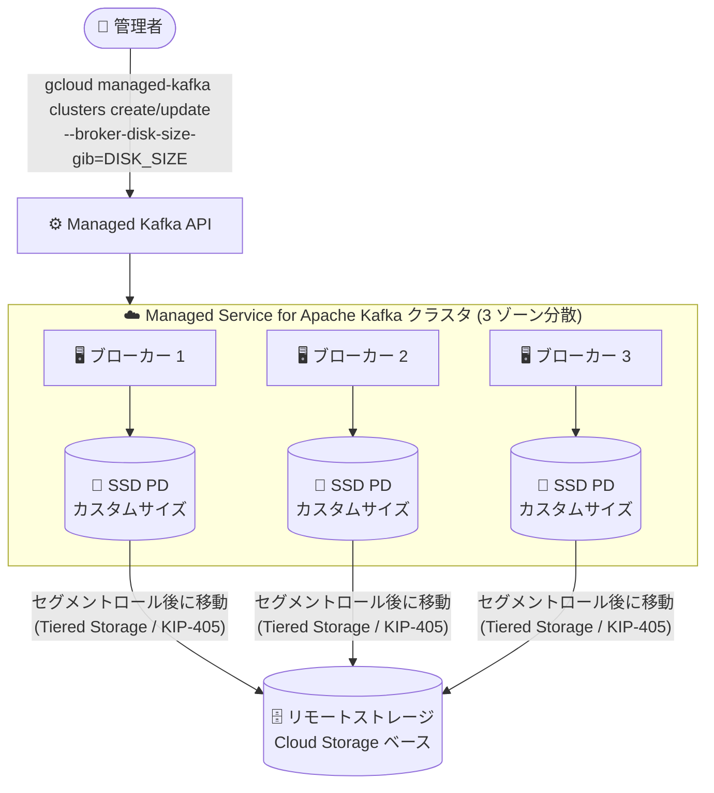

# Google Cloud Managed Service for Apache Kafka: ブローカーごとのディスク容量設定

**リリース日**: 2026-08-27

**サービス**: Google Cloud Managed Service for Apache Kafka

**機能**: ブローカーごとのディスク容量 (カスタムローカルストレージサイズ) の設定

**ステータス**: Feature

📊 [このアップデートのインフォグラフィックを見る](https://takech9203.github.io/google-cloud-news-summary/20260827-managed-kafka-broker-disk-capacity.html)

## 概要

Google Cloud Managed Service for Apache Kafka で、Kafka クラスタの作成時にブローカーごとのディスク容量 (ローカルストレージサイズ) を指定できるようになりました。また、作成後のクラスタに対してもディスク容量を後から増やすことが可能です。設定は Google Cloud コンソール、gcloud CLI (`--broker-disk-size-gib` フラグ) のいずれからも行えます。

Managed Service for Apache Kafka は、ブローカーに接続されたローカル SSD Persistent Disk と、Cloud Storage を基盤とする実質無制限のリモートストレージを組み合わせた階層型ストレージ (Tiered Storage、KIP-405) を採用しています。デフォルトではブローカーごとに vCPU あたり最低 100 GiB のディスクが自動プロビジョニングされますが、ログコンパクションを有効にした大きなキースペースを持つトピックや、パーティション数が非常に多いワークロードでは、デフォルト容量では不足するケースがありました。

今回のアップデートにより、ワークロードの特性に応じてローカルディスク容量を明示的に制御できるようになり、ディスク不足エラーへの対処や大規模ワークロードのキャパシティプランニングが容易になります。ログコンパクションを多用するユーザーや、多数のパーティションを持つクラスタを運用する Solutions Architect / プラットフォームエンジニアに有用なアップデートです。

**アップデート前の課題**

従来、ストレージ管理はサービスによって完全に自動化されており、ユーザーが直接制御することはできませんでした。

- ディスク容量は vCPU あたり最低 100 GiB という自動プロビジョニングのみで、ユーザーがブローカーごとのディスクサイズを指定できなかった
- vCPU あたりの Persistent Disk 容量は「変更される可能性のある実装詳細」と位置づけられ、ユーザーによる調整手段が提供されていなかった
- ログコンパクション有効時はローカルストレージのみが使用されるため、大きなキースペースを持つトピックではディスク容量を増やしたくても、vCPU 数を増やす以外の手段がなかった

**アップデート後の改善**

- クラスタ作成時にブローカーごとのディスク容量をカスタム指定できるようになった (コンソールの「Enable custom local storage size」トグル、または gcloud の `--broker-disk-size-gib` フラグ)
- 既存クラスタに対しても、クラスタ更新でディスク容量を後から増やせるようになった (ディスク不足エラー発生時の復旧手段としても利用可能)
- `gcloud managed-kafka clusters describe --full` で、実際にプロビジョニングされたブローカーごとのディスク容量 (effective disk capacity) を確認できるようになった

## アーキテクチャ図



管理者が `--broker-disk-size-gib` でブローカーごとのローカルディスク容量を指定し、全ブローカーに同一のカスタムサイズが適用されます。ロールされたセグメントファイルは階層型ストレージによりリモートストレージへ移動されます。

## サービスアップデートの詳細

### 主要機能

1. **クラスタ作成時のカスタムディスク構成**
   - `gcloud managed-kafka clusters create` の `--broker-disk-size-gib` フラグ、またはコンソールの「Capacity configuration」セクションでブローカーごとのディスクサイズ (GiB) を指定できる
   - 設定はクラスタ内のすべてのブローカーに適用される

2. **既存クラスタのディスク容量拡張**
   - `gcloud managed-kafka clusters update` で後からディスク容量を増やせる
   - ブローカーがディスク不足 (out-of-disk) になった場合の復旧手段として利用できる
   - ディスク容量の縮小はできない (更新時は現在の effective disk capacity 以上の値が必要)

3. **有効ディスク容量 (effective disk capacity) の確認**
   - `gcloud managed-kafka clusters describe --full` の `effectiveCapacityConfig` フィールドで、ブローカー数とブローカーごとの実際のディスクサイズを確認できる
   - カスタム構成の有無は `brokerCapacityConfig` フィールドで確認できる (未設定の場合は空)

### カスタムディスク構成が推奨されるケース (公式ドキュメントより)

- **大きなキースペースでのログコンパクション**: ログコンパクション有効時は各キーの最新メッセージがディスクに保持され続けるため、キースペースが大きいとディスク使用量が増大する
- **パーティション数が多いクラスタ**: vCPU あたり 200 パーティションを超える場合はカスタムストレージ構成の検討が推奨される
- **高負荷**: 過負荷のブローカーはロール済みセグメントをリモートストレージへ十分な速度で移動できず、より多くのローカルストレージを必要とする場合がある
- **ディスク不足エラーの解消**: ブローカーのディスクが枯渇した場合、容量を増やしてクラスタを復旧できる

## 技術仕様

### ディスク構成の要件

| 項目 | 詳細 |
|------|------|
| 最小ディスクサイズ | ブローカーあたり vCPU 数 × 100 GiB 以上 (例: 6 vCPU / 3 ブローカーのクラスタでは、ブローカーあたり 200 GiB 以上) |
| 最大ディスクサイズ | ブローカーあたり 32,768 GiB (32 TiB) |
| 縮小 | 不可。更新時は現在の effective disk capacity 以上の値を指定する必要がある |
| スケールアップ時 | 更新後の vCPU 数とディスクサイズが上記要件を満たす必要がある。ブローカーが追加される場合は同一リクエスト内でディスクサイズも併せて更新する |
| デフォルト構成への復帰 | カスタムディスク構成を一度設定すると、そのクラスタでデフォルト構成に戻すことはできない |
| デフォルト構成 | vCPU あたり最低 100 GiB を自動プロビジョニング。スケールダウンしてもディスク容量は縮小されない |

### 必要ディスクサイズの見積もり

セグメントファイルの最大サイズはデフォルトで 230 MiB です。中程度の利用率のクラスタでは、ロール済みセグメントの移動中のバッファを含めてパーティションあたり 250 MiB を想定し、以下の式でブローカーあたりの最小ディスクサイズを見積もれます。

```
250 MiB × パーティション数 × レプリケーションファクター / ブローカー数
```

実際の必要量はセグメントファイルの最大サイズ、クラスタ負荷、書き込みレート、リモートストレージへの書き込みレイテンシに依存します。Cloud Monitoring の `managedkafka/byte_size` メトリクスでパーティションのディスクサイズを監視することが推奨されます。

## 設定方法

### 前提条件

1. Managed Service for Apache Kafka クラスタの作成・更新権限があること
2. 指定するディスクサイズが「ディスク構成の要件」を満たすこと

### 手順

#### ステップ 1: クラスタ作成時にディスクサイズを指定

```bash
gcloud managed-kafka clusters create CLUSTER_ID \
  --location=LOCATION \
  --broker-disk-size-gib=DISK_SIZE
  # その他の構成フラグ ...
```

コンソールの場合は、「Create Kafka cluster」ページの「Capacity configuration」で「Enable custom local storage size」トグルを有効にし、ブローカーごとのディスクサイズ (GiB) を入力します。

#### ステップ 2: 既存クラスタのディスクサイズを更新 (増加のみ)

```bash
gcloud managed-kafka clusters update CLUSTER_ID \
  --location=LOCATION \
  --broker-disk-size-gib=DISK_SIZE
```

#### ステップ 3: 構成と有効ディスク容量を確認

```bash
# カスタムディスク構成の確認
gcloud managed-kafka clusters describe CLUSTER_ID \
  --location=LOCATION
# 出力例:
# brokerCapacityConfig:
#   diskSizeGib: '3000'

# 有効ディスク容量の確認
gcloud managed-kafka clusters describe CLUSTER_ID --full \
  --location=LOCATION
# 出力例:
# effectiveCapacityConfig:
#   brokerCount: '3'
#   brokerDiskSizeGib: '1024'
```

クラスタの総ディスク容量は `brokerCount × brokerDiskSizeGib` で計算できます。

## メリット

### ビジネス面

- **ディスク不足による障害リスクの低減**: ディスク枯渇時に vCPU の増強を伴わずに容量だけを拡張でき、復旧手段が明確になる
- **コスト効率の向上**: コンピュートリソース (vCPU/RAM) とストレージ容量を独立して調整できるため、ストレージ集約型ワークロードで vCPU を過剰にプロビジョニングする必要がない

### 技術面

- **ログコンパクションワークロードへの対応**: キースペースが大きいコンパクショントピックに必要なローカルストレージを明示的に確保できる
- **多パーティション構成のサポート**: vCPU あたり 200 パーティションを超える構成でも、ディスク容量を適切に確保できる
- **可観測性**: `effectiveCapacityConfig` によりプロビジョニング済み容量を API/CLI/コンソールから確認できる

## デメリット・制約事項

### 制限事項

- カスタムディスク構成を一度有効にすると、そのクラスタでデフォルト構成 (自動管理) に戻すことはできない
- ディスクサイズの縮小はできない (デフォルト構成でも同様)
- ブローカーあたりの上限は 32 TiB
- ディスクサイズは vCPU 数 × 100 GiB 以上である必要がある

### 考慮すべき点

- スケールアップでブローカーが追加される場合、追加後のブローカー構成で最小要件を満たすよう、vCPU 数とディスクサイズを同一の更新リクエストで指定する必要がある (例: 3 vCPU / ブローカーあたり 200 GiB のクラスタを 9 vCPU にスケールする場合、最小ディスクサイズは 300 GiB)
- ローカルストレージは GiB 時間単位で課金されるため、容量を増やすとその分コストが増加し、縮小による削減はできない
- 設定はクラスタ内の全ブローカーに一律に適用される (ブローカー個別の指定は不可)

## ユースケース

### ユースケース 1: ログコンパクショントピックのディスク容量確保

**シナリオ**: ユーザープロファイルの最新状態を保持するコンパクショントピックを運用しており、キースペースが数億件規模。ログコンパクション有効時はローカルストレージのみが使用されるため、デフォルトの vCPU あたり 100 GiB では不足する。

**実装例**:
```bash
gcloud managed-kafka clusters create profile-cluster \
  --location=asia-northeast1 \
  --cpu=6 \
  --memory=24GiB \
  --broker-disk-size-gib=1000
```

**効果**: vCPU を増やさずに必要なローカルストレージを確保でき、コンパクショントピックのデータ増加に耐えられる構成になる。

### ユースケース 2: ディスク不足エラーからの復旧

**シナリオ**: 高負荷によりロール済みセグメントのリモートストレージへの移動が追いつかず、ブローカーがディスク不足に陥りクラスタが正常に動作しなくなった。

**実装例**:
```bash
gcloud managed-kafka clusters update production-cluster \
  --location=us-central1 \
  --broker-disk-size-gib=2048
```

**効果**: クラスタの再作成やデータ移行を行わずに、ディスク容量の拡張のみでクラスタを復旧できる。

## 料金

Managed Service for Apache Kafka の料金は、コンピュート (vCPU / RAM を DCU 換算で課金)、ストレージ (ローカルストレージ + 長期ストレージ)、ネットワーキングで構成されます。ローカル Persistent Disk ストレージはブローカーごとにプロビジョニングされた容量に対して課金されます (デフォルト構成では vCPU あたり 100 GiB 分)。

### 料金例 (us-central1、料金ページより)

| 項目 | 単価 |
|------|------|
| コンピュート (DCU) | $0.09 / DCU 時間 (1 vCPU = 0.6 DCU、1 GiB RAM = 0.1 DCU) |
| ローカルストレージ | $0.000232877 / GiB 時間 |
| 長期ストレージ (Tiered Storage のリモート層) | $0.000136986 / GiB 時間 |

長期ストレージは単一レプリカ分のみ課金されます。リージョンにより単価は異なります。最新の料金は[料金ページ](https://cloud.google.com/managed-service-for-apache-kafka/pricing)を参照してください。

## 関連サービス・機能

- **Cloud Storage**: 階層型ストレージのリモート層 (長期ストレージ) の基盤。ロールされたセグメントファイルの移動先 (ユーザーが直接アクセスすることはできない)
- **Cloud Monitoring**: `managedkafka/byte_size` メトリクスでパーティションごとのディスクサイズを監視し、容量計画やアラート設定に活用
- **Compute Engine Persistent Disk (SSD)**: ブローカーのローカルストレージとして使用される
- **Private Service Connect**: クラスタへの VPC からのプライベートアクセスを提供 (ストレージ構成とは独立したクラスタ構成要素)

## 参考リンク

- 📊 [インフォグラフィック](https://takech9203.github.io/google-cloud-news-summary/20260827-managed-kafka-broker-disk-capacity.html)
- [公式リリースノート](https://docs.cloud.google.com/release-notes#August_27_2026)
- [Configure broker disk size (公式ドキュメント)](https://docs.cloud.google.com/managed-service-for-apache-kafka/docs/brokers/configure-disk-size)
- [Plan cluster size - Estimate the required disk size](https://docs.cloud.google.com/managed-service-for-apache-kafka/docs/plan-cluster-size)
- [Managed Service for Apache Kafka 概要](https://docs.cloud.google.com/managed-service-for-apache-kafka/docs/overview)
- [料金ページ](https://cloud.google.com/managed-service-for-apache-kafka/pricing)

## まとめ

Managed Service for Apache Kafka のストレージ管理は従来完全自動でしたが、今回のアップデートでブローカーごとのディスク容量をユーザーが制御できるようになり、ログコンパクションや多パーティション構成などストレージ集約型ワークロードへの適合性が大きく向上しました。カスタム構成は一度有効にすると解除できず、容量の縮小もできないため、`managedkafka/byte_size` メトリクスによる監視と見積もり式に基づいて計画的に設定することを推奨します。

---

**タグ**: `Managed Service for Apache Kafka`, `Kafka`, `ストレージ`, `Tiered Storage`, `Persistent Disk`, `キャパシティプランニング`, `Feature`
